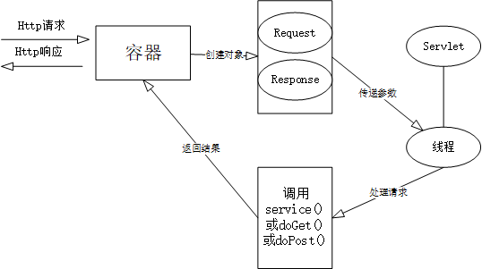
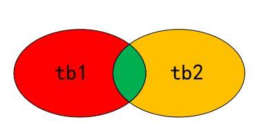
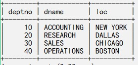
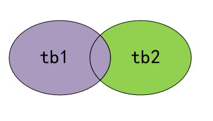
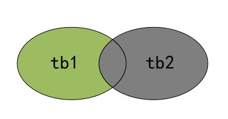
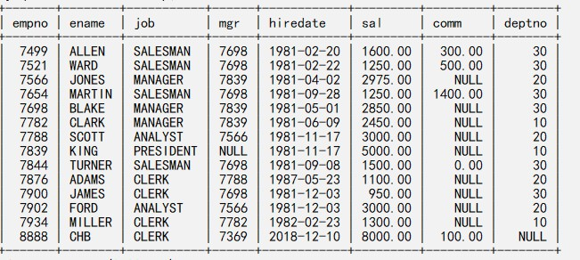

# JavaWeb_

## 1.Servlet与JSP

#### 1.1页面请求的工作流程

1. 用户通过浏览器输入链接地址请求资源
2. 浏览器将用户请求封装成指定格式发送给服务端
3. 服务端接收浏览器发送的请求，并查找用户所需要的资源
4. 服务端根据URL定位到指定资源
5. 服务端将响应应消息封装成指定格式返回给客户端
6. 浏览器对返回的内容进行渲染展示给客户

#### 1.2GET和POST的区别

**http请求有多种例如GET、POST、DELETE、PUT、HEAD等，但是最常见的是GET和POST**

- GET表示从服务端获取数据，例如图片、HTML文档、视频等。一般不使用GET向服务端提交数据，但是也可以提交数据。GET方式提交数据是在URL后面以"?a=1&b=2"的形式提交数据，这种方式提交数据有限（1024Byte），且暴露在外，并且URL一般限制长度
- POST表示向服务端提交数据，并获取响应。提交的数据一般隐藏在响应体中，且提交的数据量更大，一般默认不限制大小

#### 1.3什么是Servlet

- Servlet是用Java语言编写的服务器端程序，它运行在Web服务器的Servlet容器中
- Servlet根据每个请求创建一个线程来执行，响应时间短效率高
- Servlet处理用户请求的步骤
  - Web服务器收到用户请求，会将相应的请求交给对应的容器来处理，如果是对Servlet的请求则会创建两个对象`HttpServletRequest`和`HttpServletResponse`
  - 根据请求消息中的URL找到对应的Servlet，然后针对该请求创建单独的线程，同时将两个对象传递到新的线程中
  - 容器调用Servlet的service方法来处理用户的请求及相应，service方法会调用doGet或doPost方法来完成具体的响应任务，同时把动态生成的页面返回给容器
  - 容器将消息封装成HTTP格式返回给客户端。此时这个线程结束，同时删除两个http对象
  - 容器会根据每次请求创建新的线程以及新的http对象



#### 1.4Servlet的生命周期

1. 加载：容器通过类加载器使用Servlet类对应的文件加载Servlet
2. 创建：通过Servlet的构造方法来创建一个Servlet实例
3. 初始化：通过调用Servlet的init()方法来完成初始化工作，此方法是在Servlet已经被创建但想客户端提供服务之前调用的，此方法只会调用一次
4. 处理客户请求：每当有新的请求到来时，容器会创建一个新的线程来处理该请求，接着调用Servlet的service()方法来处理客户端的请求，service()方法会根据请求的method属性来调用doGet()或dePost()方法
5. 卸载：容器在卸载Servlet之前会调用destroy()方法，让Servlet自己释放其占用的系统资源，一旦调用destroy方法，容器不会再向这个Servlet发送任何消息。如果容器需要再次使用这个Servlet必须重新创建并初始化一个实例。destroy方法只会调用一次

#### 1.5JSP和Servlet的异同

**相同：**

- JSP和Servlet本质都是Servlet，JSP最终是被转为Servlet来运行的，因此实际请求的是编译后的Servlet
- JSP可以完成的工作Servlet都可以完成

**不同：**

- JSP擅长页面显示，而servlet擅长流程控制
- servlet中没有内置对象，而JSP中有内置对象，servlet中拿JSP的内置对象需要通过HttpServletRequest和HttpServletResponse、HttpServlet拿取

**JSP的内置对象**

- page：表示当前JSP页面，类似于Java中的this指针，是Object的实例
- request：客户端请求，包含来自GET/POST的请求参数。客户端的请求被封装在request对象中， 通过它才能了解客户的需求，然后做出响应，request对象时用来获取请求参数的非常重要的途径。它是HttpServletRequest对象的实例
- response：封装了jsp产生的响应,然后被发送到客户端以响应客户的请求 HttpServletResponse的实例
- session：表示客户端与服务端的一次会话，从客户端与服务端建立连接开始，到浏览器关闭结束表示一次会话。它是HttpSession的实例
- application：代表JSP所属的web应用本身，application可以存放全局变量，可以实现用户间的数据共享。它的生命周期与服务器生命周期一致，即web服务器启动后该对象就被创建出来，直到服务器停止这个对象的生命周期才结束。它是ServletContext的实例
- pageContext：提供了对JSP页面所有对象以及命名空间的访问。它是PageContext的实例
- config：包含服务器的配置信息。通过 pageConext对象的 getServletConfig() 方法可以获取一个config对象。当一个Servlet 初始化时，容器把某些信息通过 config对象传递给这个 Servlet。 开发者可以在web.xml 文件中为应用程序环境中的Servlet程序和JSP页面提供初始化参数。
- exception：exception 对象的作用是显示异常信息，只有在包含 isErrorPage="true" 的页面中才可以被使用，在一般的JSP页面中使用该对象将无法编译JSP文件。excepation对象和Java的所有对象一样，都具有系统提供的继承结构。exception 对象几乎定义了所有异常情况。在Java程序中，可以使用try/catch关键字来处理异常情况； 如果在JSP页面中出现没有捕获到的异常，就会生成 exception 对象，并把 exception 对象传送到在page指令中设定的错误页面中，然后在错误页面中处理相应的 exception 对象。
- out：向客户端浏览器输出信息是JSPWriter的实例

#### 1.6JSP的动作有哪些

**1.jsp:include**

- 在页面被请求的时候引入一个文件

**2.jsp:useBean**

- 寻找或实例化一个Javabean

**3.jsp:setProperty**

- 用来设置Javabean的属性

**4.jsp:getProperty**

- 获取javabean的属性值

**5.jsp:forward**

- 用来把请求转到一个新的页面

**6.jsp:plugin**

- 根据浏览器类型为Java插件生成Object或Embed标记

#### 1.7include指令和include动作的区别

**include指令**

```plain
<%@include file="path"%>
```

- include指令是在编译阶段将被包含的文件内容复制到指令所在位置，替换指令最终形成一个文件，适合包含静态页面
- 当前页面和被包含页面之间可以共享变量，所以要避免变量名冲突的问题
- include指令会去修改被包含文件，但不会立即生效，除非修改或删除主页中的类

**include动作**

```plain
<%jsp:include page="path"%>
```

- include动作是运行时调用被包含的文件，最终生成两个class
- 当前页面和被包含页面不能共享变量，除非放在request、session、application中
- incluce动作修改被包含文件会立即生效

#### 1.8回话跟踪技术

- page表示在当前页面共享数据
- request表示一次请求间共享数据
- session表示一次会话间共享数据
- application表示一个web应用间共享数据，跨多个页面多个请求多个会话的数据共享技术

#### 1.9cookie和session的区别

- cookie机制采用的是在客户端保存数据，session保存在服务器
- cookie性能高但不安全，session随着访问量的增加服务器性能会下降，但是安全性较高
- cookie保存的数据不能超过4kb，部分浏览器限制一个站点最多保存20个cookie；session不存在该问题

##2.J2E相关

####2.1web服务器和web应用服务器

- web服务器是可以向发出请求的浏览器提供文档的程序。是一种通用的服务器
- web应用程序是可以提供访问业务逻辑途径以供客户端程序使用的程序，是一种专用的服务器，例如tomcat就只处理Java程序
- 二者是并列关系

#### 2.2什么是IOC

IOC被称为控制反转，在一般分层系统中都是上层业务调用下层接口，而传统的软件项目多个类之间的依赖是通过自己主动创建来完成的，这种方式耦合性较大，不符合软件开发中低耦合的要求。

IOC的出现就是为了解决这种问题，IOC相当于一个第三方容器，所有软件开发需要的类都可以在其中进行登记，登记的时候说明自己是什么，需要什么。当程序运行到需要某个类的时候，IOC容器会主动创建一个对象注入到需要的地方，化主动（以前自己创建）为被动（现在IOC创建对象并注入）。

IOC是通过反射机制实例化出来的，因此对系统的性能有一定的影响

#### 2.3什么是AOP

- AOP被称为面向切面编程，是对面向对象的一种补充
- 使用AOP可以将一些系统相关的编程工作提取出来，独立实现然后根据切面进入系统
- 从而可以避免在业务逻辑中混入很多系统逻辑，例如权限管理、事务管理和日志记录等
- AOP中的相关概念：
  - 通知：定义了“何时”执行“什么”（例如在执行A方法之前执行了一个通知）
  - 切点：定义了在“何处”执行一个通知，满足切点表达式的方法
  - 连接点：切点的一个全集，切点是连接点的子集
  - 切面：通知和切点的组合，确定了在“何时”“何处”执行一个“什么”方法
- AOP实现原理：1.通过jdk动态代理，2.CGLIB 方式（需要三方jar包）

**spring中实现AOP（默认采用jdk动态代理）**

###### 1.实现接口的方式

**配置**

```xml
<!-- ===============================实现接口的方式=============================== -->
	
	<!-- 通知方法所在的类 -->
	<bean id="logBefore" class="org.wtu.aop.LogBefore"></bean>
	<bean id="logAfter" class="org.wtu.aop.LogAfter"></bean>
	<bean id="logException" class="org.wtu.aop.LogException"></bean>
	<bean id="logAround" class="org.wtu.aop.LogAround"></bean>
	
	
	<!-- 配置通知 建立连接  -->
	<!-- 前置通知 -->
	<aop:config>
		<!-- 切入点 -->
		<aop:pointcut expression="execution(public void addStudent(..))" id="produtc"/>
		<!-- 连接线 -->
		<aop:advisor advice-ref="logBefore" pointcut-ref="produtc"/>
	</aop:config>
	
	<!-- 后置通知 -->
	<aop:config>
		<!-- 切入点 -->
		<aop:pointcut expression="execution(public void addStudent(..))" id="produtc"/>
		<!-- 连接线 -->
		<aop:advisor advice-ref="logAfter" pointcut-ref="produtc"/>
	</aop:config>
	
	<!-- 异常通知 -->
	<aop:config>
		<!-- 切入点 -->
		<aop:pointcut expression="execution(public void org.wtu.service.impl.StudentServiceImpl.addStudent(..))" id="produtc"/>
		<!-- 连接线 -->
		<aop:advisor advice-ref="logException" pointcut-ref="produtc"/>
	</aop:config>
	
	<!-- 环绕通知 -->
	<aop:config>
		<!-- 切入点 -->
		<aop:pointcut expression="execution(public void org.wtu.service.impl.StudentServiceImpl.addStudent(..))" id="produtc"/>
		<!-- 连接线 -->
		<aop:advisor advice-ref="logAround" pointcut-ref="produtc"/>
	</aop:config>
```

- 前置通知：MethodBeforeAdvice

```java
import java.lang.reflect.Method;
import org.springframework.aop.MethodBeforeAdvice;
public class LogBefore implements MethodBeforeAdvice {
    /**
	 * method: 切入点的方法
	 * args: 方法参数
	 * target: 方法所在类
	 */
	@Override
	public void before(Method method, Object[] args, Object target) throws Throwable {
		System.out.println("前置通知");
	}
}
```

- 后置通知：AfterReturningAdvice

```java
import java.lang.reflect.Method;
import org.springframework.aop.AfterReturningAdvice;
public class LogAfter implements AfterReturningAdvice {
	@Override
	public void afterReturning(Object returnValue, Method method, Object[] args, Object target) throws Throwable {
		System.out.println("后置通知，返回值："+returnValue+"，方法名："+method.getName()+",参数个数："+args.length+",所属对象："+target);
    }
}
```

- 环绕通知：MethodInterceptor

```java
import org.aopalliance.intercept.MethodInterceptor;
import org.aopalliance.intercept.MethodInvocation;
public class LogAround implements MethodInterceptor {
	@Override
	public Object invoke(MethodInvocation invocation) throws Throwable {
		Object result  = null ;
		//方法体1...
		try {
			//方法体2...
			System.out.println("用环绕通知实现的[前置通知]...");
			// invocation.proceed() 之前的代码：前置通知
			 result  = invocation.proceed() ;//控制着目标方法的执行  ，addStudent()
			//result 就是目标方法addStudent()方法的返回值
//			 invocation.proceed() 之后的代码：后置通知
			System.out.println("用环绕通知实现的[后置通知]...:");
			System.out.println("目标对象"+invocation.getThis()+",调用的方法名："+invocation.getMethod().getName()+",方法的参数个数："+invocation.getArguments().length+",返回值："+result);
		}catch(Exception e) {
			//方法体3...
			//异常通知
			System.out.println("用环绕通知实现的[异常通知]...");
		}
		return result;//目标方法的返回值
	}
}
```

- 异常通知：ThrowsAdvice，异常通知的接口没有任何方法，但是要实现异常通知必须定义一个`afterThrowing`的方法

```java
import java.lang.reflect.Method;
import org.springframework.aop.ThrowsAdvice;
public class LogException implements ThrowsAdvice {
	//异常通知的具体方法
	public void afterThrowing(Method method, Object[] args ,Object target, Exception ex) {//只捕获NullPointerException类型的异常
		System.out.println("异常通知：目标对象:"+target+",方法名："+method.getName()+",方法的参数个数："+args.length+",异常类型:"+ex.getMessage());
	}
}
```

###### 2.注解形式实现AOP

**配置**

```xml
<!-- ===============================基于注解的方式=============================== -->
	<!-- 开启注解对AOP的支持 -->
	<aop:aspectj-autoproxy></aop:aspectj-autoproxy>
	<!-- 将注解通知类纳入IOC容器 -->
	<bean id="logAspectAnnotation" class="org.wtu.aop.LogAspectAnnotation"></bean>
```

**通知类**

```java
import org.aspectj.lang.JoinPoint;
import org.aspectj.lang.ProceedingJoinPoint;
import org.aspectj.lang.annotation.After;
import org.aspectj.lang.annotation.AfterReturning;
import org.aspectj.lang.annotation.AfterThrowing;
import org.aspectj.lang.annotation.Around;
import org.aspectj.lang.annotation.Aspect;
import org.aspectj.lang.annotation.Before;
import org.springframework.stereotype.Component;

@Component("logAspectAnnotation")
@Aspect //此类是一个通知
public class LogAspectAnnotation {
	// 前置通知
	@Before("execution(public * deleteStudent(..))")//属性：定义切点
	public void myBrfore(JoinPoint jp) {
		System.out.println("《注解形式-前置通知》：目标对象："+jp.getTarget()+",方法名："+jp.getSignature().getName() +",参数列表："+ jp.getArgs().length  );
	}
	
	//后置通知
	@AfterReturning( pointcut= "execution(public * deleteStudent(..))" ,returning="returningValue" ) 
	public void myAfter(JoinPoint jp,Object returningValue) {//returningValue是返回值，但需要告诉spring
		System.out.println("《注解形式-后置通知》：目标对象："+jp.getTarget()+",方法名："+jp.getSignature().getName() +",参数列表："+  jp.getArgs().length+",返回值："+returningValue );
	}
	
	// 环绕通知 ,参数ProceedingJoinPoint
	@Around("execution(public * deleteStudent(..))")
	public void myAround(ProceedingJoinPoint jp  ) {
		//方法之前：前置通知
		System.out.println("《【环绕】方法之前：前置通知");
		
		try {
			//方法执行时
			jp.proceed() ;//执行方法
	
			//方法之前之后：后置通知
			System.out.println("《【环绕】方法之前之后：后置通知");
		}catch(Throwable e) {
			//发生异常时：异常通知
			System.out.println("《【环绕】发生异常时：异常通知");
		}finally {
			//最终通知
			System.out.println("《【环绕】最终通知");
		}
	}
	
	//异常通知:如果只捕获特定类型的已存银行，则可以通过第二个参数实现：e
	@AfterThrowing(pointcut= "execution(public * deleteStudent(..))",throwing="e")
	public void myException(JoinPoint pj, NullPointerException e) {//此异常通知 只会捕获NullPointerException类型的异常
		System.out.println("&&&&&&《注解形式-异常通知》----e:"+e.getMessage());
	}
	
	//最终通知
	@After("execution(public * deleteStudent(..))")
	public void myAfter() {
		System.out.println("《[myAfter]注解形式-最终通知-----通知》----");
	}
}
```

###### 3.基于Schema形式的通知

**配置**

```xml
<!-- ===============================基于Schema的方式=============================== -->
	
	<!-- 通知方法所在的类 -->
	<bean id="logSchema" class="org.wtu.aop.LogSchema"></bean>
	
	<!-- 配置通知 建立连接  -->
	<aop:config>
		<!-- 切入点（连接线的一端：业务类的具体方法） -->
		<aop:pointcut expression="execution(public void org.wtu.service.impl.StudentServiceImpl.updateStudent(..))"   id="pcShema"/>
		
		
		<aop:aspect ref="logSchema">
			<!-- 前置通知 -->
			<aop:before method="before" pointcut-ref="pcShema"/>
			<!-- 后置通知 -->
			<aop:after-returning method="afterReturning" returning="returnValue" pointcut-ref="pcShema"/>
		 	<!-- 异常通知 -->
		 	<aop:after-throwing method="whenException" pointcut-ref="pcShema" throwing="e"/>
		 	<!-- 环绕 -->
		 	<aop:around method="around" pointcut-ref="pcShema" />
		</aop:aspect>	
	</aop:config>
```

**通知类**

```java
import org.aspectj.lang.JoinPoint;
import org.aspectj.lang.ProceedingJoinPoint;

public class LogSchema {
	//后置通知方法  :JoinPoint适用于注解
	public void afterReturning(JoinPoint jp,Object returnValue) throws Throwable {
		System.out.println("》》》》》》》》》》》后置通知：目标对象："+jp.getThis()+",调用的方法名："+jp.getSignature().getName()+",方法的参数个数："+jp.getArgs().length+"，方法的返回值："+returnValue);
	}
	public void before() {
		System.out.println("》》》》》》》》》》》前置通知...");
	}
	public void whenException(JoinPoint jp,NullPointerException e) {
		System.out.println(">>>>>>>>>>>>>>>>异常：" +e.getMessage());
	}
	//注意：环绕通知 会返回目标方法的返回值，因此返回值为Object
	public Object around(ProceedingJoinPoint jp)    {
		System.out.println("''''''''''''''''''环绕通知：前置通知");
		Object result = null ; 
		try {
			 result = jp.proceed() ;//执行方法
			 System.out.println("'''''''''"+jp.getSignature().getName()+","+result);
			System.out.println("''''''''''''''''''环绕通知：后置通知");
		}catch(Throwable e) {
			System.out.println("''''''''''''''''''环绕通知：异常通知");
		}
		return result ;
	}
}
```

## 3.数据库原理

#### 3.1内连接和外链接

准备两张表：

```plain
create table tb1(
eid int,
ename varchar(20)
);
insert into tb1 values(1001, 'aaa'),(1002, 'bbb'),(1003, 'ccc'),(1004, 'ddd');

create table tb2(
eid int,
pname varchar(20)
);
insert into tb2 values (1002, 'A'), (1004, 'B'),(1005, 'C'),(1006, 'D');

mysql> select * from tb1;
+------+-------+
| eid  | ename |
+------+-------+
| 1001 | aaa   |
| 1002 | bbb   |
| 1003 | ccc   |
| 1004 | ddd   |
+------+-------+

mysql> select * from tb2;
+------+-------+
| eid  | pname |
+------+-------+
| 1002 | A     |
| 1004 | B     |
| 1005 | C     |
| 1006 | D     |
+------+-------+
```

**内连接**

内连接也被称为自然连接，只有两张表相匹配的行才会在结果集中显示

```plain
select * from tb1 inner join tb2 on tb1.eid = tb2.eid;
-- 也可以用where子句
select * from tb1 ,tb2 where tb1.eid = tb2.eid;
+------+-------+------+-------+
| eid  | ename | eid  | pname |
+------+-------+------+-------+
| 1002 | bbb   | 1002 | A     |
| 1004 | ddd   | 1004 | B     |
+------+-------+------+-------+
```



**外连接**

外连接分3种`left outer join on`（左外连接），`right outer join on`（右外连接）和`full outer join on`（全外连接）。这里讨论左外连接和右外连接

- 左外连接，显示左表全部记录，右表显示符合条件的记录，不符合的记录补NULL

```plain
select * from tb1 left outer join tb2 on tb1.eid = tb2.eid;
+------+-------+------+-------+
| eid  | ename | eid  | pname |
+------+-------+------+-------+
| 1002 | bbb   | 1002 | A     |
| 1004 | ddd   | 1004 | B     |
| 1001 | aaa   | NULL | NULL  |
| 1003 | ccc   | NULL | NULL  |
+------+-------+------+-------+
```



- 右外连接，显示右表全部记录，左表显示符合条件的记录，不符合的记录补NULL

```plain
select * from tb1 right outer join tb2 on tb1.eid = tb2.eid;
+------+-------+------+-------+
| eid  | ename | eid  | pname |
+------+-------+------+-------+
| 1002 | bbb   | 1002 | A     |
| 1004 | ddd   | 1004 | B     |
| NULL | NULL  | 1005 | C     |
| NULL | NULL  | 1006 | D     |
+------+-------+------+-------+
```



#### 3.2存储过程和存储函数

**创建两张表emp和dept**

[sql语句](https://www.cnblogs.com/chenhuabin/p/10142190.html)

**emp**



**dept**



###### **1.创建不带参数的存储过程**

通过存储过程完成查询每个员工编号（empno）、姓名（ename）、职位（job）、领导编号（mgr）、领导姓名（empno）、部门名称（dname）、部门位置（loc）。

```plain
-- 创建一个存储过程
delimiter // -- 修改MySQL默认语句结束符为'//'
-- 创建一个select_pro()的存储过程
create procedure select_pro()
	begin
		select e1.empno '编号', e1.ename '姓名', 
		e1.job '职位', e1.mgr '领导编号', 
		e2.ename '领导姓名', d.dname '部门名称', 
		d.loc '部门位置' 
		from emp e1, emp e2, dept d 
		where e1.mgr = e2.empno and e1.deptno = d.deptno;
	end //
delimiter ;
```

通过`call select_pro();`就可以调用这个存储过程

###### **2.创建带参数的存储过程**

创建一个带参数的存储过程，删除emp表中empno为指定值得记录，并返回最高最高月薪，也返回大于指定月薪的人数

- 传入参数：类型为 IN，表示该参数的值必须在调用存储过程时指定，如果不显示指定位IN，那么默认就是IN类型
- in：IN类型参数一般只用于传入，可以传常量
- out：OUT是传出参数，不能用于传入参数值，调用存储过程时，OUT参数也需要知道，但必须是变量，不能是常量
- inout：可变变量INOUT:调用时可传入值，在调用过程中，可修改其值，同时也可返回值 ，INOUT调用时传入的是变量，而不是常量

```plain
delimiter //
create procedure param_pro(in id int , out num int, inout p_sal int)
	begin
		delete from emp where empno = id ;
		select max(sal) from emp into num;
		select count(*)  into p_sal from emp where sal >P_sal ;
	end //
delimiter ;

-- 使用
-- 先设置p_sal的值, id可以是常量， num不能是常量，但是
-- 设置num的值无效
set @p_sal = 1000;
-- 执行存储过程
call param_pro(7369, @num, @p_sal);
-- 获取out和inout的值
select @num, @p_sal;
```

###### **3.创建存储函数**

存储函数必须且默认带有一个in类型的参数，必须指定返回值，可以是MySQL中的数据类型int、char()、varchar()、date等，但是char和varchar要指定长度

```plain
delimiter //
create function fun1(id int) returns int
	begin
		return (select sal from emp where empno=id);
	end //
delimiter ;
```

存储过程和存储函数的区别：

- 存储函数的限制较多，不能使用临时表；存储过程限制较少，存储过程实现的功能较复杂，而函数的实现功能针对性较强
- 返回值不同，存储函数必须有返回值，且返回一个结果值；存储过程可以没有返回值，也可以返回结果集
- 调用不同，存储函数嵌入在sql中使用，可以用`select 存储函数名（变量名）`来使用，而存储过程是`call 存储过程名（[参数]）`
- 参数的不同，存储函数只能有且必须有一个in参数，而存储过程可以有in，out，inout三种参数类型
  - in：数据只从外部传入内部使用（值传递），可以是常量也可以是变量
  - out：只允许存储过程内部使用（不用外部传入数据），当外部传入out型数据时会被清空在进入内部。然后返回给外部

#### 3.3union和union all

union：将结果集求并集然后去重

union all：返回两个结果集的并集

#### 3.4视图

视图(VIEW)也被称作虚表，即虚拟的表，是一组数据的逻辑表示,其本质是对应于一条SELECT语句，结果集被赋予一个名字，即视图名字。 视图本身并不包含任何数据，它只包含映射到基表的一个查询语句，当基表数据发生变化，视图数据也随之变化。

创建一个视图，用来保存empno为7499的员工信息

```plain
create view v_emp_7499 as 
select * from emp where empno = 7499;
```

查询视图

```plain
select * from v_emp_7499;
```
