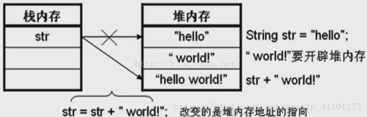
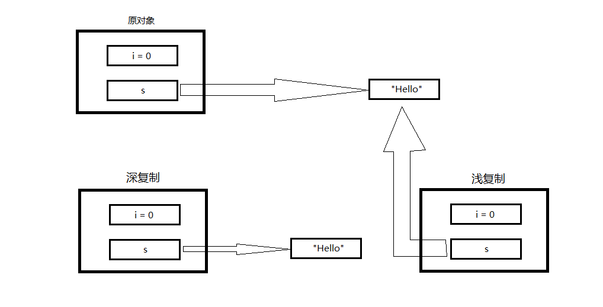
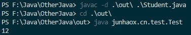
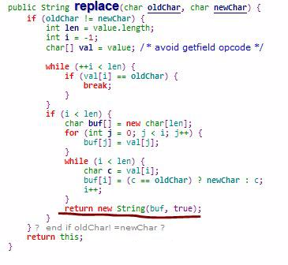
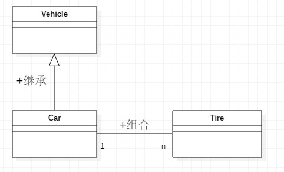

# Java基础_

## 1. java文件

1. 一个".java"文件可已包含多个类，但是只能包含一个public修饰的类，并且public修饰的类的类名必须和文件名一致，此外一个类中还可以包含多个内部类，如果一个".java"文件以及包含一个public修饰的类，那么其他类只能使用默认权限修饰。

```java
/*A.java*/
package junhaox.cn.test;

public class A {

	private C c = new C();
	
	
	private class C{
		
	}
}
/*
只能使用默认权限修饰
protected，private，和public都不允许
但是可以用final修饰（非权限修饰符）
*/
class B{
	
}
```

## 2. main方法

#### 1.为什么要有`public static void main(String[] args)`这个方法

1. `public static void main(String[] args)`为Java程序的入口方法
2. public是权限修饰符，表示任何类或对象都可以访问这个方法
3. static表名`main()`是一个静态方法，即方法中的代码是存储在静态存储区的，只要类被加载就可以通过类名.main()来调用该方法，而不需要通过实例化对象来调用方法
4. JVM就是通过上述方法的签名（必须有public和static修饰，返回值为void，且方法名为main方法的参数为字符串数组）来寻找程序入口，能找到就执行，找不到就报错

#### 2.main方法的其他定义格式

- 常规定义
  - `public static void main(String[] args)`
- static和public没有先后顺序关系
  - `static public void main(String[] args)`
- 也可以使用final修饰
  - `public static void main(String[] args)`
- 还可以使用synchronize修饰
  - `public static void main(String[] args)`

总结：程序的入口方法必须满足由public和static修饰，返回值为void，方法名为main，方法参数为字符串数组，有方法体（不能用abstract修饰）

## 3.Java程序的初始化规则

##### 1. 变量的初始化规则，以下规则优先级依次递减

- 静态对象（变量）优先于非静态对象（变量），其中静态对象（变量）只初始化一次，而非静态对象（变量）可能会初始化多次
- 父类优先于子类进行初始化
- 按照成员变量的定义顺序进行初始化。即使变量定义散布于方法定义，它们依然在任何方法（包括构造方法）被调用之前初始化

##### 2. Java程序初始化不同模块的执行顺序

1. 父类的静态常量
2. 父类静态代码块
3. 子类静态常量
4. 子类静态代码块
5. 父类非静态变量
6. 父类非静态代码块
7. 父类构造函数
8. 子类非静态变量
9. 子类非静态代码块
10. 子类构造函数

## 4.什么是构造函数

1. 构造函数必须与类名相同，且不能有返回值，返回值也不能为void
2. 每个类可以有多个构造函数，当开发人员没有提供构造函数时，编译器在把源码编译成字节码的过程中会提供一个没有阐述的默认构造函数，但是该构造函数不会执行任何代码。如果认为提供的构造函数，则编译器不会再创建默认的构造函数
3. 构造函数可以有任意个参数
4. 构造函数总是伴随着`new`操作一起调用，并且不能由程序编写者直接调用（像调用普通方法那样调用），必须由系统调用。构造函数在对象实例化时自动调用，且只运行一次；而普通方法则是在程序执行到它时被调用，且可以被改对象调用多次
5. 构造函数主要作用是完成对象的初始化工作
6. 构造函数不能被继承，因此它不能被重写，但是可以被重载，通过不同的参数个数或参数类型来定义多个构造函数
7. 子类可以通过`super`关键字来显式的调用父类的构造函数，但当父类没有提供无参构造时子类必须通过`super`来显式的调用父类的构造函数。如果父类提供了无参构造则可以不必显式的调用父类的构造函数，编译成会默认调用父类的无参构造。在有父类时，实例化对象会优先调用父类的构造参数
8. 当父类和子类都没有构造参数时，编译成会为父类和子类都生成一个默认的无参构造，且生成的默认无参构造的修饰符和当前类的修饰符一致（例如：当前类被定义为public则生成的无参构造修饰符也是public）

## 5.没有方法的接口

- 接口：
  - 接口是抽象方法定义的集合（也可以定义一些常量值）
  - 接口是一种特殊的抽象类
  - 接口中只包含方法的定义，没有方法的实现，但是在jdk1.8中接口中可以定义静态方法和普通方法（默认方法）

```java
package junhaox.cn.test;

public interface TestInterface {
	public static final int a = 10;
	 // 静态方法
	public static void del() {
		System.out.println("public static");
	}
    // 普通方法（默认方法）
	public default void add() {
		System.out.println("public default...");
	}
}
```

* 接口中的静态方法只能通过接口名类调用
* 如果多个接口定义了同样的默认方法，当实现类同时实现这几个接口 必须重新这个默认方法否则报错
-  接口中的成员都是用public修饰，接口中的常量值都是`public static final`修饰
-  接口只能用public来修饰

- 没有任何方法定义的接口被称为标识接口，用来标识这个类属于特定的类型。Java中目前存在的标识接口有Cloneable和Serializable等。在使用时通常会用instanceof来判断实例对象是否实现了指定给定标识接口
  - Cloneable：其实就是一个标记接口，只有实现这个接口后，然后在类中重写Object中的clone方法，然后通过类调用clone方法才能克隆成功，如果不实现这个接口，则会抛出CloneNotSupportedException(克隆不被支持)异常。
  - Serializable：只有实现该接口的类才可以进行序列化和反序列化

## 6.String对象不可变

#### 1.不可变类只是其实例不能被修改的类。每个实例中包含的所有信息都必须在创建该实例的时候就提供，并且在对象的整个生命周期内固定不变。为了使类不可变，要遵循下面五条规则：

- 不要提供任何会修改对象状态的方法（所有属性不提供set方法)
- 保证类不会被扩展。 一般的做法是让这个类称为 final 的，防止子类化，破坏该类的不可变行为。
- 使所有的域都是 final 的。
- 使所有的域都成为私有的。 防止客户端获得访问被域引用的可变对象的权限，并防止客户端直接修改这些对象。
- 确保对于任何可变性组件的互斥访问。 如果类具有指向可变对象的域，则必须确保该类的客户端无法获得指向这些对象的引用。
  在 Java 平台类库中，包含许多不可变类，例如 String , 基本类型的包装类，BigInteger, BigDecimal 等等。综上所述，不可变类具有一些显著的通用特征：类本身是 final 修饰的；所有的域几乎都是私有 final 的；不会对外暴露可以修改对象属性的方法。通过查阅 String 的源码，可以清晰的看到这些特征。

#### 2.String中存在一些方法可以得到改变后的值

- 这些方法有substring， replace， replaceAll， toLowerCase等

```java
String ss = "123456";
System.out.println("ss = " + ss);//ss = 123456
ss.replace('1', '0');
System.out.println("ss = " + ss);//ss = 123456
```

- 由上面代码可以看出调用以上方法并不会改变原来的对象，在源码中可以看出调用以上方法后会创建一个新的对象
  

#### 3.通过反射改变String对象

```java
public static void testReflection() throws Exception {
     
    //创建字符串"Hello World"， 并赋给引用s
    String s = "Hello World"; 
     
    System.out.println("s = " + s); //Hello World
     
    //获取String类中的value字段
    Field valueFieldOfString = String.class.getDeclaredField("value");
     
    //改变value属性的访问权限
    valueFieldOfString.setAccessible(true);
     
    //获取s对象上的value属性的值
    char[] value = (char[]) valueFieldOfString.get(s);
     
    //改变value所引用的数组中的第5个字符
    value[5] = '_';
     
    System.out.println("s = " + s);  //Hello_World
}
```

## 7.String、StringBuilder和StringBuffer

#### 1.String

1. String的对象不可变，每次对String对象的操作都会产生新的String对象浪费内存资源
   
2. 上图可以看出初始String值为"hello"，然后加上新字符串" world"，这个过程需要在内存种开辟新的内存空间，得到最终字符串"hello world"也需要开辟新的内存空间。简单的字符串拼接就需要开辟3次内存空间，极大的浪费内存

## 2.StringBuilder和StringBuffer

1. StringBuilder和StringBuffer都继承自AbstractStringBuilder，二者方法几乎一致，但是StringBuffer的方法都加了锁所以是线程安全的但效率较低，StringBuilder相对效率较高
2. 二者都有一个char[] value变量，但都不是final修饰的即可变的，这也就使得在操作字符串时不用频繁申请内存空间
3. String重写了equals和hashCode方法，而StringBuilder和StringBuffer没有重写，所以在将StringBuffer和StringBuilder作为键存储到HashMap中时会出现问题

## 8.&和&&的区别

1. &和&&都可以用作逻辑运算符，逻辑与（左右同为true时表达式为true否则为false）
2. &&具有短路功能当左边表达式为false时不再计算右边表达式，而&会计算右边表达式
3. &还可用作按位与例如1001&0011结果为0001

```java
System.out.println("-----------------------------------------");
System.out.printf("%04d", 0b1001&0b0011); // 0001
// %04d表示显示4位的二进制
// %08d表示显示8位的二进制
```

## 9.clone方法的作用

- Java中处理基本类型时（例如int,char,double等）都是采用的按值传递，传递的是输入参数的复制，除此之外都是采用按引用传递（传递的是对象的一个引用），使用"="赋值时也是采用的引用传递
- 实现浅复制（类中只有基本数据类型）的步骤：
  - 继承Cloneable接口（标识接口）
  - 重写clone（Object）方法
  - 在clone方法中直接调用`o = (Obj)super.clone();`返回新克隆对象的引用"o"

```java
@Override
protected Object clone() throws CloneNotSupportedException {
    Object o = (TestClone)super.clone();
    return o;
}
```

- 实现深复制（类中包含一些对象属性）的步骤
  - 继承Cloneable接口（标识接口）
  - 重写clone（Object）方法
  - 将克隆对象的对象属性重新赋值为被克隆对象的对象属性的克隆

```java
@Override
protected Object clone() throws CloneNotSupportedException {
    TestClone2 o = (TestClone2)super.clone();
    /*
    o为克隆对象
    this为被克隆对象
    */
    o.setDate((Date)this.getDate().clone());
    //		o.date = (Date)this.date.clone();
    return o;
}
```

- 深复制和浅复制
  - 深复制（Deep Clone）:
    - 复制后的对象的所有变量都含有与原来对象相同的值（除去那些引用其他对象的变量）
    - 那些引用其他对象的变量将指向被复制的新的对象，而不是指向原有那些被引用的对象
    - 即：深复制把复制的对象所引用的对象都复制了一遍
  - 浅复制（Shallow Clone）：
    - 复制后的对象的所有变量都含有与原来对象相同的值，并且所有引用其他对象的引用都指向原来的对象
    - 即：浅复制只复制所考虑的对象，而不关心它所引用的对象
  - 假定有如下类：

```java
class Test{
    public int i;
    public StringBuffer sb;
}
```



## 10.public、protected、默认权限、private修饰成员（包括内部类）

#### 定义

在说明这四个关键字之前，我想就class之间的关系做一个简单的定义：对于继承自己的class，base class可以认为他们都是自己的子女，而对于和自己一个包下的classes，认为都是自己的朋友。

- public：所有用户都可以调用
- protected：同一个包下的类可以直接通过该类的对象直接调用，不同包下的类只能在子类中调用（但是只能通过super关键字来调用），即对朋友和子女来讲就是public对其他人就是private
- 默认：只有在同一个包下的类才能使用，无关子类或非子类（远亲不如近邻）
- private：只能在该类的内部使用

## 11.super和this

- super：
  - super表示父类的构造函数，在子类的构造方法中会默认调用super()，即父类的无参构造（离当前类最近的父类），当父类没有无参构造时编译报错，此时只能给父类加上无参构造或显式的调用父类的其他构造方法（显式通过super调用父类构造方法时必须放在子类构造函数的第一行）
  - 在子类非static方法中调用父类的方法，`super.method()`但是super不是什么变量，也没有什么类型。如果super是一个变量，那么“Java中任何非public的非static方法的调用都是多态的”，所以此时`super.method`必然指向子类的方法，这与我们期望它静态的指向父类方法矛盾
  - 在其他包中的子类只有通过super关键字才能操作父类的protected成员
- this
  - this表示构造函数的传递。this()可以表示一个构造函数，可以在本类的其他构造函数中调用（必须放在第一行），此时this就是一个特殊语法没有类型不是变量
  - 可以在本类的非static方法中使用。此时this就是一个final类型的普通变量，可以用它调用本类的成员变量函数
  - this用来区分类属性和形参，当形参和属性形同时

```java
public void setId(int id){
    this.id = id;
}
```

- `super()`和`this()`不能同时出现，用super或this调用其他构造函数时只能调用一次

## 12.toString方法

当没有重写toString方法时默认调用的是Object中的toString方法，其返回值是“当前类的全类名@hashCode方法的返回值”，并不是当前对象的内存地址，当没有重写hashCode方法时调用的是Object中的hashCode方法

```java
/*
toHexString是将整数转换为16进制的数字型字符串
*/
public String toString() {
    return getClass().getName() + "@" + Integer.toHexString(hashCode());
}
```

## 13.Java反射机制

#### 1.获取Class类的3中方法

- Class.forName("类的全类名")
- 类名.class
- 实例.getClass

#### 2.Java创建类的4中方式

- 通过new语句实例化一个对象
- 通过反射机制创建一个对象
- 通过clone()方法创建一个对象
- 通过反序列化创建一个对象

## 14.package的作用

1. 提供多层命名空间，解决命名冲突问题
2. 对类按功能进行分类，使项目组织更加清晰
3. 包由一组类或接口组成

```plain
# 编译
javac -d 生成class文件的路径 Java源文件路径
# 执行
cd 生成class文件的路径
java 全类名（java package后面的字符串.类名）
```



```java
package junhaox.cn.entity;


public class Student{
    private int id;
    private String name;
    private int age;
    Student(){

    }

    Student(int id, String name, int age){
        this.id = id;
        this.name = name;
        this.age = age;
    }

    /**
     * @param age the age to set
     */
    public void setAge(int age) {
        this.age = age;
    }
    
    /**
     * @param name the name to set
     */
    public void setName(String name) {
        this.name = name;
    }

    /**
     * @param id the id to set
     */
    public void setId(int id) {
        this.id = id;
    }

    /**
     * @return the age
     */
    public int getAge() {
        return age;
    }
    /**
     * @return the name
     */
    public String getName() {
        return name;
    }
    /**
     * @return the id
     */
    public int getId() {
        return id;
    }

    @Override
    public String toString() {
        return this.id + "," + this.name + "," + this.age;
    }

    public static void main(String[] args) {
        System.out.println(new Student(1, "zs", 23));
    }


}
```

## 15.面向对象

#### 1.继承

- Java是单继承多实现
- 子类只能继承父类的非私有成员变量和方法，当子类和父类不在同一个包下时默认权限的成员变量和方法也不能继承
- 子类中定义的成员变量和父类定义的成员变量相同时，子类的成员变量会覆盖父类的成员变量，而不会继承
- 子类中定义的方法与父类定义的成员方法具有相同的函数签名（相同的方法名，相同的参数个数，相同的参数类型顺序）时，子类的方法会覆盖父类的方法而不会继承

#### 2.组合和继承

- 组合：
  - 在新类中创建原有类的对象，重复利用已有类的功能
- 继承：
  - 继承是面向对象的主要特性之一，它允许设计人员根据其他类的实现来定义一个类的实现
- 组合和继承都允许在新的类中设置子对象，只是组合是显示的，而继承是隐式的
- 组合和继承存在对应关系：组合中的整体类和继承中的子类对应，组合中的局部类和继承中的父类对应
- 当两个类具有"is-a"关系时使用继承，例如交通工具（Vehicle）和汽车（Car）；当两个类具有"has-a"关系时使用组合，例如汽车（Car）和轮胎（Tire）

```java
class Vehicle{
}
class Tire{
    
}
class Car extends Vehicle{
    private Tire tire = new Tire();
}
```



## 16.多态的实现机制

1. 方法的重载（overload）：同一个类中具有多个相同的方法名，但这些方法有着不同的参数、不同的参数类型等，因此在编译时就可以确定要调用那个方法，它是一种编译时多态。重载可以看做一个类中的方法多态性
2. 方法的覆盖（override）：子类可以覆盖父类的方法，因此同样的方法会在子类和父类中有着不同的表现形式。基类和接口的引用变量既可以执向基类的实例对象也可以执向子类的实例对象
3. 通过`Base b = new Derived();`方式实现多态进行方法调用时的规律总结：
   1. `Base b = new Derived();`之后的方法调用无论方法调用处在子类还是在父类只要子类重写了一律调用子类方法
   2. 子类没重写调用父类的方法（实际上还是调用子类的方法，因为子类默认继承父类非private方法）
   3. 父类没有子类有的方法调用时编译出错，此时不能使用多态，只能使用`Derived d = new Derived();`的方式调用

## 17.接口（interface）和抽象类（abstract class）

#### 1.接口：

- 接口是抽象方法定义的集合（也可以定义一些常量值）
- 接口是一种特殊的抽象类
- 接口中只包含方法的定义，没有方法的实现，但是在jdk1.8中接口中可以定义静态方法和普通方法（默认方法）

```java
package junhaox.cn.test;

public interface TestInterface {
	public static final int a = 10;
	 // 静态方法
	public static void del() {
		System.out.println("public static");
	}
    // 普通方法（默认方法）
	public default void add() {
		System.out.println("public default...");
	}
}
```

- 接口中的静态方法只能通过接口名类调用
- 如果多个接口定义了同样的默认方法，当实现类同时实现这几个接口 必须重新这个默认方法否则报错

- 接口中的成员都是用public修饰，接口中的常量值都是`public static final`修饰
- 接口只能用public来修饰

#### 2.抽象类

- 抽象类和普通类并没有什么太大区别，只是当一个类中显式的声明了一个抽象方法时（抽象方法不能为private），该类必须被声明为抽象类
- 接口中的抽象方法可以不用`abstract`修饰，因为默认为`public abstract`，但是抽象类中的抽象方法必须显式的声明为非private的abstract方法

#### 3.接口和抽象类的相同点

- 都不能被实例化，但是抽象类可以有自己的构造器
- 接口的实现类或者抽象类的子类，都只有在实现了接口或者抽象类的方法后才能实例化

#### 4.接口和抽象类的不同点

- 接口中只能定义方法，其方法不能再接口中实现（jdk1.8中可以定义默认方法和静态方法），只有实现接口的类才能实现接口中定义的方法，而抽象类可以有方法的定义和实现，即其方法可以在抽象类中被实现
- 接口需要实现（用implements），抽象类只能被继承（用extends），但是接口与接口则是extends。一个类可以实现多个接口，但是只能继承一个类
- 接口强调特定功能的实现，器设计理念是"has-a"，而抽象类强调所属关系，其设计理念是"is-a"
- 接口中的变量只能是"public static final"的且必须赋初值，接口中的方法默认是也只能是"public abstract"的；抽象类可以有自己的成员变量和非抽象的成员方法，但是抽象方法只能用“public或protected或不加权限修饰符”+abstract来修饰，不能用private、static、native、synchronize来修饰

#### 5.此外接口可以继承接口，抽象类可以实现接口，抽象类可以继承具体类，抽象类可以具有静态main方法
