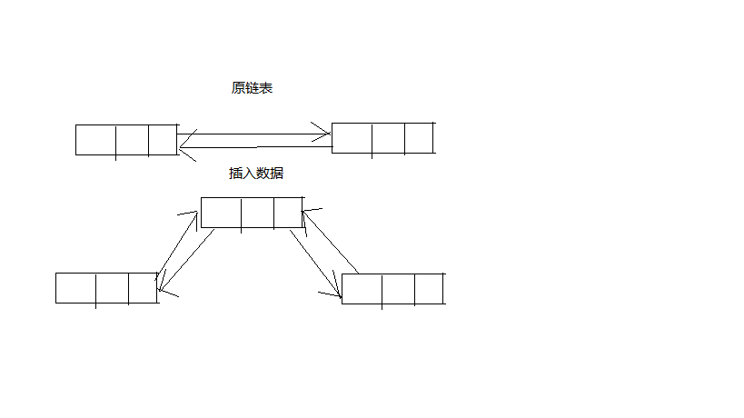

# 集合问题_

## 注意

- List和Set的上级接口是Collection，但是Collection和Map之间不存在继承实现关系，即Collection和Map是平级的两个接口；Collection的子类一般都是单值集合入ArrayList，Map的子类一般是多值集合（k-v对形式的集合）入HashMap。
- 集合中常出现的字眼“唯一”和“有序/无序”，这里“唯一”是指集合中元素是否可以重复，“有序/无序”是指元素输入集合的顺序和输出集合的顺序是否一致。

## ArrayList

- 线程不安全，底层是Object数组，默认长度为10
- 扩容机制：当插入数据超过数组容量时会新建一个数组，长度是原数组的1.5倍。JDK源码：

```java
private void grow(int minCapacity) {
    // overflow-conscious code
    int oldCapacity = elementData.length;
    // 通过以下代码确定新数组的容量
    int newCapacity = oldCapacity + (oldCapacity >> 1);
    if (newCapacity - minCapacity < 0)
        newCapacity = minCapacity;
    if (newCapacity - MAX_ARRAY_SIZE > 0)
        newCapacity = hugeCapacity(minCapacity);
    // minCapacity is usually close to size, so this is a win:
    elementData = Arrays.copyOf(elementData, newCapacity);
}
```

- ">>"在Java中为位运算符，用来操作二进制数据（其他进制会转为二进制在操作），表示当前位向左移动几位；"<<"与之相反
- 结论：移动几位可以理解为小数点移动几位，二进制下左移动1位数据缩小2被，十进制下左移动1位缩小10倍（Java中没有操作十进制数据的位运算符只是这样理解），其他以此类推。

## Vector

- 线程安全，底层Object数组，默认长度10
- 扩容机制：当插入数据超过数组容量时会新建一个数组，长度是原数组的2倍。JDK源码：

```java
private void grow(int minCapacity) {
    // overflow-conscious code
    int oldCapacity = elementData.length;
    // 通过以下代码确定新数组的容量
    int newCapacity = oldCapacity + ((capacityIncrement > 0) ?
                                     capacityIncrement : oldCapacity);
    if (newCapacity - minCapacity < 0)
        newCapacity = minCapacity;
    if (newCapacity - MAX_ARRAY_SIZE > 0)
        newCapacity = hugeCapacity(minCapacity);
    elementData = Arrays.copyOf(elementData, newCapacity);
}
```

## LinkedList

- 双向链表（jdk1.6之前为循环链表，jdk1.7取消循环）,用first和last分别指向第一个和最后一个元素。
- LinkedList的元素为Node，Node的定义：

```java
private static class Node<E> {
    // 元素值
    E item;
    // 指向前一个Node的地址
    Node<E> next;
    // 指向后一个Node的地址
    Node<E> prev;

    Node(Node<E> prev, E element, Node<E> next) {
        this.item = element;
        this.next = next;
        this.prev = prev;
    }
}
```

## Set

- 唯一，不允许元素重复，无序，元素的存取顺序可能不一致
- 常见的实现类有：
  - HashSet（唯一，无序）: 线程不安全，基于 HashMap 实现的，底层采用 HashMap 来保
    存元素
  - LinkedHashSet： LinkedHashSet 继承自 HashSet，并且其内部是通过 LinkedHashMap来实现的。
  - TreeSet（有序，唯一）： 红黑树
- 自定义对象存入Set时为了保证唯一性需要重写hashCode和equals方法，例如规定Student对象的id和name属性相等时就认为对象相等

```java
package junhaox.cn.string;

public class Student {
	private int id;
	private String name;
	private int age;

	public Student() {
	}
	public Student(int id, String name, int age) {
		super();
		this.id = id;
		this.name = name;
		this.age = age;
	}
	public int getId() {
		return id;
	}
	public void setId(int id) {
		this.id = id;
	}
	public String getName() {
		return name;
	}
	public void setName(String name) {
		this.name = name;
	}
	public int getAge() {
		return age;
	}
	public void setAge(int age) {
		this.age = age;
	}
	
	@Override
	public int hashCode() {
		int hash = Integer.hashCode(this.id)+this.name.hashCode();
		return hash;
	}
	
	@Override
	public boolean equals(Object obj) {
		if (this == obj)
			return true;
		if (obj instanceof Student) {
			Student anStudent = (Student) obj;
			if (this.id == anStudent.getId() && this.name.equals(anStudent.getName())) {
				return true;
			}else {
				return false;
			}
		}else{
			return false;
		}
	}
	
}
```

- LinkedHashSet：唯一，有序
- TreeSet：唯一，有序通过Comparator接口来指定排序规则，例如指定字符串长度排序

```java
Comparator<String> comp = new Comparator<String>() {
    @Override
    public int compare(String o1, String o2) {
        if (o1.length()>o2.length()) {
            return 1;
        }else if (o1.length()<o2.length()) {
            return -1;
        }else {
            return 0;
        }
    }
};
Set<String> treeSet = new TreeSet<>(comp);
```

- 对于自定义类需要继承Comparable接口实现compareTo方法用例自定义排序规则，例如对于Student类根据age来比较大小

```java
package junhaox.cn.string;

public class Student implements Comparable<Student>{
	private int id;
	private String name;
	private int age;
	
	// ...
	@Override
	public int compareTo(Student o) {
		if (this.age>o.getAge()) {
			return 1;
		}else if (this.age < o.getAge()) {
			return -1;
		}else {
			return 0;
		}
		
	}
	
}
```

- 如果将`compareTo()`返回值写死为0，元素值每次比较，都认为是相同的元素，这时就不再向TreeSet中插入除第一个外的新元素。所以TreeSet中就只存在插入的第一个元素。
- 如果将`compareTo()`返回值写死为1，元素值每次比较，都认为新插入的元素比上一个元素大，于是二叉树存储时，会存在根的右侧，读取时就是正序排列的。
- 如果将`compareTo()`返回值写死为-1，元素值每次比较，都认为新插入的元素比上一个元素小，于是二叉树存储时，会存在根的左侧，读取时就是倒序序排列的。

## Map

以k-v对的形式存储数据，k 不能重复，v可以重复，当添加相同的k时之前的value会被覆盖

- HashMap：线程不安全，通过 ConcurrentHashMap 解决。JDK1.8 之前 HashMap 由数组+ 链表组成的，数组是 HashMap 的主体（默认初始容量为 16），数组中的每个元素是链表 的形式。JDK1.8 以后，当链表长度大于阈值（默认为 8）时，将链表转化为红黑树，以减 少搜索时间。 HashMap 的加载因子为 0.75：当元素个数 超过 容量长度的 0.75 倍 时， 进行扩容。扩容增量：原容量的 2 倍.
- HashMap的构造方法

```java
// 1.无参构造方法、
// 构造一个空的HashMap，初始容量为16，负载因子为0.75
public HashMap() {
    this.loadFactor = DEFAULT_LOAD_FACTOR; // all other fields defaulted
}
```

```java
// 2.构造一个初始容量为initialCapacity，负载因子为0.75的空的HashMap，
public HashMap(int initialCapacity) {
    this(initialCapacity, DEFAULT_LOAD_FACTOR);
}
```

```java
// 3.构造一个空的初始容量为initialCapacity，负载因子为loadFactor的HashMap
public HashMap(int initialCapacity, float loadFactor) {
    if (initialCapacity < 0)
        throw new IllegalArgumentException("Illegal initial capacity: " +
                                           initialCapacity);
    if (initialCapacity > MAXIMUM_CAPACITY)
        initialCapacity = MAXIMUM_CAPACITY;
    if (loadFactor <= 0 || Float.isNaN(loadFactor))
        throw new IllegalArgumentException("Illegal load factor: " +
                                           loadFactor);
    this.loadFactor = loadFactor;
    this.threshold = tableSizeFor(initialCapacity);
}

//最大容量
//static final int MAXIMUM_CAPACITY = 1 << 30;
```

```java
// 4. 构造一个和指定Map有相同mappings的HashMap，初始容量能充足的容下指定的Map,负载因子为0.75
public HashMap(Map<? extends K, ? extends V> m) {
    this.loadFactor = DEFAULT_LOAD_FACTOR;
    putMapEntries(m, false);
}
```

- 注意HashMap规定初始容量必须是2的整数次幂，所以当指定初始容量是需要对初始容量进行处理，通过`tableSizeFor()`方法来处理初始容量：处理后的容量为`>=`给定值的最小2的整数次幂，例如`new HashMap(5)`是实际初始的容量为`8`
- tableSizeFor

```java
static final int tableSizeFor(int cap) {
    int n = cap - 1;
    n |= n >>> 1;
    n |= n >>> 2;
    n |= n >>> 4;
    n |= n >>> 8;
    n |= n >>> 16;
    return (n < 0) ? 1 : (n >= MAXIMUM_CAPACITY) ? MAXIMUM_CAPACITY : n + 1;
}
```

-  对于以上算法我们可以理解为，对于给定值我么只关心他的二进制最高位，对于一个`int`类型的数字通过以上5次位运算一定可以将其最高位左边的位全部变为`1`，即比下一个2次幂数小1


- hash算法

```java
static final int hash(Object key) {
    int h;
    return (key == null) ? 0 : (h = key.hashCode()) ^ (h >>> 16);
}
```

## ArrayList和LinkedList异同

1. 都是线程不安全
2. ArrayList底层通过数组实现`支持快速随机访问`,LinkedList底层通过双向链表实现（jdk1.6之前是循环链表，jdk1.7之后取消了循环链表），`不支持快速随机访问`;是否支持随机访问可以通过查看它是否实现了`RandomAccess`接口
3. ArrayList通过数组实现，当插入或删除元素时受元素位置影响，但是当执行`add(E ele)`时默认是将元素追加到列表尾部这种情况时间复杂度为O(1),如果要在指定位置i添加或删除元素时例如`add(int index, E ele)`时间复杂度就为O(n-i)，所以没有特殊需求时添加元素就直接添加到表尾。LinkedList通过双向链表实现，插入或删除指定元素时间复杂度都为O(1)
   
4. 对于ArrayList推荐使用for循环通过下标访问元素，对于LinkedList推荐使用Iterator迭代器迭代
5. ArrayList和LinkedList都存在浪费空间的问题。ArrayList主要存在于空间利用不充分，因为ArrayList会预设数组长度，当空间不够时会重新申请一个原来长度1.5倍的数组，但是并不是每次都刚好填满数组所以会存在空间浪费，也即在 list 列表的结尾会预留一定的容量空间 ；LinkedListt 的空间花费则体现在它的每一个元素都需要消耗比 ArrayList 更多的 空间（因为要存放直接后继和直接前驱以及数据）。

## **HashMap 和 Hashtable 的区别**

1. **线程是否安全：**  HashMap 是非线程安全的，HashTable 是线程安全的；HashTable 内部的方法基本都经过 `synchronized` 修饰。（如果你要保证线程安全的话就使用ConcurrentHashMap  [https://mp.weixin.qq.com/s/1yWSfdz0j-PprGkDgOomhQ](https://mp.weixin.qq.com/s/1yWSfdz0j-PprGkDgOomhQ) 吧！）；
2. **效率：**  因为线程安全的问题，HashMap 要比 HashTable 效率高一点。另外，HashTable 基本被淘汰，不要在代码中使用它；
3. **对Null key 和Null value的支持：**  HashMap 中，null 可以作为键，这样的键只有一个，可以有一个或多个键所对应的值为 null。但是在 HashTable 中 put 进的键值只要有一个 null，直接抛出 NullPointerException。因此，在HashMap中不能由get()方法来判断HashMap中是否存在某个键， 而应该用containsKey()方法来判断。
4. **初始容量大小和每次扩充容量大小的不同 ：**  ①创建时如果不指定容量初始值，Hashtable 默认的初始大小为11，之后每次扩充，容量变为原来的2n+1。HashMap 默认的初始化大小为16。之后每次扩充，容量变为原来的2倍。②创建时如果给定了容量初始值，那么 Hashtable 会直接使用你给定的大小，而 HashMap 会将其扩充为2的幂次方大小（HashMap 中的`tableSizeFor()`方法保证，下面给出了源代码）。也就是说 HashMap 总是使用2的幂作为哈希表的大小,后面会介绍到为什么是2的幂次方。
5. **底层数据结构：**  JDK1.8 以后的 HashMap 在解决哈希冲突时有了较大的变化，当链表长度大于阈值（默认为8）时，将链表转化为红黑树，以减少搜索时间。Hashtable 没有这样的机制。
6. **两个遍历方式的内部实现上不同。** Hashtable、HashMap都使用了 Iterator。而由于历史原因，Hashtable还使用了Enumeration的方式 。
7. **继承不同**

```plain
public class Hashtable extends Dictionary implements Map {}
public class HashMap extends AbstractMap implements Map{}
```

##HashMap 的长度为什么是2的幂次方

为了能让 HashMap 存取高效，尽量较少碰撞，也就是要尽量把数据分配均匀，每个链表/红黑树长度大致相同。这个实现就是把数据存到哪个链表/红黑树中的算法。

**这个算法应该如何设计呢？**

我们首先可能会想到采用%取余的操作来实现。但是，重点来了： **“取余(%)操作中如果除数是2的幂次则等价于与其除数减一的与(&amp;)操作（也就是说 hash%length==hash&amp;(length-1)的前提是 length 是2的 n 次方；）。”**  并且 **采用二进制位操作 &amp;，相对于%能够提高运算效率，这就解释了 HashMap 的长度为什么是2的幂次方。**

## HashMap和HashSet的底层关系

- HashSet的底层就是HashMap

```java
public HashSet() {
    map = new HashMap<>();
}

public boolean add(E e) {
    return map.put(e, PRESENT)==null;
}
```

- HashSet存储的元素就是HashMap的key，HashMap的value是一个常量PRESENT`PRESENT=new Object（）`占位符
- HashMap的put方法返回值是当前key对应的上一次的value值，所以只有当当前key在本次put之前不存在时才会返回`null`，此时HashSet的add方法才会返回true，即`null==null`
- HashMap的put方法返回值

```java
public V put(K key, V value) {
    return putVal(hash(key), key, value, false, true);
}

// putVal方法的部分源码
if (e != null) { // existing mapping for key
    V oldValue = e.value;
    if (!onlyIfAbsent || oldValue == null)
        e.value = value;
    afterNodeAccess(e);
    return oldValue;
}
```

- 由此可见当本次插入（key,value），当key已经存在时会返回它所对应的oldValue，插入的value会覆盖oldValue

```java
Map map = new HashMap();
map.put("key1", "v1"); // key1之前不存在，返回null
map.put("key1", "v2"); // key1之前存在，返回v1
// 当前map存在的元素是(key1, v2)
```
