# 实现发布订阅模式

了解了 Spring 中的事件发布和消费的流程之后，可以自己通过实现观察者模式来实现一个简单的主题订阅功能，实现步骤如下：

- 定义主题
- 定义观察者
- 定义事件发布器，发布主题时通知观察者

  

## 定义主题

### 抽象主题

这里的主题可以模仿 Spring 添加一个 source 字段，用来标注是谁发布的事件，在后续消费的时候可以通过这个字段来判断具体的观察者是否处理这个事件。

```java
public abstract class AbstractSubject {

    private Object source;

    public Object getSource() {
        return source;
    }

    public AbstractSubject(Object source) {
        this.source = source;
    }
}
```

### 实现一个具体的主题

```java
public class UserSubject extends AbstractSubject {

    private String name;

    public UserSubject(Object source, String name) {
        super(source);
        this.name = name;
    }

    @Override
    public String toString() {
        return "UserSubject{" +
                "name='" + name + '\'' +
                '}';
    }
}
```

## 定义事件监听器

定义是加监听器的时候除了提供具体的事件消费方法外还可以提供一个判断是否消费的的方法以供具体的监听器来判断是否消费该事件：

```java
public interface AbstractObserver {
    default boolean isInterestedIn(AbstractSubject subject) {
        return true;
    }

    void onEvent(AbstractSubject subject);
}
```

### 具体的事件监听器

这里提供的监听器表示只消费来自 Main 类发布的消息：

```java
public class UserPrintObserver implements AbstractObserver{
    @Override
    public void onEvent(AbstractSubject subject) {
        System.out.println("Print user: " + subject);
    }

    @Override
    public boolean isInterestedIn(AbstractSubject subject) {
        Object source = subject.getSource();
        return source instanceof Main;
    }
}
```

## 事件发布器

在 Spring 中 spring 是通过 Ioc 容器来注册监听器的，这里我们可以使用 hutool 工具包的包扫描工具类，将项目中的所有监听器都注册到事件发布器中。同时也可以模仿 Spring 在事件发布器中提供一个 ThreadPool 以供用户具体使用的时候选择同步消费还是异步消费：

```java
public class ObserverSubjectHandler {

    /**
     * 观察者列表
     */
    private final List<AbstractObserver> observers = new ArrayList<>();

    /**
     * 线程池
     */
    private ThreadPoolExecutor executor;


    /**
     * 通知观察者/事件消费
     * @param subject
     */
    public void notifyObservers(AbstractSubject subject) {
        for (AbstractObserver observer : observers) {
            if (!observer.isInterestedIn(subject)) {
                continue;
            }
            if (executor != null) {
                executor.execute(() -> observer.onEvent(subject));
                continue;
            }
            observer.onEvent(subject);
        }
    }

    public ObserverSubjectHandler() {
        // 扫描包下的所有观察者
        ClassUtil.scanPackage("com.iflytek").forEach(clazz -> {
            if (!AbstractObserver.class.isAssignableFrom(clazz)) {
                return;
            }
            try {
                boolean isAbstract = Modifier.isAbstract(clazz.getModifiers()) || clazz.isInterface();
                if (isAbstract) {
                    return;
                }
                AbstractObserver observer = (AbstractObserver) clazz.newInstance();
                attach(observer);
            } catch (InstantiationException | IllegalAccessException e) {
                e.printStackTrace();
            }
        });
    }

    public ObserverSubjectHandler(ThreadPoolExecutor executor) {
        this();
        this.executor = executor;
    }

    /**
     * 添加观察者
     * @param observer
     */
    public void attach(AbstractObserver observer) {
        observers.add(observer);
    }

    /**
     * 配置线程池
     * @param executor
     */
    public void setExecutor(ThreadPoolExecutor executor) {
        this.executor = executor;
    }
}
```

## 事件发布

用户只需要实现抽象主题之后通过时间发布器就可以完成事件的发布-订阅效果了，后续需要新增消费逻辑只需要新增事件监听器即可，实现了业务解耦：

```java
public class Client {
    public static void main(String[] args) {
        ObserverSubjectHandler osh = new ObserverSubjectHandler();
        UserSubject us = new UserSubject(new Object(), "zhangsan");
        osh.notifyObservers(us);
    }
}
```
