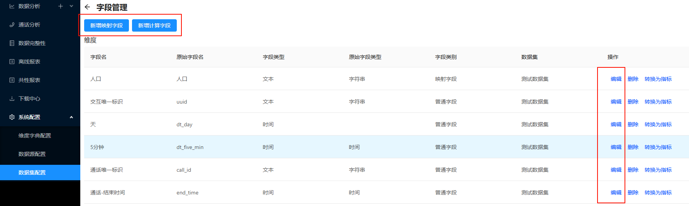
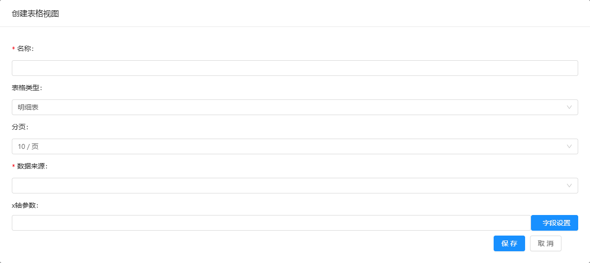
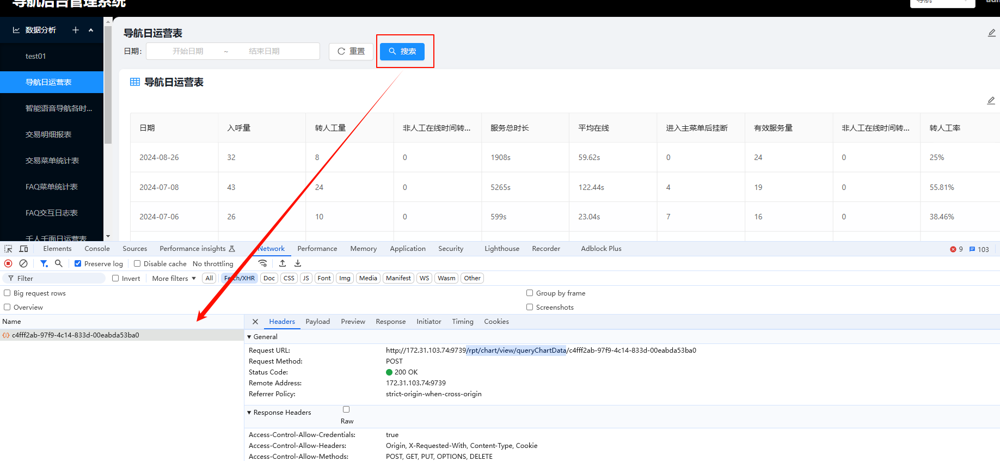
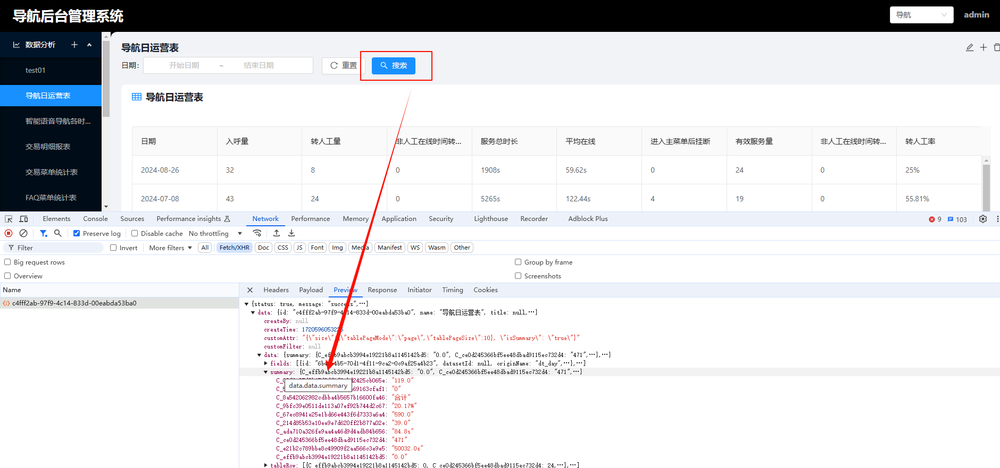
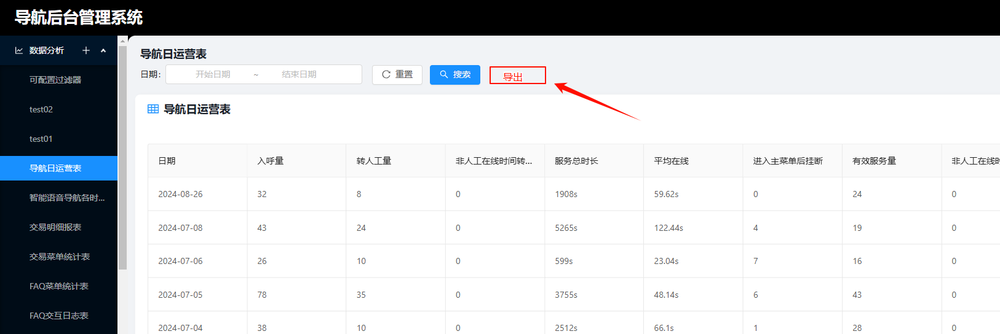

# 唐山银行修改接口

## 1.字段管理

数据集新增、编辑字段新增**单位(unit)** 参数



涉及接口地址：`/rpt/dataset/field/save`

请求参数：

```json
{
  "id":"86a80719-d6ec-40c9-af85-e5bbc742ddde",
  "name":"计算字段",
  "deType":3,
  "unit":"秒"
}
```

## 2.创建、编辑表格视图

创建表格视图是新增是否汇总参数，**是否汇总参数(isSummary)添加到现有 json 参数中**



涉及接口地址：

创建表格视图：`/rpt/chart/view/create/{panelId}`

修改表格视图：`/rpt/chart/view/update`

参数示例：

```json
{
    "id": "90434f95-3ee2-4948-9096-6f4bb64fa52a",
    "name": "ttt",
    "title": null,
    "tableId": "6b7e1e22-c8b5-498e-8359-7bf4f5228ff5",
    "type": "table",
    "render": "antv",
    "resultCount": 1000,
    "resultMode": null,
    "createBy": null,
    "createTime": 1731984183248,
    "updateTime": null,
    "customAttr": "{\"size\":{\"tablePageMode\":\"page\",\"tablePageSize\":10}, \"isSummary\": \"false\"}",
    "customFilter": null,
    "viewFields": "[]",
    "dataFilter": null,
    "data": null,
    "sql": null,
    "xaxis": "",
    "yaxis": "[]",
    "tablePageSize": 10
```

## 3.查询图表数据

查询图表数据接口**返回值添加汇总行数据**


涉及接口地址：`/rpt/chart/view/queryChartData/{chartViewId}`

新增返回值如下：



## 4.通用报表导出

BI 报表页面表格看板新增导出功能， ****​**点击导出后立即返回，创建下载任务，后台异步下载，具体文件通过下载中心进行下载。**​ ****



接口地址：`/rpt/chart/view/exportChartData/{chartViewId}`

接口入参：参考`查询图表数据：/rpt/chart/view/queryChartData/{chartViewId}`
