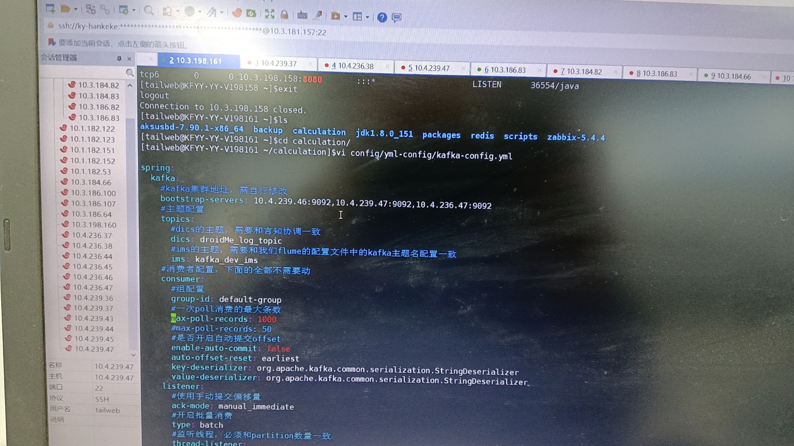

# 12306 现场问题

## 1.Kafka 各个主题信息

```latex
[tailweb@KF-YY-T239047 ~/kafka_2.13-3.4.0/bin]$./kafka-topics.sh --bootstrap-server 10.4.239.47:9092 --describe
Topic: __delay-minutes-5	TopicId: GD-s-t4UQ7q4h5UhGRg1ww	PartitionCount: 1	ReplicationFactor: 1	Configs: 
	Topic: __delay-minutes-5	Partition: 0	Leader: 0	Replicas: 0	Isr: 0
Topic: __delay-seconds-5	TopicId: sVURQecGRfCxd79O88Rojw	PartitionCount: 1	ReplicationFactor: 1	Configs: 
	Topic: __delay-seconds-5	Partition: 0	Leader: 1	Replicas: 1	Isr: 1
Topic: __delay-minutes-4	TopicId: kPqaTrmKTdeLRMF4ymCeEg	PartitionCount: 1	ReplicationFactor: 1	Configs: 
	Topic: __delay-minutes-4	Partition: 0	Leader: 3	Replicas: 3	Isr: 3
Topic: __delay-minutes-7	TopicId: u06symiqSj-Oq5VEwSUJmg	PartitionCount: 1	ReplicationFactor: 1	Configs: 
	Topic: __delay-minutes-7	Partition: 0	Leader: 1	Replicas: 1	Isr: 1
Topic: __delay-minutes-6	TopicId: 3N2pDNqOTe2QLZo1PYYFPQ	PartitionCount: 1	ReplicationFactor: 1	Configs: 
	Topic: __delay-minutes-6	Partition: 0	Leader: 0	Replicas: 0	Isr: 0
Topic: __delay-minutes-1	TopicId: v_E4sxuDS4e5_B4bIwWZ2A	PartitionCount: 1	ReplicationFactor: 1	Configs: 
	Topic: __delay-minutes-1	Partition: 0	Leader: 0	Replicas: 0	Isr: 0
Topic: __delay-seconds-1	TopicId: fyeARCnKT5a7E0I-yJ0oJw	PartitionCount: 1	ReplicationFactor: 1	Configs: 
	Topic: __delay-seconds-1	Partition: 0	Leader: 0	Replicas: 0	Isr: 0
Topic: test	TopicId: cm8FWcFaS06V11fWnAhyXQ	PartitionCount: 1	ReplicationFactor: 1	Configs: 
	Topic: test	Partition: 0	Leader: 3	Replicas: 3	Isr: 3
Topic: __delay-minutes-3	TopicId: IcIq_iVaQO-wA88OpaNsoQ	PartitionCount: 1	ReplicationFactor: 1	Configs: 
	Topic: __delay-minutes-3	Partition: 0	Leader: 3	Replicas: 3	Isr: 3
Topic: __delay-minutes-2	TopicId: LFmXO3s0TWSO0rkUvTm_Og	PartitionCount: 1	ReplicationFactor: 1	Configs: 
	Topic: __delay-minutes-2	Partition: 0	Leader: 1	Replicas: 1	Isr: 1
Topic: droidMe_log_topic	TopicId: rFedoHf4Q4aRvDYAgMFoNw	PartitionCount: 1	ReplicationFactor: 1	Configs: 
	Topic: droidMe_log_topic	Partition: 0	Leader: 3	Replicas: 3	Isr: 3
Topic: delay-message	TopicId: JWxqTGO4Ra-xa7rM0T2uRg	PartitionCount: 1	ReplicationFactor: 1	Configs: 
	Topic: delay-message	Partition: 0	Leader: 0	Replicas: 0	Isr: 0
Topic: __delay-minutes-30	TopicId: ysWjO0KiTu6P0vr__S0x1A	PartitionCount: 1	ReplicationFactor: 1	Configs: 
	Topic: __delay-minutes-30	Partition: 0	Leader: 0	Replicas: 0	Isr: 0
Topic: __delay-minutes-20	TopicId: Z8-aa5HaR12hPNmbOMSjCg	PartitionCount: 1	ReplicationFactor: 1	Configs: 
	Topic: __delay-minutes-20	Partition: 0	Leader: 0	Replicas: 0	Isr: 0
Topic: __delay-minutes-10	TopicId: 6G8TtV_VS8-KRWaFTzOllA	PartitionCount: 1	ReplicationFactor: 1	Configs: 
	Topic: __delay-minutes-10	Partition: 0	Leader: 0	Replicas: 0	Isr: 0
Topic: __delay-hours-2	TopicId: p53BcsIASr-tXsGg_os8Tw	PartitionCount: 1	ReplicationFactor: 1	Configs: 
	Topic: __delay-hours-2	Partition: 0	Leader: 0	Replicas: 0	Isr: 0
Topic: __delay-hours-1	TopicId: jc_URYt4QLWBIFl-xRUlBQ	PartitionCount: 1	ReplicationFactor: 1	Configs: 
	Topic: __delay-hours-1	Partition: 0	Leader: 0	Replicas: 0	Isr: 0
Topic: kafka_dev_ims	TopicId: FRDxB9bRQ92juiv7sCOrtQ	PartitionCount: 1	ReplicationFactor: 1	Configs: 
	Topic: kafka_dev_ims	Partition: 0	Leader: 0	Replicas: 0	Isr: 0
Topic: __delay-minutes-9	TopicId: 7UO-h6x2Q16KXYKiBIOhnw	PartitionCount: 1	ReplicationFactor: 1	Configs: 
	Topic: __delay-minutes-9	Partition: 0	Leader: 3	Replicas: 3	Isr: 3
Topic: __delay-seconds-30	TopicId: 5BE6BIxxTkKPqJis4ScgBA	PartitionCount: 1	ReplicationFactor: 1	Configs: 
	Topic: __delay-seconds-30	Partition: 0	Leader: 1	Replicas: 1	Isr: 1
Topic: __delay-minutes-8	TopicId: a0jWkoBISymeTppsvMXloA	PartitionCount: 1	ReplicationFactor: 1	Configs: 
	Topic: __delay-minutes-8	Partition: 0	Leader: 3	Replicas: 3	Isr: 3
Topic: __consumer_offsets	TopicId: u195VMjgSpqk6RzU_NtYzQ	PartitionCount: 50	ReplicationFactor: 1	Configs: compression.type=producer,cleanup.policy=compact,segment.bytes=104857600
	Topic: __consumer_offsets	Partition: 0	Leader: 3	Replicas: 3	Isr: 3
	Topic: __consumer_offsets	Partition: 1	Leader: 1	Replicas: 1	Isr: 1
	Topic: __consumer_offsets	Partition: 2	Leader: 0	Replicas: 0	Isr: 0
	Topic: __consumer_offsets	Partition: 3	Leader: 3	Replicas: 3	Isr: 3
	Topic: __consumer_offsets	Partition: 4	Leader: 1	Replicas: 1	Isr: 1
	Topic: __consumer_offsets	Partition: 5	Leader: 0	Replicas: 0	Isr: 0
	Topic: __consumer_offsets	Partition: 6	Leader: 3	Replicas: 3	Isr: 3
	Topic: __consumer_offsets	Partition: 7	Leader: 1	Replicas: 1	Isr: 1
	Topic: __consumer_offsets	Partition: 8	Leader: 0	Replicas: 0	Isr: 0
	Topic: __consumer_offsets	Partition: 9	Leader: 3	Replicas: 3	Isr: 3
	Topic: __consumer_offsets	Partition: 10	Leader: 1	Replicas: 1	Isr: 1
	Topic: __consumer_offsets	Partition: 11	Leader: 0	Replicas: 0	Isr: 0
	Topic: __consumer_offsets	Partition: 12	Leader: 3	Replicas: 3	Isr: 3
	Topic: __consumer_offsets	Partition: 13	Leader: 1	Replicas: 1	Isr: 1
	Topic: __consumer_offsets	Partition: 14	Leader: 0	Replicas: 0	Isr: 0
	Topic: __consumer_offsets	Partition: 15	Leader: 3	Replicas: 3	Isr: 3
	Topic: __consumer_offsets	Partition: 16	Leader: 1	Replicas: 1	Isr: 1
	Topic: __consumer_offsets	Partition: 17	Leader: 0	Replicas: 0	Isr: 0
	Topic: __consumer_offsets	Partition: 18	Leader: 3	Replicas: 3	Isr: 3
	Topic: __consumer_offsets	Partition: 19	Leader: 1	Replicas: 1	Isr: 1
	Topic: __consumer_offsets	Partition: 20	Leader: 0	Replicas: 0	Isr: 0
	Topic: __consumer_offsets	Partition: 21	Leader: 3	Replicas: 3	Isr: 3
	Topic: __consumer_offsets	Partition: 22	Leader: 1	Replicas: 1	Isr: 1
	Topic: __consumer_offsets	Partition: 23	Leader: 0	Replicas: 0	Isr: 0
	Topic: __consumer_offsets	Partition: 24	Leader: 3	Replicas: 3	Isr: 3
	Topic: __consumer_offsets	Partition: 25	Leader: 1	Replicas: 1	Isr: 1
	Topic: __consumer_offsets	Partition: 26	Leader: 0	Replicas: 0	Isr: 0
	Topic: __consumer_offsets	Partition: 27	Leader: 3	Replicas: 3	Isr: 3
	Topic: __consumer_offsets	Partition: 28	Leader: 1	Replicas: 1	Isr: 1
	Topic: __consumer_offsets	Partition: 29	Leader: 0	Replicas: 0	Isr: 0
	Topic: __consumer_offsets	Partition: 30	Leader: 3	Replicas: 3	Isr: 3
	Topic: __consumer_offsets	Partition: 31	Leader: 1	Replicas: 1	Isr: 1
	Topic: __consumer_offsets	Partition: 32	Leader: 0	Replicas: 0	Isr: 0
	Topic: __consumer_offsets	Partition: 33	Leader: 3	Replicas: 3	Isr: 3
	Topic: __consumer_offsets	Partition: 34	Leader: 1	Replicas: 1	Isr: 1
	Topic: __consumer_offsets	Partition: 35	Leader: 0	Replicas: 0	Isr: 0
	Topic: __consumer_offsets	Partition: 36	Leader: 3	Replicas: 3	Isr: 3
	Topic: __consumer_offsets	Partition: 37	Leader: 1	Replicas: 1	Isr: 1
	Topic: __consumer_offsets	Partition: 38	Leader: 0	Replicas: 0	Isr: 0
	Topic: __consumer_offsets	Partition: 39	Leader: 3	Replicas: 3	Isr: 3
	Topic: __consumer_offsets	Partition: 40	Leader: 1	Replicas: 1	Isr: 1
	Topic: __consumer_offsets	Partition: 41	Leader: 0	Replicas: 0	Isr: 0
	Topic: __consumer_offsets	Partition: 42	Leader: 3	Replicas: 3	Isr: 3
	Topic: __consumer_offsets	Partition: 43	Leader: 1	Replicas: 1	Isr: 1
	Topic: __consumer_offsets	Partition: 44	Leader: 0	Replicas: 0	Isr: 0
	Topic: __consumer_offsets	Partition: 45	Leader: 3	Replicas: 3	Isr: 3
	Topic: __consumer_offsets	Partition: 46	Leader: 1	Replicas: 1	Isr: 1
	Topic: __consumer_offsets	Partition: 47	Leader: 0	Replicas: 0	Isr: 0
	Topic: __consumer_offsets	Partition: 48	Leader: 3	Replicas: 3	Isr: 3
	Topic: __consumer_offsets	Partition: 49	Leader: 1	Replicas: 1	Isr: 1
Topic: __delay-seconds-10	TopicId: tPo6Rz2OQWmnx0Q4oIQccQ	PartitionCount: 1	ReplicationFactor: 1	Configs: 
	Topic: __delay-seconds-10	Partition: 0	Leader: 0	Replicas: 0	Isr: 0
[tailweb@KF-YY-T239047 ~/kafka_2.13-3.4.0/bin]$

```



## 2.Kafka 消息挤压情况

等信息：

- 分别显示了主题名和分区号。
- 表示该消费者组在每个分区上的当前偏移量。
- 是该分区上的最新偏移量。
- 之间的差值。

的值大于0，说明这个消费者组在相应的分区上有消息积压。

```latex
[tailweb@KF-YY-T239047 ~/kafka_2.13-3.4.0/bin]$./kafka-consumer-groups.sh --bootstrap-server 10.4.239.47:9092 --describe --group defaultGroup

GROUP           TOPIC           PARTITION  CURRENT-OFFSET  LOG-END-OFFSET  LAG             CONSUMER-ID                                     HOST            CLIENT-ID
defaultGroup    test            0          0               0               0               consumer-2-50e019af-ce80-4ebe-a4fd-9fd1b3453827 /10.4.239.43    consumer-2
[tailweb@KF-YY-T239047 ~/kafka_2.13-3.4.0/bin]$./kafka-consumer-groups.sh --bootstrap-server 10.4.239.47:9092 --describe --group group1

GROUP           TOPIC             PARTITION  CURRENT-OFFSET  LOG-END-OFFSET  LAG             CONSUMER-ID                                     HOST            CLIENT-ID
group1          droidMe_log_topic 0          128332308       128332327       19              consumer-4-0ef81580-dfd2-41b9-9a4c-9540671b84e3 /10.4.236.44    consumer-4
group1          test              0          0               0               0               consumer-6-1e69eb02-aa9d-4718-8806-e8f61486db39 /10.4.239.43    consumer-6
[tailweb@KF-YY-T239047 ~/kafka_2.13-3.4.0/bin]$./kafka-consumer-groups.sh --bootstrap-server 10.4.239.47:9092 --describe --group IMS_KAFKA_ID

GROUP           TOPIC           PARTITION  CURRENT-OFFSET  LOG-END-OFFSET  LAG             CONSUMER-ID                                                  HOST            CLIENT-ID
IMS_KAFKA_ID    kafka_dev_ims   0          133356358       133356576       218             consumer-IMS_KAFKA_ID-1-41b9b76b-1541-47bb-ac14-68009549ce56 /10.3.198.161   consumer-IMS_KAFKA_ID-1
[tailweb@KF-YY-T239047 ~/kafka_2.13-3.4.0/bin]$./kafka-consumer-groups.sh --bootstrap-server 10.4.239.47:9092 --describe --group DICS_KAFKA_ID 
GROUP           TOPIC             PARTITION  CURRENT-OFFSET  LOG-END-OFFSET  LAG             CONSUMER-ID                                                   HOST            CLIENT-ID
DICS_KAFKA_ID   droidMe_log_topic 0          128332303       128332697       394             consumer-DICS_KAFKA_ID-2-56310de2-9eda-45ac-aff0-07366ac8e9cb /10.3.198.161   consumer-DICS_KAFKA_ID-2
```
