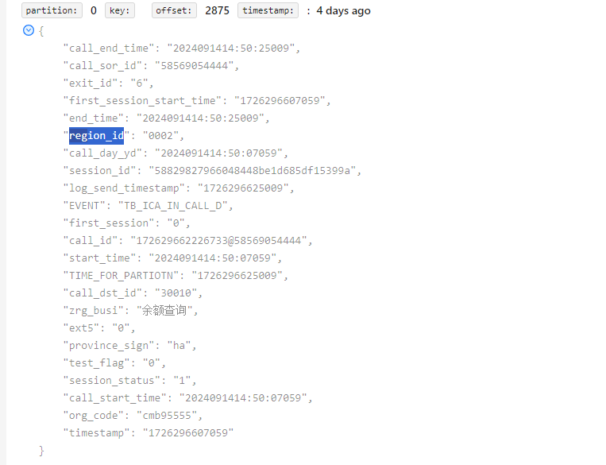
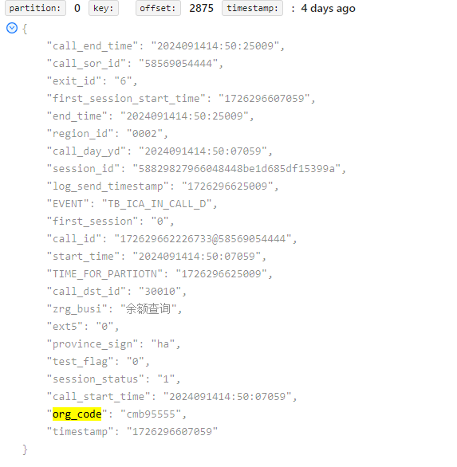
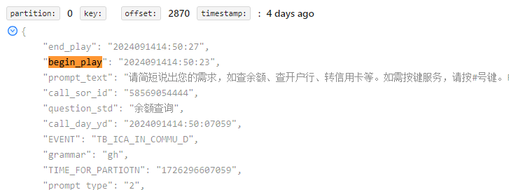
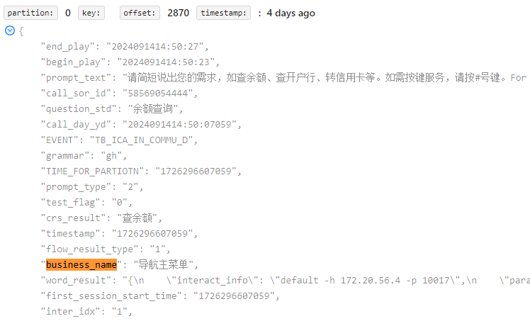

# 字段来源说明

### 1.通话字段（in_call）

- CALL_REGION_ID

> 原始通话日志中的 region_id 字段
>
> ​​​

- IF_NO_VOICE

> 根据 commu 日志中的识别结果 flow_result 来计算的，识别结果全为(timeout,playover,hangup) 为无声通话, 交互中存在不为(timeout,playover,hangup), 则为有声通话

```java
private void setNoVoice(InCall call, List<InCommu> commus, List<String> noVoiceList) {
    if (CollectionUtils.isEmpty(noVoiceList)) {
        return;
    }
    if (CollectionUtils.isEmpty(commus)) {
        call.setIfNoVoice("1");
        return;
    }
    // 识别结果全为(timeout,playover,hangup) 为无声通话, 交互中存在不为(timeout,playover,hangup), 则为有声通话
    boolean allNoVoice = commus.stream().allMatch(communication -> noVoiceList.contains(communication.getFlowresult()));
    if (allNoVoice) {
        call.setIfNoVoice("1");
    } else {
        call.setIfNoVoice("0");
    }
    // 若出口为4，定义为有声
    if (LogProcessProperties.hasVoiceExit.equalsIgnoreCase(call.getExitId())) {
        call.setIfNoVoice("0");
    }
}
```

- ENTRY_ID

> 原始通话日志中的 entrance_id 字段

- USER_LEVEL

> 原始通话日志 level_id 字段

- BELONG_REGION_ID

> 原始通话日志中的 region_id 字段

- TENANT_ID

> 原始通话日志中的 org_code 字段
>
> 

- satisfaction

> 原始通话日志的 ext1 字段

### 2.交互字段（in_commu）

- COMMU_ID

> call_id + inter_idx 字段

- BEGIN_PLAY_TIME

> 原始交互日志的 begin_play 字段转时间戳
>
> 

- END_PLAY_TIME

> 原始交互日志的 end_play 字段转时间戳

- BUSI_RESULT

> 原始交互日志的 business_name 字段
>
> 

- NO_VOICE

> 交互识别结果不为空即为有声

```java
/**
 * 设置 交互是否无声
 */
public void setNovoice(FullRawCommuLog fullCommu, InCommu inCommu) {
    String flowResult = fullCommu.getFlow_result();
    if (flowResult != null && !"".equals(flowResult) && flowResult.toLowerCase().indexOf(flowResult) > -1) {
        inCommu.setNovoice("0");
    } else {
        inCommu.setNovoice("1");
    }
}
```

- BUSI_WORD_RESULT

> 直接给的空字符串

```java
/**
 * 设置 语义结果映射出的业务名称
 */
public void setBusiWordResult(FullRawCommuLog fullCommu, InCommu inCommu) {
    inCommu.setBusiWordResult("");
}
```

- BUSI_NAME

> 如果原始交互日志中 business_name 不为空则为 business_name 字段，否则根据 word_result 字段取其中的questionStd 字段

```java
/**
 * 设置 业务名称
 */
public void setBusiname(FullRawCommuLog fullCommu, InCommu inCommu) {
    if (fullCommu.getBusiness_name() != null) {
        inCommu.setBusiname(fullCommu.getBusiness_name());
    } else {
        String questionStd = getQuestionStd(fullCommu.getWord_result());
        inCommu.setBusiname(questionStd);
    }
}
```

- SIMP_WORD_RESULT

> 根据原始交互日志中的 word_result 字段计算而来

```java
//设置精简语义
private void setSimpleWordResult(EsCommu commun) {
    if (commun == null
            || !StringUtils.hasLength(commun.getWordResult())) {
        return;
    }
    String resultStr = getSimpleWordResult(commun.getWordResult());
    commun.setSimpleWordResult(resultStr);
}

//获取精简语义
public String getSimpleWordResult(String wordResult) {
    if (StringUtils.isEmpty(wordResult)) {
        return "";
    }
    String resultStr = "";
    try {
        JSONObject jsonObject = JsonUtil.parseObject(wordResult,Feature.OrderedField);
        if (jsonObject == null) {
            return "";
        }
        jsonObject = jsonObject.getJSONObject("result");
        if (jsonObject == null) {
            return "";
        }
        //设置语义拒识
        if (jsonObject.containsKey("rc")) {
            String rc = jsonObject.get("rc").toString();
            if ("-1".equals(rc)) {
                resultStr = "rc_nomatch";
                return resultStr;
            }
        }
        if ("query".equals((jsonObject.get("operation").toString()))) {
            resultStr = getQuerySentenceResult(jsonObject);
        } else if ("do".equals((jsonObject.get("operation").toString()))) {
            resultStr = getQuerySentenceResult(jsonObject);
        } else if ("consult".equals((jsonObject.get("operation").toString()))) {
            resultStr = getOtherSentenceResult(jsonObject);
        }
    } catch (Exception e) {
        log.error("(commu)wordResult{}解析错误:", wordResult, e);
    }
    return resultStr;
}

private String getQuerySentenceResult(JSONObject jsonObject) {
    jsonObject = jsonObject.getJSONObject("semantic");
    jsonObject = jsonObject.getJSONObject("slots");
    JSONObject resultAction = jsonObject.getJSONObject("action");
    JSONObject actionTarget = jsonObject.getJSONObject("target");
    JSONObject resultJsonObj = new JSONObject(true);
    resultJsonObj.putIfAbsent("action", resultAction.get("name"));
    JSONObject params = resultAction.getJSONObject("params");
    if (params != null && params.size() != 0) {
        for (String key : params.keySet()) {
            resultJsonObj.putIfAbsent("action." + key, params.get(key));
        }
    }
    resultJsonObj.putIfAbsent("target", actionTarget.get("name"));
    JSONObject targetParams = actionTarget.getJSONObject("params");
    if (targetParams != null && !targetParams.isEmpty()) {
        for (String key : targetParams.keySet()) {
            resultJsonObj.putIfAbsent("target." + key, targetParams.get(key));
        }
    }
    return resultJsonObj.toString();
}
private static String getOtherSentenceResult(JSONObject obj) {
    String resultStr = "";
    JSONObject matchInfoObj = obj.getJSONObject("matchInfo");
    if (matchInfoObj.containsKey("questionStd")) {
        resultStr = matchInfoObj.get("questionStd").toString();
    } else {
        if (matchInfoObj.containsKey("extraInfo")) {
            matchInfoObj = matchInfoObj.getJSONObject("extraInfo");
            if (matchInfoObj.containsKey("STANDARD_QUESTION")) {
                resultStr = matchInfoObj.get("STANDARD_QUESTION").toString();
            }
        }
    }
    return resultStr;
}
```

- TENANT_ID

> 原始交互日志中的 org_code 字段

- bank_id

> 取通话日志中的 bank_id

```java
if(!CollectionUtils.isEmpty(inCalls)){
    String bankId = "";
    for(InCall call : inCalls){
        if(org.apache.commons.lang3.StringUtils.isNotBlank(call.getBankId())){
            bankId = call.getBankId();
        }
    }
    // commu 和 inter日志设置bankId
    for(InCommu inCommu : inCommus){
        inCommu.setBankId(bankId);
    }
    for(InInter inInter : inInters){
        inInter.setBankId(bankId);
    }
}
```

- busi_num、complete_flag

> 循环判断commu的promptName对应prompt_busi表的记录，
>
> 如果是澄清(clearUpFlag=1)，且有绑定提示音，则判断绑定的提示音业务是否包含下次交互的业务名称，如果包含则继续判断下次交互，只要下次交互是绑定的提示音，则后续交互找到业务量，上轮交互的业务量就不算；
>
> 当绑定的提示音为非澄清非最终时，上轮交互的业务量为1；
>
> 如果没有绑定提示音，则判断下一次交互与本次交互的提示音对应的业务名称是否一致，一致则后续交互有几个最终就有几个业务量，没有最终就澄清的业务量为1；
>
> 如果不是澄清(clearUpFlag!=1)，则直接判断下一次交互与本次交互的提示音对应的业务名称是否一致，一致则后续交互有几个最终就有几个业务量，没有最终就澄清的业务量为1；

- busi_type

> 根据当前交互的提示音 code （promptName）查询 prompt_busi 表，然后根据查询出来的 prompt_busi 的业务名称对应的 codeId （busiCodeId）查询 dim_business 表，获取父编码作为 busi_type

- busi_prompt_id

> 根据当前交互的提示音 code （promptName）查询 prompt_busi 表，取 prompt_busi 中的业务名称对应的 codeId （busiCodeId）

### 3.接口字段（in_inter）

- COMMU_ID

> call_id + inter_idx 字段

- INTERFACE_ID

> call_id + inter_idx + interface_idx 字段

- bank_id

> 取通话日志中的 bank_id
