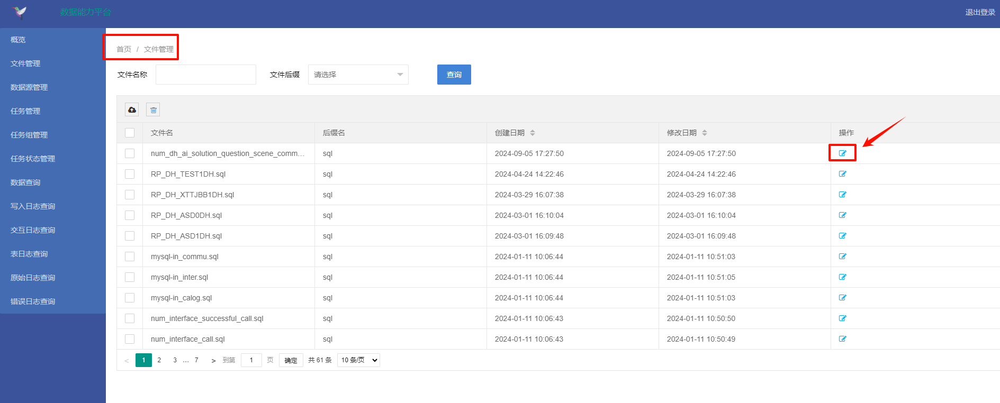
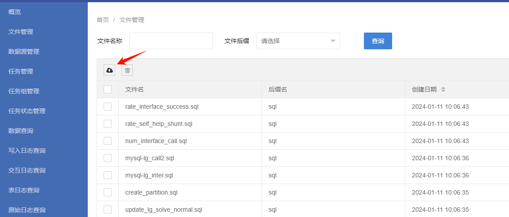
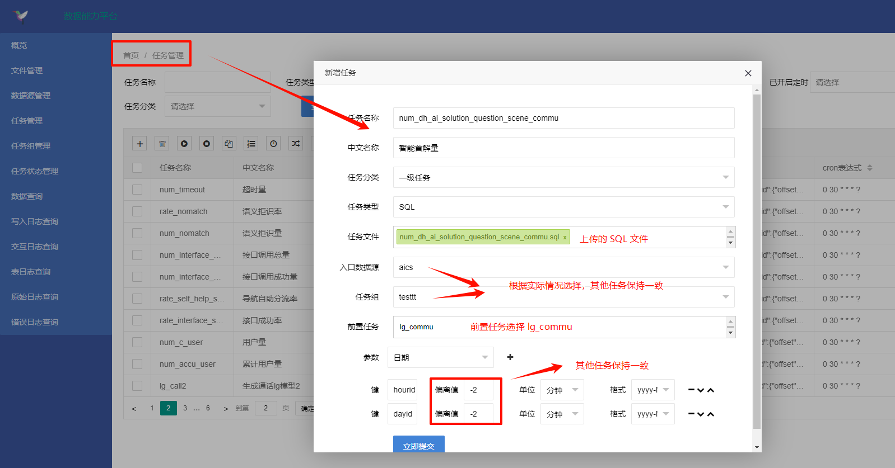
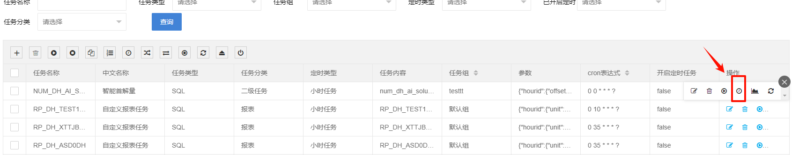

# 20240909_指标修改

## 1.更新脚本

需要在 Oracle 客户端执行：aics_addtable.sql，用来修改报表表结构。

## 2.job 任务更新

现有任务，直接更新任务脚本，无法修改直接删除后重建

- rp_question_report.sql
- mysql-lg_commu.sql
- num_c_call_question_scene.sql

## 3.新增 job 任务

- num_dh_ai_solution_question_scene_commu.sql
- num_m_commu_question_scene_credible.sql

1. 上传 job 指标 SQL 文件

2. 新建 job 任务

3. 修改定时执行时间，和其他任务保持一致

**或者通过执行 dml_job.sql 脚本来新增任务。**

## 4.修改 rp_question_report 任务

修改 rp_question_report 的前置任务，添加 num_dh_ai_solution_question_scene_commu 和 num_m_commu_question_scene_credible 为 rp_question_report 的前置任务
