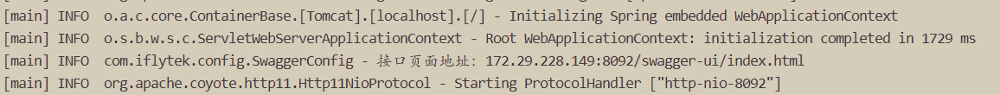
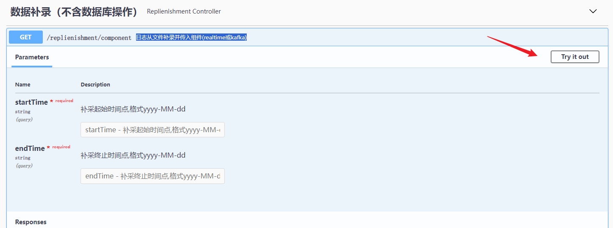
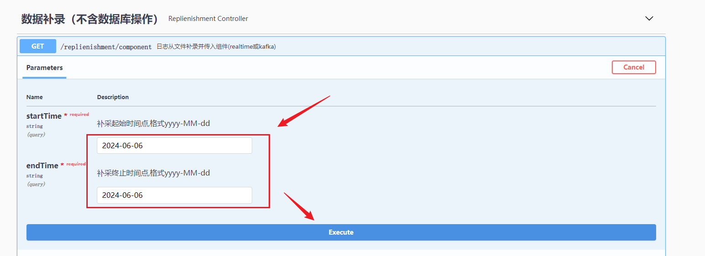

# 补数文档

## 1.修改配置

1.2 版本补数需要从日志文件补录到 Kafka，由 calculation 组件重新消费入库，进入 in_ 表，然后通过操作 job 工具进行重跑任务

需要修改的配置文件：

- kafka-config.yml

```yaml
spring:
  kafka:
    # kafka集群地址需要修改与 calculation 组件保持一致
    bootstrap-servers: 172.29.67.148:9092
    #主题配置，修改为和 calculation 组件的配置保持一致
    topics:
      dics: kafka_dev_dics_0819
      ims: kafka_dev_ims_0819
```

- logreader-config.yml

```yaml
#dics和ims、原始数据日志的目录：
#如果是单机部署，则配置一个目录就行了
#如果是集群部署，会有多台dics服务器，所以需要配置多个目录
log:
  #dics日志前缀（dics-web_或者icsLog_）
  dics-log-prefix: icsLog_
  dir:
    ics:
      - D:\log\ics
      - D:\log\ics2
    ims:
      - D:\log\ims
      - D:\log\ims2
    # 配置一个空目录即可
    audio:
      - D:\log\audio
```

其中 ics 目录，直接 ics 日志文件复制到其中即可，例如`D:\log\ics\icsLog_2024-08-19.0.log`；

ims 目录需要按照年、月、日的格式区分每一天的数据，例如`D:\log\ims\2024\08\19\15\ISR-S8jfeK5j2e02050a00y.log`，其中 15 是小时目录

## 2.启动补录工具

直接执行启动脚本：

```shell
sh start.sh start
```

查看启动日志，会输出 swagger 地址：



## 3.数据补录

进入 swagger 页面，选择`数据补录（不含数据库操作）-> /replienishment/component日志从文件补录并传入组件(realtime或kafka)`​



输入补录时间：



## 4.任务重跑

操作 job 组件进行任务重跑
