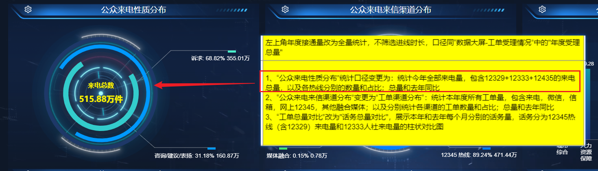
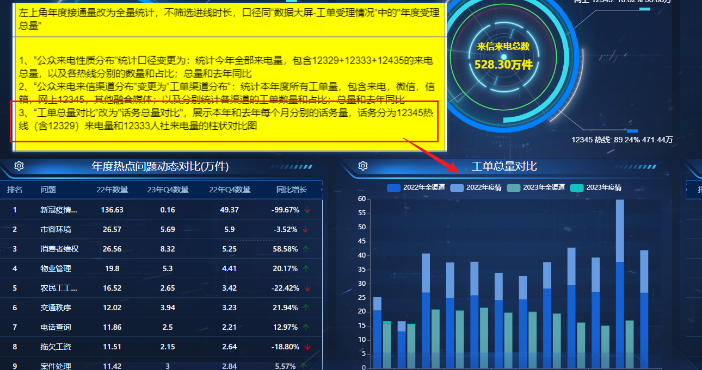

# 1226 需求

## 1.接口1



**接口地址**：`https://12345znkf.qingdao.gov.cn:9097/dataservice/nature/letter1`

**字段说明**：

```json
{
  "errorCode": 0,
  "errorMsg": "成功",
  "data": {
    // 今年 12345 来电量及占比
    "count12345": 4770508,
    "rate12345": "79.37%",
    // 今年 12333 来电量及占比
    "count12333": 975049,
    "rate12333": "16.22%",
    // 今年 12329 来电量及占比
    "count12329": 265164,
    "rate12329": "4.41%",
    // 今年来点总量
    "workCount": 6010721,
    // 去年来点总量
    "preWorkCount": 5024475,
    // 今年同比去年
    "yearOnYearRate": "19.63%"
  }
}
```

## 2.接口2



**接口地址：**​`https://12345znkf.qingdao.gov.cn:9097/dataservice/hotIssues/comparison1`

**字段说明**：

```json
{
	"errorCode": 0,
	"errorMsg": "成功",
	"data": [
		{
      // 月份
			"date": "01",
      // 今年 12345（含12329）
			"currentCount12345": 257848,
      // 去年 12345（含12329）
			"preCount12345": 313235,
      // 今年 12333
			"currentCount12333": 42534,
      // 去年 12333
			"preCount12333": 87222
		},
		...
	]
}
```
