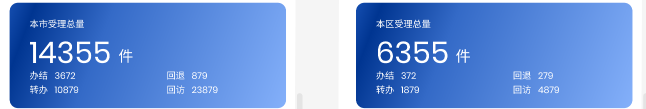
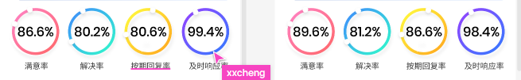
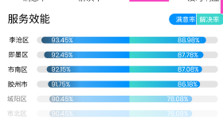
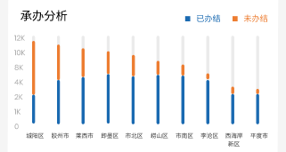
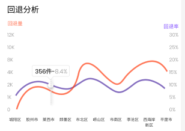
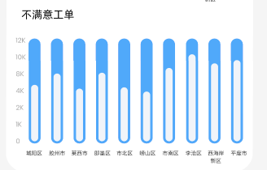
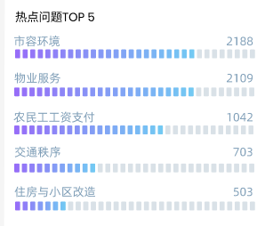
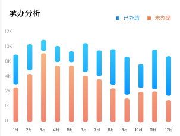
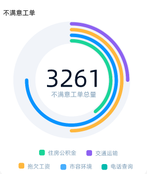

# H5 页面接口

## 1.所有接口统一入参

|**参数名**|**类型**|**说明**|**是否必传**|
| --------| ------| --------| -|
|start|String|开始时间|Y|
|end|String|结束时间|Y|
|district|String|区市政府|Y|

## 2.地区受理量



**接口地址：**​ **​`/dataservice/h5/areaWorkCount`​**

**请求类型：**​**​`GET`​**

**响应参数：**

```json
{
  # 工单总量
  "workCount": 10000
  # 办结
  "finishCount": 5000
  # 转办
  "turnCount": 2000
  # 回退
  "backCount": 1000
  # 回访
  "returnCount": 2000
}
```

## 3.四率



**接口地址：**​`/dataservice/h5/fourRate`​​​
**请求类型：**​`GET`
**响应参数：**

```json
{
  # 满意率
  "satisfRate": "83.21%",
  # 解决率
  "resolveRate": "83.21%",
  # 按期回复率
  "replyRate": "83.21%",
  # 及时响应率
  "responseRate": "83.21%"
}
```

## 4.区市情况(服务效能)



**接口地址：/dataservice/h5/serviceEfficiency**

**请求类型：**​**​`GET`​**​

**响应参数：**

```json
[
  {
    # 地区
    "mainDounitSimple": "市南区",
    # 满意率
  	"satisfRate": "83.21%",
    # 解决率
    "resolveRate": "83.21%",
  	# 按期回复率
    "replyRate": "83.21%",
    # 及时响应率
    "responseRate": "83.21%"
  },
  ...
]
```

## 5.承办分析（全市）



**接口地址：**​ **​`/dataservice/h5/undertake/citywide`​**
**请求类型：**​**​`GET`​**
**响应参数：**

```json
[
  {
    # 地区
    "mainDounitSimple": "市南区",
    # 办结
  	"finishCount": 3000,
  	# 未办结
  	"unFinishCount": 1000
  },
  ...
]
```

## 6.回退分析（全市）



**接口地址：**​ **​`/dataservice/h5/back/citywide`​**​

**请求类型：**​**​`GET`​**

**响应参数：**

```json
[
  {
    # 地区
    "mainDounitSimple": "市南区",
    # 回退量
  	"backCount": 3000,
  	# 回退率
  	"backRate": "78.21%"
  },
  ...
]
```

## 7.不满意工单（全市）



**接口地址：**​ **​`/dataservice/h5/unsatisfied/citywide`​**​
**请求类型：**​**​`GET`​**​
**响应参数：**

```json
[
  {
    # 地区
    "mainDounitSimple": "市南区",
    # 回退量
  	"unsatisfiedCount": 3000
  },
  ...
]
```

## 8.热点问题 top5



**接口地址：**​ **​`/dataservice/h5/hotIssues`​**

**请求类型：**​**​`GET`​**

**响应参数：**

```json
[
  {
    # 问题名称
    "wtflDesc": "市容环境",
    # 问题数量
  	"wtflCount": 5000
  },
  ...
]
```

## 9.承办分析（地区）



**接口地址：**​ **​`/dataservice/h5/undertake/area`​**
**请求类型：**​**​`GET`​**
**响应参数：**

```json
[
  {
    # 月份 01、02、03、...11、12
    "date": "01",
    # 办结
  	"finishCount": 3000,
  	# 未办结
  	"unFinishCount": 1000
  },
  ...
]
```

## 10.回退分析（地区）


**接口地址：**​ **​`/dataservice/h5/back/area`​**​
**请求类型：**​**​`GET`​**​
**响应参数：**

```json
[
  {
    # 月份 01、02、03、...11、12
    "date": "01",
    # 回退量
  	"backCount": 3000,
  	# 回退率
  	"backRate": "78.21%"
  },
  ...
]
```

## 11.不满意工单（地区）



**接口地址：**​ **​`/dataservice/h5/unsatisfied/area`​**

**请求类型：**​**​`GET`​**

**响应参数：**

返回不满意工单 top5 事项及占比

```json
[
  {
    # 事项名称
    "wtflDesc": "住房公积金",
    # 占比
  	"unsatisfiedRate": "12.34%"
  },
  ...
]
```

## 12.下拉框地区数据

**接口地址：**​ **​`/dataservice/h5/areaList`​**​
**请求类型：**​**​`GET`​**​
**响应参数：**

```json
[
	{
		"areaName": "青岛市",
		"district": ""
	},
	{
		"areaName": "李沧区",
		"district": "李沧区政府"
	},
	{
		"areaName": "城阳区",
		"district": "城阳区政府"
	},
	{
		"areaName": "平度市",
		"district": "平度市政府"
	},
	{
		"areaName": "崂山区",
		"district": "崂山区政府"
	},
	{
		"areaName": "胶州市",
		"district": "胶州市政府"
	},
	{
		"areaName": "市北区",
		"district": "市北区政府"
	},
	{
		"areaName": "即墨区",
		"district": "即墨区政府"
	},
	{
		"areaName": "市南区",
		"district": "市南区政府"
	},
	{
		"areaName": "西海岸新区",
		"district": "西海岸新区政府"
	},
	{
		"areaName": "莱西市",
		"district": "莱西市政府"
	}
]
```

## 13.登录

**接口地址：**​ **​`/dataservice/h5/login`​**​

**请求类型：**​**​`POST`​**​

**请求参数：**

```json
{
  "username": 用户名,
  "password": md5(实际密码)
}
```

**响应参数：**

- 登录失败：

```json
{
  "errorCode": 1,
  "errorMsg: "用户名或密码错误"
}
```

- 登录成功：

```json
{
  "errorCode": 0,
  "errorMsg: "成功",
  "data": {
    "username": "iflytek",
    "cityList": [
      {
        "areaName": "青岛市",
        "district": ""
      }
    ],
    # 1 管理员（可以进入新增用户页面），0 普通用户
    "manager": 1,
    # 0 首次登录，默认值，需要重新修改密码，1 非首次登陆，已经修改过密码
    "firstLogin": 1,
    "token": "e267d339-5170-469e-8c35-175011d44346"
  }
}
```

## 14.获取权限列表

**接口地址：**​ **​`/dataservice/h5/city/list`​**​
**请求类型：**​**​`GET`​**​
**响应参数：**

```json
{
  "errorCode": 0,
  "errorMsg": "成功",
  "data": [
    {
      "id": 1,
      "district": "",
      "areaName": "青岛市"
    },
    {
      "id": 2,
      "district": "市南区政府",
    	"areaName": "市南区"
    },
    {
      "id": 3,
      "district": "市北区政府",
      "areaName": "市北区"
    },
    {
      "id": 4,
      "district": "李沧区政府",
      "areaName": "李沧区"
    }
    ...
  ]
}
```

## 15.新增用户

**接口地址：**​ **​`/dataservice/h5/user/add`​**​
**请求类型：**​**​`POST`​**​
**请求参数：**

```json
{
    # 用户名
    "username": "shinanqu",
    # md5 之后的密码
    "password":"98ebd835a56f32dfa123a624f282060b",
    # 权限列表，城市 id
 	  "roles": [1,2,3]
}
```

​**响应参数：**

- 新增失败

```json
{
    "errorCode": 1,
    "errorMsg": "添加用户失败，用户名已存在"
}
```

- 新增成功

```json
{
    "errorCode": 0,
    "errorMsg": "成功",
    "data": {
        "id": 9,
        "username": "zhangsan",
        "password": "cc4d943d659c28b789b57abf99c22af6",
        "manager": 0,
        "salt": "iflytek",
        "roles": [
            1,
            2,
            3
        ]
    }
}
```

## 16.重置密码

**接口地址：**​ **​`/dataservice/h5/pwd/reset/{id}`​** ​

**请求类型：**​**​`PUT`​**​

**请求参数：**​**​`路径参数`​**​

**响应参数：**

```json
{
    "errorCode": 0,
    "errorMsg": "成功"
}
```

## 17.删除用户

**接口地址：**​ **​`/dataservice/h5/del/user/{id}`​** ​
**请求类型：**​**​`DELETE`​**​
**请求参数：**​**​`路径参数`​**​
**响应参数：**

```json
{
    "errorCode": 0,
    "errorMsg": "成功"
}
```

## 18.用户列表

**接口地址：**​ **​`/dataservice/h5/user/list`​**​

**请求类型：**​**​`GET`​**​

**请求参数：**

|名称|类型|描述|是否必传|
| --------| -------| ---------------------| --------|
|pageNum|Integer|页码，默认值 1|N|
|pageSize|Integer|每页数据大小，默认 10|N|

**响应参数：**

```json
{
	"errorCode": 0,
	"errorMsg": "成功",
	"data": {
    # 总用户数
		"total": 3,
    # 用户列表
		"list": [
			{
				"id": 1,
				"username": "iflytek",
				"manager": 1
			},
			{
				"id": 8,
				"username": "shinanqu",
				"manager": 0
			},
			{
				"id": 9,
				"username": "zhangsan",
				"manager": 0
			}
		],
		"pageNum": 1,
		"pageSize": 10,
		"size": 3,
		"startRow": 1,
		"endRow": 3,
		"pages": 1,
		"prePage": 0,
		"nextPage": 0,
		"isFirstPage": true,
		"isLastPage": true,
		"hasPreviousPage": false,
		"hasNextPage": false,
		"navigatePages": 8,
		"navigatepageNums": [
			1
		],
		"navigateFirstPage": 1,
		"navigateLastPage": 1
	}
}
```

## 19.修改密码

**接口地址：**​ **​`/dataservice/h5/pwd/update`​**​
**请求类型：**​**​`PUT`​**​
**请求参数：**

```json
{
    # 用户名
    "username": "shinanqu",
    # 明文密码
    "password":"ifytek!123",
    # 确认密码
 	  "confirmPwd":"ifytek!123",
}
```

**响应参数：**

```json
{
    "errorCode": 0,
    "errorMsg": "成功"
}
```
