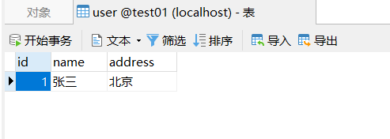
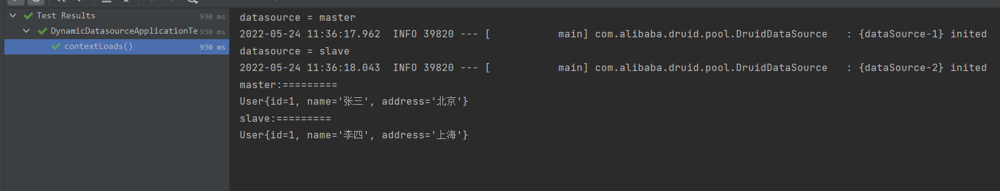

# 01动态数据源

# 1.实现原理

1. 通过自定义注解用来修饰 service 层类或方法，来指定具体类或方法使用的数据源
2. 使用 aop 拦截被自定义注解修饰的类或方法，获取注解中指定的数据源
3. 在拦截方法中将获取的数据源信息存放到 threadLocal 中。在 servlet 中一个请求由一个线程来处理，所以在 service 中设置 threadLocal 的值可以在 mapper 中获取。
4. 读取配置文件中动态数据源的配置信息，并存放在 map 中
5. 加载所有的数据源信息，并返回一个关于数据源的`map<routingKey, datasource>`
6. 添加配置类继承`AbstractRoutingDataSource`
   1. 重写`determineCurrentLookupKey`方法，该方法返回具体使用的数据源的 routingKey
   2. 在构造函数中加载所有的数据源和指定默认的数据源

# 2.具体实现细节

## 2.1自定义注解

自定义`@Datasource`注解，包含一个属性用来指定具体数据源，默认数据源为 master，可以修饰在类或方法上

```java
@Target({ElementType.METHOD, ElementType.TYPE})
@Retention(RetentionPolicy.RUNTIME)
public @interface Datasource {
    String value() default DatasourceConstant.MASTER;
}
```

## 2.2配置类加载配置

使用 yml 来定义数据源信息，这里包含公共信息（连接数，超时时间等）和动态信息（连接信息等），定义配置类来加载配置文件中的数据源信息

```yaml
# 数据源配置
spring:
  datasource:
    type: com.alibaba.druid.pool.DruidDataSource
    driverClassName: com.mysql.cj.jdbc.Driver
    ds:
      # 主库数据源
      master:
        url: jdbc:mysql://localhost:3306/test01?useUnicode=true&characterEncoding=utf8&zeroDateTimeBehavior=convertToNull&useSSL=false&serverTimezone=GMT%2B8
        username: root
        password: 123
      # 从库数据源
      slave:
        url: jdbc:mysql://localhost:3306/test02?useUnicode=true&characterEncoding=utf8&zeroDateTimeBehavior=convertToNull&useSSL=false&serverTimezone=GMT%2B8
        username: root
        password: 123
    # 初始连接数
    initialSize: 5
    # 最小连接池数量
    minIdle: 10
    # 最大连接池数量
    maxActive: 20
    # 配置获取连接等待超时的时间
    maxWait: 60000
```

```java
@ConfigurationProperties("spring.datasource")
public class DruidProperties {
    private String type;
    private String driverClassName;
    private Map<String, Map<String, String>> ds;
    private Integer initialSize;
    private Integer minIdle;
    private Integer maxActive;
    private Integer maxWait;

    public DruidDataSource druidDataSource(DruidDataSource dataSource) {
        dataSource.setInitialSize(initialSize);
        dataSource.setMinIdle(minIdle);
        dataSource.setMaxActive(maxActive);
        dataSource.setMaxWait(maxWait);
        return dataSource;
    }
    /* setter getter */
}
```

# 3.AOP拦截对应方法

首先需要定义 ThreadLocal 工具类，然后在拦截方法中将获取到的数据源信息设置在 ThreadLocal 中，当拦截方法执行完毕后需要手动删除 ThreadLocal 中的值，避免内存泄漏。

```java
public class DynamicDataSourceContextHolder {
    public static ThreadLocal<String> DATASOURCE_ROUTE = new ThreadLocal<>();
    public static void setDatasource(String value) {
        DATASOURCE_ROUTE.set(value);
    }
    public static String getDatasource() {
        return DATASOURCE_ROUTE.get();
    }
    public static void removeDatasource() {
        DATASOURCE_ROUTE.remove();
    }
}
```

```java
@Aspect
@Component
public class DatasourceAspect {

    // @within 表示拦截类上被 @Datasource 修饰中的所有方法
    @Pointcut("@annotation(cn.junhaox.dd.annotation.Datasource) || @within(cn.junhaox.dd.annotation.Datasource)")
    public void pc() {}


    @Around("pc()")
    public Object around(ProceedingJoinPoint pjp) {
        System.out.println("=============拦截");
        Datasource datasource = getDatasource(pjp);
        if (datasource != null) {
            DynamicDataSourceContextHolder.setDatasource(datasource.value());
        }
        try {
            return pjp.proceed();
        } catch (Throwable throwable) {
            throwable.printStackTrace();
        } finally {
            DynamicDataSourceContextHolder.removeDatasource();
        }
        return null;

    }

    private Datasource getDatasource(ProceedingJoinPoint pjp) {
        MethodSignature signature = (MethodSignature) pjp.getSignature();
        Datasource annotation = AnnotationUtils.findAnnotation(signature.getMethod(), Datasource.class);
        if (null != annotation) {
            return annotation;
        }
        return AnnotationUtils.findAnnotation(signature.getDeclaringType(), Datasource.class);
    }
}
```

# 4.数据源加载

通过配置类中的数据源配置信息创建一个`map<routingKey, datasource>`，其中包含所有的数据源信息

```java
@EnableConfigurationProperties(DruidProperties.class)
@Component
public class LoadDataSource {

    /**
     * 如果上面不使用 @EnableConfigurationProperties(DruidProperties.class) 则
     * 这里的依赖注入为 null
     */
    @Resource
    private DruidProperties druidProperties;

    public Map<String, DruidDataSource> loadAllDatasource() {
        // 最终返回的关于数据源 routingKey 和 datasource 的 map
        Map<String, DruidDataSource> map = new HashMap<>(4);
        try {
            // 获取动态的连接信息
            Map<String, Map<String, String>> ds = druidProperties.getDs();
            Set<String> keys = ds.keySet();
            for (String key : keys) {
                map.put(key, druidProperties.druidDataSource((DruidDataSource) DruidDataSourceFactory.createDataSource(ds.get(key))));
            }
        } catch (Exception e) {
            e.printStackTrace();
        }
        return map;
    }
}
```

# 5.动态数据源配置

添加配置类，集成 AbstractRoutingDataSource 并重写 determineCurrentLookupkey 方法，该方法返回具体使用的数据源，如果返回 null 则使用默认数据源。

```java
@Component
public class DynamicDataSource extends AbstractRoutingDataSource {

    public DynamicDataSource(LoadDataSource loadDataSource) {
        // 所有的数据源
        Map<String, DruidDataSource> allDatasource = loadDataSource.loadAllDatasource();
        // 设置所有的数据源
        super.setTargetDataSources(new HashMap<>(allDatasource));
        // 设置默认的数据源
        super.setDefaultTargetDataSource(allDatasource.get(DatasourceConstant.MASTER));
        super.afterPropertiesSet();
    }
    
    @Override
    protected Object determineCurrentLookupKey() {
        String datasource = DynamicDataSourceContextHolder.getDatasource();
        System.out.println("datasource = " + datasource);
        return datasource;
    }
}

```

# 6.测试使用

在 service 层定义两个方法，分别使用 master 数据源和 slave 数据源，都调用共同的 mapper 层方法，观察其返回值

master 数据库表数据如下：



slave 数据库表数据如下：


mapper 层方法定义：

```java
@Mapper
public interface UserMapper {
    /**
     * 查询所有
     * @return
     */
    @Select("select * from user")
    List<User> getAllUsers();
}
```

service 层方法：

```java
@Service
public class UserService {
    @Resource
    private UserMapper userMapper;

    @Datasource("slave")
    public List<User> getSlaveAllUsers() {
        return userMapper.getAllUsers();
    }

    @Datasource("master")
    public List<User> getMasterAllUsers() {
        return userMapper.getAllUsers();
    }

}
```

测试类中调用对应方法及观察结果如下：

```java
@SpringBootTest
class DynamicDatasourceApplicationTests {
    @Resource
    UserService userService;
    @Test
    void contextLoads() {
        List<User> allMasterUsers = userService.getMasterAllUsers();
        List<User> allSlaveUsers = userService.getSlaveAllUsers();
        System.out.println("master:=========");
        allMasterUsers.forEach(System.out::println);
        System.out.println("slave:=========");
        allSlaveUsers.forEach(System.out::println);
    }
}
```


