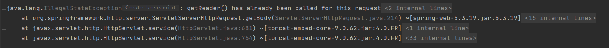

# 03RequestBody数据重复读取

# 1.问题演示

对于 spring boot 项目中，如果我们在拦截器中对于 request 中流数据进行读取完毕后，在 controller 中将无法再次读取该数据。

首先定义一个拦截器：

```java
@Component
public class RepeatIntercept implements HandlerInterceptor {
    @Override
    public boolean preHandle(HttpServletRequest request, HttpServletResponse response, Object handler) throws Exception {
        String s = request.getReader().readLine();
        System.out.println(s);
        return true;
    }
}
```

然后配置拦截器拦截所有请求：

```java
@Configuration
public class WebConfig implements WebMvcConfigurer {

    @Resource
    private RepeatIntercept repeatIntercept;

    @Override
    public void addInterceptors(InterceptorRegistry registry) {
        registry.addInterceptor(repeatIntercept).addPathPatterns("/**");
    }
}
```

最后定义 controller 接口

```java
@RestController
public class HelloController {
    @PostMapping("/hello")
    public String hello(@RequestBody String msg) throws IOException {
        return msg;
    }
}
```

`@RequestBody`底层也是通过流来进行数据读取的，但是由于在拦截器中对于流已经进行一次读取了，所以这里再次读取就会报错：



# 2.问题解决

这里可以利用装饰者模式对 HttpServletRequest 的功能进行装饰增强，具体做法为：重新定义一个 HttpServletRequest 然后在过滤器中“偷梁换柱”

```java
public class RepeatableReadRequestWrapper extends HttpServletRequestWrapper {
    private byte[] cache;
    public RepeatableReadRequestWrapper(HttpServletRequest request, HttpServletResponse response) throws IOException {
        super(request);
        response.setCharacterEncoding("UTF-8");
        response.setCharacterEncoding("UTF-8");
        String line = null;
        StringBuilder sb = new StringBuilder();
        while ((line = request.getReader().readLine()) != null) {
            sb.append(line);
        }
        cache = sb.toString().getBytes(StandardCharsets.UTF_8);
    }


    @Override
    public BufferedReader getReader() throws IOException {
        return new BufferedReader(new InputStreamReader(getInputStream()));
    }

    @Override
    public ServletInputStream getInputStream() throws IOException {
        ByteArrayInputStream bais = new ByteArrayInputStream(cache);
        return new ServletInputStream() {
            @Override
            public boolean isFinished() {
                return false;
            }

            @Override
            public boolean isReady() {
                return false;
            }

            @Override
            public void setReadListener(ReadListener readListener) {

            }

            @Override
            public int read() throws IOException {
                return bais.read();
            }

            @Override
            public int available() throws IOException {
                return cache.length;
            }
        };
    }
}
```

这段代码的意思是指，在构造 RepeatableReadRequestWrapper 的时候首先将输入流读取到 byte 数组中，然后重写`getReader`和`getInputStream`方法，在这两个读取 IO 流的的方法中都从 byte 数组中返回 IO 流数据，这样即可实现反复读取。

然后在过滤去中增强 request ，让这个装饰后的 request 生效

```java
public class RepeatFilter implements Filter {
    private static final String CONTENT_TYPE = "application/json";


    @Override
    public void init(FilterConfig filterConfig) throws ServletException {
        Filter.super.init(filterConfig);
    }

    @Override
    public void doFilter(ServletRequest servletRequest, ServletResponse servletResponse, FilterChain filterChain) throws IOException, ServletException {
        HttpServletRequest request = (HttpServletRequest) servletRequest;
        if (StringUtils.startsWithIgnoreCase(request.getContentType(), CONTENT_TYPE)) {
            RepeatableReadRequestWrapper readRequestWrapper = new RepeatableReadRequestWrapper(request, ((HttpServletResponse) servletResponse));
            filterChain.doFilter(readRequestWrapper, servletResponse);
            return;
        }
        filterChain.doFilter(servletRequest, servletResponse);
    }

    @Override
    public void destroy() {
        Filter.super.destroy();
    }
}
```

过滤器中需要判断一下，如果是 application/json 格式的数据就把 request 进行装饰，修改为 RepeatableReadRequestWrapper 然后让过滤器继续往下走。

最后配置一下过滤器就大功告成，body 中的数据就可以反复读取了

```java
@Bean
public FilterRegistrationBean<RepeatFilter> repeatFilterFilterRegistrationBean() {
    FilterRegistrationBean<RepeatFilter> bean = new FilterRegistrationBean<>();
    bean.setFilter(new RepeatFilter());
    bean.addUrlPatterns("/*");
    return bean;
}
```
