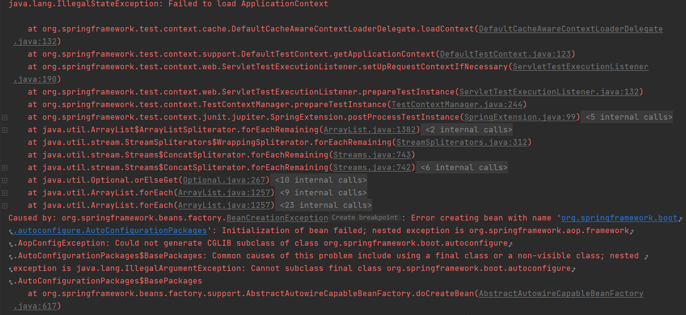

# 04AOP

# 1.AOP 切点指示符

#### 1.1使用 execution 定义切点

execution 用来匹配方法签名，包括方法访问修饰符（public、private、protected）、方法返回类型、方法包名、类名、方法名、参数名，其中包名、类名、方法名和参数是必须的

1. 切点为`cn.junhaox.boottest01.service`包下的任意类中的任意方法且方法参数任意（0个或多个参数），其中 `..`代表任意个参数（包含0个）

```java
@Pointcut(value = "execution(public * cn.junhaox.boottest01.service.*.*(..))")
public void pc1(){}
```

2. 切点为`cn.junhaox.boottest01.service`包下的任意类中的任意方法且方法只有一个`String`类型的参数

```java
@Pointcut(value = "execution(public * cn.junhaox.boottest01.service.*.*(String))")
public void pc1(){}
```

3. 切点为`cn.junhaox.boottest01.service`包下的任意类中的任意方法且方法参数任意（0个或多个参数），其中 `..`代表任意个参数（包含0个）且抛出`IllegalArgumentException`异常的方法

```java
@Pointcut(value = "execution(public * cn.junhaox.boottest01.service.*.*(..) throws IllegalArgumentException)")
public void pc2(){}
```

4. 切点为`cn.junhaox.boottest01.service.IBookService`接口及其实现类的任意方法，参数任意

```java
@Pointcut(value = "execution(public * cn.junhaox.boottest01.service.IBookService+.*(..))")
public void pc3(){}
```

#### 1.2使用 within 定义切点

1. 切点为指定类型`cn.junhaox.boottest01.service.IBookService+`及其子类型下的任意方法

```java
@Pointcut(value = "within(cn.junhaox.boottest01.service.IBookService+)")
public void pc4(){}
```

2. 切点为指定类型`cn.junhaox.boottest01.service.BookService`下的任意方法

```java
@Pointcut(value = "within(cn.junhaox.boottest01.service.BookService)")
public void pc5(){}
```

3. 切点为持有`cn.junhaox.boottest01.anno.CustomAnnotation`注解的对象中的任意方法，注解必须修饰在对象上修饰接口及方法不生效

```java
@Pointcut(value = "within(@cn.junhaox.boottest01.anno.CustomAnnotation *)")
public void pc6(){}
```

#### 1.3使用 args 定义切点

使用`args(参数列表)`来匹配当前执行方法传入的参数为指定类型的方法

1. 切点为参数列表以`cn.junhaox.boottest01.entiy.User`为第一个参数其他参数任意的方法

```java
@Pointcut(value = "args(cn.junhaox.boottest01.entiy.User, ..)")
public void pc7(){}
```

使用以上切点定义方式会报错，args 方式定义切点为运行时动态匹配，开销较大，只通过参数匹配 spring 会认为不合理，报错如下：



正确的做法为加入限制条件，如，匹配指定接口及其实现类下的方法参数

```java
@Pointcut(value = "within(cn.junhaox.boottest01.service.IBookService+) && args(cn.junhaox.boottest01.entiy.User)")
public void pc7(){}
```

#### 1.4使用 @within 定义切点

使用`@within(注解类型)`来定义切点，注解类型必须为全类名，不能使用通配符

1. 切点为持有`cn.junhaox.boottest01.anno.CustomAnnotation`注解的对象中的任意方法，注解必须修饰在对象上修饰接口及方法不生效

```java
@Pointcut(value = "@within(cn.junhaox.boottest01.anno.CustomAnnotation)")
public void pc8(){}
```

#### 1.5使用 @args 定义切点

使用`@args(注解类型)`表示所执行方法的参数必须**持有**指定注解，注解类型必须为全类名，不能使用通配符，该方法于 args 类似，属于动态切入，需要加入前置条件否则会报错，参考1.3

1. 切点的定义如下

```java
@Pointcut(value = "execution(public * cn.junhaox.boottest01.service.BookService1.*(..)) && @args(cn.junhaox.boottest01.anno.ParamAnnotation)")
public void pc9(){}
```

期望被增强的方法：

- 错误的方法如下：原因是 String 类并不持有`@ParamAnnotation`注解，仅仅是参数被该注解修饰

```java
public void world02(@ParamAnnotation String s) {
    System.out.println("world02");
}
```

- 正确的方法如下：其中 User 对象被`@ParamAnnotation`修饰，理解为**持有**​`@ParamAnnotation`注解

```java
@CustomAnnotation
public void world01(User user) {
    System.out.println(user);
}
```

```java
@ParamAnnotation
public class User {}
```

#### 1.6使用 @annotation 定义切点

使用`@annotation(注解类型)`表示被执行方法持有指定注解

1. 切点定义如下：

```java
@Pointcut(value = "@annotation(cn.junhaox.boottest01.anno.CustomAnnotation)")
public void pc10(){}
```

# 2.AOP默认参数

#### 1.JoinPoint

```java
package org.aspectj.lang;  
import org.aspectj.lang.reflect.SourceLocation;  
public interface JoinPoint {  
    String toString();         //连接点所在位置的相关信息  
    String toShortString();     //连接点所在位置的简短相关信息  
    String toLongString();     //连接点所在位置的全部相关信息  
    Object getThis();         //返回AOP代理对象  
    Object getTarget();       //返回目标对象  
    Object[] getArgs();       //返回被通知方法参数列表  
    Signature getSignature();  //返回当前连接点签名  
    SourceLocation getSourceLocation();//返回连接点方法所在类文件中的位置  
    String getKind();        //连接点类型  
    StaticPart getStaticPart(); //返回连接点静态部分  
} 
```

#### 2.ProceedingJoinPoint

Proceedingjoinpoint 继承了 JoinPoint。是在JoinPoint的基础上暴露出 proceed 这个方法。proceed很重要，这个是aop代理链执行的方法。

> 暴露出这个方法，就能支持 aop:around 这种切面（而其他的几种切面只需要用到JoinPoint，，这也是环绕通知和前置、后置通知方法的一个最大区别。这跟切面类型有关）， 能决定是否走代理链还是走自己拦截的其他逻辑。
