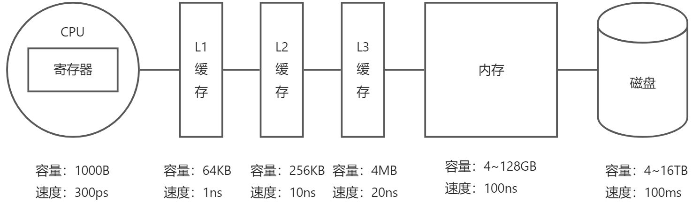
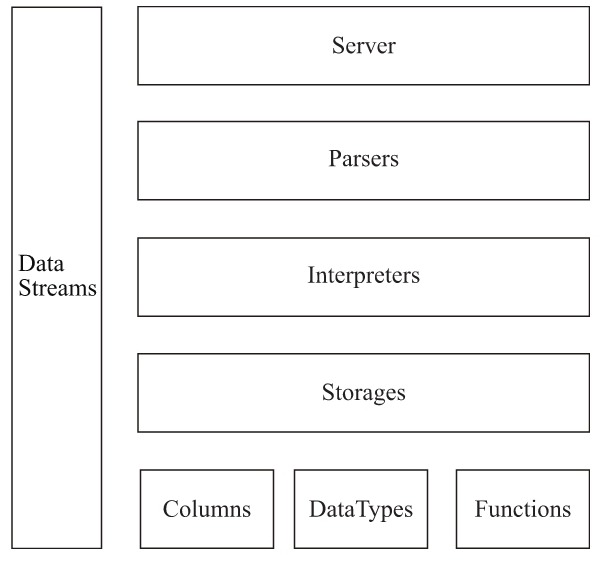

# 02ClickHouse 架构概述

## 1.ClickHouse 的核心特性

### 1.1完备的 DBMS 功能

ClickHouse 拥有完备的管理功能，所以它称得上是一个 DBMS ，而不仅是一个数据库。作为一个 DBMS 它具备一些基本功能：

- DDL（数据定义语言）：可以动态的创建、修改或删除数据库、表和试图，而无需重启服务。
- DML（数据操作语言）：可以动态查询、插入、修改或删除数据
- 权限控制：可以按照用户粒度设置数据库或者表的操作权限，保障数据的安全性。
- 数据备份与回复：提供了数据备份导出与导入的恢复机制，满足生产环境的要求。
- 分布式管理：提供集群模式，能够自动管理多个数据库节点。

### 1.2列式存储与数据压缩

列式存储和数据压缩，对于一款高性能数据库来说是必不可少的。列式存储和数据压缩通常是伴生的，因为一般来说列式存储时数据压缩的前提。

- 按行存储每次查询需要扫描全部字段，而按列存储直接返回对应列的数据，避免多余的数据扫描。
- 案列存储由于同一列中的字段类型相同，更利于数据压缩压缩

### 1.3向量化执行引擎

在计算机系统体系结构中，存储系统是一种层次结构。典型服务期计算机的存储层次结构如下图所示：

存储媒介距离 CPU 越近，则访问速度越快。

ClickHouse 用单条命令操作多条数据实现向量化执行，这需要利用 CPU 的 SIMD 指令。它的原理是在 CPU 寄存器层面实现数据的并行操作。

### 1.4关系模型与 SQL 查询

- ClickHouse 使用关系模型描述数据，并提供了传统数据库的概念：数据库、表、视图和函数等。
- ClickHouse 完全使用 SQL 作为查询语言，支持 GROUP BY、ORDER BY、JOIN、IN 等大部分标准 SQL。
- 关系模型相较于文档和键值对等其他模型，拥有更高的描述能力。在 OLAP 领域，已经有大量的数据建模工作都是居于关系型模型展开的（星型模型、雪花模型乃至宽表模型）

### 1.5多样化的表引擎

与 MySQL 类似，ClickHouse 也将数据存储部分进行了抽象，把存储引擎作为一层独立的接口。

ClickHouse 支持的引擎如下：

- 合并树
- 内存
- 文件
- 接口
- ... 以及其他 6 大类 20 多种表引擎

## 2.ClickHouse 的架构设计

### 2.1Column 与 Field

Column 和 Field 是 ClickHouse 数据最基础的映射单元。

在大多数场合，ClickHouse  都会以整列的方式操作数据，但是如果只操作单个具体的数值，也即单列中的一行数据，则需要使用 Field 对象，Field 对象代表一个单值。

### 2.2DataType

数据的序列化与反序列化工作是由 DataType 负责。IDataType 接口定义了许多正反序列化的方法，他们成对出现：

- serializeBinary 和 deserializeBinary
- serializeTextJSON 和 deserializeTextJSON

这些操作涵盖了常用的二进制、文本、JSON、XML、CSV 和 Protobuf 等多种格式类型。

### 2.3Block 与 Block 流

Block 对象可以看作数据报表的子集。Block 对象本质是由数据对象、数据类型和列名称组成的三元组，即 Column、DataType 及列名称字符串。

有了 Block 对象这一层封装之后，对 Block 流的设计就是水到渠成的事情了。流操作有两组顶层接口：IBlockInputStream 负责数据的读取和关系运算，IBlockOutputStream 负责将数据输出到下一环节。

### 2.4Table

在数据表的底层设计中并没有所谓的 Table 对象，它直接使用 IStorage 接口指代数据表。表引擎是ClickHouse的一个显著特性，不同的表引擎由不同的子类实现，例如 IStorageSystemOneBlock（系统表）、StorageMergeTree（合并树表引擎）和 StorageTinyLog（日志表引擎）等。

### 2.5Parser 与 Interpreter

Parser 分析器可以将一条 SQL 语句以递归下降的方式解析成 AST 语法树的形式。

Interpreter 解释器的作用就像 Service 服务层一样，起到串联这个查询过程的作用，它会根据解释器类型，聚合到它所需要的资源。首先它会解析 AST 对象；然后执行“业务逻辑”（例如分支判断、设置参数、调用接口等）；最终返回 IBlock 对象，以线程的形式建立起一个查询执行管道。

### 2.6Functions 与 Aggregate Functions

ClickHouse 主要提供两类函数：

- 普通函数：由 IFunction 接口定义，提供诸如四则运算等常用函数。
- 聚合函数：由 IAggregateFunctionCount 接口定义，相比无状态的普通函数，聚合函数是有状态的。

### 2.7Cluster 与 Replication

ClickHouse 的分片特性：

- ClickHouse 的一个节点只能拥有 1 个分片，也就是说如果要实现 1 分片、1 副本，则至少需要 2 个服务节点。
- 分片只是一个逻辑概念，其物理承载还是由副本承担
