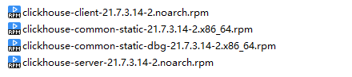
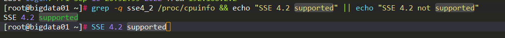
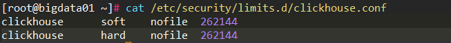
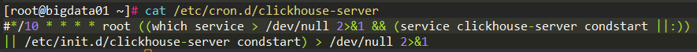
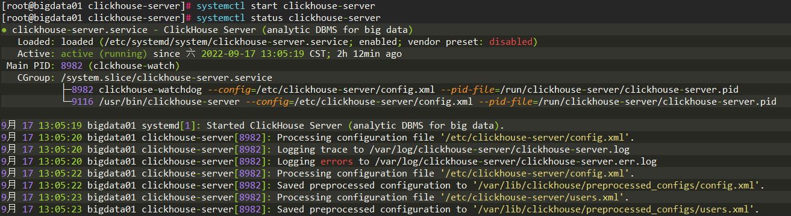
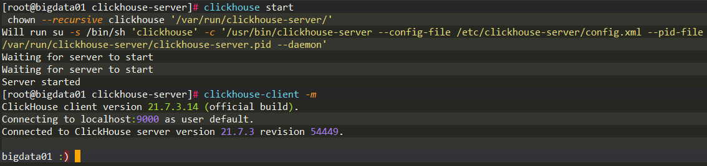
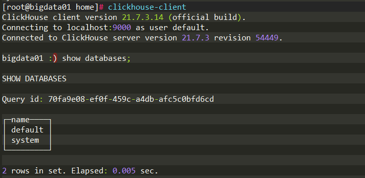
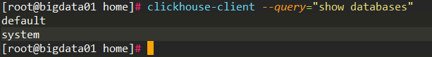
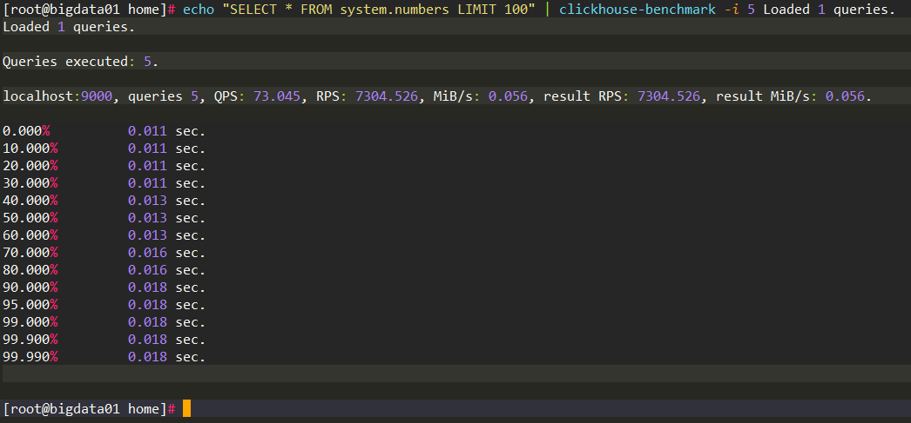

# 03ClickHouse 的安装部署

## 1.安装过程

### 1.1环境准备

**系统及安装包**

操作系统为 Centos，采用 rpm 离线包的方式安装。

下载 rpm 离线包镜像地址：

- [https://repo.yandex.ru/clickhouse/rpm/stable/x86_64/](https://repo.yandex.ru/clickhouse/rpm/stable/x86_64/)
- [https://packagecloud.io/altinity/clickhouse](https://packagecloud.io/altinity/clickhouse)

总共需要以下 4 个安装包文件



**关闭防火墙及依赖检查**

考虑到后续的集群部署以及初学 ClickHouse 建议先关闭防火墙，避免出现一些问题：

```shell
systemctl stop firewalld
systemctl disable firewalld
```

接着需要验证当前服务器 CPU 是否支持 SSE4.2 指令集，因为向量化执行需要用到这项特征：

```shell
grep -q sse4_2 /proc/cpuinfo && echo "SSE 4.2 supported" || echo "SSE 4.2 not supported"
```

出现`SSE 4.2 supported`表示支持。



如果不支持SSE指令集，则不能直接使用先前下载的预编译安装 包，需要通过源码编译特定的版本进行安装。

### 1.2安装 ClickHouse

在 rpm 安装包目录内执行如下命令一键安装：

```shell
rpm -ivh *.rpm
```

注意这种做法需要当前目录只有 ClickHouse 的相关 4 个安装包。

如果出现缺失依赖的情况，通过 yum 补齐相关依赖即可。

安装完成后会自动构建 ClickHouse 相关目录结构，具体如下：

**核心目录：**

- `/etc/clickhouse-server/`：服务端的配置文件目录，包括全局配置 config.xml 和用户配置 users.xml 。
- `/var/lib/clickhouse`：默认的数据存储目录，通常会修改到大容量磁盘挂载的目录。
- `/var/log/clickhouse-server`：默认保存日志的目录，通常会修改到大容量磁盘挂载的目录。

**配置文件目录：**

- `/etc/security/limits.d/clickhouse.conf`：文件句柄数量的配置，具体如下：



- `/etc/cron.d/clickhouse-server`：cron 定时任务配置，用于恢复因异常原因中断的 ClickHouse 服务进程，其默认配置如下。



可以看到，在默认情况下，每个 10 秒 就会使用 condstart 尝试启动一次 ClickHouse 服务，而 condstart 命令的启动逻辑如下：

如果 ClickHouse 服务正在运行，则跳过；如果没有运行，则通过 start 启动。

 **/usr/bin 路径下的可执行文件：**

- clickhouse：主程序可执行文件。
- clickhouse-client：一个指向 ClickHouse 可执行文件的软链接，供客户端连接使用
- clickhouse-server：一个指向 ClickHouse 可执行文件的软连接，供服务端启动使用
- clickhouse-compressor：内置提供的压缩工具，用于数据的正压反解

### 1.3启动 ClickHouse

启动前建议先修改默认的数据保存目录，将他切换到大容量磁盘挂载的目录。修改 config.xml 如下位置即可改变数据存储目录：

```xml
<!-- 可以修改为自定义目录，这里是默认目录 -->
<user_files_path>/var/lib/clickhouse/user_files/</user_files_path>
```

启动命令：使用 `systemctl start clickhouse`或`clickhouse start`都可以启动 ClickHouse。





ClickHouse 在安装过程中会创建 clickhouse 用户，第一次切换 clickhouse 用户时可能会由于该用户未激活导致切换失败，可以使用如下命令将其激活：

```shell
usermod -s /bin/bash clickhouse
```

## 2.客户端的访问接口

ClickHouse 底层的访问接口支持 TCP 和 HTTP 两种，TCP 协议具有良好的性能，其端口默认为 9000，主要用于集群间的内部通信及 CLI 客户端；而 HTTP 协议具有更好的兼容性，可以通过 REST 服务的形式被广泛用户 JAVA、Python，默认端口为 8123。但是通常不建议使用底层接口访问，更为推荐的是通过 CLI 和 JDBC 这些封装接口。

### 2.1CLI

CLI 即命令行接口，其底层是基于 TCP 接口进行通信的，通过 clickhouse-client 脚本运行的。

它拥有两种执行模式：

- 交互式执行



通过交互式模式执行的 SQL 语句会被统一记录到`~/.clickhouse-client-history`文件。

- 非交互式执行



这种模式主要用于批处理，通过`--query`参数指定执行的 SQL 语句。

**CLI 中的重要参数**

- `--host/-h`：指定服务端的地址，默认为 localhost
- `--port`：指定服务端 TCP 的观看，默认为 9000
- `--user/-u`：指定登录的用户名，默认为 defautl
- `--password`：指定登录密码，默认为空
- `--database/-d`：指定登录数据库，默认值为 default
- `--query/-q`：只能在非交互式查询时使用，指定 SQL 语句
- `--multiquery/-n`：只能在非交互式查询时使用，指定 SQL 语句，允许一次执行多条 SQL ，多条 SQL 以分号间隔
- `--time/-t`：在非交互执行时会打印每条 SQL 的执行时间

完整的参数通过 `--help`来获得。

### 1.2JDBC

ClickHouse 支持标准的 JDBC 协议，底层基于 HTTP 接口通信。相关依赖如下：

```xml
<dependency>
  <groupId>ru.yandex.clickhouse</groupId>
  <artifactId>clickhouse-jdbc</artifactId>
  <version>0.2.4</version>
</dependency>
```

具体操作和 JDBC 操作 MySQL 一致。

## 3.内置的实用工具

ClickHouse 除了提供基础的服务端与客户端程序之外，还内置了 clickhouse-local 和 clickhouse-benchmark 两种实用工具。

### 3.1clickhouse-local

clickhouse-local 可以独立运行大部分 SQL 查询，不需要依赖任何 ClickHouse 的服务端程序，它可以理解成是 ClickHouse 服务的单机版微内核，是一个轻量级的应用程序。

### 3.2clickhouse-benchmark

clickhouse-benchmark 是基准测试的小工具，它可以自动运行 SQL 查询，并生成相应的运行指标报告，例如执行下面的语句启动测试：


