# 04ClickHouse 数据定义

## 1.CK 的数据类型

作为一款分析型数据库，ClickHouse 提供了许多数据类型，它们可以划分为基础类型、复合类型和特殊类型。

### 1.1基础类型

ClickHouse 中的基础类型只有数值、字符串和时间三种类型，没有 Boolean 类型，但可以用 0 或 1 代替。

1. **数值类型**
   1. Int类型

ClickHouse 用 Int8、Int16、Int32、Int64 来代表不同长度的 Int 类型。Int 后面的数值表示位数

2. Float 类型

与整数类型 ClickHouse 用 Float32 和 Float64 代表不同精度的浮点数

3. Decimal 类型

浮点数在进行计算是会有精度丢失的问题，所以如果需要高精度计算是可以使用 Decimal。ClickHouse 提供了 Decimal32、Decimal64、Decimal128 三种精度的定点数。

有两种形式可以声明定点数：

- Decimal(S)：简写版
- Decimal(P, S)：原生方式，其中 P 代表精度，决定总位数（整数部分+小数部分），取值范围是 1<sub>38；S 代表小数部分，取值范围是 0</sub>P

简写与原生方式的对应关系如下：

|**名称**|**等效声明**|**范围**|
| -------------| ----------------| ------|
|Decimal32(S)|Decimal(1~9,S)|-10<sup>(9-S)</sup>~10<sup>(9-S)</sup>|
|Decimal64(S)|Decimal(10~18,S)|-10<sup>(18-S)</sup>~10<sup>(18-S)</sup>|
|Decimal128(S)|Decimal(19~38,S)|-10<sup>(38-S)</sup>~10<sup>(38-S)</sup>|

不同精度的定点数进行四则运算其精度变化规则不同，具体如下：

|**名称**|**规则**|
| ----| -------------------------------------------|
|加法|S = MAX(S1, S2)|
|减法|S = MAX(S1, S2)|
|乘法|S = S1 + S2|
|除法|S = S1（S1 为 被除数，且 S1范围 >= S2范围）|

2. **字符串类型**
   1. String 类型

字符串由 String 定义，长度不限。因此在使用它时无需指定长度。它代替了传统意义上的 Varchar、Text、Blob 等字符串类型。String 不限定字符集，因为它根本没有这个概念，但是在同一个系统中，应该保证字符集一致。

2. FixedString 类型

FixedString 与传统意义上的 Char 类型类型，对于有字符串固定长度的场景可以使用 FixedString(N)，N 代表字符串长度，若字符串实际长度不足 N 则使用 null 字节填充末尾（MySQL 中的 Char 通常是在末尾补充空格）；字符串长度超过 N 则会直接报错。

3. UUID 类型

UUID 是一种常见的数据库主键类型，一般数据库将其通过内置函数的形式呈现，而在 ClickHouse 中则直接被作为一种数据类型。UUID 一共有 32 位，格式为 8-4-4-4-12 如果一个 UUID 类型字段在写入数据时没有被赋值，则会按照格式用 0 补充。

3. **时间类型**
   1. DateTime 类型

DateTime 类型包含时、分、秒，精确到秒，支持使用字符串形式写入。

2. DateTime64 类型

精确到亚秒。

3. Date 类型

精确到天。

### 1.2复合类型

除了基础类型之外，ClickHouse 还提供了数组、枚举、元组和嵌套四类复合类型。

1. **Array**

数组定义的方式有两种，常规方式 array(T)，或者简写 [T]。

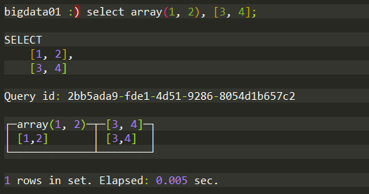

通过上述的例子可以发现，在查询时并不需要主动声明数组的元 素类型。因为 ClickHouse 的数组拥有类型推断的能力，推断依据：以 最小存储代价为原则，即使用最小可表达的数据类型。例如在上面的 例子中，array(1,2) 会通过自动推断将 UInt8 作为数组类型。但是数 组元素中如果存在 Null 值，则元素类型将变为 Nullable，例如：

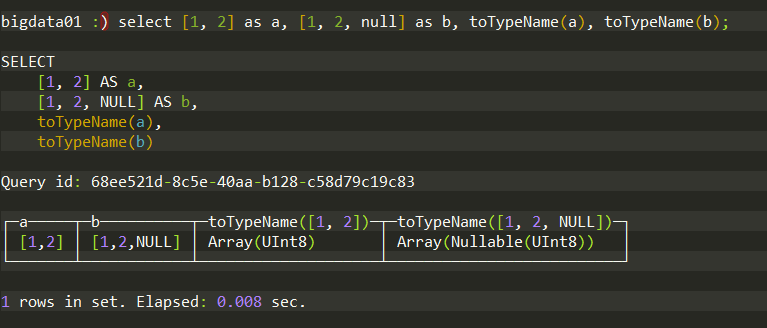

数组中可以包含多种类型，但各个类型间必须兼容。

2. **Tuple**

元组类型由 1~n 个元素构成，不要求各个元素兼容。使用 tuple(T) 定义，或者简写 (T)。

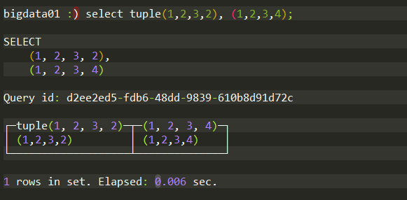

使用元组定义字段时，元组也需要指明元素类型；

```sql
create table tuple_test(
  c1 Tuple(String, Int8);
) ENGINE=Memory;
```

如果插入类型不匹配则会报错：

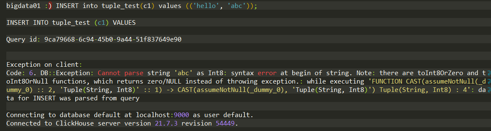

3. **Enum**

ClickHouse 支持枚举类型，提供了 Enum8 和 Enum16 两种，二者除了在取值范围不同外，其他使用方法一致。其中 Enum8 对应 (String, Int8)，Enum16 对应 (String, Int16)。例如：

```sql
create table enum_test(
  c1 Enum('reday' = 1, 'start' = 2, 'success' = 3, 'error' = 4)
) ENGINE=Memory;
```

其中 key 和 value 都不能重复，且都不能为 null，但字符串可以使用空字符串。

再插入时可以使用 key 值进行插入，也可以使用 value 值进行插入，无法匹配 key 或 value 就会报错：

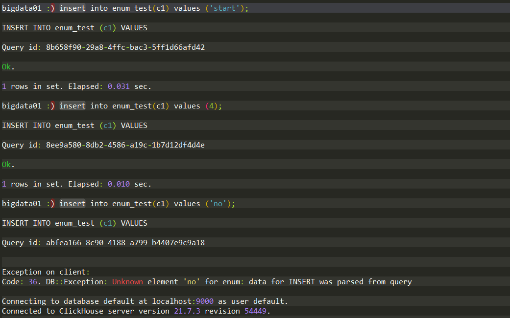

4. **Nested**

嵌套类型，是一种嵌套表结构。一张数据表可以拥有任意多个嵌套类型字段，但一个嵌套字段最多只能有一级。

```sql
create table nested_test(
  name String,
  age UInt8,
  dept Nested(
    id UInt8,
    name String
  )
)ENGINE=Memory;
```

值得注意的是 nested_test 与 dept 并非一对一的关系，而是一对多的关系，具体插入方式如下：

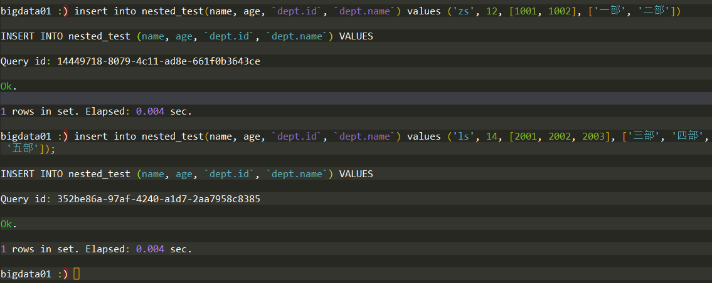

由此可见每一行数据中的 dept 数组长度可以不同，但是行内的 dept 字段的数据长度必须对其：

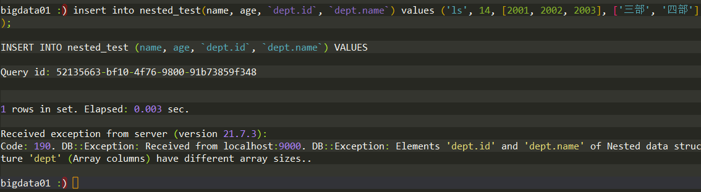

### 1.3特殊类型

ClickHouse 还有一类特殊的数据类型。

1. **Nullable**

严格来讲 Nullable 并不能算一种独立的数据类型，他需要搭配基础类型来使用，表示这个基础类型字段可以为 null ，但是它不能作用于符合类型、特殊类型以及索引字段。

```sql
create table nullable_test(
  c1 String,
  c2 Nullable(Int8)
)ENGINE=Memory;
```

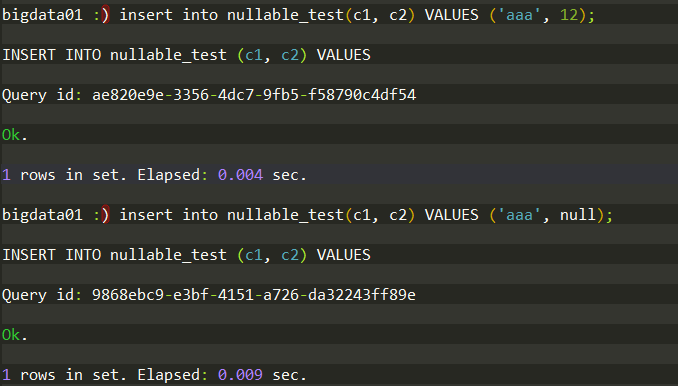

其次，应该慎用 Nullable 类型，包括 Nullable 的数据表， 不然会使查询和写入性能变慢。因为在正常情况下，每个列字段的数 据会被存储在对应的 [Column].bin 文件中。如果一个列字段被 Nullable 类型修饰后，会额外生成一个 [Column].null.bin 文件专门 保存它的 Null 值。这意味着在读取和写入数据时，需要一倍的额外文件操作。

2. **Domain**

域名类型分为 IPv4 和 IPv6 两类，本质上它们是对整型和字符串的 进一步封装。IPv4 类型是基于 UInt32 封装的，它的具体用法如下所示：

```sql
create table domain_test(
    url String,
    ip IPv4
) engine = Memory;
```


使用 IPv4 类型而不是字符串的原因：

- 出于便捷性的考量，IPv4 支持格式检查，格式错误的数据无法写入。
- 出于性能的考量，IPv4 使用 UInt32 存储，相比 String 更为紧凑，占用空间小，查询速度块。

IPv6 则是基于 FixedString(16) 封装，与 IPv4 的使用一致。

注意：使用 Domain 时虽然它从表象上看和 String 一样，但 Domain 并不是字符串，所以并不支持隐式类型自动转换。如果需要返回 IP 的字符串格式，则需要显示调用 IPv4NumToString 或 IPv6NumToString 函数进行转换。

## 2.如何定义数据表

### 2.1数据库

数据库起到了数据隔离的作用，任何数据表都必须归属于够一个数据库之下。创建数据库的完整语法如下：

```sql
create database if not exists db_name [engine = engine];
```

如你所见，数据库也支持引擎，目前支持 5 中引擎：

- Ordinary：默认引擎，绝大多数情况下我们都是用这种引擎，无需显式声明，在此数据库下，我们可以使用任意类型的表引擎。
- Dictionary：字典引擎，此类数据库会自动为所有数据字典创建它们的数据表。
- Memory：内存引擎，用于存放临时数据。此类数据库下的数据表只会存在内存中，没有任何磁盘交互，重启服务后数据会被清除。
- Lazy：日志引擎，此类数据库下的表只能使用 Log 类型的表引擎。
- MySQL：MySQL 引擎，此类引擎下的数据库会自动拉取远端 MySQL 中的数据，并为它创建 MySQL 表引擎的数据表。

绝大多数情况下我们都是用默认引擎。创建使用以下语句就可以创建一个默认引擎数据库：

```sql
create database db_test;
```

默认数据库的实质是物理磁盘上的一个目录，所以在执行创建数据库语句之后会在数据目录创建一个 db_test 目录：

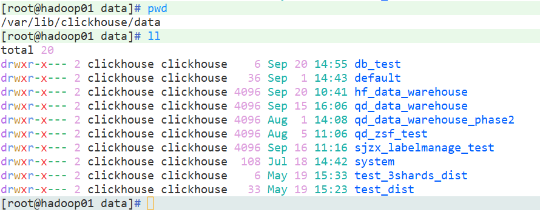

于此同时，在 metadata 目录会创建用于恢复数据库的 db_test.sql  文件

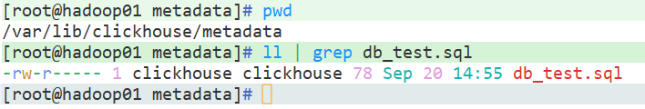

使用`show dabatases;`可以查看当前系统的数据库，使用`use db_test;`可以实现多个数据库之间的切换，使用`drop database db_test;`可以删除数据库。

### 2.2数据表

ClickHouse 支持标准三种定义数据表的形式：

- 标准 SQL 形式

```sql
CREATE TABLE [IF NOT EXISTS] [db.]table_name [ON CLUSTER cluster]
(
    name1 [type1] [NULL|NOT NULL] [DEFAULT|MATERIALIZED|EPHEMERAL|ALIAS expr1] [compression_codec] [TTL expr1],
    name2 [type2] [NULL|NOT NULL] [DEFAULT|MATERIALIZED|EPHEMERAL|ALIAS expr2] [compression_codec] [TTL expr2],
    ...
) ENGINE = engine
```

例如：

```sql
create table db_test.table_test(
  c1 String,
  c2 UInt8
) engine=Memory;
```

- 复制其他表结构

```sql
CREATE TABLE [IF NOT EXISTS] [db.]table_name AS [db2.]name2 [ENGINE = engine]
```

例如：

```sql
create table if not exists db_test.ads_hl_district_cate_info as hf_data_warehouse.ads_hl_district_cate_info engine=Memory;
```

- 通过 SELECT 子句形式创建，不仅会创建表结构，同时也会将 SELECT 子句查询的数据顺带写入。

```sql
CREATE TABLE [IF NOT EXISTS] [db_name.]table_name ENGINE = engine AS SELECT …
```

例如：

```sql
create table if not exists db_test.ads_hl_wtfl_addr_info engine=Memory as select id, wtfl_fir, wtfl_fir_name, wtfl_sec, wtfl_sec_name from hf_data_warehouse.ads_hl_wtfl_addr_info;
```

### 2.3默认值表达式

表字段支持三种默认值表达式的形式，DEFAULT、MATERIALIZED 和 ALIAS。

例如：

```sql
create table db_test.default_test(
    c1 default 'OOO',
    c2 UInt16,
    c3 materialized concat(c1, toString(rand())),
    c4 alias c2
) engine = Memory;
```

字段声明默认值之后则不需要显式指明字段类型，ClickHouse 会根据默认值进行类型推断。如果同时定义了数据类型和默认值，则以数据类型为主。

三种定义方法存在不通之处，可以从如下三个方面来比较：

1. 数据写入：只有 DEFAULT 类型字段可以出现在 insert 语句中。MATERIALIZED 和 ALIAS 不能被显式赋值，它们只能依靠计算取值。
2. 数据查询：在使用`select *`时只有 DEFAULT 类型字段会返回。
3. 数据存储：只有 DEFAULT 和 MATERIALIZED 会被持久化存储（如果表引擎支持物理存储）。

可以通过 alter 语句进行默认值修改：

```sql
ALTER TABLE [db_name.]table MODIFY COLUMN col_name DEFAULT value
```

修改默认值动作并不会影响已经存在的数据。但默认值修改有诸多限制，例如在合并树表引擎中，他的主键无法被修改；而某些表引擎完全不支持修改，例如 TinyLog。

### 2.4临时表

ClickHouse 的临时表是在创建普通表的基础上添加 temporary 关键字。

```sql
create temporary table default_test1(
    c1 UInt8 default 1,
    c2 String
) engine = Memory;
```

临时表有如下特性：

- 临时表不属于任何数据库，因此不需要指定数据库创建临时表。
- 它只和会话绑定，表引擎只能为 Memory ，会话结束表就会销毁。
- 如果临时表和普通表重名则以临时表为主。

在 ClickHouse 的日常使用中，通常不会刻意使用临时表。它更多被运用在 ClickHouse 的内部，是数据在集群间传播的载体。

### 2.5分区表

数据分区是对本地数据的一种纵向切分，借助数据分区，在后续的查询中能够跳过不必要的目录，从而提升查询性能。目前支持分区的引擎只有 MergeTree 系列的表引擎。

例如按月分区：

```sql
create table db_test.partition_v1(
    id String,
    url String,
    end_time Date
) engine = MergeTree partition by toYYYYMM(end_time) order by id;
```

接着插入不同的数据进行测试：

```sql
INSERT INTO db_test.partition_v1(id, url, end_time) 
VALUES ('A000','www.nauu.com', '2019-05-01'), ('A001','www.brunce.com', '2019-06-02') ;
```

最后通过 system.parts 系统表查看数据表分区状态：

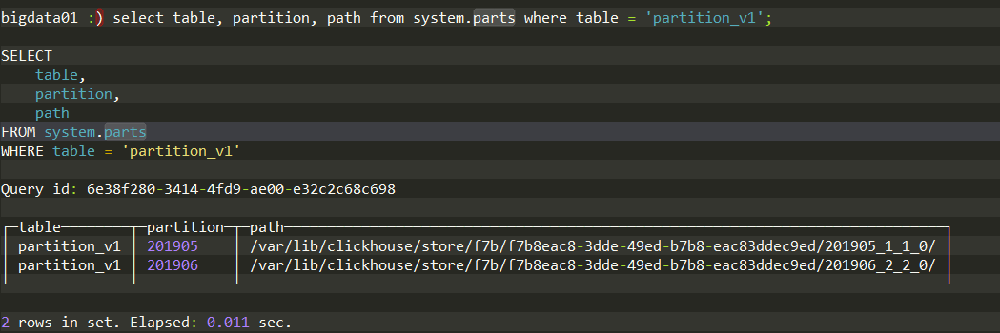

可以看到 partition_v1 按月分区后目前有两个分区目录，用于保存各自的数据。那么在后续的查询中，通过分区键过滤：

```sql
select * from tb_test.partition_v1 where end_time = '2019-06-02';
```

就会只加载 6 月份的数据，从而带来查询性能的提升。

当然使用不合理的分区键也会适得其反，例如使用粒度过细的分区键会导致分区数量的急剧增长，从而导致性能下降。

### 2.6视图

ClickHouse 支持普通视图和物化视图两种

- 普通视图只是一种简单的查询代理，不会存储任何数据，不会提升查询效率，其创建语法如下

```sql
CREATE VIEW [IF NOT EXISTS] [db_name.]view_name AS SELECT ...
```

- 物化视图支持表引擎，数据保存形式由它的表引擎决定，创建物化视图的完整语法如下：

```sql
CREATE MATERIALIZED VIEW [IF NOT EXISTS] [db.]table_name [TO[db.]name] [ENGINE = engine] [POPULATE] AS SELECT ...
```

物化视图创建完成之后如果源表被写入新数据，那么物化视图也会同步更新。POPULATE 决定了物化视图的初始化策略：

- 使用 POPULATE：创建物化视图时会将源表中的数据一同写入
- 不使用 POPULATE：创建物化视图时不会导入数据，只会同步在此之后源表被写入的数据。

删除源表中的数据，物化视图不会同步删除。物化视图的本质是一张特殊的表，使用`show tables;`查看创建的物化视图：

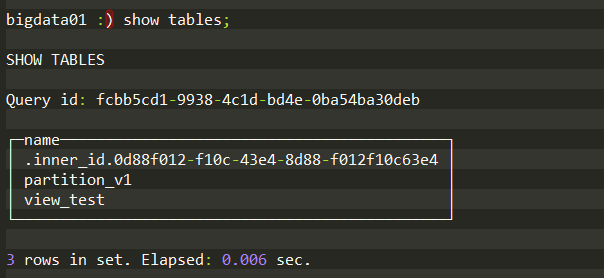

可以使用`drop table tableName;`来删除物化视图。

## 3.数据表的基本操作

目前只有 MergeTree、Merge 和 Distributed 这三类表引擎支持 alter 查询。

### 3.1追加新字段

追加新字段完整语法：

```sql
ALTER TABLE tb_name ADD COLUMN [IF NOT EXISTS] name [type] [default_expr] [AFTER name_after]
```

例如在数据表末尾添加字段：

```plsql
alter table test add column c_test String default 'c';
```

在指定字段后面添加字段：

```plsql
alter table test add column c_test String default 'c' after id;
```

### 3.2修改字段类型

修改字段类型的完整语法：

```sql
ALTER TABLE tb_name MODIFY COLUMN [IF EXISTS] name [type] [default_expr]
```

修改字段类型，实质上会调用相应的 toType() 方法，如果类型不兼容，则修改会报错。例如将 IPv4 转化为 String 是可行的：

```sql
create table domain_test(
    url String,
    ip IPv4,
    c_time Date default today()
) engine = MergeTree partition by toYYYYMM(c_time) order by url;
insert into domain_test(url, ip) VALUES ('localhost', '120.0.0.1');
alter table domain_test modify column ip String;
```

### 3.3修改备注

修改备注完整语法：

```sql
ALTER TABLE tb_name COMMENT COLUMN [IF EXISTS] name 'some comment'
```

### 3.4删除字段

删除字段完整语法：

```sql
ALTER TABLE tb_name DROP COLUMN [IF EXISTS] name
```

### 3.5移动数据表

移动数据表完整语法：

```plsql
RENAME TABLE [db_name11.]tb_name11 TO [db_name12.]tb_name12, [db_name21.]tb_name21 TO [db_name22.]tb_name22, ...
```

rename 是重命名的意思，但是如果移动前后数据库发生变化则表示数据表移动，否则就是重命名数据表。

需要注意的是移动数据表仅适用于单节点范围里。换言之集群内移动是不支持的。

### 3.6清空数据表

清空数据表完整语法：

```plsql
TRUNCATE TABLE [IF EXISTS] [db_name.]tb_name
```

## 4.数据分区的基本操作

数据分区的好处有很多，但是目前只有 MergeTree 系列的表引擎支持数据分区。

### 4.1查询分区信息

在前面分区操作时已经使用到了 system.parts 表来查询 partition_v1 的分区信息，具体使用如下：

```sql
select partition_id, name, table, database from system.parts where table = 'partition_v1';
```

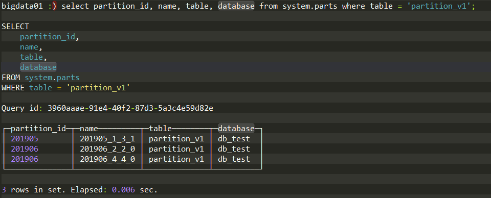

通过 partition_id 和 name 就可以唯一确定一个分区。

### 4.2删除指定分区

删除分区语法如下：

```sql
alter table table_name drop partition partition_expr;
```

这里的 partition_expr 可以是 partition_id 也可以是 name

例如：

```sql
alter table partition_v1 drop partition 201905;
```

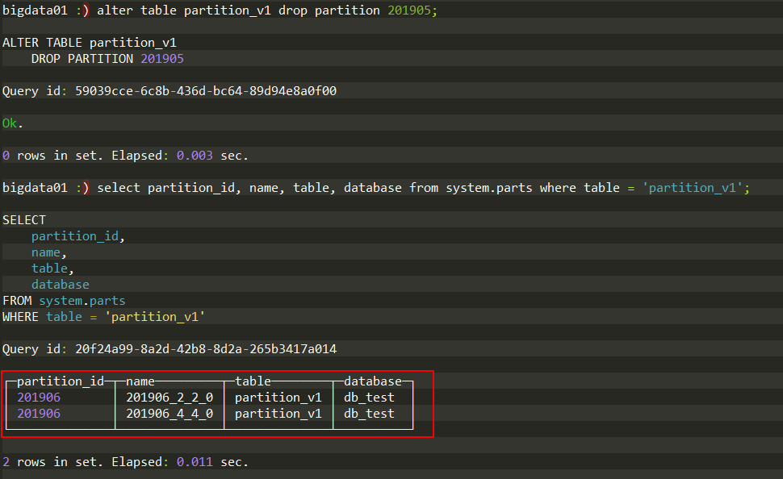

### 4.3复制分区数据

复制分区数据完整语法如下：

```sql
ALTER TABLE B REPLACE PARTITION partition_expr FROM A;
```

复制需要满足两个前提条件：

- 二者拥有相同的分区键
- 二者表结构完全相同

A 表中的分区数据会覆盖 B 表中的同分区的数据。

### 4.4重置分区数据

重置分区数据完整语法如下：

```sql
ALTER TABLE tb_name CLEAR COLUMN column_name IN PARTITION partition_expr;
```

### 4.5卸载与装载分区

卸载分区完整语法如下：

```sql
ALTER TABLE tb_name DETACH PARTITION partition_expr
```

例如使用以下语句卸载 partition_v2 的整个 6 月份的数据：

```sql
alter table partition_v2 detach partition 201906;
```

再次查询发现 6 月份的数已经不存在了。同时被卸载的分区目录已经被移动到 detached 目录中：

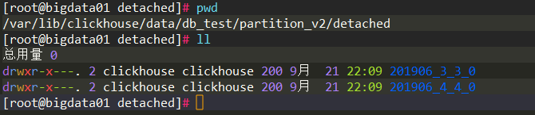

这些数据已经脱离 ClickHouse 的管理，ClickHouse 不会主动删除这些数据。除非我们主动删除它或者使用 attach 命令重新装载它，具体语法如下：

```sql
ALTER TABLE tb_name ATTACH PARTITION partition_expr;
```

例如装载刚刚卸载的 6 月份数据：

```sql
alter table partition_v2 attach partition 201906;
```

## 5.分布式 DDL 执行

ClickHouse 支持集群模式，create、alter、drop、rename、truncate 这些 ddl 语句都支持分布式执行，如同批处理一样，省去了需要依次去单个节点执行 ddl 的烦恼。

具体语法如下：

```sql
create table db_test.partition_v1 on cluster cluster_name(
    id String,
    url String,
    end_time Date
) engine = MergeTree partition by toYYYYMM(end_time) order by id;
```

`on cluster cluster_name`表示这个 ddl 语句将会在 cluster_name 这个集群内执行。

## 6.数据的写入

数据的写入支持三种语法范式。

- 第一种是常见的 values 格式语法：

```sql
INSERT INTO [db.]table [(c1, c2, c3…)] VALUES (v11, v12, v13…), (v21, v22, v23…),
...
```

- 第二种是使用指定格式的语法：

```sql
INSERT INTO [db.]table [(c1, c2, c3…)] FORMAT format_name data_set
```

例如从 csv 格式数据中写入数据到 partition_v2：

```sql
insert into partition_v2(id, url, end_time) format CSV
    'A0017','www.nauu.com', '2019-10-01'
    'A0018','www.nauu.com', '2019-10-01';
```

注意 CSV 需要大写。

- 第三种是使用 select 字句将查询结果写入数据表：

```sql
insert into A select ... from B
```

> ClickHouse 内部所有的数据操作都是面向 Block 数据块的，所以 INSERT 查询最终会将数据转换为 Block 数据块。也正因如此，INSERT 语句在单个数据块的写入过程中是具有原子性的。在默认的情况下，每个数据块最多可以写入1048576 行数据 （由 max_insert_block_size 参数控制）。也就是说，如果一条 INSERT 语句写入的数据少于 max_insert_block_size 行，那么这批 数据的写入是具有原子性的，即要么全部成功，要么全部失败。需要注意的是，只有在 ClickHouse 服务端处理数据的时候才具有这种原子写入的特性，例如使用JDBC或者HTTP接口时。因为 max_insert_block_size 参数在使用 CLI 命令行或者 INSERT SELECT 子句写入时是不生效的。

## 7.数据的删除与修改

ClickHouse 提供了 delete 和 update 的功能，这类操作被称为 mutation 操作，它可以看作 alter 操作的变种。虽然 mutation 操作最终可以实现 delete 和 update 的效果，但不能以常意义上的 delete 和 update 来理解，主要有三个特点：

- mutation 操作“很重”，更适用于批量修改和删除。
- mutation 操作不支持事务，一旦语句被提交则立刻对现有数据进行修改和删除。
- mutation 语句的执行是一个异步过程，语句被提交后立即返回。这不代表他的逻辑已经执行完毕，具体进度需要查询 system.mutation 来获得。

delete 完整语法

```sql
ALTER TABLE [db_name.]table_name DELETE WHERE filter_expr
```

例如删除 partition_v1 中 id 为 A003 的数据：

```sql
alter table partition_v3 delete where id = 'A003';
```

执行删除操作之前的 partition_v3 目录：

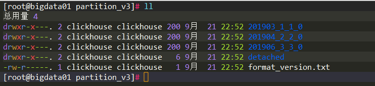

执行删除操作之后的 partition_v3 目录：

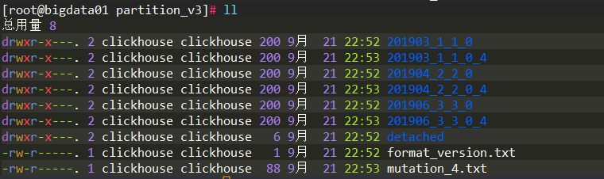

原有的数据目录都新增了一个同名目录并且添加了同一个后缀`_4`，同时该目录下还新增了一个 mutation_4.txt 的文件，其内容如下：

```plain
[root@bigdata01 partition_v3]# cat mutation_4.txt 
format version: 1
create time: 2022-09-21 22:53:33
commands: DELETE WHERE id = \'A003\'
```

mutation_4.txt 是一个日志文件，完整的记录了 delete 操作的执行语句和执行时间，同时通过查询 system.mutations 系统表得知后缀`_4`来自 该系统表的 block_numbers 的 number 字段（block_number 是一个符合类型）：

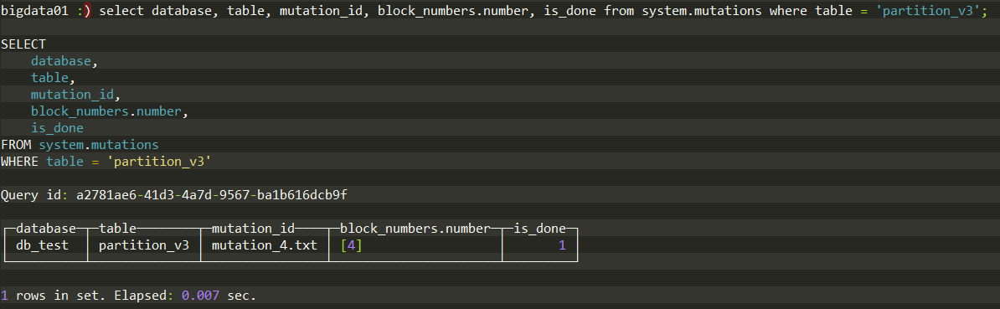

删除的原理：

> 数据删除的过程是以数据表的每个分区目录为单位，将所有目录重写为新的目录，新目录的命名规则是在原有名称上加上`system.mutations.block_numbers.number`。数据在重写的过程中会将需要删除的数据去掉。旧的数据目录并不会立即删除，而是会被标记成非激活状态（active为0）。等到 MergeTree 引擎的下一次 合并动作触发时，这些非激活目录才会被真正从物理意义上删除。

update 完整语法：

```sql
ALTER TABLE [db_name.]table_name UPDATE column1 = expr1 [, ...] WHERE filter_expr
```
