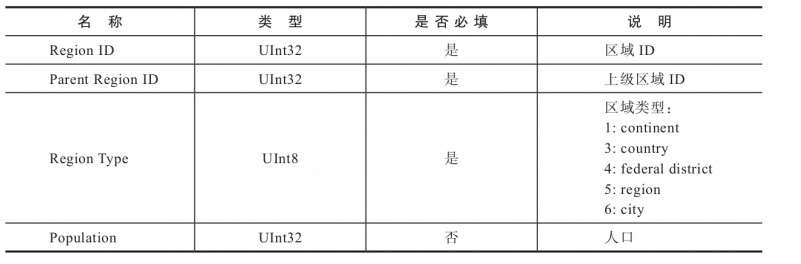
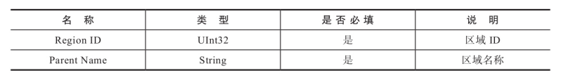
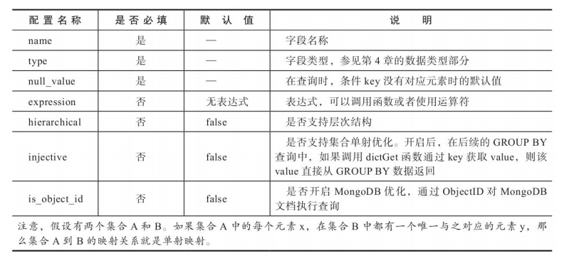
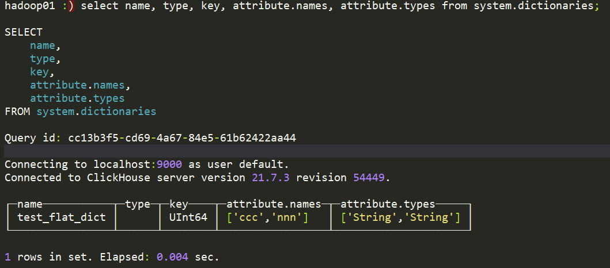
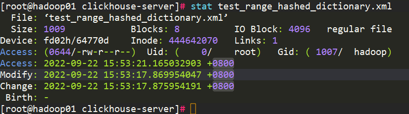

# 05数据字典

数据字典是 ClickHouse 提供的简单的、实用的存储媒介，它以键值和属性的形式定义数据。字典中的数据可以主动或被动的加载到内存，并支持动态更新。

主动或被动是指 ClickHouse 启动时加载，还是查询时懒加载，可以由参数配置。

数据字典分为内置和扩展两种。正常情况下，字典数据只能通过特定的字典函数访问。但有一种情况例外，那就是使用特殊的字典表引擎，可以将数据字典挂载到一张代理的数据表下，从而实现数据表和字典数据的 join 查询。

## 1.内置字典

ClickHouse 目前只提供了一种数据字典：Yandex.Metrica 字典。但是这个字典由于版权问题没有任何数据，这就意味着 ClickHouse 目前的内置字典只提供了字典的定义机制和取数函数。

### 1.1内置字典配置说明

内置字典在默认情况下是禁用的，需要开启后才能使用，开启方式是将如下两项配置打开：

```xml
<path_to_regions_hierarchy_file>/opt/geo/regions_hierarchy.txt</path_to_regions_hierarchy_file>
<path_to_regions_names_files>/opt/geo/</path_to_regions_names_files>
```

两项配置的具体用法：

1. path_to_regions_hierarchy_file

path_to_regions_hierarchy_file 等同于区域数据的主表，由 1 个 regions_hierarchy.txt 和多个 regions_hierarchy_[name].txt 区域层次的数据文件组成，缺一不可。这些 txt 文件内的数据需要使用 TabSeparated 格式定义：



2. path_to_regions_names_files

path_to_regions_names_files 等同于区域数据的维度表，记录了区域 id 对应的区域名称。维度使用 6 个 regions_hierarchy_[name].txt 文件保存其中 [name] 表示区域标识 符与 regions_hierarchy_[name].txt 对应，目前包括 ru、en、ua、 by、kz 和 tr。

这些 TXT 文件内的数据同样需要使用TabSeparated格式定义：



### 1.2内置字典使用

配置好内置字典的数据后，就可以使用他了。例如：

```sql
SELECT regionToName(toUInt32(20009));
```

可以看到，对于 Yandex.Metrica 字典数据的访问，这里用到了 regionToName 函数。类似这样的函数还有很多，在 ClickHouse 中它们被称为 Yandex.Metrica 函数。

## 2.外部扩展字典

外部扩展字典是以插件形式注册到 ClickHouse 中，由用户自行定义数据模式及数据来源。目前扩展字典支持 7 中类型的内存布局 和 4 类数据来源。

### 2.1数据准备

准备三分数据，他们均使用 csv 格式。

- 第一份是企业组织数据，它拥有 id、code、name 字段：

```plain
1,"a0001","研发部" 
2,"a0002","产品部" 
3,"a0003","数据部" 
4,"a0004","测试部" 
5,"a0005","运维部" 
6,"a0006","规划部" 
7,"a0007","市场部"
```

- 第二份是销售数据，它拥有 id、start、end 和 price 四个字段：

```plain
1,2016-01-01,2017-01-10,100 
2,2016-05-01,2017-07-01,200 
3,2014-03-05,2018-01-20,300 
4,2018-08-01,2019-10-01,400 
5,2017-03-01,2017-06-01,500 
6,2017-04-09,2018-05-30,600 
7,2018-06-01,2019-01-25,700 
8,2019-08-01,2019-12-12,800
```

- 第三份是 asn 数据，用于演示 ip_trie 字典场景。这份数据拥有 ip、asn 和 country 三个字段：

```plain
"82.118.230.0/24","AS42831","GB" 
"148.163.0.0/17","AS53755","US" 
"178.93.0.0/18","AS6849","UA"
"200.69.95.0/24","AS262186","CO" 
"154.9.160.0/20","AS174","US"
```

### 2.2扩展字典的配置文件

扩展字典的配置文件在 config.xml 配置指定：

```xml
<dictionaries_config>*_dictionary.xml</dictionaries_config>
```

在默认情况下，ClickHouse 会自动识别并加载 /etc/clickhouse-server 目录下的所有以`_dictionary.xml`结束的配置文件。同时 ClickHouse 也能动态的感知到此目录下的配置文件的各种变化，并且支持不停机更新。

在单个字典配置文件中可以定义多个字典，其中一个字典由一组 dictionary 元素定义。在 dictionary 元素下又分为 5 个子元素，均为必填项，完整结构如下：

```xml
<?xml version="1.0"?>
<dictionaries>
    <dictionary>
        <name>dict_name</name>
        <structure>
        <!-- 字典的数据结构 -->
        </structure>
        <layout>
        <!-- 在内存中的数据格式类型 -->
        </layout>
        <source>
        <!-- 数据源配置 -->
        </source>
        <lifetime>
        <!-- 字典的自动更新频率 -->
        </lifetime>
		</dictionary>
</dictionaries>
```

子节点含义如下：

- name：字典名称，确定字典的唯一标识，全局唯一。
- structure：字典数据结构
- layout：字典类型，它决定了数据在内存中以何种形式组织和存储。
- source：数据来源，决定了数据从何处加载。目前有文件、数据库和其他三种方式。
- lifetime：字典更新的时间，扩展字典支持在线更新。

### 2.3扩展字典的数据结构

扩展字典的数据机构由 structure 定义，包含 key 键值和 attribute 属性两部分，key 用来定义字典的数据标识，attribute 用来定义字段属性。具体如下：

```xml
<dictionary>
    <structure>
        <!-- <id> 或 <key> -->
        <id>
            <!-- Key属性-->
        </id>
        <attribute>
            <!-- 字段属性-->
        </attribute>
        ...
    </structure> 
</dictionary>
```

key 和 attribute 字段的含义如下：

1. key 字段，每个字典必须包含一个 key 字段，用来定位数据，类似数据库主键。key 分为数值型和复合型两种：
   1. 数值型：数值型 key 由 UInt64 类型定义，支持 flat、hashed、range_hashed 和 cache 类型的字典，具体定义如下：

```xml
<structure> 
    <id>
        <!--名称自定义--> 
        <name>Id</name> 
    </id>
省略…
```

2. 复合型：复合型 key 使用 Tuple 元组定义，可以由 1 到多个字段组成，类似数据库中的复合主键。它仅支持 complex_key_hashed、complex_key_cache 和 ip_trie 类型的字典。其定义方法如下：

```xml
<structure>
    <key>
        <attribute>
            <name>field1</name>
            <type>String</type>
        </attribute>
        <attribute>
            <name>field2</name>
            <type>UInt64</type>
        </attribute>
省略… 
    </key> 
省略…
```

2. attribute 字段：用来定义字典的的属性字段，字典可以拥有多个属性：

```xml
<structure> 
省略…
    <attribute>
        <name>Name</name>
        <type>DataType</type>
        <!-- 空字符串-->
        <null_value></null_value>
        <expression>generateUUIDv4()</expression>
        <hierarchical>true</hierarchical>
        <injective>true</injective>
        <is_object_id>true</is_object_id>
    </attribute> 
省略…
</structure>
```

attribute 下的 7 项配置说明如下：



### 2.4扩展字典类型

扩展字典的类型使用 layout 元素定义，目前共有7种类型。一个字典的类型，既决定了其数据在内存中的储结构，也决定了该字典支持的 key 键类型。根据 key 键类型的不同，可以将它们划分为两类：

- 一 类是 flat、hashed、range_hashed 和 cache 组成的单数值 key 类型，因为它们均使用单个数值型的 id ；
- 另一类则是由 complex_key_hashed、complex_key_cache 和 ip_trie 组成的复合 key 类型

complex_key_hashed 与 complex_key_cache 字典在功能方面与 hashed 和 cache 并无二致，只是单地将数值型 key 替换成了复合型 key 而已。

#### 1.flat 类型

flat 字典是所有字典类型中效率最高的，它只能用 UInt64 定义数值型 key 。flat 类型字典在内存中用数组结构保存，初始大小为 1024 上限为 500000，超出上限则会报错。

创建 flat 类型数据字典步骤如下：

1. 将数据文件放在`/home/jhwang31`下
2. 在`/etc/clickhouse-server`目录下创建 test_flat_dictionary.xml 文件，内容如下：

```xml
<?xml version="1.0"?>
<dictionaries>
    <dictionary>
        <name>test_flat_dict</name>
        <source>
            <!—准备好的测试数据-->
            <file>
                <path>/home/jhwang31/organization.csv</path>
                <format>CSV</format>
            </file>
        </source>
        <layout>
            <flat/>
        </layout>
        <!—与测试数据的结构对应-->
        <structure>
            <id>
                <name>xxx</name>
            </id>
            <attribute>
                <name>ccc</name>
                <type>String</type>
                <null_value></null_value>
            </attribute>
            <attribute>
                <name>nnn</name>
                <type>String</type>
                <null_value></null_value>
            </attribute>
        </structure>
         <lifetime>
            <min>300</min>
            <max>360</max>
        </lifetime>
    </dictionary>
</dictionaries>
```

注意其中 source.path 为 1 中的路径

3. 查验数据字典是否创建成功

```sql
select name, type, key, attribute.names, attribute.types from system.dictionaries;
```



#### 2.hashed 类型

hashed 类型同样只能使用 UInt64 数值型 key，但与 flat 类型字典不同的是，hashed 字典数据在内存中通过散列结构保存，没有存储上限。

创建步骤与 flat 类型字典一致，配置文件如下：

```xml
<?xml version="1.0"?>
<dictionaries>
    <dictionary>
        <name>test_hashed_dict</name>
        <source>
                <!-- 准备好的测试数据 -->
                <file>
                    <path>/home/jhwang31/organization.csv</path>
                    <format>CSV</format>
                </file>
            </source>
        <layout>
            <hashed/>
        </layout>
        <!-- 与测试数据的结构对应 -->
        <structure>
            <id>
                <name>id</name>
            </id>
            <attribute>
                <name>name</name>
                <type>String</type>
                <null_value></null_value>
            </attribute>
            <attribute>
                <name>code</name>
                <type>String</type>
                <null_value></null_value>
            </attribute>
        </structure>
         <lifetime>
            <min>300</min>
            <max>360</max>
        </lifetime>
    </dictionary>
</dictionaries>
```

#### 3.range_hashed 类型

range_hashed 可以看作 hashed 的变种，它在原有的功能上添加了指定时间区间的特性，数据会按散列结构存储，并按时间排序。时间区间通过 range_min 和 range_max 指定，其字段必须是 Date 或 DateTime类型。

创建一个 range_hashed 类型字段配置文件如下：

```xml
<?xml version="1.0"?>
<dictionaries>
    <dictionary>
        <name>test_hashed_dict</name>
        <source>
                <!-- 准备好的测试数据 -->
                <file>
                    <path>/home/jhwang31/sales.csv</path>
                    <format>CSV</format>
                </file>
            </source>
        <layout>
            <range_hashed/>
        </layout>
        <!-- 与测试数据的结构对应 -->
        <structure>
            <id>
                <name>id</name>
            </id>
            <range_min>
                <name>start</name>
            </range_min>
            <range_max>
                <name>end</name>
            </range_max>
            <attribute>
                <name>price</name>
                <type>Float32</type>
                <null_value></null_value>
            </attribute>
        </structure>
         <lifetime>
            <min>300</min>
            <max>360</max>
        </lifetime>
    </dictionary>
</dictionaries>
```

#### 4.cache 类型

cache 类型的数据字典使用 UInt64 类型的 key，它的字典数据在内存中通过固定长度的向量数组保存。定长的向量数组长度由 size_in_cells 指定，且必须是 2 的整倍数，若不是则向上取。

#### 5.complex_key_hashed 类型

complex_key_hashed 类型字典与 hashed 类型字典在功能上完全一致，只是将单个数值型的 key 换成复合型的 key。

配置文件如下：

```xml
<?xml version="1.0"?>
<dictionaries>
    <dictionary>
        <name>test_complex_key_hashed_dict</name>
        <source>
			<!-- 准备好的测试数据 -->
			<file>
				<path>/home/jhwang31/organization.csv</path>
				<format>CSV</format>
			</file>
		</source>
        <layout>
            <complex_key_hashed/>
        </layout>
        <!-- 与测试数据的结构对应 -->
        <structure>
            <key>
				<attribute>
					<name>id</name>
					<type>UInt64</type>
				 </attribute>
				<attribute>
					<name>code</name>
					<type>String</type>
				</attribute>
			</key>
            <attribute>
                <name>name</name>
                <type>String</type>
                <null_value></null_value>
            </attribute>
            <attribute>
                <name>code</name>
                <type>String</type>
                <null_value></null_value>
            </attribute>
        </structure>
         <lifetime>
            <min>300</min>
            <max>360</max>
        </lifetime>
    </dictionary>
</dictionaries>
```

#### 6.complex_key_cache 类型

complex_key_cache 类型字典与 cache 类型字段功能一致，只不过将 key 替换成了复合型。

#### 7.ip_trie 类型

ip_trie 类型虽然是复合类型的 key 但是只能定义一个 String 类型的字段，用来指代 IP 的前缀。ip_trie 类型的字典数据在内存中使用 trie 树保存，且专门用于 IP 前缀查询的场景。

具体配置如下：

```xml
<?xml version="1.0"?> 
<dictionaries>
    <dictionary>        
		<name>test_ip_trie_dict</name>
        <source>
            <file>
                <path>/home/jhwang31/asn.csv</path>
                <format>CSV</format>
            </file>
        </source>
            <layout>
                <ip_trie/>
            </layout>
            <structure>
                <!-- 虽然是复合类型,但是只能设置单个String类型的字段 -->
                <key>
                    <attribute>
                        <name>prefix</name>
                        <type>String</type>
                    </attribute>
                </key>
            <attribute>
                <name>asn</name>
                <type>String</type>
                <null_value></null_value>
            </attribute>
            <attribute>
                <name>country</name>
                <type>String</type>
                <null_value></null_value>
            </attribute>
        </structure>
		<lifetime>
            <min>300</min>
            <max>360</max>
        </lifetime>
    </dictionary> 
</dictionaries>
```

### 2.5扩展字典的数据源

数据源使用 source 定义，共支持 3 大类 9 种数据源。

#### 1.文件类型

1. 本地文件

```xml
<source> 
    <file>
        <path>/data/dictionaries/organization.csv</path> 
        <format>CSV</format>
    </file> 
</source>
```

2. 远程文件

```xml
<source> 
    <http>
        <url>http://10.37.129.6/organization.csv</url> 
        <format>CSV</format>
    </http> 
</source>
```

3. 可执行文件

```xml
<source>
    <executable>
        <command>cat /data/dictionaries/organization.csv</ command> 
        <format>CSV</format>
    </executable> 
</source>
```

#### 2.数据库类型

1. MySQL

```xml
 <source>
    <mysql>
        <port>3306</port>
        <user>root</user>
        <password></password>
        <replica>
            <host>10.37.129.2</host>
            <priority>1</priority>
        </replica>
        <db>test</db>
        <table>t_organization</table>
        <!--
        <where>id=1</where>
        <invalidate_query>SQL_QUERY</invalidate_query>
        --> 
    </mysql> 
</source>
```

2. ClickHouse

```xml
<source>
    <clickhouse>
    <host>10.37.129.6</host>
    <port>9000</port>
    <user>default</user>
    <password></password>
    <db>default</db>
    <table>t_organization</table>
    <!--
    <where>id=1</where>
    <invalidate_query>SQL_QUERY</invalidate_query>
    -->
    </clickhouse> 
</source>
```

3. MongoDB

```xml
<source>
    <mongodb>
        <host>10.37.129.2</host>
        <port>27017</port>
        <user></user>
        <password></password>
        <db>test</db>
        <collection>t_organization</collection>
    </mongodb>
</source>
```

#### 3.其他类型

ClickHouse 支持通过 ODBC 连接 PostgreSQL 和 MS SQL Server 作为数据源。

### 2.6扩展字典的更新策略

扩展字典的数据支持在线更新，无需重启服务。字典的更新频率由 lifetime 指定，单位为秒。

```xml
<lifetime>
    <min>300</min> 
    <max>360</max> 
</lifetime>
```

其中 min 和 max 定义了更新时间的上下限，CK 会在这个区间内随机触发更新，这样能有效的错开更新时间，避免所有字典在同一时间爆发更新。min 和 max 都是 0 的时候表示禁用更新。同时，对于 cache 字典 lifetime 还代表了他的缓存失效时间。

在字典更新过程中，旧版本的字典数据仍然会提供服务，只有完全更新成功之后新版数据才会完全替换旧版本数据。这也意味着如果更新失败，不会影响数据字典提供服务。

不同数据源类型，其更新机制也不尽相同。这个判断源数据是否被修改的标识，在字典内部称为 previous 它保存了一个用于比对的值。 ClickHouse 的后台进程每隔 5 秒便会启动一次数据刷新的判断，依次对比每个数据字典中前后两次previous的值是否相同。具体规则如下：

1. 文件类型

它的 previous 值来自修改时间，这和 Linux 系统的 stat 查询命令相似：

```shell
stat test_range_hashed_dictionary.xml 
```



2. MySQL（Innodb）、ClickHouse 和 ODBC

这个的 previous 来自 invalidate_query 中的查询语句，这个对于数据源有一定的要求

```shell
<source> 
    <mysql>
省略…
        <invalidate_query>select updatetime from t_organization where id = 
8</invalidate_query>
    </mysql> 
</source>
```

3. MySQL（MyIsam）

MyIsam 引擎的表结构通过如下命令就可以查询到修改时间：

```sql
SHOW TABLE STATUS
```

4. 其他数据源

除了上面描述的数据源之外，其他数据源目前无法依照标识判断 是否跳过更新。所以无论数据是否发生质性更改，只要满足当前 lifetime 的时间要求，它们都会执行更新动作。相比之前介绍的更新方式，其他类型的更新效率更低。

### 2.7扩展字典的基本操作

#### 1.元数据查询

```sql
select name, type, key, attribute.names, attribute.types from system.dictionaries;
```

#### 2.数据查询

```sql
select dictGet('test_flat_dict', 'ccc', toUInt64(1));
```

参数分别为字典名、字段名 和 key 值。如果是复合类型的 key 则需要先使用元组作为参数传入：

```sql
SELECT dictGet('test_ip_trie_dict', 'asn', tuple(IPv4StringToNum('82.118.230.0')));
```

除了 dictGet 函数外，还提供了获取具体类型的函数：

- 获取整型数据的函数：dictGetUInt8、dictGetUInt16、dictGetUInt32、dictGetUInt64、dictGetInt8、dictGetInt16、dictGetInt32、dictGetInt64。
- 获取浮点数据的函数：dictGetFloat32、dictGetFloat64。
- 获取日期数据的函数：dictGetDate、dictGetDateTime。
- 获取字符串数据的函数：dictGetString、dictGetUUID。

#### 3.字典表

除了通过字典函数读取数据之外，ClickHouse 还提供了另外一种借助字典表的形式来读取数据：

```sql
CREATE TABLE tb_test_flat_dict ( 
    id UInt64,
    code String, 
    name String
) ENGINE = Dictionary(test_flat_dict);
```

#### 4.使用 DDL 创建字典

```sql
CREATE DICTIONARY test_dict( 
       id UInt64,
       value String 
 )
PRIMARY KEY id 
LAYOUT(FLAT())
SOURCE(FILE(PATH '/usr/bin/cat' FORMAT TabSeparated)) 
LIFETIME(1)
```

参数与配置文件类似，不过换成了 DDL 语句。
