# 06MergeTree原理解析

ClickHouse 中有许多表引擎，表引擎是 ClickHouse 的一大特色。其中包含的表引擎有合并树、外部存储、内存、文件、接口和其他 6 大类 20 种表引擎。

在这些表引擎中合并树及其家族系列表引擎最为强大，在生产环境绝大多数场景使用的都是此系列表引擎，因为只有合并树表引擎支持主键索引、数据分区、数据副本和数据采集这样的特性，同时也只有这系列的表引擎支持 alter 操作。

## 1.MergeTree 的创建方式和存储结构

MergeTree 在写入一批数据时，数据总是以数据片段的方式写入磁盘，且数据不可修改。为了避免数据片段过多，ClickHouse 会通过后台线程的方式，定期合并这些数据片段，属于相同分区的数据片段会被合并成一个新的片段。这些数据片段往复合并的特点正是合并树的由来。

### 1.1MergeTree 的创建方式

在创建表时将 engine 声明为 MergeTree 即可：

CREATE TABLE [IF NOT EXISTS] [db_name.]table_name (   name1 [type] [DEFAULT|MATERIALIZED|ALIAS expr],   name2 [type] [DEFAULT|MATERIALIZED|ALIAS expr], 省略... ) ENGINE = MergeTree() [PARTITION BY expr] [ORDER BY expr] [PRIMARY KEY expr] [SAMPLE BY expr] [SETTINGS name=value, 省略...]

MergeTree 引擎的相关参数解释如下：

- partition by [选填]：分区键，用来指定表数据以何种标准进行分区。分区键既可以是单个字段也可以是通过元组形式使用多个字段，同时它也支持使用列表达式。如果不指定分区键则 CK 会自动生成一个名为 all 的分区。
- order by [必填]：排序键，用来指定一个数据片段内，数据以何种标准排序。默认情况下主键和排序键相同。排序键可以是单个字段，也可以是元组形式的多个字段。
- primary key [选填]：主键，声明后会按照主键建立以及索引，加速查询。默认情况下主键和排序键相同，因此可以直接使用 order by 代为指定，无需刻意指定主键。与其他数据库不同的是，CK 的主键可以重复。
- sample by [选填]：抽样表达式，抽样表达式需要配合 simple 子查询使用。用于声明数据以何种方式进行采样。如果使用了此项配置，则在主键配置中也需要声明同意的表达式：

省略... ) ENGINE = MergeTree() ORDER BY (CounterID, EventDate, intHash32(UserID) SAMPLE BY intHash32(UserID)

- settings: index_granularity[选填]：表示索引间隔粒度，默认值 8192 。也就是说在默认情况下 8192 条数据才会生成一条索引。定义方式如下；

省略... ) ENGINE = MergeTree() 省略... SETTINGS index_granularity = 8192;

- settings: index_granularity_bytes[选填]：数据体量大小，默认 10M ，用于动态划分数据间隔大小，设置为 0 表示不启用自适应功能
- settings: enable_mixed_granularity_parts[选填]：是否开启索引间隔自适应功能，默认开启。
- settings: merge_with_ttl_timeout [选填]：数据 ttl 。
- settings: storage_policy [选填]：数据存储策略。

### 1.2MergeTree 的存储结构

MergeTree 表引擎中的数据拥有物理存储，数据会按照分区目录形式存储到磁盘之上，如下图所示：

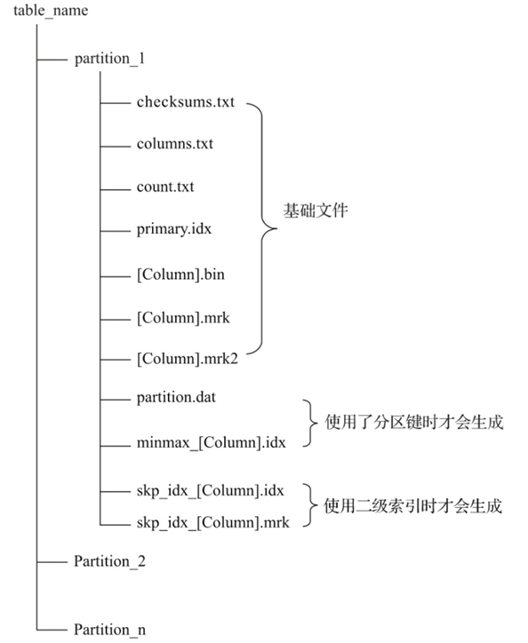

从图中可以看出一张数据表的完整物理结构分为 3 个层次，依次是数据表目录、分区目录及各分区下的具体的数据文件。相关作用介绍如下：

- partition：分区目录，余下的各类数据文件（primary.idx、[column].bin 等）都是以分区目录的形式被组织存放的，属于相同的分区数据，最终会被合并到同一个分区目录。
- checksums.txt：校验文件，使用二进制格式存储。保存余下各类文件（primary.idx、count.txt）的 size 大小及 size 的哈希值，用来快速校验文件的正确性和完整性。
- columns.txt：列信息文件，使用明文格式存储。
- count.txt：计数文件，使用明文格式存储。用于记录当前分区目录下数据的总行数。
- primary.idx：一级索引文件，使用二进制格式存储。用于存放稀疏索引，一张 MergeTree 表只能声明一次一级索引（通过 order by 或 primary key）。
- [Column].bin：数据文件，使用压缩格式存储，默认为 LZ4 压缩格式，用于存储某一列的数据。由于 CK 使用列式存储，所以每个字段都有单独的 .bin 文件，并以列明命名。
- [Column].mrk：列字段标记文件，使用二进制格式存储。记录了 .bin 文件中数据的偏移量信息。标记文件与稀疏索引对其，又与 .bin 文件一一对应，所以 MergeTree 通过标记文件建立了 primary.idx 稀疏索引与 .bin 数据文件之间的映射关系。
- [Column].mrk2：如果使用了自适应大小的索引间隔，则标记文件会以 .mrk2 命名。
- partition.dat 与 minmax_[Column].idx：如果使用了分区键则会额外产生 partition.dat 与 minmax 索引文件，它们均使用二进制格式存储。partition.dat 记录当前分区下分区表达式最终生成的值；minmax 索引用于记录当前分区下分区字段对应原始数据的最大值和最小值。
- skp_idx[Column].idx 与 skp_idx_[Column].mrk：如果见表语句使用了二级索引，则会二外产生相应的二级索引与标记文件。二级索引在 CK 中又称跳数索引，目前拥有 minmax、set、ngrambf_v1 和 tokenbf_v1 四种。

## 2.数据分区

在 MergeTree 中，数据是以分区目录的形式组织在一起的，每个分区独立分开存储。借助这种形式，在对 MergeTree 进行数据查询时可以跳过无用的数据文件，只使用最小的分区目录。

### 2.1数据分区的规则

MergeTree 的分区规则由分区 ID 决定，而分区 ID 是由分区键决定的，分区 ID 的生成逻辑如下：

- 不指定分区键：如果不适用分区键，即不使用partition by声明任何表达式，则分区 ID 默认为 all，所有的数据都会被写入这个分区。
- 使用整型：如果分区键取值属于整型，且无法转换为YYYYMMDD格式，则直接按照该整型的字符形式输出，作为分区ID 取值。
- 使用日期类型：如果分区键取值属于日期类型，或者能够转化为 YYYYMMDD 格式，则按照 YYYYMMDD 进行格式化后的字符串作为分区ID。
- 使用其他类型：如果分区键取值既不属于整型，也不输入日期类型，例如String、Float 等，则通过128位Hash算法取值作为ID取值。

如果通过元组的方式使用多个分区字段，则分区ID依旧是根据上市规则生成，不过多个ID之间通过-连接。

### 2.2分区目录的命名规则

分区目录并不完全按照分区ID命名，在ID之后会跟着一串数字，例如201905_1_1_0完整的分区目录的命名公式如下：

PartitionID_MinBlockNum_MaxBlockNum_Level

由此可见例子中的201905代表分区目录ID；1_1分别表示最小数据块编号和最大数据块编号；最后的0 表示目前合并的层级。

- PartitionID：分区ID
- MinBlockNum和MaxBlockNum：最小数据块编号和最大数据块编号。对于一个新的分区目录而言MinBlockNum与MaxBlockNum取值相同。当分区目录发生合并时取值会发生变化。
- Level：合并的层级，可以理解为某个分区被合并过的次数。对于一个新分区而言初始值均为0。之后如果相同分区发生合并动作，则累加1。

### 2.3分区目录的合并过程

MergeTree的分区目录和传统数据库有所不同。分区目录在数据表创建之后并不会立即创建，也即当数据表没有任何数据写入时是不会创建分区目录的。

其次在分区目录创建之后也不是一成不变，MergeTree伴随着每一批次的数据写入（一次INSERT语句），MergeTree都会创建一个新的分区目录，即使不同批次的数据的分区ID相同也会生成新的分区目录。在之后的某个时刻（写入后的10~15分钟）CK会使用后台线程将相同分区ID的目录合并成新的分区目录，且旧的分区目录不会立即删除，而是在之后的某个时刻（默认8分钟）通过后台任务删除。

新目录合并规则如下：

- MinBlockNum：取同一分区所有目录的最小MinBlockNum值
- MaxBlockNum：取同一分区所有目录的最大MaxBlockNum值
- Level：取最大Level值加1。

## 3.一级索引

MergeTree的主键使用primary key 定义，主键定义完成之后，MergeTree 会根据 index_granularity间隔（默认8192行），为数据生成一级索引，并保存至primary.idx文件内，索引数据按照primary key 排序。

### 3.1稀疏索引

在稠密索引中每一行索引标记都会对应到一行具体记录。在稀疏索引中，每一行索引标记对应的是一段数据。稀疏索引的又是是使用少量的索引记录就能记录大量数据的区间位置信息，且数据量越大优势越明显。以默认的索引粒度（8192）为例，MergeTree 只需要用12208行索引记录就能为1亿行数据提供索引。稀疏索引占用空间小，所以primary.idx内的索引数据常驻内存，取用速度极快。

### 3.2索引粒度.

索引粒度由 index_granularity 设置，数据以index_granularity 的粒度（默认8192）被标记成多个小区间。MergeTree 使用 MarkRange 表示一个具体的区间，并通过 start 和end表示其具体的范围。

### 3.3索引数据的生成规则

由于是稀疏索引，所以 MergeTree 需要间隔 index_granularity 行数据才会生成一条索引记录，其索引值会根据声明的主键字段获取。例如以下是根据 toYYYYMM(EventDate)进行分区，主键为counterID，则其生成的索引数据规则如下：

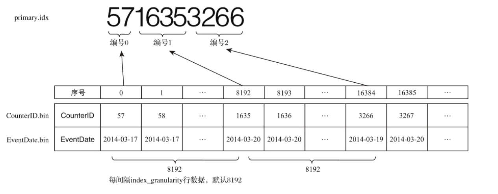

### 3.4索引的查询过程

MarkRange 在ClickHouse中是用于定义标记区间的对象。通过先前的介绍已知，MergeTree按照index_granularity的间隔粒度，将一段完整的数据划分成了多个小的间隔数据段，一个具体的数据段即是一个 MarkRange。MarkRange与索引编号对应，使用start和end两个属性表示其区间范围。通过与start及end对应的索引编号的取值，即能够得到它所对应的数值区间。而数值区间表示了此MarkRange包含的数据范围。

假如现在有一份测试数据，共192行记录。其中，主键ID为String类型，ID的取值从A000开始，后面依次为 A001、A002……直至A192为止。MergeTree的索引粒度index_granularity=3，根据索引的生成规则，primary.idx文件内的索引数据会下图所示：

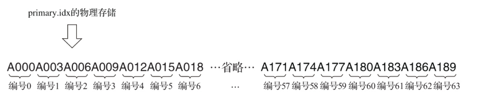

根据索引数据，MergeTree会将此数据片段划分成192/3=64个小的MarkRange，两个相邻MarkRange相距的步长为1。其中，所有MarkRange（整个数据片段）的最大数值区间为[A000,+inf)，其完整的示意下图所示：

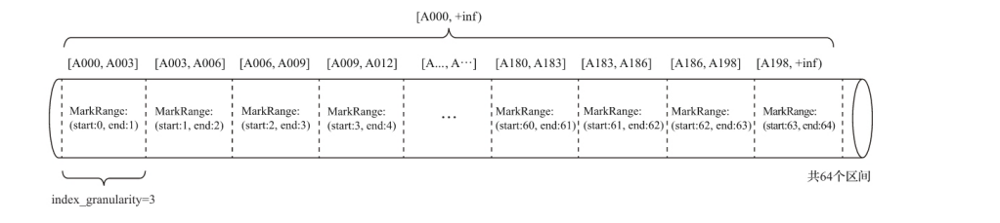

整个查询过程可以分为3个步骤：

- 生成查询条件区间：首先，将查询条件转换为条件区间。
- 递归交集判断：以递归的形式，依次对MarkRange的数值区间与条件区间做交集判断。
- 递归交集判断：以递归的形式，依次对MarkRange的数值区间与条件区间做交集判断。
- 合并MarkRange区间：将最终匹配的MarkRange聚在一起，合并它们的范围。

完整过程如下：

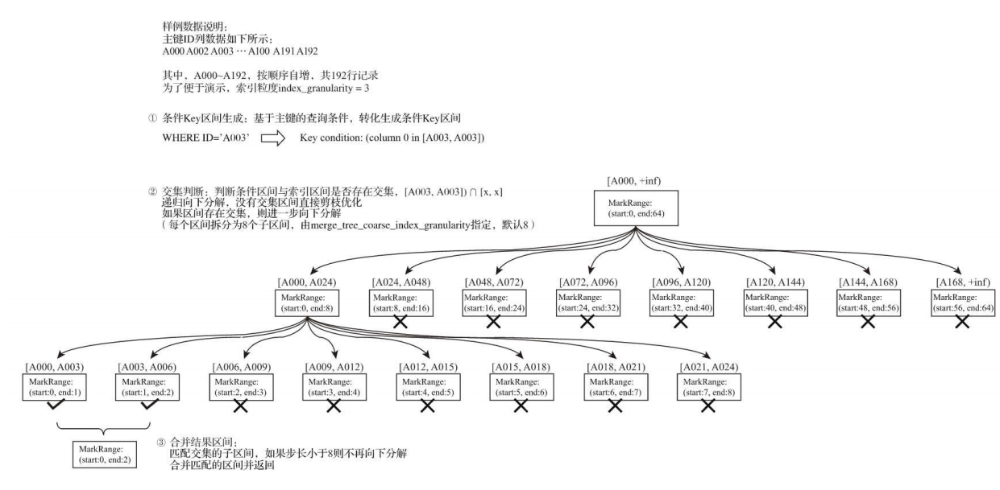

## 4.二级索引

二级索引又称跳数索引，由数据的聚合信息构建而成。根据索引类型的不同，其聚合信息的内容也不同。

跳数索引在默认情况下时关闭的需要设置allow_experimental_data_skipping_indices才能使用：

set allow_experimental_data_skipping_indices=1

跳数索引需要在create语句内定义，它支持使用元组和表达式的形式声明，完整定义语法如下：

index index_name expr type index_type(...) granularity granularity

与以及索引一样，如果在建表语句中声明了跳数索引，则会额外生成相应的索引文件与标记文件（skp_idx_[Column].idx）与（skp_idx_[Column].mrk）。

### 4.1granularity和index_granularity的关系

对于跳数索引而言，index_granularity定义了数据的粒度，而granularity定义了聚合信息汇总的粒度。换言之，granularity定义了一行跳数索引能够跳过多少个index_granularity区间的数据。

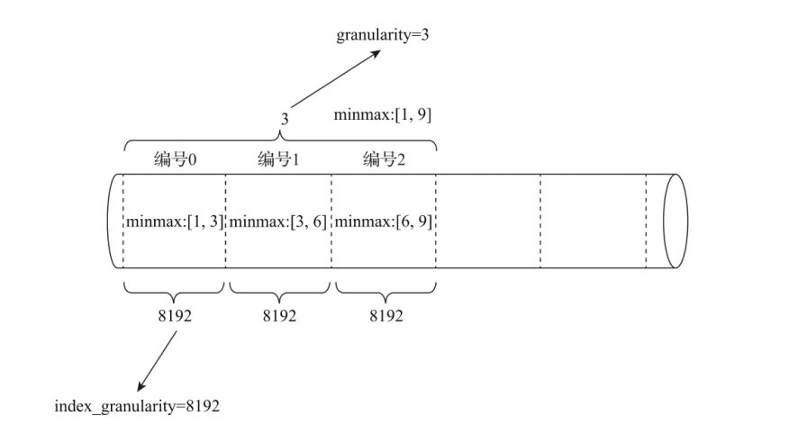

### 4.2跳数索引的类型

目前跳数索引支撑4种类型，分别是minmax、set、ngrambf_v1和tokenbf_v1。同一张表可以支持多个跳数索引和多种跳数索引类型：

CREATE TABLE skip_test (      ID String,     URL String,      Code String,      EventTime Date,     INDEX a ID TYPE minmax GRANULARITY 5,     INDEX b(length(ID) * 8) TYPE set(2) GRANULARITY 5,     INDEX c(ID，Code) TYPE ngrambf_v1(3, 256, 2, 0) GRANULARITY 5,     INDEX d ID TYPE tokenbf_v1(256, 2, 0) GRANULARITY 5  ) ENGINE = MergeTree() 省略...

各种跳数索引的用法：

- minmax：minmax 索引记录了一段数据内的最小和最大值，其索引的作用类似分区目录的 minmax 索引，能够快速跳过无用的数据区间。
- set：set索引记录了声明字段或表达式的取值（唯一，无重复），完整形式为set(max_rows)，其中 max_rows 是一个阈值，表示在一个 index_granularity 内，索引最多记录的数据行数。如果 max_rows = 0，则表示无限制。
- ngrambf_v1：ngrambf_v1索引记录时数据短语的布隆过滤器，只支持 String 和 FixedString 类型。它能够提升in、notin、like、equals和notequals的性能。完整形式如下：

ngrambf_v1(n,size_of_bloom_filter_in_bytes,number_of_hash_functions,random_seed)

- n：token 长度，一句n的长度将数据切割为 token 短语。
- size_of_bloom_filter_in_bytes：布隆过滤器的大小。
- nunber_of_hash_functions：布隆过滤器中使用 Hash 函数的个数。
- random_seed：Hash函数的随机种子。
- tokenbf_v1：tokenbf_v1索引是ngrambf_v1的变种，同样也是一种布隆过滤器索引。tokenbf_v1除了短语token的处理方法外，其他与ngrambf_v1是完全一样的。tokenbf_v1会自动按照非字符的、数字的字符串分割token。

## 5.数据存储

### 5.1各列独立存储

在 MergeTree 中，数据按列存储。具体到每个列字段，数据也是独立存储的，每个列字段拥有一个与之对应的.bin文件。也正是这些.bin文件，最终承载着数据的物理存储。同时数据是经过压缩后以压缩数据块的形式被组织并写入.bin文件中。

目前支持的压缩算法有LZ4、ZSTD、Multiple和Delta几种算法，默认使用LZ4。

### 5.2压缩数据块

一个压缩数据库由头信息和压缩数据两部分组成。头信息固定使用9位自建表示，具体由 1 个 UInt8 整型和 2 个 UInt32 整型组成，分别代表使用的压缩算法类型、压缩后的数据大小和压缩前的数据大小。

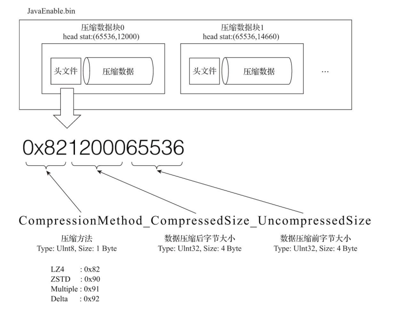

每个压缩块的大小控制在64KB~1MB之间，上下限分别由min_compress_block_size（默认65536）与max_compress_block_size（默认1048576）指定。但最终一个压缩快的大小是由index_granularity控制。

MergeTree 在数据写入时，会按照索引粒度，按批次获取数据并进行处理。如果一批次未压缩的大小为size，则写入过程规则如下：

- size<64KB：单批次小于64KB，则继续获取下一批次数据，直到累计到 size≥64KB。
- 64KB≤1MB：直接生成压缩快。
- size>1MB：按照1MB截断后生成压缩快。

整个逻辑过程如图：

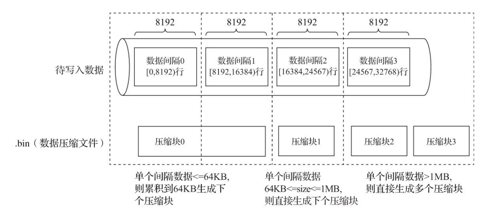

引入压缩快的目的：

1. 降低存储空间并加速传输效率，但数据压缩和解压缩需要额外动作带来性能损耗，所以需要控制被压缩数据大小，寻求性能损耗和压缩效率之间的平衡。
2. 在进行数据读取时需要先将压缩数据加载到内存并解压。通过压缩快可以在不加载整个.bin文件的情况下进行数据读取，缩小了数据读取的范围。

## 6.数据标记

数据标记可以看作一级索引和.bin文件中的数据的对应关系。

### 6.1数据标记的生成规则

索引区间和数据标记的对应关系：

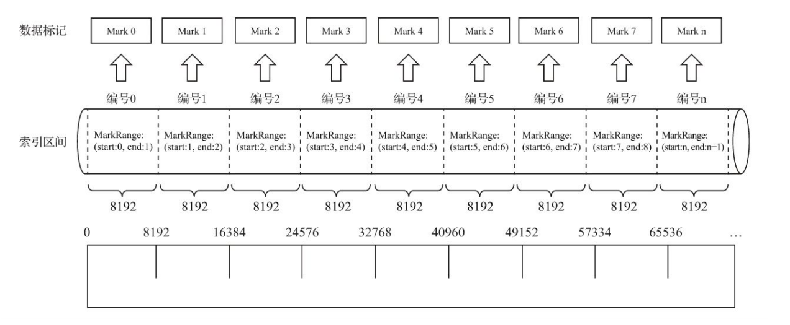

从图中可以看出，数据标记和索引区间是对齐的，均按照 index_granularity的粒度间隔。如此一来，只需要简单通过索引区间的下标编号就可以直接找到对应的数据标记。

为了能够进行数据衔接，数据标记文件和.bin文件一一对应。即每个列字段的 [Column].bin文件都有一个与之对应的 [Column].mrk 数据标记文件，用于记录数据在.bin文件中的偏移量信息。

### 6.2数据标记的工作方式

1. 读取压缩数据：在查询某一列数据时，MergeTree 无需一次性加载整个.bin文件，而是可以根据需要，只加载特定的压缩数据块。而这项特性需要借助标记文件中所保存的压缩文件中的偏移量。
2. 读取数据：在读取解压后的数据时，MergeTree并不需要一次性扫描整段解压数据，它可以根据需要，以index_granularity的粒度加载特定的一小段。为了实现这项特性，需要借助标记文件中保存的解压数据块中的偏移量。

## 7.分区、索引、标记和压缩数据的协同总结

### 7.1写入过程

数据写入的第一步是生成分区目录，伴随着每一批数据的写入，都会生成一个新的分区目录。在后续的某一时刻，属于相同分区的目录会依照规则合并到一起；接着，按照index_granularity索引粒度，会分别生成primary.idx一级索引（如果声明了二级索引，还会创建二级索引文件）、每一个列字段的.mrk数据标记和.bin压缩数据文件。

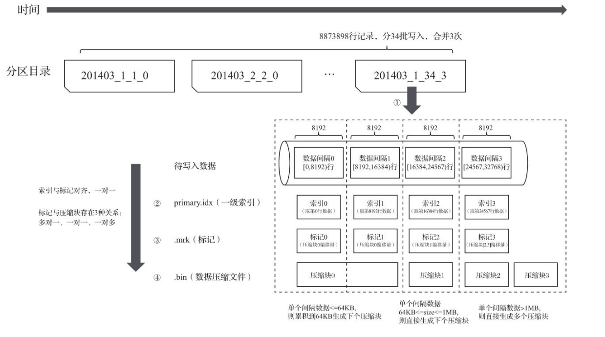

### 7.2查询过程

数据查询的本质，可以看作一个不断减小数据范围的过程。在最理想的情况下，MergeTree首先可以依次借助分区索引、一级索引和二级索引，将数据扫描范围缩至最小。然后再借助数据标记，将需要解压与计算的数据范围缩至最小。

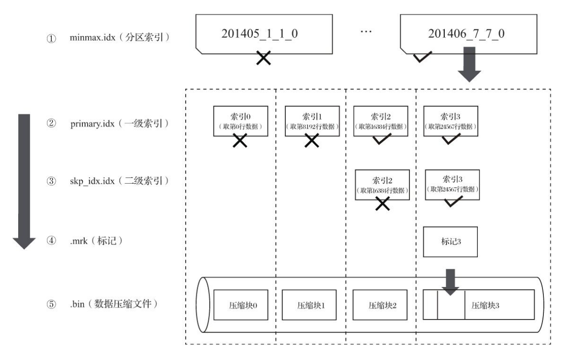

### 7.3数据标记与数据块对应关系

由于压缩数据块的划分，与一个间隔（index_granularity）内的数据大小相关，每个压缩数据块的体积都被严格控制在64KB～1MB。而一个间隔（index_granularity）的数据，又只会产生一行数据标记。那么根据一个间隔内数据的实际字节大小，数据标记和压缩数据块之间会产生三种不同的对应关系。

1. 多对一：多个数据标记对应一个压缩数据块，当一个间隔（index_granularity）内的数据未压缩大小size小于64KB时，会出现这种对应关系。
2. 一对一：一个数据标记对应一个压缩数据块，当一个间隔（index_granularity）内的数据未压缩大小size大于等于64KB且小于等于1MB时，会出现这种对应关系。
3. 一对多：一个数据标记对应多个压缩数据块，当一个间隔（index_granularity）内的数据未压缩大小size直接大于1MB时，会出现这种对应关系。
