# 07MergeTree 系列表引擎

目前在 ClickHouse 中共按照特点可以将存储引擎分为6个系列，分别为合并树、外部存储、接口、内存、文件和其他。其中合并树最为重要，因为他的使用场景作为广泛，性能最好。

## 1.MergeTree

MergeTree 作为合并树家族最基础的表引擎，提供了数据分区、索引等功能。除此之外还有数据 TTL 和存储策略。

### 1.1数据TTL

MergeTree 可以指定某一列的TTL 或整张表的TTL，如果是列级别TTL则时间到期后该列数据就会被删除；如果是表级别的TTL则会将整张表的数据清空。如果二者同时存在则以先到期的那个为主。

不论是列级别TTL 还是标记别TTL都需要依赖某个DateTime或者Date 类型的字段，通过对这个字段进行INTERVAL操作来表示过期时间：

```sql
TTL time_col + INTERVAL 1 DAY
```

表示数据的存活时间是time_col 的1天后

#### 1.1.1列级别TTL

设置列级别 TTL 只需要在定义字段的时候为它声明 TTL 表达式：

```sql
create table ttl_v1(
  id UInt8,
  create_time DateTime,
  code String TTL create_time + interval 10 second
)
engine=MergeTree
partition by toYYYYMM(create_time)
order by id
;
```

插入数据：

```sql
INSERT into ttl_v1 (id, create_time, code) values (1, now(), 'hello');
INSERT into ttl_v1 (id, create_time, code) values (2, now() + interval 10 second, 'hello');
INSERT into ttl_v1 (id, create_time, code) values (3, now() + interval 20 second, 'hello');
INSERT into ttl_v1 (id, create_time, code) values (4, now() + interval 30 second, 'hello');
```

经过 10 秒后执行如下语句强制进行数据合并完成TTL清理

```sql
optimize table ttl_v1 final;
```

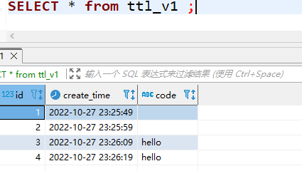

可以使用如下语句对指定列添加TTL：

```sql
ALTER TABLE ttl_v1 MODIFY COLUMN code String TTL create_time + INTERVAL 1 DAY
```

目前ClickHouse没有提供取消列级别TTL的方法。

#### 1.1.2表级别TTL

建表语句如下：

```sql
create table ttl_v2(
  id UInt8,
  create_time DateTime,
  code String
)
engine=MergeTree
partition by toYYYYMM(create_time)
order by id
TTL create_time + toIntervalSecond(10)
;
```

经过 create_time + 10 秒后，整行数据将被删除。

使用如下语句可以对表添加 TTL：

```sql
ALTER TABLE ttl_v2 MODIFY TTL create_time + INTERVAL 3 DAY
```

表级别TTL目前也没有取消的方法。

#### 1.1.3TTL的运行原理

如果一张 MergeTree 表的字段被设置了 TTL 则会在每个分区内生成 ttl.txt 文件。文件内容如下：

```bash
[root@bigdata01 202210_1_1_0]# cat ttl.txt 
ttl format version: 1
{"columns":[{"name":"code","min":1666969415,"max":1666972415}]}[root@bigdata01 202210_1_1_0]#
```

可以看到 ttl.txt 以 json 的形式记录了被设置 TTL 的字段和该分区内指定 TTL 字段的最大值和最小值与 interval 计算之后的值。

TTL 的处理逻辑如下：

- MergeTree 以分区为单位，通过ttl.txt 记录过期时间。
- 每当写入一批新的数据时，都会基于 interval 重新计算ttl.txt 的结果。
- 只有在 MergeTree 合并时才会出发删除TTL过期数据的逻辑。
- 在选择删除的分区时，会使用贪婪算法，它的算法规则是 尽可能找到会最早过期的，同时年纪又是最老的分区（合并次数更 多，MaxBlockNum更大的）。
- 如果一个分区内某一列数据因为TTL到期全部被删除了，那 么在合并之后生成的新分区目录中，将不会包含这个列字段的数据文 件（.bin和.mrk）。

除此之外还有几点需要注意：

- TTL 默认的合并频率是由 MergeTree 的 merge_with_ttl_timeout 参数控制的，默认 86400 秒，即1天，如果设置的过小会影响性能。
- 可以使用optimize 命令强制触发合并。

```sql
-- 触发一个分区合并
optimize table table_name
-- 触发所有分区合并
optimize table table_name final
```

- 可以使用如下命令进行全局TTL合并任务的的启停：

```bash
system stop/start ttl merges
```

### 1.2多路径存储策略

在 ClickHouse 19.15 版本之前，MergeTree 只支持但路径存储，所有数据都存储在 config.xml 中 path 指定的路径下。从 19.15 版本开始，MergeTree 实现了自定义存储策略的功能，最小支持分区为移动单元，将分区目录写入多块磁盘（如果服务器挂在了多块磁盘）。

根据配置策略不同，大致有三种存储策略：

1. 默认策略：MergeTree 原本的策略，无需任何配置，所有分区保存在 config.xml 的path 指定的目录下。
2. JBOD策略：这种策略适合服务器挂载了多块磁盘的场景。它是一种轮询策略，每次执行 insert 或 merge，所产生的新分区会轮询写入各个磁盘。
3. HOT/COLD 策略：这种策略适合服务器挂载了多种类型磁盘的场景。将磁盘存储分为 HOT 和 CLOD 两类区域。HOT 使用 SSD 这类高性能存储媒介；注重性能。CLOD 使用HDD这类高容量存储媒介，注重经济效益。

#### 1.2.1JBOD 策略

首先在 config.xml 中增加`storage_configuration`元素，并配置三块磁盘：

```xml
<!--自定义磁盘配置 -->
<storage_configuration>
    <disks>
        <!--自定义磁盘名称 -->
        <disk_hot1>
            <path>/chbase/data</path>
        </disk_hot1>
        <disk_hot2>
            <path>/chbase/hotdata1</path>
        </disk_hot2>
        <disk_cold>
            <path>/chbase/cloddata</path>
            <keep_free_space_bytes>1073741824</keep_free_space_bytes>
        </disk_cold>
    </disks>
    ...
</storage_configuration>
```

接着配置一个存储策略，在volumes卷下引用两块磁盘，组成一个磁盘组：

```xml
<storage_configuration>
    <!-- 实现JDOB效果 -->
    <policies>
        <!--自定义策略名称 -->
        <default_jbod>
            <volumes>
                <jbod> 
                    <!-- 自定义名称 磁盘组 -->
                    <disk>disk_hot1</disk>
                    <disk>disk_hot2</disk>
                </jbod>
            </volumes>
        </default_jbod>
    </policies>
</storage_configuration>
```

至此已经配置完毕，之后只需要将磁盘路径授权给 clickhouse 启动用户，然后重启 clickhouse-server 服务。

重启完成后可以查看系统配置验证是否生效：

```sql
SELECT
  name,
  path,
  formatReadableSize(free_space) AS free,
  formatReadableSize(total_space) AS total,
  formatReadableSize(keep_free_space) AS reserved
FROM system.disks
```

#### 1.2.2HOT/CLOD 策略

现在 config.xml 中添加一个策略：

```xml
<policies> 
    …省略
    <moving_from_hot_to_cold>
        <!--自定义策略名称 -->
        <volumes>
            <hot>
                <!--自定义名称 ,hot区域磁盘 -->
                <disk>disk_hot1</disk>
                <max_data_part_size_bytes>1073741824</max_data_part_size_bytes>
             </hot>
              <cold>
                  <!--自定义名称 ,cold区域磁盘 -->
                  <disk>disk_cold</disk>
               </cold>
           </volumes>
            <move_factor>0.2</move_factor>
    </moving_from_hot_to_cold>
</policies>
```

然后重启 clickhouse-server 服务，通过system.storage_policies系统表可以看到，刚才配置的存储策略已经生效了。

### 1.3ReplacingMergeTree

在MergeTree 中虽然拥有主键，但是它的主键却没有唯一约束能力，在某些场景下，用户并不希望数据表中出现重复数据。这个时候就可以使用 ReplacingMergeTree ，它能够在合并分区时删除重复数据。在一定程度上解决了数据重复的问题。

创建一个 ReplacingMergeTree 非常简单，与创建 MergeTree 类似，只需要替换 engine 即可：

```sql
engine=ReplacingMergeTree(ver)
```

其中 ver 是个可选参数，他会指定一个 UInt* 或者 Date 、DateTime 类型的字段作为版本号。这个参数决定了去重时使用的算法。

创建一个ReplacingMergeTree 表：

```sql
create table replace_v1(
  id String,
  create_time DateTime,
  code String
)
engine=ReplacingMergeTree()
partition by toYYYYMMDD(create_time)
order by (id, code)
primary key id
;
```

需要注意的是这里去重是根据 order by 字段进行的，而非 primary key 字段：

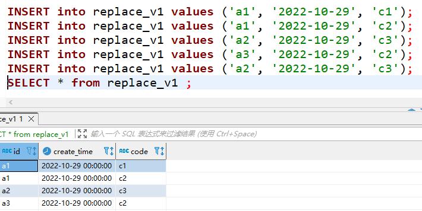

由上图可以看出，去重是根据 id 和 code 字段进行的，而非只根据 id 字段去重。

接着插入新的分区数据观察去重情况：

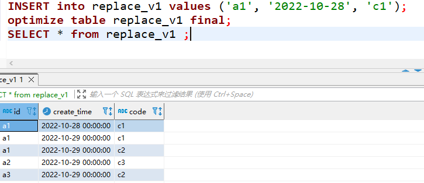

可以发现即使出现重复的 (id, code) 也不会进行去重，因为二者属于不同的分区，由此可见去重是分区内去重。

接着来说明版本号的作用：

```sql
create table replace_v2(
  id String,
  create_time DateTime,
  code String
)
engine=ReplacingMergeTree(create_time)
partition by toYYYYMM(create_time)
order by id
;
```

插入相同的id 数据和不同的 create_time 来观察去重情况

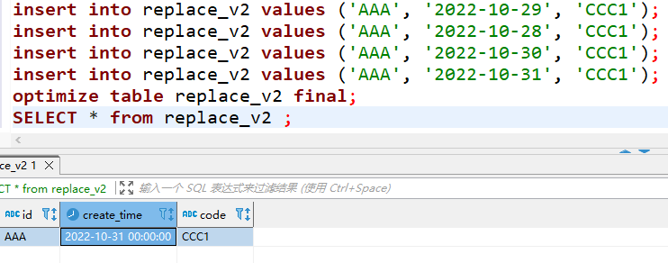

由此可见，在删除重复数据时会保留同一组内最新的数据。

总结：

1. 使用 order by 字段进行去重。
2. 只有在合并时才会触发删除重复数据的逻辑。
3. 以分区为单位进行重复数据删除，不同分区的重复数据不会被删除。
4. 在删除重复数据时，由于分区内已经基于 order by 字段进行了排序，所以可以很容易找到相邻的重复的数据。
5. 在进行重复数据删除时有两种策略：
   1. 如果没有指定 ver 字段则保留最后插入的数据。
   2. 指定了 ver 字段则保留最大的哪一行。

### 1.4SummingMergeTree

SummingMergeTree 是为了应对用户不关心明细数据只需要聚合数据的场景而产生的，并且聚合汇总条件是已知的且不会随意改变。

在 MergeTree 中我们知道主键的定义可以用 order by 或者 primary key 并且 order by 可以取代 primary key 来定义主键。如果需要同时定义 order by 和 primary key通常只会在SummingMergeTree 和 AggregatingMergeTree 中使用。因为二者都是以 order by 字段进行聚合，为修改聚合空间留下余地。

但是需要注意的是如果同时定义了 order by 和 primary key 那么 primary key 必须是 order by 字段的前缀：

```sql
order by(A, B)
-- 错误的定义
primary key B
-- 正确的定义
primary key A
```

在修改 order by 字段是只能在现有的基础上减少字段。如果是新增字段只能添加通过`alter table add column`新增的字段：

```sql
-- 减少 order by
alter table table_name modify order by id;
-- 增加 order by
alter table table_name add column odr String, modify order by (id, ord);
```

创建一个 SummingMergeTree 表：

```sql
create table summing_v1(
  id String,
  code String,
  create_time DateTime,
  v1 UInt32,
  v2 UInt32,
  v3 UInt32
)
engine=SummingMergeTree((v1, v2, v3))
partition by toYYYYMM(create_time)
order by (id, code)
PRIMARY key id
;
```

其中的 (v1, v2, v3) 是可选参数，表示计算列，会将其进行 sum 汇总；如果不指定则会将所有非主键的数值类型字段当作计算列。

插入一些数据：

```sql
INSERT into summing_v1 values('aaa', 'bbb', now(), 1,2,3);
INSERT into summing_v1 values('aaa', 'bbb', now(), 1,2,3);
INSERT into summing_v1 values('ccc', 'ddd', now(), 1,2,3);
INSERT into summing_v1 values('aaa', 'eee', now(), 1,2,3);
INSERT into summing_v1 values('ccc', 'ddd', now(), 1,2,3);
```

直接查询会发现它以及根据id和code 进行了聚合：

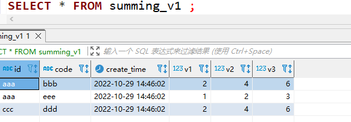

注意 SummingMergeTree 也是分区内聚合，不同分区内不会聚合：

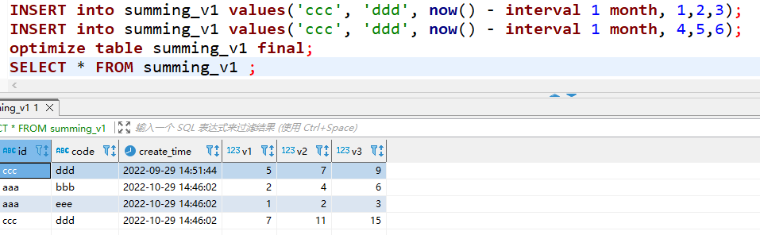

- 在汇总数据时，同一分区内，相同聚合Key的多行数据会合 并成一行。其中，汇总字段会进行SUM计算；对于那些非汇总字段， 则会使用第一行数据的取值。
- 支持嵌套结构，但列字段名称必须以Map后缀结尾。嵌套 类型中，默认以第一个字段作为聚合Key。除第一个字段以外，任何 名称以Key、Id或Type为后缀结尾的字段，都将和第一个字段一起组 成复合Key。

### 1.5AggregatingMergeTree

AggregatingMergeTree在设计思路上与 SummingMergeTree 是一致的，都是基于 order by 进行分组，同时定义 order by 和 primary key 相同的原因和目的。

声明 AggregatingMergeTree的方式如下：

```sql
engine=AggregatingMergeTree()
```

AggregaingMergeTree没有任何参数，在进行分区合并时，使用何种聚合函数以及根据那些字段进行计算都要通过 AggregateFunction 数据类型实现：

```sql
create table aggregaing_v1(
  id UInt16,
  code String,
  v1 AggregateFunction(uniq, String),
  v2 AggregateFunction(sum, UInt16),
  create_time DateTime
)
engine = AggregatingMergeTree()
partition by toYYYYMM(create_time) 
order by (id, code)
PRIMARY KEY id
;
```

上例中是以 id 和 code 进行分组，v1，v2是计算列，聚合函数分别是uniq 和 sum。

AggregateFunction 是 CK 中的一类特殊数据类型，它能够以二进制的形式存储中间状态结果。对于该类型的字段在写入时需要使用`*State`函数，查询时要使用`*Merge`函数，并且要使用`insert into select...`语法：

```sql
INSERT into aggregaing_v1 select 1, 'ccc', uniqState('vvv1'), sumState(toUInt16(10)), now();
select id, code, uniqMerge(v1), sumMerge(v2), any(create_time) from aggregaing_v1 group by id, code;
```

这种使用方式非常繁琐，并且也不是主流场景。其主要使用场景是作为物化视图的引擎，以 MergeTree 表作为源表，MergeTree 表插入数据时会自动流向物化视图，并按照 AggregatingMergeTree 规则进行聚合，如下创建一个物化视图：

```sql
-- MergeTree 源表
create table aggregaing_basic(
  id UInt16,
  code String,
  v1 String,
  v2 UInt16,
  create_time DateTime
)
engine = MergeTree
partition by toYYYYMM(create_time) 
order by (id, code)
;
-- 物化视图
CREATE materialized view aggregaing_view
engine=AggregatingMergeTree()
order by (id, code)
primary key id
as select id, code, uniqState(v1) as v1, sumState(v2) as v2
from aggregaing_basic group by id, code ;
```

向源表中插入数据：

```sql
INSERT into aggregaing_basic values (1, 'a', 'v1', 1, now());
INSERT into aggregaing_basic values (1, 'a', 'v2', 2, now());
INSERT into aggregaing_basic values (2, 'a', 'v3', 3, now());
```

查询物化视图：

```sql
SELECT id, code, uniqMerge(v1) as v1, sumMerge(v2) as v2
from aggregaing_view group by id, code;
```

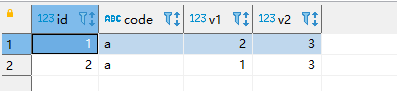

### 1.6CollapsingMergeTree

支持行级别的修改或删除，其操作是基于插入实现的，它需要一个 Int8 类型的标志位：

```sql
create table collapsing_v1(
  id UInt32,
  code String,
  create_time DateTime,
  sign Int8
)
engine=CollapsingMergeTree(sign)
partition by toYYYYMM(create_time)
order by id
;
-- 插入两条初始化数据
insert into collapsing_v1 values (1, 'ccc', now(), 1);
insert into collapsing_v1 values (2, 'bbb', now(), 1);
```

将 ccc 修改为 ccc1：

```sql
insert into collapsing_v1 values (1, 'ccc', now(), -1);
insert into collapsing_v1 values (1, 'ccc1', now(), 1);
```

强制合并后查询：

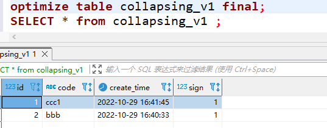

删除 id 为 2 的数据：

```sql
insert into collapsing_v1 values (2, 'bbb', now(), -1);
```

强制合并后查询：

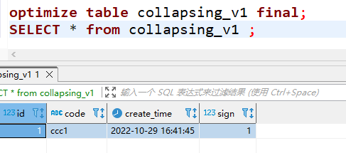

CollapsingMergeTree对于写入数据的顺序有着严格要求。如果按照正常顺序写入，先写入sign=1，再写入 sign=-1，则能够正常折叠。如果将写入顺序调换则不能正常折叠。这种现象是CollapsingMergeTree的处理机制引起的，因为它要求sign=1和sign=-1的数据相邻。而分区内的数据基于ORBER BY排序，要实现sign=1和sign=-1的数据相邻，则只能依靠严格按照顺序写入。

### 1.7VersionedCollapsingMergeTree

VersionedCollapsingMergeTree 和 CollapsingMergeTree 的功能完全一致，并且它不要求写入顺序，其原理是需要添加一个额外字段 ver 来表示版本号，在进行排序时会将 ver 加到 order by 最后来保证顺序：

```sql
create table ver_collapsing_v1(
  id UInt32,
  code String,
  create_time DateTime,
  sign Int8,
  ver UInt8
)
engine=VersionedCollapsingMergeTree(sign, ver)
partition by toYYYYMM(create_time)
order by id
;
```

删除数据：

```sql
INSERT into ver_collapsing_v1 values (1, 'ccc', now(), -1, 1);
INSERT into ver_collapsing_v1 values (1, 'ccc', now(), 1, 1);
```

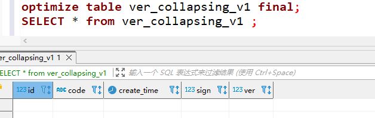

修改数据：

```sql
INSERT into ver_collapsing_v1 values (1, 'ccc1', now(), -1, 1);
INSERT into ver_collapsing_v1 values (1, 'ccc2', now(), 1, 1);
INSERT into ver_collapsing_v1 values (1, 'ccc3', now(), 1, 2);
```

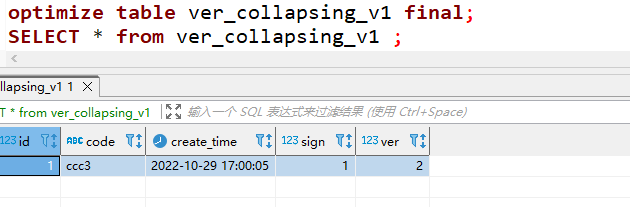
