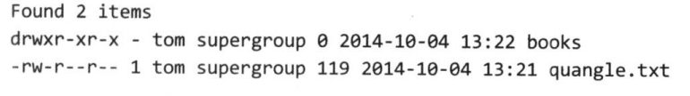
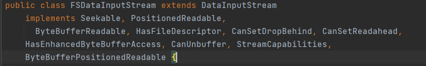
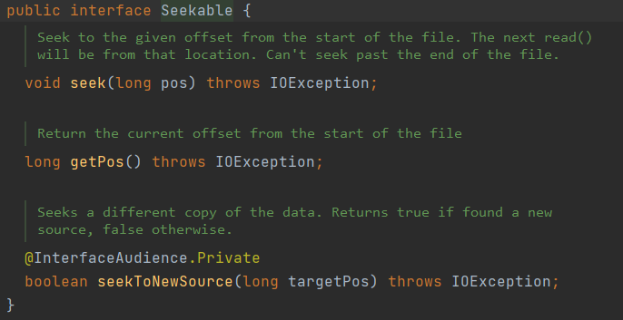
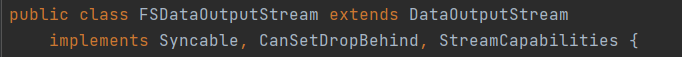

# 02Hadoop 分布式文件系统

# 1.HDFS的相关背景及概念

## 1.1HDFS的产生背景

随着数据量越来越大，在一个操作系统存不下所有的数据，那么就需要对其进行分区，并存储到若干台独立的计算机上。管理网络中跨多台计算机存储的文件系统就称为**分布式文件系统**，Hadoop 自带一个称为 HDFS 的分布式文件系统，即 Hadoop Distributed File System.

## 1.2HDFS的定义

HDFS 是一个分布式文件系统，用于存储文件，由多台服务器联合起来实现其功能，适合一次写入多次读出的场景

## 1.3HDFS的优缺点

- 优点：
  1. 可以使用商用硬件，即对硬件要求不高
  2. 高容错性，HDFS遇到故障时能够继续运行且不让用户觉察到明显的中断
  3. 能处理超大文件，目前已经有处理 PB 级数据的 Hadoop 集群了
- 缺点：
  1. 不适合低延时的数据访问，例如毫秒级别的数据存储 Hadoop 无法做到
  2. 大量小文件存储，namenode 将文件元数据存储在内存中，因此存储大量小文件（十亿）会超出当前硬件的存储能力
  3. 不支持并发写及随机修改，一个文件只能由一个用户操作；同时只支持追加写的模式

## 1.4HDFS的相关概念

1. 数据块：每个磁盘都有默认的数据块，HDFS 同样也有块的概念，默认为 128MB
2. namenode 和 datanode：类似于主从的概念，namenode 作为 master 下达命令，datanode 作为 slave 来执行命令
   1. namenode 作用：
      1. 管理 HDFS 的名称空间
      2. 配置副本策略
      3. 管理数据块的映射信息
      4. 处理客户端的读写请求
   2. datanode 作用：
      1. 存储实际的数据块
      2. 执行数据块的读写操作
3. 块缓存：对于访问频繁的数据块会以堆外缓存的形式存在，作业调度器通过缓存块上的 datanode 运行任务，可以利用缓存的优势提高读的性能
4. 联邦 HDFS：在2.X 版本中引入的联邦 HDFS 允许系统通过添加 namenode 实现扩展，其中 每个 namenode 管理文件系统命名空间的一部分

# 2.HDFS的相关操作

## 2.1命令行接口

1. 将指定文件复制到 HDFS 中：`hadoop fs copyFromLocal a.txt /input`
2. 从 HDFS 中复制文件回本地系统：`hadoop fs copyToLocal /input/a.txt a.copy.txt`
3. 创建文件夹：`hadoop fs -mkdir books`
4. 查看当前文件夹下的文件信息：`hadoop fs -ls .`



结果信息解释：

- 第一列：文件模式，于 Unix 系统类似
- 第二列：显示文件的备份数，传统 Unix 系统没有此列
- 第三、四列：显示文件所属用户及用户组
- 第五列：显示文件大小，以字节为单位，目录为0
- 第六、七列：显示文件最后修改日期及时间
- 第八列：显示文件或目录名

## 2.2Java接口

### 2.2.1从 Hadoop URL 读取数据

从 Hadoop 文件系统中读取数据，最简单的方式就是通过 `java.net.URL`对象打开数据流，从中读取数据：`InputStream = new URL("hdfs://host/path").openStream();`

但是需要对 URL 进行特殊处理：`URL.setURLStreamHandlerFactory(new FsUrlStreamHandlerFactory());`

特别需要注意的是 setURLStreamHandlerFactory 在一个 JVM 实例中只能调用一次，一般放在静态方法中，如果程序的其他组件已经声明了一个 URLStreamHandlerFactory 那么将无法使用这种方式从 Hadoop 中读取数据

### 2.2.2通过 FileSystem API 读取数据

FileSystem 提供了一下几个静态工厂方法：

> throws IOException
>
> throws IOException
>
> , InterruptedException

Configuration 对象封装了服务的或客户端配置，通过设置配置文件读取类路径来实现

- 第一个方法返回默认的文件系统，如果没有默认的文件系统则使用本地文件系统
- 第二个方法通过给定的 URI 来确定要使用的文件系统，如果给定 URI 没有指定则使用默认文件系统
- 第三个方法通过给定用户来访问文件系统

获取 FileSystem 后就可以通过 open 方法来获取输入流：

> throws IOException
>
> , int bufferSize)

第一个方法默认缓冲池大小为 4KB。

FSDataInputStream 是一个继承了 `java.io.DataInputStream`的特殊类，并支持随机访问，由此可以从流的任意位置读取数据





### 2.2.3写入数据

创建一个文件，可以使用 create 方法进行创建，给准备创建的的文件指定一个 Path 对象，然后返回一个用于写入数据的输出流

> throws IOException

另一种新建文件的方式是使用 append 方法在现有的文件末尾追加数据

> throws IOException

这种操作允许一个 writer 打开文件后在访问该文件的最后偏移量处追加数据

FSDataOutputStream 对象与 FSDataInputStream 对象类似也有一个查询文件当前位置的方法：



### 2.2.4创建目录

FileSystem 提供创建目录的方法：

> throws IOException

### 2.2.5删除数据

使用 FileSystem 的 delete 方法可以永久删除文件夹或目录

```java
/**
Delete a file.
Params:
f – the path to delete.
recursive – if path is a directory and set to true, the directory is deleted else throws an exception. In case of a file the recursive can be set to either true or false.
Returns:
true if delete is successful else false.
Throws:
IOException – IO failure
*/
public abstract boolean delete(Path f, boolean recursive) throws IOException;
```

## 2.3数据流

### 2.3.1文件读取

1. 通过 FileSystem 对象的 open 方法打开需要读取的文件，对于 HDFS 来说这个对象就是一个 DistributedFileSystem 实例，DistributedFileSystem 通过远程调用来调用 namenode 来确定文件起始块的位置
2. DistributedFileSystem 类返回一个 FSDataInputStream 对象给客户端以便读取数据
3. 客户端对这个流调用 read 方法可以将数据从 datanode 传输到客户端
4. 到达最末端时 DFSInputStream 关闭与该 datanode 的连接

> 如果 DFSInputStream 在与 datanode 通信时遇到错误，会尝试从这个块的另一个最邻近的 datanode 中读取数据。并标记那个错误的 datanode 以便之后不会反复读取该 datanode 上的块

### 2.3.2文件写入

1. 客户端通过 DistributedFileSystem 的 create 方法来新建文件，DistributedFileSystem 对 namenode 创建一个RPC 调用，在文件系统的命名空间中新建一个文件
2. namenode 执行各种不同的检查以确保需要创建的文件不存在及客户端拥有对应创建权限
3. 返回一个 FSDataOutputStream 对象，由此客户端可以开始写入数据
4. 在客户端写入数据时，DFSOutPutStream 将它分成一个个数据包，并写入内部队列，称为“数据队列”。DataStreamer 用于处理数据队列。假设副本数为3，DataStreamer 将数据传输到管线中的第一个 datanode，该 datanode 存储数据并传输给第二个 datanode，第2个执行相同操作传输给第3个
5. DFSOutPutStream 也维护一个内部数据包队列来等待 datanode 的收到确认回执，称为“确认队列”。收到所有回执后该数据包才会从确认队列删除

> 如果任何 datanode 在数据写入期间发生故障，则执行以下操作。首先关闭管线，确认把队列中的所有数据包都添加回数据队列的最前端，以确保故障节点下游的 atanode 不会漏掉任何一个数据包。为存储在另一 正常datanode 的当前数据块指定一个新的标识，并将该标识传送给 namenode，以 便故障 datanode 在恢复后可以删除存储的部分数据块。从管线中删除故障 datanode，基于两个正常 datanode 构建一条新管线。余下的数据块写入管线中正常的datanode。 namenode 注意到块复本量不足时，会在另一个节点上创建一个新的复本。后续的数据块继续正常接受处理。
>
> 在一个块被写入期间可能会有多个datanode同时发生故障，但非常少见。只要写入了`dfs.namenode.replication.min`的复本数（默认为1），写操作就会成功， 并且这个块可以在集群中异步复制，直到达到其目标复本数（`dfs.replication`的 默认值为3）客户端完成数据的写入后，对数据流调用 close 方法

## 2.4并行复制

- 使用`hadoop fs distcp file1 file2`用来复制文件
- 使用`hadoop fs distcp dir1 dir2`用来复制目录，dir2 不存在会创建，如果 dir2 已经存在会将 dir1 复制到 dir2 下，形成`dir2/dir1`的效果，也可以使用 `-override`强制覆盖，或者`-update`仅更新发生变化的文件
