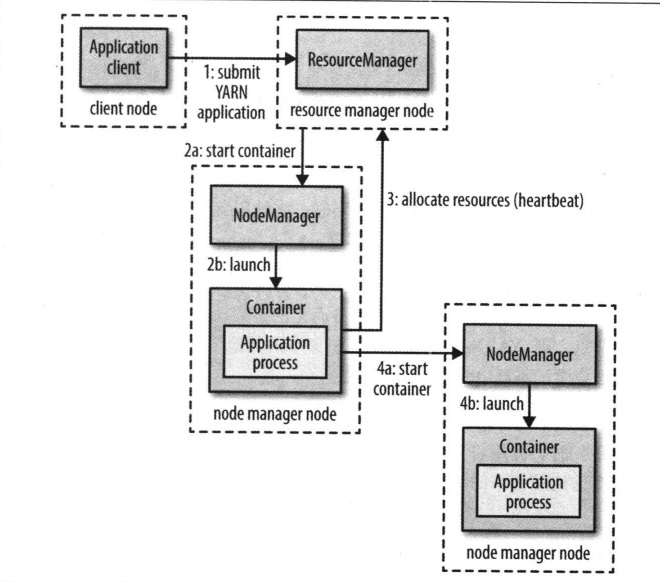

# 03关于 YARN

# 1.YARN简介

Apache YAEN(Yet Another Resource Negotiator) 是 Hadoop 的集群资源管理器。负责为运算程序提供服务器运算资源，相当于一个分布式的操作系统，而 MapReduce 等运算程序则相当于运行于操作系统之上的应用程序。

# 2.YARN的运行机制

## 2.1YARN的基础架构

YARN 主要由 ResourceManger、NodeManager、ApplicationManager 和 Container 等组件构成

## 2.2资源请求

YARN 拥有灵活的资源请求模型。当请求多个容器时，可以指定每个容器需要的计算机资源数量，还可以指定对容器的本地限制要求

## 2.3应用生命期

YARN 应用的生命期差异很大，与其关注应用运行多长时间不如按照应用到用户运行的作业之间的映射关系对应用进行分类更有意义：

1. 最简单的模型是一个用户作业对应一个应用，这也是 MapReduce 采用的方式
2. 作业的每个工作流或每个用户对话，对应一个应用。spark 采取的是这种模型
3. 多个用户共享一个长期运行的应用。这种应用通常是作为一种协调者的角色在运行。例如 Apache Slider

# 3.YARN与MP1的对比

## 3.1Mapreduce1

有时用 MapReduce1 来指代 Hadoop 的初始版本。 MapReduce1 中有两类守护进程控制着作业执行过程：一个 jobtracker 及一个或多个 tasktracker。jobtracker 通过调度 tasktracker 上运行的任务来协调所有运行在系统上的作业。tasktracker 在运行任务的同时将运行进度报告发送个 jobtracker，jobtracker 由此记录每项作业的整体运行情况。如果其中一个运行失败，jobtracker 可以在另一个 tasktracker 上重新调度该任务。

## 3.2组成上的比较

|**Mapreduce1**|**YARN**|
| -----------| --------------------------------------------|
|Jobtracker|资源管理器、application master、时间轴服务器|
|Tasktracker|节点管理器|
|slot|容器|

## 3.3使用YARN的优点

1. 可以扩展性：YARN 可以在更大规模的集群上运行
2. 可用性：当服务守护进程失败时，通过为另一个守护进程复制接管工作所需状态以便其继续提供服务，从而获得高可用性
3. 利用率：YARN 中一个节点管理器管理一个资源池，而不是指定数目的 slot
4. 多租户：用户甚至可以在同一个 YARN 上运行不同版本的 MapReduce

# 4.YARN中的调度

## 4.1为什么需要调度策略

理想状态下，YARN 应用发出的资源请求立即给予响应。然而现实中资源是有限的 ，在一个繁忙的集群上，一个应用的请求往往需要等待才能得到响应。这就需要调度策略来应对不同的使用场景。

## 4.2YARN中的调度策略

1. FIFO 调度器：简单易懂，不需要任何配置，但是不适合共享集群
2. 容量调度器：容量调度器会提供一个对立的队列来保证小作业已提交就可以执行，由于队列容量是为那个队列中的作业所保留的，因此这种策略是以整个集群的利用率为代价的
3. 公平调度器：不需要预留一定量的资源，调度器会在运行的所有作业中动态平衡资源
