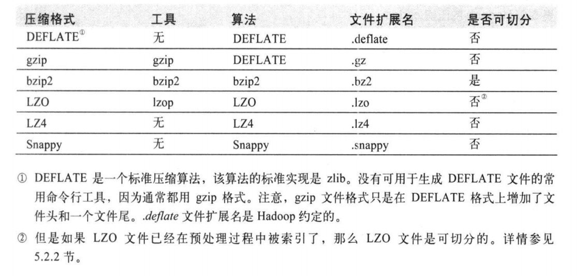

# 04Hadoop 的 IO 操作

# 1.数据完整性

> 检测数据是否损坏的常见措施是，在数据第一次引入系统时计算校验和(checksum)并在数据通过一个不可靠通道进行传输时再次计算校验和，如果新的校验和与旧的校验和不匹配，则我们认为数据已经损坏。！注意，校验和也是可能损坏的，但是由于校验和比数据小得多，所以损坏的可能性非常小。常见的错误检测码是CRC-32（32位循环冗余校验），任何大小的数据输入均计算得到一个32位的整数校验和。
>
> HDFS会对dfs.bytes-per-checksum指定字节的数据计算校验和，一般为512个字节，由于CRC-32校验和是4个字节，所以存储校验和的额外开销小于1%。

## 1.1HDFS的完整性

1. 在写数据的过程中，客户端将数据及其校验和发送到由一系列datanode组成的管线，管线中的最后一个datanode会负责验证校验和。如果检测到错误，则客户端会收到一个IOException异常。
2. 客户端从datanode读取数据时，也会检验校验和。每个datanode均持久保存一个用于验证的校验和日志，所以它知道每个数据块的最后一次验证时间。客户端成功验证一个数据块后，会告诉这个datanode，datanode由此更新日志。除此之外，每个datanode也会在后台线程中运行一个DataBlockScanner来定期校验数据块。
3. 修复：由于HDFS存储着每个数据块的复本，因此它可以通过数据复本来修复已损坏的数据块。思路是，客户端在读取到已损坏的数据块时，首先向namenode报告已损坏的数据块及其所属datanode，再抛出ChecksumException。namenode将该数据块复本标记为已损坏，并不会再将客户端请求转发到这个节点。之后，namenode安排这个数据块的一个复本复制到另一个datanode，这样依赖已损坏的数据副本便被修复了。
4. 禁用checksum：如果有一个已损坏文件需要检查并决定如何处理，可以选择禁用checksum。在使用open()方法读取文件之前，将false值传给FileSystem对象中的setVerifyChecksum()方法，就可以禁用校验和。

# 2.压缩

> 文件压缩有两大好处：减少存储文件的空间，并加速数据在磁盘和网络中的传输。不同的压缩算法各有千秋，但都需要权衡时间/空间：压缩速度更快，通常意味着只能节省更少的空间。
>
> 是否可切分：表示被压缩文件是否可以搜索数据流的任意位置并进一步往下读取数据。其原因在于DEFLATE算法将数据存储在一系列连续的压缩块中，而每个块的起始位置并没有任何形式的标记，所以读取时无法从数据流的任意当前位置前进到下一块的起始位置读取下一个数据块，从而实现与整个数据流的同步。可切分的压缩格式尤其适合mapreduce。bzip2文件支持切分，LZO文件如果在预处理过程中被索引了，那么它也是可分的。DEFLATE、gzip、snappy等不支持切分。

1. 压缩和输入分片：在考虑如何压缩将由mapreduce处理的数据时，理解这些压缩格式是否支持切分是非常重要的。如果输入的文件无法被切分，那么mapreduce会直接使用一个map任务来处理该文件，但可能其中大多数据块没有存储在执行该map任务的节点上，因此失去了数据的本地化优势。而且map数越少，作业的粒度就越大，运行的时间越长。
2. 对mapTask的输出进行压缩：由于mapTask的输出需要写到本地磁盘并通过网络传输到reducer节点，所以通过LZO、snappy这样的快速压缩方式，是可以获得性能提升的，因为需要传输的数据减少了。可以通过两个属性分别指定是否对mapTask输出开启压缩以及压缩所用codec。

# 3.序列化

> 序列化：是指将结构化对象转为字节流以便在网络上传输或写入磁盘进行永久存储的过程。
>
> 反序列化：是指将字节流转回结构化对象的过程。
>
> 序列化用于分布式数据处理的两大领域：进程间通信和永久存储。序列化格式需要满足四大属性：紧凑、快速、可扩展、支持互操作。
>
> Hadoop使用自己的序列化格式Writable。它绝对紧凑、速度快，但是不太容易与Java以外的语言交互。

## 3.1Writable接口

Writable 接口定义了两个方法：一个将其状态写入 DataOutput 二进制流，另一个从 DataInput 二进制流读取状态。

## Writable类

1. Java 基本类型的 Writable 封装器

> - Writable 类对所有的 Java 基本类型提供封装（char 类型除外，因为它可以存储在 IntWritable 中）。所有的封装包含 get() 和 set() 来存取封装的值。
> - 对整数进行编码时，有定长格式(IntWritable 和 LongWritable)和变长格式(VIntWritable 和 VLongWritable)两种选择。

2. Text 类型	
   - Text类使用VLongWritable来存储字符串编码所需的字节数，因此最大值为2GB。另外，Text使用标准UTF-8编码
   - 可变性：与String相比，Text的一个区别是它是可变的。可以通过调用set()方法来重用Text实例。
3. BytesWritable：BytesWritable是对二进制数据数组的封装。它的序列化格式为一个指定所含数据字节数的整数域(4字节)。
4. NullWritable：NullWritable是Writable的特殊类型，它的序列化长度是0。它并不从数据流中读取数据，也不向数据流中写入数据，它充当占位符。
5. ObjectWritable和GenericWritable：ObjectWritable是对Java基本类型(String, enum, Writable, null或这些类型组成的数组)的一个通用封装。

# 4.基于文件的数据结构

## 4.1关于 SequenceFile

1. sequenceFile文件是Hadoop用来存储二进制形式的[Key,Value]对而设计的一种平面文件(Flat File)。
   可以把SequenceFile当做是一个容器，把所有的文件打包到SequenceFile类中可以高效的对小文件进行存储和处理。
2. SequenceFile文件并不按照其存储的Key进行排序存储，SequenceFile的内部类Writer提供了append功能。
   SequenceFile中的Key和Value可以是任意类型Writable或者是自定义Writable。
3. 在存储结构上，SequenceFile主要由一个Header后跟多条Record组成，Header主要包含了Key classname，value classname，存储压缩算法，用户自定义元数据等信息，此外，还包含了一些同步标识，用于快速定位到记录的边界。每条Record以键值对的方式进行存储，用来表示它的字符数组可以一次解析成：记录的长度、Key的长度、Key值和value值，并且Value值的结构取决于该记录是否被压缩。

## 4.2关于 MapFile

> 一个 MapFile 可以通过 SequenceFile 的地址，进行分类查找的格式。
>
> 使用这个格式的优点在于：
>
> 1. 首先会将SequenceFile中的地址都加载入内存，并且进行了key值排序，从而提供更快的数据查找。
> 2. MapFile 即为排序后的 SequeneceFile，它会额外生成一个索引文件提供按键的查找。读写 MapFile 与读写SequenceFile非常类似，只需要换成MapFile.Reader和MapFile.Writer就可以了。
>
> SequenceFile 文件是用来存储 key-value 数据的，但它并不保证这些存储的 key-value 是有序的。而 MapFile 文件则可以看做是存储有序 key-value 的 SequenceFile 文件。MapFile 文件保证 key-value 的有序(基于 key)是通过每一次写入 key-value 时的检查机制，这种检查机制其实很简单，就是保证当前正要写入的 key-value 与上一个刚写入的 key-value 符合设定的顺序。但是，这种有序是由用户来保证的，一旦写入的 key-value 不符合key的非递减顺序，则会直接报错而不是自动的去对输入的 key-value 排序。
