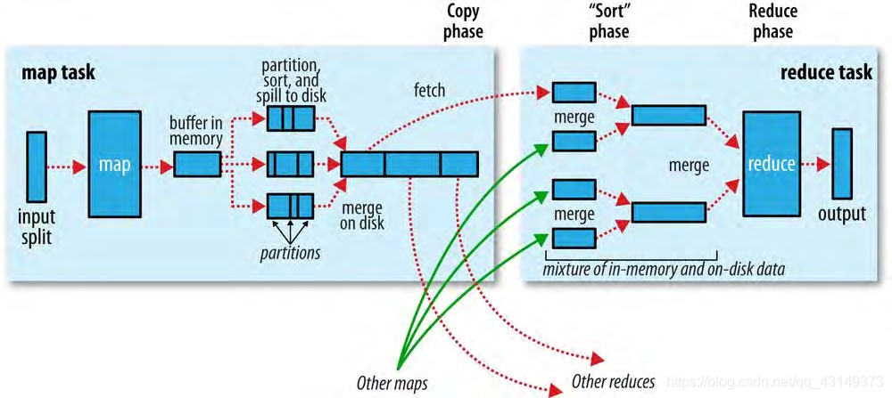

# 06MapReduce 的工作机制

# 1.MapReduce作业运行机制

## 1.1作业的提交和初始化

通过调用Job对象的submit()方法或者waitForCompletion()方法，我们可以运行一个MapReduce作业

**四大模块：**

- 客户端：提交 MR 作业
- jobtracker：协调作业运行。jobtracker 是一个 Java 程序，主类是 JobTracker
- tasktracker：运行作业划分后的任务。TaskTracker 是一个 Java 程序，主类是 TaskTracker
- 分布式文件系统：用来在其他实体间共享作业文件

**作业提交到运行的机制如下：**

- 向资源管理器请求一个资源 ID，用于 MapReduce 的工作 ID。
- 检查作业的输出说明。例如如果没有指明输出目录，或者输出目录已经存在，作业就不提交，错误抛回给 MapReduce 程序
- 计算作业的输入分片。如果分片无法计算，比如因为输入路径不存在，作业就不提交，错误返回给 MapReduce 程序
- 将运行作业所需要的资源复制到一个以作业 ID 命名的目录下的共享文件系统中
- 通过调用资源管理器的 submitApplication() 方法提交作业

## 1.2任务的分配

- TaskTracker 执行一个简单的循环,定期发送心跳( heartbeat)方法调用 Jobtracker心跳方法告诉 jobtracker, tasktracker是否还存活,同时也充当两者之间的消息通道。作为心跳方法调用的一部分， tasktracker会指明它是否已经准备运行新的任务，如果是， jobtracker会为它分配一个任务，并使用心跳方法的返回值与tasktracker进行通信。
- 针对map任务和 reduce任务, tasktracker有固定数量的槽。例如,一个 asktracker可能可以同时运行两个map任务和两个 reduce任务。(准确数量由 tasktracker核的数量和内存大小来决定，详见第9章的“内存”小节）。默认调度器在处理 reduce任务槽之前，会填满空闲的map任务槽，因此，如果至少有一个空闲的map任务槽, jobtracker会为它选择一个map任务;否则选择一个 reduce任务。
- 要选择一个 reduce任务, jobtracker只是简单地从尚未运行的 reduce任务列表中选取下一个来执行，并没有考虑数据的本地化。然而，对于一个map任务，它考虑的是 tasktracker的网络位置和选取一个距离其输入划分文件最近的 tasktracker。在最理想的情况下，任务是data- local（数据本地化）的，与分割文件所在节点运行在相同的节点上。同样，任务也可能是rack- local（机架本地化）的：和分割文件在同个机架，但不在同一节点。一些任务既不是数据本地化的，也不是机架本地化的，从与它们自身运行的不同机架上检索数据。可以通过查看作业的计数器得知每种类型任务的比例（详见第8章的“内置计数器”小节）。

## 1.3任务的执行

- TaskTracker 被分配任务后会运行任务。
  1. 它本地化作业的JAR文件，将它从共享文件系统复制到 tasktracker所在的文件系统。
  2. 将应用程序所需要的全部文件从分布式缓存复制到到本地磁盘
  3. 为任务新建一个本地工作目录，并把JAR文件中的内容解压到这个文件夹下。
  4. 新建一个 TaskRunner实例来运行任务。
- TaskRunner启动一个新的 Java 虚拟机来运行每个任务，使得用户定义的map和 reduce函数的任何缺陷都不会影响 tasktracker(比如导致它崩溃或者挂起）。但在不同的任务之间重用JVM还是可能的。
- 子进程通过 umbilical接口与父进程进行通信。它每隔几秒便告知父进程它的进度，直到任务完成。

## 1.4进度和状态的更新

如果任务报告了进度，便会设置一个标志以表明状态变化将被发送到 tasktracker在另一个线程中，每隔三秒检查此标志一次，如果已设置，则告知 tasktracker当前任务状态。同时, tasktracker每隔五秒发送心跳到 jobtracker(5秒这个间隔是最小值，因为心跳间隔是由集群的大小来决定的：对于一个更大的集群，间隔会更长一些），并且在此调用（指心跳调用）中，所有由tasktracker运行的任务，它们的状态都会被发送至 jobtracker计数器的发送间隔通常大于5秒，因为计数器占的带宽相对较高。

# 2.失败

## 2.1任务的失败

- 对于流任务，如果流进程以非零退出代码退出运行，则会被标记为 failed（失败）这种行为是由 stram non.zeroexit.s. failure属性(默认值为true)决定的。
- 另一种错误情况是子JVM突然退出可能有JVM错误，由 MapReduce用户代码某些特殊原因而造成JVM退出。在这种情况下， tasktracker会注意到进程已经退出，并将此次尝试标记为 failed（失败）
- 对于任务的挂起，处理方式则有不同。 tasktracker注意到自己已经有一段时间没有收到进度更新，因此进而将任务标记为 failed（失败）。在此之后，子JVM进程将被自动杀死。任务失败的超时间隔通常为10分钟，这可按照每个作业的方式进行设置（或按照每个集群的方式进行设置，具体做法是把 mapred.task. timeout属性设置为一个毫秒为单位的值。

## 2.2Application master 运行失败

- YARN 中的应用程序失败几次后会继续尝试，尝试的次数由 `mapreduce.am.max-attemps` 控制，超过此项配置次数后就会失败
- 恢复过程如下：application master 向资源管理器发送周期性心跳，当 application master 失败时，资源管理器将检测到该失败并在一个新的容器中开始一个新的 master 实例

## 2.3节点管理器的失败

如果节点管理器由于崩溃或运行非常缓慢而失败，就会停止向资源管理器发送心跳信息或者频率很慢，如果10分钟内没有收到一条心跳信息，资源管理器将会通知停止发送心跳信息的节点管理器，并将其从自己的节点池中移除以调度启用容器

## 2.4资源管理器运行失败

资源管理器失败是非常严重的问题，没有资源管理器，作业和任务容器将无法启动。在默认的配置中，资源管理器是单点故障，这是由于在机器失败的情况下，所有运行的作业都失败且不能被恢复。

为获得高可用性，在双机热备配置下，运行一对资源管理器是必要的

# 3.shffle和排序

## 3.1map端

map函数开始产生输出结果时，并不是简单地将它写到磁盘。这个过程更复杂，他利用缓冲的方式写到内存，并处于效率的原因预先进行排序。

每个map任务都有一个环形内存缓冲区，任务会把输出写到此。默认情况下，缓冲区的大小为100MB，此值可以通过io.sort.mb属性来修改。当缓冲内容达到指定大小时（io.sort.spill. percent，默认为0.80，80%），一个后台线程便开始把内容溢写（spi）到磁盘中。在线程工作的同时，map输出继续被写到缓冲区但如果在此期间缓冲区被填满，map会阻塞直到溢写过程结束。

溢写将按轮询方式写到 marred.local.dir属性指定的目录，在一个作业相关子目录中。在写到磁盘之前，线程首先根据数据最终被传送到的 reducer，将数据划分成相应的分区。在每个分区中，后台线程按键进行内排序（in- memory sort）。此时如果有一个combiner，它将基于排序后输出运行。

一旦内存缓冲区达到溢写阈值，就会新建一个溢写文件，因此在map任务写入其最后一个输出记录之后，会有若干个溢写文件。在任务完成之前，溢写文件被合并成一个已分区且已排序的输出文件。配置属性io.sort. factor控制着一次最多能

合并多少流，默认值是10。

## 3.2reduce端

map输出文件位于运行map任务的tasktracker的本地磁盘(注意,尽管map输出经常写到 map tasktracker的本地磁盘，但 reduce输出并不这样），不过在现在， tasktracker需要它为分区文件运行reduce任务。而且， reduce任务需要为其特定分区文件从集群上若干个map任务的map输出。map任务可以在不同时间完成，因此只要有一个任务结束， reduce任务就开始复制其输出。这就是 reduce任务的复制阶段。 reduce任务有少量复制线程，因此能够并行地取得map输出。默认是5个线程，但这个默认值可以通过设置 mapped. reduce.parallelcopies属性来改变

# 4.任务的执行

## 4.1任务执行环境

Hadoop 为 map 任务或 reduce 任务提供运行环境相关信息。例如 map 任务可以知道它处理的文件名称，map 任务或 reduce 任务可以得知任务的尝试次数。

## 4.2推测任务

MapReduce 模型将作业分解成任务，然后并行的运行任务以使作业的整体执行时间少于各个任务顺序执行的时间

推测任务是一种优化措施，它并不能使作业的运行更可靠。如果有一些软件缺陷会造成任务挂起或运行速度减慢，依靠推测任务执行来避免这些问题显然是不明智的，并且不能可靠的运行，因为相同的软件缺陷可能会影响推测式任务。
