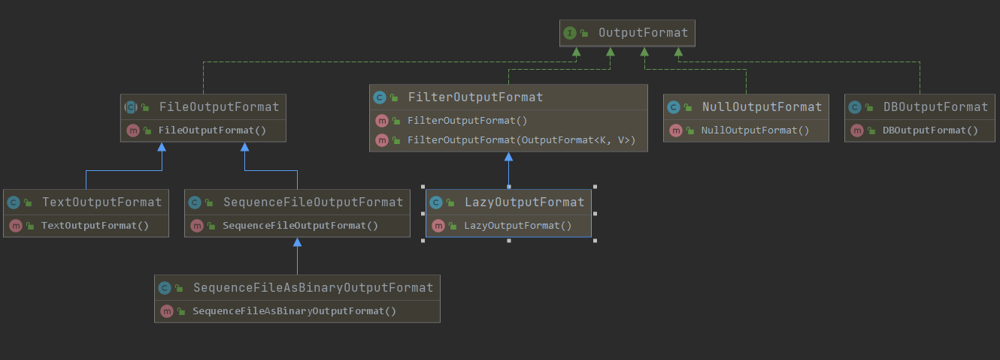

# 07MapReduce 的类型与格式

MapReduce 数据处理模型非常简单：map 和 reduce 函数的输入输出都是键-值对。

# 1.MapReduce 的类型

Hadoop 的 MapReduce 中，map 函数和 reduce 函数遵循如下格式：

- `map(k1, v1) -> list(k2, v2)`
- `combiner(k2, v2) -> list(k2, v2)`
- `reduce(k2, list(v2)) -> list(k3, v3)`

## 1.1默认的 MapReduce 作业

1. 默认的 mapper 是 Mapper 类，它的作用是将输入的键和值原封不动的写到输出中：

```java
public class Mapper<KEYIN,VALUEIN,KEYOUT,VALUEOUT>{
    protected void map(KEYIN key,VALUEIN value,
        Context context) throws IOException,InterruptedException{
            context.write((KEYOUT)key,(VALUE)value);
    }
}
```

Mapper 是一个泛类型，它可以接受任何键或值的类型。map 任务的数量等于输入文件被划分成的分块数，取决于输入文件的大小及文件块的大小

2. 默认的 partitioner （分区索引）是 HashPartitioner ，它对每条记录的键进行 hash 操作，以决定该记录应该属于那个分区

```java
public class HashPartitioner<K,V>extends Partitioner<K,V>{
    public int getPartitioner(k key,V value,int numPartitions){
        return (key.hashCode()& Integer.MAX_VALUE) % numPartitions;
    }
}
```

键的哈希码被转换为一个非负整数，它由哈希值与最大的整型值做一次按位与操作而获得，然后用分区数进行取模操作，来决定该记录属于哪个分区索引。每个分区由 reduce 任务处理，所以分区数等于作业的 reduce 任务个数，默认情况下，只有一个 reducer ，因此，也就只有一个分区，在这种情况下，由于所有数据都放在一个分区，partitioner 操作将变得无关紧要了。如果有多个 reducer 任务，HashPartitioner 的作用便体现出来

# 2.输入格式

从一般的文本到数据库，Hadoop 能处理很多不同的数据类型。

## 2.1输入分片与记录

一个输入分片就是一个由单个 map 操作来处理的输入块。每一个 map  操作只处理一个输入分片，每个分片被划分为若干个记录，每条记录就是一个键值对，map 一个接一个的处理记录。

输入分片在 Java 中表示为 InputSplit 接口，在`org.apache.hadoop.mapreduce`包中

```java
public abstract class InputSplit{
    public abstract long getLength() throws IOException,InterruptedException;
    public abstract String[] getLocations()throws IOException,InterruptedException;
}
```

InputSplit 包含一个以字节为单位的长度和一组存储位置（即一组主机名）。分片并不包含数据本身，而是指向数据的引用。存储位置供 MapReduce 系统使用，以便将 map 任务尽量放在分片数据附近，而分片大小用来排序分片，以便优先处理最大分片，从而最小化作业运行时间（贪婪近似算法）

MapReduce 开发人员不必直接处理 InputSplit，它由 InputFormat 创建（在 MapReduce 驱动程序中，InputFormat 负责创建输入分片并将他们分割成记录），InputFormat 类定义如下：

```java
public abstract class InputFormat<K,V>{
    public abstract List<InputSplit> getSplits(JobContext context)
        throws IOException,InterruptedException;
    
    public abstract RecordReader<K,V> createRecordReader(InputSplit split,
        TaskAttemptContext context) throws IOException,InterruptedException;
}
```

- 运行作业的客户端（驱动程序）通过`getSplits()`计算分片，然后将它们发送到 application master
- application master 使用其存储位置信息（InputSplit 中的字段）来调度 map 任务，从而在集群上处理这些分片数据。
- map 任务把输入分片传给 InputForma t的`createRecordReader()`方法来获取这个分片的 RecordReader。RecordReader 就像记录上的迭代器，map任务用一个RecordReader 来生成记录的键值对，然后再传递给 map 函数。

Mapper 的 run 方法如下：

```java
public void run(Context context)throws IOException,InterruptedException{
    setup(context);
    while(context.nextKeyalue()){
        map(context.getCurrentKey(),context.getCurrentValue(),context);
    }
    cleanup(context);
}
```

- 首先运行`setup()`，重复调用 Context 的`nextKeyValue()`为 mapper 产生键值对象。
- 通过 Context，键值从 RecordReader 中被检索出并传递给`map()`方法
- 当 reader 读到 stream 的结尾时，`nextKeyValue()`方法返回 false，map 任务运行其`cleanup()`方法，然后结束。

Mapper 的 run 方法是公共的 ，可以由用户定制。MultithreadedMapRunner 是另一个 MapRunnable 接口的实现，可配置指定个数的线程来并发运行多个 mapper。

**FileInputFormat 类：**

FileInputFormat是所有使用文件作为其数据源的InputFormat实现的基类，它提供两个功能：

- 用于指出作业的输入文件位置
- 为输入文件生成分片的代码实现。

作业的输入被设定成一组路径，FileInputFormat提供4种静态方法来设定Job：

```java
public static void addInputPath(Job job,Path path);
public static void addInputPaths(Job job,String commaSeperatedPaths);
public static void setInputPaths(Job job,Path inputPaths);
public static void setInputPaths(Job job,String commaSeperatedPaths);
```

## 2.2文本输入

**TextInputFormat：**

TextInputFormat是默认的InputFormat，每天记录时一行输入，键是LongWritable类型，存储该行在整个文件中的字节偏移量。值是这行内容，不包括任何终止符，被打包成一个Text对象。如下：

```java
//如下文本
On the top of the Crumpetty Tre 
The Quangle Wangle sat,
But his face you could not see,
On accout of his Beaver Hat.

//每条记录值,键值对
(0,On the top of the Crumpetty Tre )
(33,The Quangle Wangle sat,)
(57,But his face you could not see,)
(89,On accout of his Beaver Hat.)
```

**KeyValueTextInputFormat：**

TextInputFormat 的键，即每一行在文件中的字节偏移量，通常并不是特别有用。通常情况下，文件中的每一行是一个键值对，使用某个分界符进行分隔，比如制表符。例如由 TextOutputFormat 产生的输入就是这种。如果要正确处理这类文件，KeyValueTextInputFormat 比较合适。

**NLineInputFormat：**

通过 TextInputFormat 和 KeyValueTextInputFromat，每个 mapper 收到的输入行数不同。行数取决于输入分片的大小和行的长度。如果希望 mapper 收到固定的行数的输入，将需要 NLineInputFormat 作为 InputFormat 使用。与 TextInputFormat 一样，键是文件中行的字节偏移量，值是行本身。其中 N 是 mapper 收到的输入行数，由`mapreduce.input.lineinputformat.linespermap`属性控制

## 2.3二进制输入

二进制输入类包含如下类：

- SequenceFileInputFormat
- SequenceFileAsTextInputFormat
- SequenceFileAsBinaryInputFormat
- FileLengthInputFormat类。

## 2.4数据库输入

在关系型数据库和 HDFS 之间共享数据的一个方式是：使用 Sqoop

# 3.输出格式

针对之前的输入格式，Hadoop 都有对应的输出格式。OutputFormat 类的层次结构如下：


