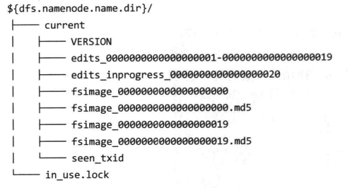
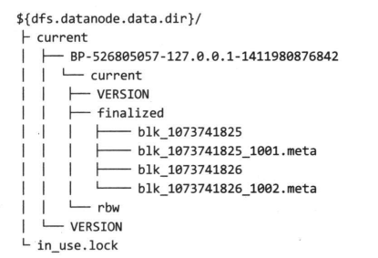

# 10管理 Hadoop

# 1.HDFS

## 1.1永久性数据结构

**1.namenode 的目录结构**

运行中的 namenode 拥有如下结构：

VERSION 是一个 Java 属性文件，包含了正在运行的 HDFS 的版本信息，该文件一般包含如下信息：

- layoutVersion 是一个负整数，描述 HDFS 持久性数据结构的版本
- namespaceID 是文件系统命名空间的唯一标识符
- cTime 属性标识了 namenode 存储系统创建空间
- storageType 属性说明该存储目录包含的是 namenode 的数据机构

**2.文件系统映像和编辑日志**

文件系统客户端执行写操作时，这些事务首先被记录到编辑日志中。namenode 在内存中维护文件系统的元数据；当编辑日志被修改时，相关元数据信息也同步更新。内存中的元数据可支持客户端的读请求。

**3.辅助 namenode 的目录结构**

辅助 namenode 的检查点目录的布局和主 namenode 的检查点目录的布局相同。这种设计方案的好处时，在主 namenode 发生故障时，可以从辅助 namenode 恢复数据。

**4.datanode 的目录结构**

和 namenode 不同的是，datanode 的存储目录是初始阶段自动创建的，不需要额外格式化。datanode 的关键文件和目录如下：

HDFS 数据库存储在以 blk_ 为前缀名的文件中，文件名包含了该文件存储的块的原始字节数。

## 1.2安全模式

namenode 启动时，首先将映像文件载入内存，并执行编辑日志中的各项编辑操作。一旦在内存中成功建立文件系统元数据的映像，则船舰一个新的 fsinage 文件和一个空的编辑日志。在这个过程中，namenode 运行在安全模式，意味着 namenode 的文件系统对于客户端来说是只读的。

需要强调的是，系统中数据块的位置并不是由 namenode 维护的，而是以块列表的形式存储在 datanode 中。在系统的正常操作期间，namenode 会在内存中保留所有块位置的映射信息。

## 1.3工具

1. dfsadmin 工具

> dfsadmin 工具用途较广，既可以查找 HDFS 状态信息，又可以在 HDFS 	上执行管理操作。以 hdfs dfsadmin 形式调用，且需要超级用户权限

2. 文件系统检查 fsck 工具

> Hadoop 提供 fsck 工具来检查 HDFS 中文件的健康状况。该工具会查找那些在所有 datanode 中均缺失的块以及过少或过多副本的块

3. datanode 块扫描器

> 多个 datanode 运行一个块扫描器，定期检查本节点上的所有块，从而在客户端读取到坏块之前及时的检查和修复坏块

4. 均衡器

> 均衡器程序是一个 Hadoop 守护进程，它将块从忙碌的 datanode 移到相对空闲的 datanode，从而重新分配块。

# 2.监控

监控的目标在于检测集群在何时未提供所期望的服务。主守护进程是最需要监控的，包括主 namenode、辅助 namenode 和资源管理器。

## 2.1日志

**1.设置日志级别**

**2.获取堆栈跟踪**

Hadoop 守护进程提供一个网页对正在守护进程的 JVM 中运行着的线程执行线程转储。

## 2.2度量和 JMX（Java 管理扩展）

Hadoop 守护进程收集事件和度量相关的信息，这些信息统称为“度量”。

所有的 Hadoop 度量都发布给 JMX，可以使用标准的 JMX 工具，如 JConsole，来查看这些度量。

# 3.维护

## 3.1日常管理过程

**1.元数据备份**

如果 namonode 的永久性元数据丢失或损坏，则整个文件系统无法使用。因此元数据备份非常关键：

- 方法一：直接保存这些元数据的复本
- 方法二：整合到 namenode 上正在使用的文件中

**2.数据备份**

为数据划分不同优先级。那些无法重新生成的数据优先级最高，这些数据对业务非常关键。

**3.文件系统检查**

**4.文件系统均衡器**

## 3.2委任和解除节点

Hadoop 集群的管理员经常需要向集群中添加节点，或从集群中移除节点。

**1.委任新节点**

添加新节点步骤：

1. 将新节点的网络地址添加到 include 文件中
2. 运行以下命令，将审核过的一系列 datanode 集合更新至 namenode 信息：`hdfs dfsadmin -refreshNodes`
3. 运行以下命令，将审核过的一系列节点管理器更新至资源管理器：`yarn readmin -refreshNodes`
4. 以新节点更新 slaves 文件。
5. 启动新的 datanode 和节点管理器。

**2.解除旧节点**

从集群中移除节点的步骤如下：

1. 将待解除节点的网络地址添加到 exclude 文件中，不更新 include 文件。
2. 执行一下指令，使用一组新的审核过的 datanode 来更新 namenode 设置：`hdfs dfsadmin -refreshNodes`
3. 使用一组新的审核过的节点管理器来更新资源管理器设置：`yarn rmadmin -refreshNodes`
4. 转到网页界面，查看待解除 datanode 的管理状态是否已经变为“正在解除”，因为此时相关的 datanode 正在被解除过程中。这些 datanode 会把他们的块复制到其他 datanode 中。
5. 当所有的 datanode 状态变为“解除完毕”时，表明所有的块都已经复制完毕。关闭已经解除的节点。
6. 从 include 文件中移除这些节点，并运行一下命令：
   - `hdfs dfsadmin -refreshNodes`
   - `yarn rmadmin -refreshNodes`
7. 从 slaves 文件中移除节点

## 3.3升级

将 Hadoop 版本升级成另外一个版本时，需要仔细考虑需要升级的步骤。同时还需要考虑几个方面：API 兼容性、数据兼容性和连接兼容性。
