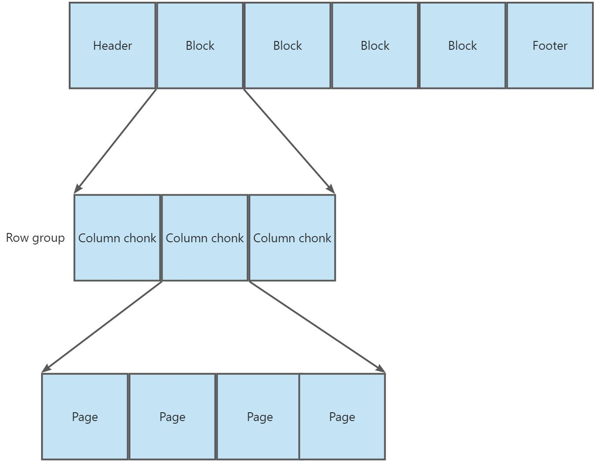
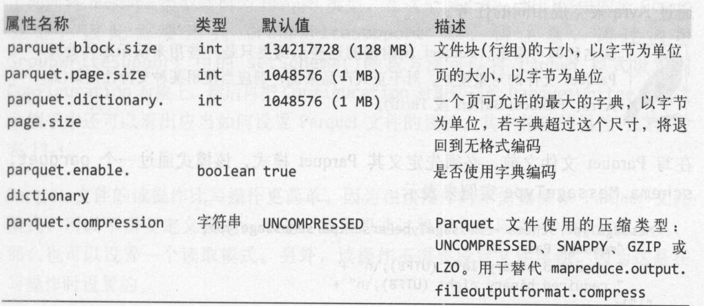

# 12关于 Parquet

Apache Parquet 是一种能有效存储嵌套数据的列式存储格式。

由于列式存储在文件大小和查询性能上表现优秀，因而受到人们的青睐。在列式存储格式下，同一列的数据连续保存。一般来说，这种做法可以允许更高效的编码方式，从而使列式存储格式的文件常常比行式存储格式的同等文件占用更少空间。

# 1.数据模型

Parquet 定义了少数几个原子类型：

|**类型**|**描述**|
| --------------------| -----------------------|
|boolean|二进制值|
|int32|32位有符号整数|
|int64|64位有符号整数|
|int96|96位有符号整数|
|float|单精度浮点数|
|double|双精度浮点数|
|binary|8位无符号字节序列|
|fixed_len_byte_array|固定数量的8位无符号字节|

保存在 Parquet 文件中的数据通过模式进行描述，模式的根为 message，message 中包含一组字段，每个字段由一个重复数（require、optional 或 repeated）、一个数据类型和一个字段名称构成。

```plain
message WeatherRecord {
	required int32 year;
	required int32 tempereature;
	required binary stationId(UTF8);
}
```

Parquet 的原子类型不包含字符串。但是 Parquet 定义了一些逻辑类型，可以通过逻辑指出应当如何对原子类型进行解读，从而使得序列化的表示（即原子类型）与特定于应用的语义（即逻辑类型）相互独立。

例如通过 UTF8 注解的 binary 原子类型表示字符串类型。

Parquet 的逻辑类型：

|**逻辑类型注解**|**描述**|**模式示例**|
| -------------------------| ------------------------------------------------------------------------------| -----------------------------------------------------------------------------------|
|UTF8|由 UTF-8 字符组成的字符串，可用于注解 binary|message m {<br />required binary a (UTF8);<br />}|
|ENUM|值命名的集合，可用于注解 binary|message m {<br />required binary a(ENUM);<br />}|
|DECIMAL(percision, scale)|任意精度的有符号小数，可用于注解 int32、int64、binary 或 fixed_len_byte_array|message m {<br />required int32 a(DECIMAL(5,2));<br />}|
|DATE|不带时间的日期值，可用于注解 int32。用 Unix 元年（1970年1月1日）以来的天数表示|message m {<br />required int32 a(DATE);<br />}|
|LIST|一组有序的值，可用于注解 group|message m {<br />required group a(LIST) {<br />required int32 element;<br />}<br />}|
|MAP|一组无序的键值对，可用于注解 group|message m {<br />required group a(MAP) {<br />required binary key(UTF8);<br />optional int32 value;<br />}<br />}|

Parquet 利用 group 类型来构造复杂类型，它可以增加一层嵌套。没有注解的 group 就是一个简单的嵌套记录。

# 2.Parquet 文件格式

Parquet 文件由一个文件头（header）、一个或多个紧随其后的文件块（block），以及一个用于结尾的文件尾（footer）构成。文件头中仅包含一个称为 PAR1 的 4 字节数字，它用来识别整个 Parquet 文件格式。文件的所有元数据都被保存在文件尾中。文件尾中的元数据包括文件格式的版本信息、模式信息、额外的键值对以及所有快的元数据信息。文件尾的最后两个字段分别是一个 4 字节字段（其中包含了文件尾中元数据长度的编码）和一个 PAR1 （与文件头中的相同）。

Parquet 文件中的每个文件块负责存储一个**行组（row group）** ，行由**列块（column chunk）**构成，且一个列块负责存储一列数据。每个列块中的数据以**页（page）**为单位存储：



# 3.Parquet 的配置

Parquet 文件的属性在写操作时设置，下图列出的文件属性书用于 MapReduce、Crunch、Pig 或 Hive 创建的 Parquet 文件



Parquet 文件块的大小不能超过其 HDFS 的块大小，只有这样才能使每个 Parquet 文件块仅需读取一个 HDFS 块（因而也只需要从一个数据结点上读）。比较常见的作法是为这两个属性设置相同的值，并且它们的默认值都是 128 MB。

# 4.Parquet 文件的读写

大多数情况下我们会使用高级工具来处理 Parquet 文件的读写操作，比如 Pig 、 Hive 或 Impala 。但有时候也需要对其进行低级的顺序方法。

# 5.Parquet MapReduce

MapReduce 的输入/输出格式中有一部分是用于通过 MapReduce 作业来读写 Parquet 文件 Parquet 格式，包括 Avro 、 Protocol Buffers 和 Thrift 模式和数据打交道的格式。
