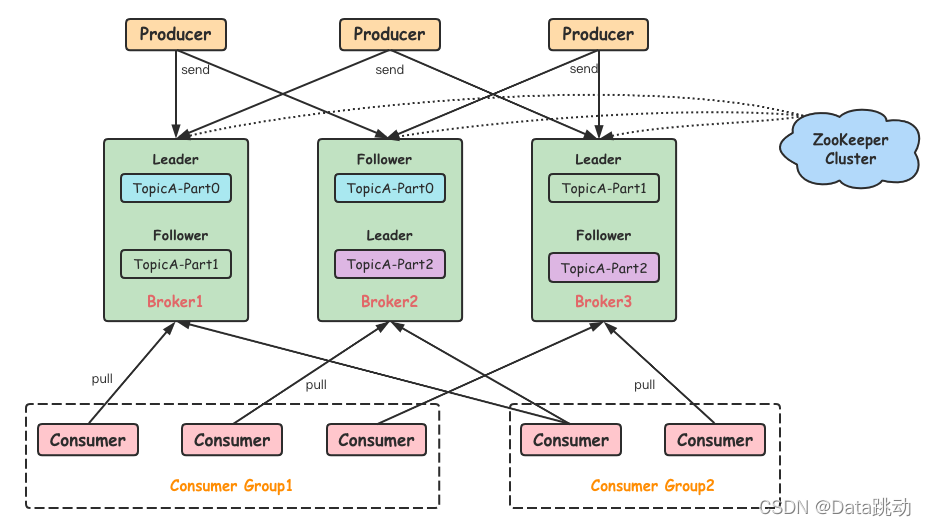

# 01初识Kafka

对于Kafka而言其扮演的角色主要由三个：

- 消息系统：Kafka和传统的消息系统都具备系统解耦、冗余存储、流量削峰、缓冲、异步通信、扩展性、可恢复性等功能。同时Kafka还提供了大多数消息系统难以实现的消息顺序性及回溯性功能；
- 存储系统：Kafka把消息持久化到磁盘，有效降低数据丢失风险；
- 流式处理平台：Kafka提供了完整的流式处理类库，比如窗口、连接、变换、聚合等操作。

## 1基本概念

一个典型的Kafka体系架构包括若干Producer、若干Broker、若干Consumer，以及一个ZK集群，如下图所示：



整个Kafka体系中引入以下三个术语：

- Producer：生产者，生产消息发送到Broker中；
- Consumer：消费者，接收消息的一方，从Broker 中消费消息；
- Broker：服务代理节点。对于Kafka而言，可以简单的将一个Broker看作一台Kafka。

Kafka中还有一个重要概念——主题（Topic）和分区（Partition）。Kafka中以主题为单位进行归类，生产者负责将消息发送到特定的主题，而消费者负责订阅主题并进行消费。

主题是一个逻辑上的概念，可以细分为多个分区，一个分区只属于一个主题。同一个主题下的分区的消息是不同的，分区可以看作一个可追加的日志文件，消息在被追加到分区日志文件的时候会被统一分配一个特定的偏移量（offset）。Kafka通过offset保证消息顺序性，不过offset并不跨分区，所以Kafka保证的是分区有序而非主题有序。

一条消息被发送到Broker前，会根据分区规则选择具体存储到那个分区。分区规则设置合理所有消息就可以均匀的分配到不同分区。并且为主题设置多个分区，可以用来解决单分区带来的IO性能瓶颈。

Kafka为分区引入了多副本的机制，通过增加副本数量可以提升容灾能力。副本之间是一主多从的关系，leader副本负责梳理读写，follower副本只负责与leader副本的消息同步，消息同步可能会存在一定延迟。副本处于不同Broker中。

**关于副本的相关概念：**

由于副本之间的消息同步存在一定延迟，所以根据延迟多少可以将副本归到以下三类集合中：

- AR：分区中所有副本；
- ISR：与leader保持一定程度同步的副本；
- OSR：与leader同步滞留过多的副本；
- HW：高水位，消费之只能读取HW之前的消息；
- LEO：日志文件中下一条待写入的offset。

由此可以得到一些结论：

1. AR = ISR + OR
2. HW为ISR中最小的LEO

## 2.安装与配置

需要安装JDK、ZK、Kafka

## 3.生产与消费

### 3.1命令行操作

1. 创建一个名为 tp01 的主题，其分区为1，副本也为1

```bash
bin/kafka-topics.sh --bootstrap-server 172.30.35.243:9092 --create --topic tp01 --partitions 1 --replication-factor 1
```

1. 查看当前Kafka中的所有主题

```bash
bin/kafka-topics.sh --bootstrap-server 172.30.35.243:9092 --list
```

1. 生产端向 tp01生产消息

```bash
bin/kafka-console-producer.sh --broker-list 172.30.35.243:9092 --topic tp01
```

1. 消费端消费 tp01的消息

```bash
bin/kafka-console-consumer.sh --bootstrap-server 172.30.35.243:9092 --topic tp01
```

bin/kafka-console-consumer.sh --bootstrap-server 172.30.35.243:9092 --topic tp01

### 3.2代码操作

1. 添加Kafka依赖

```xml
<dependency>
    <groupId>org.apache.kafka</groupId>
    <artifactId>kafka-clients</artifactId>
    <version>2.3.0</version>
  </dependency>
```

1. 生产者代码

```java
public static void main(String[] args) {
    Properties properties = new Properties();
    properties.put(ProducerConfig.BOOTSTRAP_SERVERS_CONFIG, "bigdata01:9092,bigdata03:9092,bigdata05:9092");
    properties.put("acks", "all");
    properties.put("retries", 3);
    properties.put("batch.size", 16384);
    properties.put("linger.ms", 1);
    properties.put("buffer.memory", 33554432);
    properties.put("key.serializer", "org.apache.kafka.common.serialization.StringSerializer");
    properties.put("value.serializer", "org.apache.kafka.common.serialization.StringSerializer");
    KafkaProducer<String, String> producer = new KafkaProducer<>(properties);
    for (int i = 0; i < 10; i++) {
        // 通过回调可以获取offset和分区等信息
        producer.send(new ProducerRecord<>("first", "hello**--**" + i), (recordMetadata, e) -> {
            if (e == null) {
                System.out.println(recordMetadata.partition() + "----------" + recordMetadata.offset());
            } else {
                e.printStackTrace();
            }
        });
    }
    producer.close();
}
```

1. 消费者代码

```java
public static void main(String[] args) {
    Properties properties = new Properties();
    properties.put(ConsumerConfig.BOOTSTRAP_SERVERS_CONFIG, "bigdata01:9092,bigdata03:9092,bigdata05:9092");
    properties.put(ConsumerConfig.KEY_DESERIALIZER_CLASS_CONFIG, "org.apache.kafka.common.serialization.StringDeserializer");
    properties.put(ConsumerConfig.VALUE_DESERIALIZER_CLASS_CONFIG, "org.apache.kafka.common.serialization.StringDeserializer");
    properties.put(ConsumerConfig.AUTO_COMMIT_INTERVAL_MS_CONFIG, 100);
    properties.put(ConsumerConfig.ENABLE_AUTO_COMMIT_CONFIG, true);
    properties.put(ConsumerConfig.GROUP_ID_CONFIG, "group1");
    KafkaConsumer<String, String> consumer = new KafkaConsumer<String, String>(properties);
    consumer.subscribe(Arrays.asList("first", "second"));
    while (true) {
        ConsumerRecords<String, String> records = consumer.poll(Duration.ofMillis(100));
        records.forEach(System.out::println);
    }
}
```

## 4.服务端参数配置

以下会介绍 config/server.properties 中的部分配置作用。

1. zookeeper.connect
   该参数用来指定 ZK 集群服务地址，无默认值，且为必填。多个 ZK 地址之间通过`,`分隔，最佳实践为在集群连接地址后面再加一个Kafka根路径：`172.30.11.121:2181,172.30.9.61:2181,172.30.11.25:2181/kafka`，如果不指定根路径则默认使用ZK的根路径。
2. listeners
   用来配置Broker监听客户端连接地址列表，格式为：`protocol:/hostname:prot`其中protocol表示连接协议，支持 PLAINTEXT、SSL、SASL_SSL等。如不开启安全认证，则使用PLAINTEXT即可。不填默认为null，表示绑定默认网卡，但不建议这样设置。
3. broker.id
   标识Kafka在集群中的唯一id，默认值为 -1，则Kafka会自动生成一个。集群中的该配置必须唯一。
4. log.dir和log.dirs
   用来存储Kafka中的消息，二者都可以配置一个或多个目录，逗号分隔，log.dirs优先级更高。
5. message.max.bytes
   用来指定Broker所能接收的消息的最大值。如果Producer发送的消息大于该值，则会抛出RecordTooLargeException 的异常。
