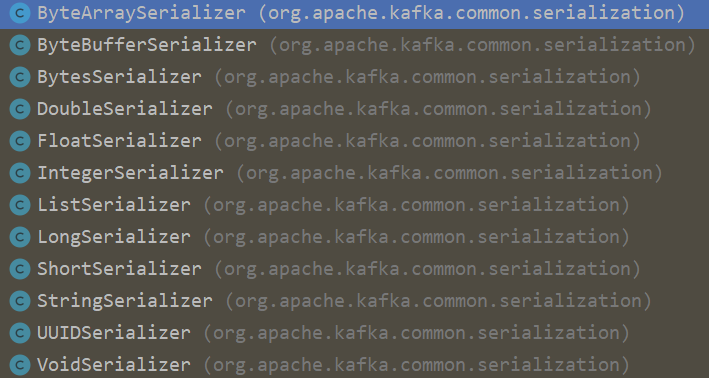
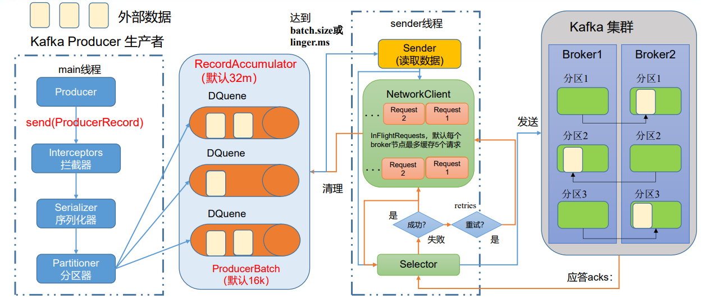

# 02生产者

## 1.客户端开发

一个正常的生产逻辑需要具备以下几个步骤：

1. 构建生产者客户端参数及创建相应的生产者实例；
2. 构建待发送的消息；
3. 发送消息；
4. 关闭生产者实例。

其中单独构建的消息对象为ProducerRecord，它并不是单纯的消息，而是包含了多个属性，原本需要发送的与业务相关的消息体只是其中的一个 value属性，其他部分属性如下：

```java
public class ProducerRecord<K, V> {
    // 主题
    private final String topic;
    // 分区号
    private final Integer partition;
    // 消息头
    private final Headers headers;
    // 键
    private final K key;
    // 值
    private final V value;
    // 消息时间戳
    private final Long timestamp;
}
```

- topic和 partition表示要发往的主题和分区号；
- headers表示与业务相关的信息，如果不需要也可以不设置；
- key可以将消息进行二次归类，同一个key的消息会被划分到同一个分区中；
- value则是实际的消息体，一般不为空，如果为空则表示特定的消息—墓碑消息；
- timestamp是指消息的时间戳，有CreateTime 和 LogAppendTime两种类型，前者表示消息创建的时间，后者表示消息追加到日志文件的时间；

### 1.1必要的参数配置

在构建 KafkaProducer时需要传递一个Properties对象，配置的key由`org.apache.kafka.clients.producer.ProducerConfig`的定义，这个对象中存放了一些必要的参数配置：

- bootstrap.servers：用来指定Kafka集群地址，多个地址逗号分隔；
- key.serializer和value.serializer：key和value的序列化器全类名，对应的消费者也应该有反序列化对象；
- client.id：如果生产着客户端id，如果不穿则随机生成。

KafkaProducer时线程安全的，可以在多个线程中共享KafkaProducer实例，也可以将KafkaProducer实例进行池化来供其他线程调用。

### 1.2消息的发送

在完成生产者的构建之后，接下来就是构建消息，构建消息即为构建ProducerRecord，其中topic和value属性是必填项。消息构建完成即可调用KafkaProducer的send方法进行消息的发送，发送模式公用三种：

- 发后即忘
- 同步发送
- 异步发送

send方法共有两种定义：

```java
public Future<RecordMetadata> send(ProducerRecord<K, V> record, Callback callback)
public Future<RecordMetadata> send(ProducerRecord<K, V> record)
```

二者都返回Future对象，由此可以确定上述三种发送模式的实现方式：

- 发后即忘：直接调用send方法不关心返回值；
- 同步发送：调用send方法后立即调用future.get() 方法，阻塞获取发送详情；
- 异步发送：通过带 Callback的send方法实现异步调用。
  其中Callback的定义如下：

```java
public interface Callback {
    void onCompletion(RecordMetadata var1, Exception var2);
}
```

正常发送情况下，获取得到的返回值为RecordMetadata对象，这个对象中包含了一些元数据信息，比如当前消息的主题，分区号、分区中的偏移量、时间戳等。

异常发送情况下，future.get() 会抛出异常，或者通过Callback.onCompletion() 方法的第二个参数获取异常。这些异常分为可重试异常和不可重试异常，常见的可重试异常有NetworkException、LeaderNotAvailableException等待，它们都继承自RetriableException，对于可重试异常如果配置了 retries 参数，那么如果在规定重试次数内自行恢复了就不会抛出该异常。

通常一个KafkaProducer不会只负责发送单条消息，更多的是发送多条消息，在发送完这些消息后需要调用KafkaProducer的close方法来释放资源。

### 1.3序列化

生产者需要使用序列化器把对象转为字节数组才能通过网络发送到Kafka。而在消费者需要使用反序列化器把从Kafka中受到的字节数组转为相应的对象。

所有的序列化器都实现自Serializer接口，该接口定义如下：

```java
public interface Serializer<T> extends Closeable {
    default void configure(Map<String, ?> configs, boolean isKey) {
        // intentionally left blank
    }
    byte[] serialize(String topic, T data);
    default byte[] serialize(String topic, Headers headers, T data) {
        return serialize(topic, data);
    }
    @Override
    default void close() {
        // intentionally left blank
    }
}
```

configure 方法用来配置当前类；serialize 方法用来实现具体的序列化操作；close 方法用来关闭当前序列化器，一般情况下close都是一个空方法。

客户端自带的序列化器如下：



如果Kafka提供的客户端无法满足应用需求，则可以选择使用如Avro、JSON、Thrift、ProtoBuf或ProtoStuff等通用序列化工具来实现，或者自定义序列化器，自定义序列化器只需要实现serialize方法即可，其他直接使用默认实现。

### 1.4分区器

如果在ProducerRecord 中没有指定 partition 字段，那么就会依赖分区器，如果指定了就不会经过分区器。分区器是根据key 字段来计算partition指，其规则如下：

- key为null：轮询主题中所有可用分区；
- key 不为 null：采用 MurmurHash2算法，根据最终的哈希值计算分区号。

> 📌如果key为null，那么计算的分区号是可用分区中的任意一个；key不为null，分区号为所有分区中的任意一个。

所有的分区器都实现自Partitioner接口，Kafka中提供了一个默认分区器实现DefaultPartitioner。Partitoner接口定义如下：

```java
public interface Partitioner extends Configurable, Closeable {
    /**
    * topic 主题
    * key 键
    * keyBytes 序列化后键值
    * value 值
    * valueBytes 序列化后的值
    * cluster 集权元数据信息
    */
    int partition(String topic, Object key, byte[] keyBytes, Object value, byte[] valueBytes, Cluster cluster);
    void close();
    default void onNewBatch(String topic, Cluster cluster, int prevPartition) {
    }
}
```

其中 partition 方法用来计算分区号，返回值为int类型，该接口还有一个父接口 Cofnigurable，父接口中的configure方法用来获取配置信息及初始化数据。

在不改变主题分区数量的情况下，key与分区之间的映射可以保持不变。不过一旦增加了分区，就那以保证key与分区之间的映射关系。

除了使用默认分区外，可以通过实现 Partitioner 接口自定义分区器，自定义完成后通过设置partitioner.class 参数来设置分区器。

### 2.5生产者拦截器

生产者拦截器可以用来在消息发送前做一些准备，比如按照某个规则过滤不符合要求的消息、修改消息内容等，也可以用来在发送回调逻辑前做一些定制化需求，比如统计类工作。

生产者拦截器实现非常简单，只需要实现 ProducerInterceptor 接口即可，该接口定义如下：

```java
public interface ProducerInterceptor<K, V> extends Configurable {
    ProducerRecord<K, V> onSend(ProducerRecord<K, V> record);
    void onAcknowledgement(RecordMetadata metadata, Exception exception);
    void close();
}
```

各个方法的调用时机：

- onSend：在消息序列化和计算分区之前的调用；
- onAcknowledgement：在消息应答之前或消息发送失败时调用，优先于Callback；
- close：这个方法主要用于在关闭拦截器时执行一些资源的清理工作。

该接口也有一个Configurable 父接口，用于获取相关配置信息。

自定义生产者连接器只需要实现该接口后配置interceptor.classes指定自定义拦截器即可。

## 2.原理分析

### 2.1整体架构

消息在发送到Kafka之前可能会经历拦截器、序列化器和分区器，生产者客户端整体架构如图：



生产者客户端由两个线程协调运行，这两个线程分别为主线程和 Sender 线程。在主线程中由KafkaProducer创建消息，然后通过可能的拦截器、序列化器和分区器之后缓存到消息累加器 RecordAccumulator中。Sender线程负责从RecordAccumulator中获取消息，并将其发送到Kafka中。

RecordAccumulator用来缓存消息一遍Sender线程可以批量发送，默认32MB。如果生产者生产消息到RecordAccumulator的速度大于发送到服务器的速度那么就会造成消息积压，生产者空间不足的问题，此时KafkaProducer的send方法调用要么被阻塞要么抛出异常，这个取决于 max.block.ms的配置，默认值为 60000，即60秒。

RecordAccumulator中为每个分区都维护了一个双端队列，队列中的内容就是ProducerBatch，一个ProducerBatch中包含了一个或多个ProducerRecord。

同时RecordAccumulator中维护了一个BufferPool，主要针对特定大小的ByteBuffer实现复用，默认值为16384，即16KB。这个参数由batch.size 控制。

ProducerBatch的大小即为batch.size 的大小，可以适当增大batch.size 以便缓存更多的消息。当一条消息到达RecordAccumulator时，会先寻找与指定分区对应的双端队列（不存在则创建），从队尾获取一个ProducerBatch（不存在则创建），产看这个ProducerBatch是否可以写入，如果无法写入则创建新的ProducerBatch。创建新的ProducerBatch时判断这条消息大小是否超过batch.size，不超过则以batch.seze创建ProducerBatch，然后直接写入，这样在使用完成这段内存区域后可以通过BufferPool 的管理进行复用；如果超过则以实际大小创建ProducerBatch，写入消息，同时这段内存无法复用。

Sender从RecordAccumulator中获取缓存消息后最终会转化为`<Node, Request>`的形式，Request即为Kafka中的各种协议氢气，其中包含了许多ProducerBatch。请求在从Sender线程发往Kafka之前还会保存到InFlightRequests中，保存形式为`Map<NodeId, Deque<Request>>`，其主要作用是缓存了已经发出去但还没受到响应的请求，默认缓存5个由参数 max.in.flight.requests.per.connection控制。

### 2.2元数据的更新

在InflightRequests中可以获取到 leastLodaedNode，即所有结点中负载最小的哪一个，这里负载最小是通过Node中未确认的请求数量决定的，未确认的请求数量越多则负载越大。

生产者在发送消息时只知道topic信息，对于其他信息一无所知。KafkaProducer在将消息发送到指定分区的leader副本前需要知道leader副本所在broker节点所在地址、端口等信息才能建立连接，在这一过程中所需要了解的信息都属于元数据信息。

当客户端中没有需要使用的元数据信息时，或者超过metadata.max.age.ms 时间没有更新元数据时都会引起更新操作，其默认值为 300000即5分钟。元数据更新是在客户端内部进行的，用户无感知，当需要更新元数据时，会先挑选出leastLoadedNode，然后向这个Node发送MetadataRequest请求来获取具体的元数据信息。

## 3.重要的生产者参数

- acks这个参数用来指定分区中必须由多少个副本收到这条消息之后，生产者才会认为这条消息是成功写入的。共有三个值可以配置：
  - ack = 1：默认值，只要leader 副本写入成功后，就会受到服务端的成功响应。这个值为消息可靠性和吞吐量之间的折中方案；
  - ack = 0：生产者发送消息后无需等待服务端响应，可达到最大吞吐量；
  - ack = -1 或 ack = all：生产者需要等待ISR中的所有副本均成功写入消息后才会收到服务端的成功响应，但这并不意味着消息一定不会丢失，当ISR 中只有leader 副本时就退化为 ack = 1 的情况了。
- max.request.size
  这个参数用来限制客户端能够发送的消息的最大值，默认为 1048576B，即1MB。一般情况下，这个值足够满足大多数场景。
- retries和retry.backoff.ms
  retires用来配置生产者重试的次数，默认值为0。retry.backoff.ms用来设置两次重试之间的间隔时间默认值为 100ms。在出现重试的场景时就不能保证分区写入顺序和消息发送顺序完全一致，在进行需要强一致性消息传输时可以将 max.in.flight.requests.per.connection配置为1，即只缓存一个request，当这个request失败后在重试次数内成功即可保证分区消息一致性。
- compression.type
  用来指定压缩方式，默认值为 "none" 即不进行压缩。该参数可以配置为 gzip 、snappy和lz4。压缩消息可以减少网络传输量，降低网络IO，是一种时间换空间的方式，如果对时效性由一定要求，不建议对消息进行压缩。
- connections.max.idle.ms
  用来指定在多久之后关闭限制的连接，默认值为 540000即9分钟。
- linger.ms
  该参数用来指定生产者发送ProducerBatch之前等待更多消息加入ProducerBatch的时间，默认值为0。生产者会在ProducerBatch填满之前或等待时间超过linger.ms时发送消息，增大该参数会增加消息延迟，但能提升一定的吞吐量。
- receive.buffer.bytes
  用来设置Socket接收消息缓冲区的大小，默认值为32768，即32KB。
- send.buffer.bytes
  用来设置Socket发送消息缓冲区的大小，默认值为131072，即128KB。
- request.timeout.ms
  用来配置Producer等待请求响应的最长时间，默认值为30000。请求超时之后可以选择进行重试。该参数需要比Broker端参数replica.lag.time.max.ms值要大，可以减少因客户端重试而引起的消息重复的概率。
