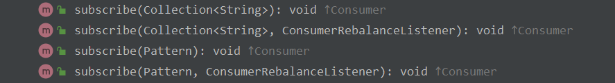
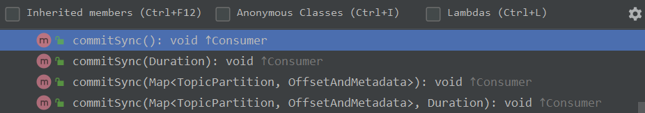
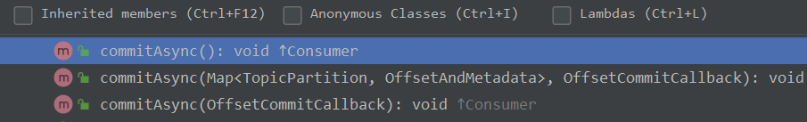
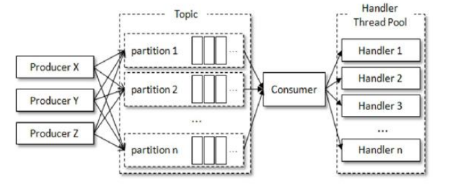

# 03 消费者

与生产者对应的是消费者，应用程序可以通过KafkaConsumer来订阅主题，并从订阅主题中拉取消息。

## 1.消费者与消费者组

消费者负责订阅Kafka中的主题，并且从订阅的主题中拉取消息。与其他消息中间件不同的是：Kafka的消费理念中还有一层消费者组的概念，每个消费者都有一个与之对应的消费者组。当消息发布到主题后之后被投递到订阅它的消费者组中的一个消费者，一个分区的数据只能被消费者组中的一个消费者消费。

消费者与消费者组的这种模型可以让整体的消费能力具备横向扩展的能力，但是对于分区固定的的情况一味的增加消费者并不能提升消费能力，当消费者数量大于分区数后就会有消费者分配不到任何分区。关于分区与消费者之间的分配策略由 partition.assignmeng.strategy 参数进行配置。

Kafka同时支持点对点和广播形式的消息投递模式：

- 当所有消费者同属于一个消费者组，则所有的消息均匀的投递给每一个消费者，即每条消息只会被消费一次；
- 当所有消费者都属于不同消费者组，则所有的消息被广播给所有消费者，即每条消息都会被所有消费者处理；

消费者组是逻辑上的概念，将旗下的消费者归为一类，每个消费者都只属于一个消费者组。消费者组通过客户端参数 group.id 配置；

消费者并非逻辑概念，它是实际的应用实例，可以是线程，也可以是进程。

## 2.客户端开发

一个正常的消费逻辑需要具备以下一个步骤：

1. 配置消费者客户端参数及创建相应的消费者实例；
2. 订阅主题；
3. 拉取消息并消费；
4. 提交消费位移；
5. 关闭消费者实例。

### 2.1必要的参数配置

- bootstra.servers：配置Kafka集群地址；
- group.id：配置消费者组名称；
- key.deserializer和value.deserializer：key和value的反序列化器。

消费者相关参数都可以从org.apache.kafka.clients.consumer.ConsumerConfig中找到。

### 2.2订阅主题与分区

订阅主题使用的是KafkaConsumer中的subscribe方法，该方法的所有重载方法如下：



订阅主题可以以集合的方式进行订阅，也可以根据正则表达式订阅指定特点的主题。如果KafkaConsumer重复多次的订阅主题则以最后一次为准。

在以正则表达式订阅主题过程中，如果创建了符合表达式的主题那么该消费者也能消费到新添加主题中的消息。

除了使用subscribe方法进行主题订阅之外，还可以使用assign方法进行指定主题的指定分区消息订阅：

```java
public void assign(Collection<TopicPartition> partitions);
```

其中的TopicPartition集合就包含了主题及主题的分区信息：

```java
public final class TopicPartition implements Serializable {
    // 分区
    private final int partition;
    // 主题
    private final String topic;
}
```

在分区信息未知的情况下可以通过partitionsFor方法获取指定主题的元数据信息：

```java
public List<PartitionInfo> partitionsFor(String topic);
```

PartitionInfo 即为分区元数据信息：

```java
public class PartitionInfo {
    // 主题
    private final String topic;
    // 分区
    private final int partition;
    // leader 副本所在节点
    private final Node leader;
    // 副本节点 AR 集合
    private final Node[] replicas;
    // ISR 节点
    private final Node[] inSyncReplicas;
    // OSR 节点
    private final Node[] offlineReplicas;
}
```

除了订阅主题外，还可以使用 unsubscribe方法取消订阅：

```plain
public void unsubscribe();
```

取消订阅表示取消所有主题的订阅，或者重新订阅一个空集合与此方法效果一致。

订阅主题的三种方式对应三种订阅状态：

- 集合订阅方式：AUTO_TOPICS；
- 正则表达式方式：AUTO_PATTERN；
- 指定分区方式：USER_ASSIGNED。

这三种状态是互斥的，在一个消费者中只能使用其中一种，否则会抛出 IllegalStateException 异常。使用 subscribe 方法订阅主题有消费者自动再平衡的功能，使用assign的方式则不具备在平衡的功能。

### 2.3反序列化

反序列化器都实现自org.apache.kafka.common.serialization.Deserializer接口：

```java
public interface Deserializer<T> extends Closeable {
    default void configure(Map<String, ?> configs, boolean isKey) {
        // intentionally left blank
    }
    T deserialize(String topic, byte[] data);
    default T deserialize(String topic, Headers headers, byte[] data) {
        return deserialize(topic, data);
    }
    @Override
    default void close() {
        // intentionally left blank
    }
}
```

其中只有 deserialize 方法是必须实现的，用来实现反序列化的具体逻辑；configure 和 close 方法与Producer中的序列化器的方法作用一致，不再赘述。

### 2.4消息消费

Kafka中的消费是基于拉模式的。Kafka中的消费是一个不断轮询的过程，消费者所需要做的就是不断重复的调用 poll方法，poll 方法返回的是所订阅主题上的一组消息：

```java
public ConsumerRecords<K, V> poll(final Duration timeout);
```

poll 方法可以设置一个超时时间，用来控制poll方法的阻塞时间，在消费者的缓冲区里没有可用数据时会发生阻塞，直到超时时间内获取到数据并返回或者超过超时时间返回空集合。如果应用线程需要在执行轮询时需要在较短时间内获取到控制权，则可以将超时时间设置为0，那么poll方法会立即返回，而不管是否已经拉取到消息；如果应用线程的唯一工作就是从Kafka中拉取消息，则可以将其设置为Long.MAX_VALUE，那么除非拉取到消息否则超时时间内不会返回。

ConsumerRecords中包含了多个ConsumerRecord即消息记录，其具体结构如下：

```java
public class ConsumerRecord<K, V> {
    private final String topic;
    private final int partition;
    private final long offset;
    private final long timestamp;
    private final TimestampType timestampType;
    private final int serializedKeySize;
    private final int serializedValueSize;
    private final Headers headers;
    private final K key;
    private final V value;
    private final Optional<Integer> leaderEpoch;
}
```

介绍一些无法一眼看穿的参数：

- offset：所属分区的偏移量；
- timestampType：时间戳类型，共两种：CreateTime 和 LogAppendTime，分别代表消息创建时间戳和消息追加到日志的时间戳；
- serializedKeySize 和 serializedValueSize：序列化后key 和value的大小。

ConsumerRecords 有的 records 方法可以用来获取指定主题或指定分区的消息：

```java
public Iterable<ConsumerRecord<K, V>> records(String topic);
public List<ConsumerRecord<K, V>> records(TopicPartition partition);
```

### 2.5位移提交

对于Kafka中的分区而言，他的每条消息都有唯一的offset，用来表示这条消息在分区中的位置。对于消费者而言它也有一个offset的概念，消费者用offset来表示消费到分区中某个消息所在的位置。

- offset的偏移量含义一般用来表示消息在分区中的位置；
- offset的位移含义一般用来表示消费者的消费位移。

对于一条消息而言他的偏移量和消费位移是相同的。

对于poll方法而言，它返回的是Kafka中未被消费的消息集合，需要做到这一点就需要每次记录上一次的消费位移。这里将消费者消费位移存储起来的动作称之为“提交”。

假设对于某次消费，消费者消费到了位移为X 的消息，那么就可以说消费者的消费位移是X，则消费者需要提交的消费位移是X+1而不是X，这点需要注意。

对于消费位移提交的时间也比较重要，否则就会造成重复消费或者消息丢失的情况：

假设某次消费拉取了位移为[11, 20]的消息

- 消息丢失：拉取到消息之后就立即提交位移。假设在消费到位移为15的消息时出现异常，当故障恢复之后就会重新拉取位移21之后的消息，那么位移[15, 20]之间的消息就属于丢失的消息；
- 重复消费：所有消息消费完成之后再提交位移。同样假设再消费到位移为15的消息时出现异常，当故障恢复后就会重新拉取位移为11 之后的消息，那么[11, 15)之间的消息就属于重复消费的消息。

Kafka中的位移提交方式：

- 自动提交：这个行为由消费者参数enable.auto.commit配置，默认值为true。提交频率为定期5秒提交一次，由参数auto.commit.interval.ms配置，其生效前提是enable.auto.commit为true。自动提交虽然代码实现简单，但是可能带来重复消费和消息丢失的问题，所以在实际编码中并不建议这样使用。
- 手动提交：手动提交需要将参数enable.auto.commit配置为false，手动提交分为同步和异步两种方式。
  - 同步提交：commitSync及其重载方法；
  - 异步提交：commitAsync及其重载方法。

**同步提交：**

commitSync及其重载方法定义如下：



commitSync方法会根据poll方法拉取的最新位移来进行提交，只要没有发生不可恢复的系统错误，它会一直阻塞消费者线程直至位移提交完成。

对于commitSync的无参方法而言，其提交消费位移的频率和拉取消息的频率以及处理消息的频率是一样的。如果需要精细话处理可以使用带 Map参数的方法，这个map中可以存放对应分区及提交位移信息。

而带Duration参数的方法表示同步提交时的阻塞时间。

**异步提交：**

异步提交并不会阻塞消费者线程，可能再提交消费位移的结果未返回之前就开始了新一次的拉取操作，commitAsync的重载方法定义如下：



其中的无参方法以及Map 参数都非常好理解，其中的OffsetCommitCallback参数表示提交完成后的返回结果：

```java
public interface OffsetCommitCallback {
    void onComplete(Map<TopicPartition, OffsetAndMetadata> offsets, Exception exception);
}
```

异步提交也会出现失败的情况，而解决失败情况的核心思路就是重试。但是由于是异步提交，第一次提交失败后的重试可能会覆盖第二次成功提交，就会导致重复消费。为此我们可以通过精细话提交的方式在提交时添加一个版本号，存放在 OffsetAndMetadata 的metadata中，同时在提交前获取此时的版本号，也即上次提交的metadata，通过KafkaConsumer.committed(Set<TopicPartition> partitions)可以获取OffsetAndMetadata，进而获取到metadata值。

一般情况下位移提交失败的情况很少发生，不重试也无妨，后面会有提交成功的。重试会增加代码复杂度，不重试会增加重复消费的概率。如果消费者异常退出，那么重复消费很难避免，因为位移无法及时提交；如果消费者正常退出或再均衡，那么可以在退出或者再均衡之前使用同步提交的方式做最后的把关。

### 2.6控制或关闭消费

KafkaConsumer提供了对消费者速度控制的方法，比如暂停或者恢复某些分区的消费。KafkaConsumer提供了pause方法来暂停某些分区的消费，提供resume方法用来恢复分区消费：

```java
public void pause(Collection<TopicPartition> partitions);
public void resume(Collection<TopicPartition> partitions);
```

同时KafkaConsumer还提供了paused 方法用来获取当前被暂停的分区集合：

```java
public Set<TopicPartition> paused();
```

退出while循环的方法由两种：

- while条件中使用 AutomaticBoolean，当需要暂停时可以使用 AutomaticBoolean.set(false) 方法来退出循环；
- 使用KafkaConsumer的wakeup方法，该方法是KafkaConsumer中唯一一个线程安全的方法。wakeup方法会抛出WakeupException，不需要处理。

跳出循环后需要显式的执行关闭动作以及释放运行过程中占用的各种系统资源。KafkaConsumer提供了2个重载close方法，用来实现这一目的：

```java
public void close();
public void close(Duration timeout);
```

第二种方法通过timeout参数来设定关闭方法的最长执行时间，有些内部关闭逻辑会耗费一定时间；无参方法内部设定了最长等待时长30秒。

### 2.7指定位移消费

当一个消费者没有找到消费位移的时候，会根据auto.offset.reset参数的配置来决定这个消费者如何进行消费。消费者找不到消费位移共有三种情况：

- 当一个新的消费者组建立时，其中的消费者为新的消费者，自然找不到消费位移；
- 一个消费者组种新增了一个消费者；
- 当 __consumer_offsets主题中有关这个消费组的位移信息过期而被删除后，它也没有可以查找的消费位移。

auto.offset.reset参数共有三种取值：

- latest：默认参数，从将要写入的消息的位移处进行拉取消息消费；
- earliest：从头拉取消息消费，即从位移为0的位置开始消费；
- none：找得到消费位移则正常消费，否则抛出NoOffsetForPartitionException异常。

配置为其他值之间抛出ConfigException。

以上情况均是基于 poll方法的逻辑来处理的，这种处理粒度较粗，部分情况下无法满足实际需求，此时可以使用KafkaConsumer种的seek方法来指定位移消费：

```java
public void seek(TopicPartition partition, long offset);
public void seek(TopicPartition partition, OffsetAndMetadata offsetAndMetadata)
```

其中partition参数表示分区信息，第二个参数均表示位移信息，可以通过long参数直接传递，也可以构造OffsetAndMetadata 传递位移信息。

seek方法只能用来重置分配到的分区的位移信息，而分配分区是在poll方法种实现的，也即调用seek方法前需要调用一次poll方法来获取分区信息。

如下代码为seek方法的调用示例：

```java
public static void main(String[] args) {
    KafkaConsumer<String, String> kafkaConsumer = new KafkaConsumer<>(Constant.CM_PROPERTIES);
    kafkaConsumer.subscribe(Collections.singleton("tp01"));
    // 1.获取分配分区信息
    kafkaConsumer.poll(Duration.ofSeconds(1));
    // 获取分配的所以分区
    Set<TopicPartition> partitions = kafkaConsumer.assignment();
    // 2.重置获取到分区的位移
    for (TopicPartition pt : partitions) {
        kafkaConsumer.seek(pt, 10);
    }
    while (true){
        ConsumerRecords<String, String> consumerRecords = kafkaConsumer.poll(Duration.ofMillis(1000));
        for (ConsumerRecord<String, String> consumerRecord : consumerRecords) {
            System.out.println(consumerRecord);
        }
    }
}
```

其中第一步的获取分配分区信息中需要设置等待时间，为了保证设置时间刚好足够又不浪费可以使用如下方法来获取：

```java
// 1.获取分配分区信息
Set<TopicPartition> partitions = new HashSet<>();
while (partitions.size() == 0) {
    kafkaConsumer.poll(Duration.ofMillis(100));
    partitions = kafkaConsumer.assignment();
}
```

KafkaConsumer还提供了endOffsets方法用来获取分区对应的末尾消息位置（将要写入的消息的位移）：

```java
public Map<TopicPartition, Long> endOffsets(Collection<TopicPartition> partitions);
public Map<TopicPartition, Long> endOffsets(Collection<TopicPartition> partitions, Duration timeout);
```

timeout 用来设置等待获取的超时时间，不设置默认使用request.timeout.ms参数值，默认 30000。

与之对应的是 beginningOffsets方法，一个分区的起始位移都是0，但并不是每个时刻都为0，因为日志清理动作会清理旧的数据：

```java
Map<TopicPartition, Long> beginningOffsets(Collection<TopicPartition> partitions);
Map<TopicPartition, Long> beginningOffsets(Collection<TopicPartition> partitions, Duration timeout);
```

获取开始或者末尾位移可以用来从开头或者末尾开始消费，但是KafkaConsumer也提供了seekToBeginning和seekToEnd方法来实现这两个功能。

```java
void seekToBeginning(Collection<TopicPartition> partitions);
void seekToEnd(Collection<TopicPartition> partitions);
```

在实际应用场景中，我们可能并不知道实际需要消费的位置，而是直到一个相关的时间点，此时我们便无法直接使用seek方法，但是可以使用offsetsForTimes方法来同时timestamp查询此时对应的分区位置：

```java
Map<TopicPartition, OffsetAndTimestamp> offsetsForTimes(Map<TopicPartition, Long> timestampsToSearch);
Map<TopicPartition, OffsetAndTimestamp> offsetsForTimes(Map<TopicPartition, Long> timestampsToSearch, Duration timeout);
```

该方法的入参为一个map，key为待查询的分区，value为待查询的时间戳，返回值为时间戳大于等于待查询时间戳的第一条消息对应的位置和时间戳。

### 2.8再平衡

在平衡是指分区的所属权从一个消费者转移到另一个消费者的行为，不过在再平衡期间，消费者组内的消费者是无法读取消息的。另外，当一个分区被重新分配给另一个消费者是，消费者当前的状态也会丢失，例如消费位移未提交就发生了再平衡操作，原来的消息会被再次消费，也就是重复消费。

subscribe方法有一个重载方法可以用来设置再平衡监听器：

```java
public void subscribe(Pattern pattern, ConsumerRebalanceListener listener);
```

再平衡监听器有三个方法：

```java
public interface ConsumerRebalanceListener {
    void onPartitionsRevoked(Collection<TopicPartition> partitions);
    void onPartitionsAssigned(Collection<TopicPartition> partitions);
    default void onPartitionsLost(Collection<TopicPartition> partitions) {
        onPartitionsRevoked(partitions);
    }
}
```

- onPartitionsRevoked：再平衡开始之前和消费者停止读取消息之后被调用，partitions表示再平衡之前所分配的分区；
- onPartitionsAssigned：重新分配到分区之后和新的消费者开始消费之前被调用，partitions表示再平衡之后分配到的分区；
- onPartitionsLost：当 consumer 调用 close 方法或者 unsubscribe 方法，会调用onPartitionsLost方法，参数partitions表示它不在订阅的分区。

### 2.9消费者拦截器

消费者拦截器主要实现org.apache.kafka.clients.consumer.ConsumerInterceptor接口，该接口共有三个方法：

```java
public interface ConsumerInterceptor<K, V> extends Configurable, AutoCloseable {
    ConsumerRecords<K, V> onConsume(ConsumerRecords<K, V> records);
    void onCommit(Map<TopicPartition, OffsetAndMetadata> offsets);
    void close();
}
```

其调用时机如下：

- poll方法返回之前调用onConsume方法，比如修改返回的内容、按某种规则过滤消息。如果该方法抛出异常则直接记录日志，并不会向上传递；
- 当提交完消费位移之后调用拦截器的onCommit方法，可以用来跟踪分区的位移信息；
- close方法与生产者拦截器使用方法一致。

### 2.10多线程实现

KafkaProducer是线程安全的，而KafkaConsumer不是线程安全的，除了weakup方法之外，所有的共有方法在调用之前都会调用acquire方法来判断是否有其他线程在操作，否则就会抛出ConcurrentModifcationException 异常。其作用类似一个轻量级锁，相应的也会有解锁操作，即release方法。

```java
private final AtomicInteger refcount = new AtomicInteger(0);

private void acquire() {
    long threadId = Thread.currentThread().getId();
    if (threadId != currentThread.get() && !currentThread.compareAndSet(NO_CURRENT_THREAD, threadId))
        throw new ConcurrentModificationException("KafkaConsumer is not safe for multi-threaded access");
    refcount.incrementAndGet();
}

private void release() {
    if (refcount.decrementAndGet() == 0)
        currentThread.set(NO_CURRENT_THREAD);
}
```

KafkaConsumer的多线程实现方式共有三种：

- 多个线程对应多个KafkaConsumer实例，一般线程个数与分区数量一致，如果线程数量大于分区数量就会有部分消费线程一直处于空闲状态；
- 多个消费者消费同一分区消息，通过assign或seek等方法实现，不过消费顺序及位移提交的处理将变的极为困难，很少使用；
- 少量个线程及KafkaConsumer实例，然后当拉取一批次消息后交由处理线程去进行消息消费。

### 2.11重要的消费参数

除了常用的四个默认参数外，大部分参数都有合理的默认值，一般不需要我们去修改。

- `fetch.min.bytes`
  - 用来配置Consumer再一次拉取请求中能从Kafka中拉取的最小数据量，默认值为1B。
- `fetch.max.bytes`
  - 用来配置Consumer再一次拉取请求中能从Kafka中拉取的最大数据量，默认值为52428800B，也即50MB
- `fetch.max.wait.ms`
  - 这个参数也和fetch.min.bytes参数有关，用于指定Kafka等待时间如果没有达到fetch.min.bytes则最多等待 fetch.max.wait.ms 毫秒，默认500ms。
- `max.partition.fetch.bytes`
  - 配置每个分区返回给Consumer的最大数据量，默认值 1048576B，即1MB。
- `max.poll.records`
  - 配置Consumer在一次拉取请求中拉取的最大消息数，默认500条。
- `connections.max.idle.ms`
  - 用来指定多久之后关闭限制的连接，默认 540000，即9分钟。
- `exclude.internal.topics`
  - Kafka中的内部主题是否向消费者公开，默认true。如果设置为true，则只能使用subscribe(Collection)的方式，而不能使用正则的方式来订阅，设置为false则没有这个限制。
- `receive.buffer.bytes`
  - 设置socket接收消息缓冲区，默认65536B，即64KB。
- `send.buffer.bytes`
  - 设置socket发送消息缓冲区，默认 131072B，即128KB。
- `request.timeout.ms`
  - 配置Consumer等待请求响应的最长时间，默认30000ms。
- `metadata.max.age.ms`
  - 配置元数据过期时间，默认值为300000ms，即5分钟。
- `reconnect.backoff.ms`
  - 配置尝试重连指定主机之前等待时间，避免频繁的连接主机，默认值50ms。
- `retry.backoff.ms`
  - 这个参数用来配置尝试重新发送失败的请求到指定的主题分区之前的等待（退避）时间，避免在某些故障情况下频繁地重复发送，默认值为100（ms）。
- `isolation.level`
  - 这个参数用来配置消费者的事务隔离级别。字符串类型，有效值为 “read_uncommitted”和“read_committed”，表示消费者所消费到的位置，如果设置为“read_committed”，那么消费者就会忽略事务未提交的消息，即只能消费到 LSO（LastStableOffset）的位置，默认情况下为“read_uncommitted”，即可以消费到HW（High Watermark）处的位置。
