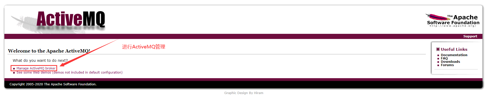
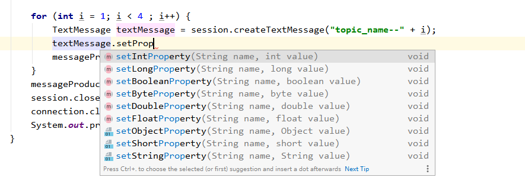
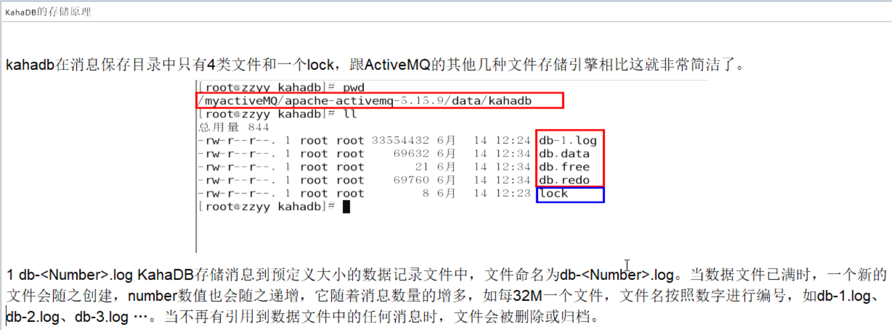
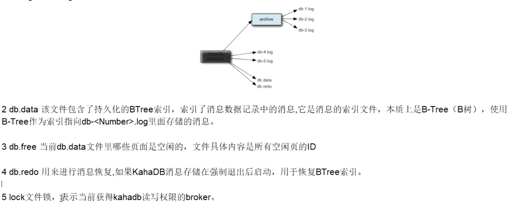
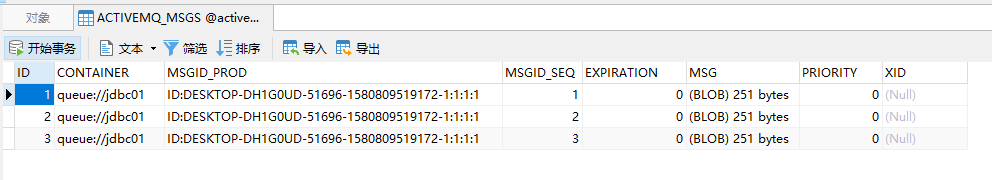
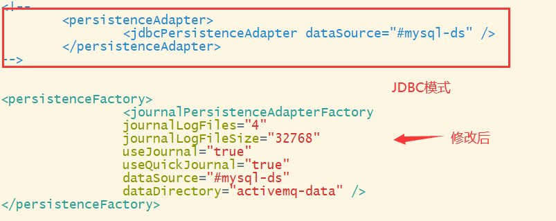

# ActiveMQ笔记

# 1.MQ的定义

面向消息的中间件（message-oriented middleware）MOM能够很好的解决以上问题。是指利用高效可靠的消息传递机制与平台无关的数据交流，并基于数据通信来进行分布式系统的集成。通过提供消息传递和消息排队模型在分布式环境下提供应用解耦，弹性伸缩，冗余存储、流量削峰，异步通信，数据同步等功能。

大致的过程是这样的：发送者把消息发送给消息服务器，消息服务器将消息存放在若干队列/主题topic中，在合适的时候，消息服务器回将消息转发给接受者。在这个过程中，发送和接收是异步的，也就是发送无需等待，而且发送者和接受者的生命周期也没有必然的关系；尤其在发布pub/订阅sub模式下，也可以完成一对多的通信，即让一个消息有多个接受者。


# 2.MQ的特点

## 2.1采用异步处理模式

- 消息发送者可以发送一个消息而无须等待响应。消息发送者将消息发送到一条虚拟的通道（主题或者队列）上；
- 消息接收者则订阅或者监听该通道。一条消息可能最终转发给一个或者多个消息接收者，这些消息接收者都无需对消息发送者做出同步回应。整个过程都是异步的。

**案例：**

也就是说，一个系统跟另一个系统之间进行通信的时候，假如系统A希望发送一个消息给系统B，让他去处理。但是系统A不关注系统B到底怎么处理或者有没有处理好，所以系统A把消息发送给MQ，然后就不管这条消息的“死活了”，接着系统B从MQ里面消费出来处理即可。至于怎么处理，是否处理完毕，什么时候处理，都是系统B的事儿，与系统A无关。

## 2.2应用系统之间解耦

- 发送者和接受者不必了解对方，只需要确认消息。
- 发送者和接受者不必同时在线。

## 2.3整体架构


## 2.4MQ的缺点

- 两个系统之间不能同步调用，不能实时回复，不能响应某个调用的回复。

# 3.ActiveMQ的安装

1. [官网](http://activemq.apache.org/components/classic/download/)下载tar.gz版本MQ
2. 上传到服务器，解压
3. 进入bin目录进行启动

```bash
./activemq start # 启动
./activemq stop # 关闭
./activemq restart # 重启
```

4. 进入conf目录修改`jetty.xml`

```xml
<!--将117行左右的host由127.0.0.1修改为0.0.0.0--> 
<bean id="jettyPort" class="org.apache.activemq.web.WebConsolePort" init-method="start">
   <!-- the default port number for the web console -->
   <property name="host" value="0.0.0.0"/>
   <property name="port" value="8161"/>
</bean>
```

5. ActiveMQ监听端口为61616和8161（后台管理界面，默认账户密码：admin/admin）



# 4.入门案例、MQ标准、API详解

## 4.1项目中的依赖

```xml
<dependencies>
        <!--  activemq  所需要的jar 包-->
        <dependency>
            <groupId>org.apache.activemq</groupId>
            <artifactId>activemq-all</artifactId>
            <version>5.16.0</version>
        </dependency>

        <!--  activemq 和 spring 整合的基础包 -->
        <dependency>
            <groupId>org.apache.xbean</groupId>
            <artifactId>xbean-spring</artifactId>
            <version>3.16</version>
        </dependency>
        <dependency>
            <groupId>junit</groupId>
            <artifactId>junit</artifactId>
            <version>4.11</version>
            <scope>test</scope>
        </dependency>
        <dependency>
            <groupId>org.slf4j</groupId>
            <artifactId>slf4j-api</artifactId>
            <version>1.7.25</version>
        </dependency>
        <dependency>
            <groupId>ch.qos.logback</groupId>
            <artifactId>logback-classic</artifactId>
            <version>1.2.3</version>
        </dependency>
        <dependency>
            <groupId>org.projectlombok</groupId>
            <artifactId>lombok</artifactId>
            <version>1.16.18</version>
            <scope>provided</scope>
        </dependency>

        <!--  broker 的绑定  -->
        <dependency>
            <groupId>com.fasterxml.jackson.core</groupId>
            <artifactId>jackson-databind</artifactId>
            <version>2.9.10.4</version>
        </dependency>

        <!--  activeMQ  jms 的支持  -->
        <dependency>
            <groupId>org.springframework</groupId>
            <artifactId>spring-jms</artifactId>
            <version>4.3.23.RELEASE</version>
        </dependency>
        <dependency>    <!--  pool 池化包相关的支持  -->
            <groupId>org.apache.activemq</groupId>
            <artifactId>activemq-pool</artifactId>
            <version>5.15.9</version>
        </dependency>

        <!--  aop 相关的支持  -->
        <dependency>
            <groupId>org.springframework</groupId>
            <artifactId>spring-core</artifactId>
            <version>4.3.23.RELEASE</version>
        </dependency>
        <dependency>
            <groupId>org.springframework</groupId>
            <artifactId>spring-context</artifactId>
            <version>4.3.23.RELEASE</version>
        </dependency>

    </dependencies>
```

## 4.2JMS编码总体规范


## 4.2队列消息生产者入门案例

```java
import org.apache.activemq.ActiveMQConnectionFactory;
import javax.jms.*;

public class JmsProduce {
    //  linux 上部署的activemq 的 IP 地址 + activemq 的端口号
    public static final String ACTIVEMQ_URL = "tcp://118.24.20.3:61626";
    // 目的地的名称
    public static final String QUEUE_NAME = "jdbc01";

    public static void main(String[] args) throws  Exception{
        // 1 按照给定的url创建连接工厂，这个构造器采用默认的用户名密码。该类的其他构造方法可以指定用户名和密码。
        ActiveMQConnectionFactory activeMQConnectionFactory = new ActiveMQConnectionFactory(ACTIVEMQ_URL);
        // 2 通过连接工厂，获得连接 connection 并启动访问。
        Connection connection = activeMQConnectionFactory.createConnection();
        connection.start();
        // 3 创建会话session 。第一参数是是否开启事务， 第二参数是消息签收的方式
        Session session = connection.createSession(false,Session.AUTO_ACKNOWLEDGE);
        // 4 创建目的地（两种 ：队列/主题）。Destination是Queue和Topic的父类
        Queue queue = session.createQueue(QUEUE_NAME);
        // 5 创建消息的生产者
        MessageProducer messageProducer = session.createProducer(queue);
        // 6 通过messageProducer 生产 3 条 消息发送到消息队列中
        for (int i = 1; i < 4 ; i++) {
            // 7  创建消息
            TextMessage textMessage = session.createTextMessage("msg--" + i);
            // 8  通过messageProducer发送给mq
            messageProducer.send(textMessage);
        }
        // 9 关闭资源
        messageProducer.close();
        session.close();
        connection.close();
        System.out.println("  **** 消息发送到MQ完成 ****");
    }
}

```

## 4.3ActiveMQ控制台之队列


1. Number Of Pending Messages：
   - 等待消费的消息，这个是未出队列的数量，公式=总接收数-总出队列数。
2. Number Of Consumers：
   - 消费者数量，消费者端的消费者数量。
3. Messages Enqueued：
   - 进队消息数，进队列的总消息量，包括出队列的。这个数只增不减。
4. Messages Dequeued：
   - 出队消息数，可以理解为是消费者消费掉的数量。

 

- **总结：**
  - 当有一个消息进入这个队列时，等待消费的消息是1，进入队列的消息是1。
  - 当消息消费后，等待消费的消息是0，进入队列的消息是1，出队列的消息是1。
  - 当再来一条消息时，等待消费的消息是1，进入队列的消息就是2。

## 4.4队列消息消费者的入门案例

```java
import org.apache.activemq.ActiveMQConnectionFactory;
import javax.jms.*;

// 消息的消费者
public class JmsConsumer {

    public static final String ACTIVEMQ_URL = "tcp://118.24.20.3:61626";
    public static final String QUEUE_NAME = "jdbc01";

    public static void main(String[] args) throws Exception{
        ActiveMQConnectionFactory activeMQConnectionFactory = new ActiveMQConnectionFactory(ACTIVEMQ_URL);
        javax.jms.Connection connection = activeMQConnectionFactory.createConnection();
        connection.start();
        Session session = connection.createSession(false, Session.AUTO_ACKNOWLEDGE);
        Queue queue = session.createQueue(QUEUE_NAME);
        // 5 创建消息的消费者
        MessageConsumer messageConsumer = session.createConsumer(queue);
        while(true){
            // reveive() 一直等待接收消息，在能够接收到消息之前将一直阻塞。 是同步阻塞方式 。和socket的accept方法类似的。
// reveive(Long time) : 等待n毫秒之后还没有收到消息，就是结束阻塞。
            // 因为消息发送者是 TextMessage，所以消息接受者也要是TextMessage
            TextMessage message = (TextMessage)messageConsumer.receive(); 
            if (null != message){
                System.out.println("****消费者的消息："+message.getText());
            }else {
                break;
            }
        }
        messageConsumer.close();
        session.close();
        connection.close();
    }
}
```

## 4.5异步监听式消费者（MessageListener）

```java
import org.apache.activemq.ActiveMQConnectionFactory;
import javax.jms.*;
// 消息的消费者  也就是回答消息的系统
public class JmsConsumer {
    public static final String ACTIVEMQ_URL = "tcp://118.24.20.3:61626";
    public static final String QUEUE_NAME = "jdbc01";
    public static void main(String[] args) throws Exception{
        ActiveMQConnectionFactory activeMQConnectionFactory = new ActiveMQConnectionFactory(ACTIVEMQ_URL);
        javax.jms.Connection connection = activeMQConnectionFactory.createConnection();
        connection.start();
        Session session = connection.createSession(false, Session.AUTO_ACKNOWLEDGE);
        Queue queue = session.createQueue(QUEUE_NAME);
        MessageConsumer messageConsumer = session.createConsumer(queue);

        /* 通过监听的方式来消费消息，是异步非阻塞的方式消费消息。
           通过messageConsumer 的setMessageListener 注册一个监听器，当有消息发送来时，系统自动调用MessageListener 的 onMessage 方法处理消息
         */
        messageConsumer.setMessageListener(new MessageListener() {
            public void onMessage(Message message)  {
//  instanceof 判断是否A对象是否是B类的子类
                    if (null != message  && message instanceof TextMessage){
                        TextMessage textMessage = (TextMessage)message;
                        try {
                            System.out.println("****消费者的消息："+textMessage.getText());
                        }catch (JMSException e) {
                            e.printStackTrace();
                        }
                }
            }
        });
        // 让主线程不要结束。因为一旦主线程结束了，其他的线程（如此处的监听消息的线程）也都会被迫结束。
        // 实际开发中，我们的程序会一直运行，这句代码都会省略。
        System.in.read();
        messageConsumer.close();
        session.close();
        connection.close();
    }
}
```

## 4.6队列消息（Queue）总结

### 4.6.1**两种消费方式**

- **同步阻塞方式**​ **(receive)**

订阅者或接收者抵用MessageConsumer的receive()方法来接收消息，receive方法在能接收到消息之前（或超时之前）将一直阻塞。

- **异步非阻塞方式（监听器**​******onMessage()******​ **）**

订阅者或接收者通过MessageConsumer的setMessageListener(MessageListener listener)注册一个消息监听器，当消息到达之后，系统会自动调用监听器MessageListener的onMessage(Message message)方法。

### 4.6.2**队列的特点**


### 4.6.3消息消费情况


- **情况**​******1******​ **：只启动消费者**​******1******​ **。**

结果：消费者1会消费所有的数据。

- **情况2：先启动消费者1，再启动消费者2。**

结果：消费者1消费所有的数据。消费者2不会消费到消息。

- **情况3：生产者发布6条消息，在此之前已经启动了消费者1和消费者2。**

结果：消费者1和消费者2平摊了消息。各自消费3条消息。

## 4.7Topic介绍、入门案例、控制台

在发布订阅消息传递域中，目的地被称为主题（topic）

发布/订阅消息传递域的特点如下：

（1）生产者将消息发布到topic中，每个消息可以有多个消费者，属于1：N的关系；

（2）生产者和消费者之间有时间上的相关性。订阅某一个主题的消费者只能消费自它订阅之后发布的消息。

（3）生产者生产时，topic不保存消息它是无状态的不落地，假如无人订阅就去生产，那就是一条废消息，所以，一般先启动消费者再启动生产者。

### 4.7.1生产者案例

```java
import org.apache.activemq.ActiveMQConnectionFactory;
import javax.jms.*;
public class JmsProduce_Topic {
    public static final String ACTIVEMQ_URL = "tcp://192.168.2.128:61616";
    public static final String TOPIC_NAME = "topic01";
    public static void main(String[] args) throws JMSException {
        ActiveMQConnectionFactory activeMQConnectionFactory = new ActiveMQConnectionFactory(ACTIVEMQ_URL);
        Connection connection = activeMQConnectionFactory.createConnection();
        connection.start();
        Session session = connection.createSession(false, Session.AUTO_ACKNOWLEDGE);
        Topic topic = session.createTopic(TOPIC_NAME);
        MessageProducer producer = session.createProducer(topic);
        for (int i = 0; i < 3; i++) {
            TextMessage textMessage = session.createTextMessage("topic01订阅MessageListener---" + i);
            producer.send(textMessage);

        }
        producer.close();
        session.close();
        connection.close();
        System.out.println("**********消息发布成功");
    }
}
```

### 4.7.2消费者案例

```java
import org.apache.activemq.ActiveMQConnectionFactory;
import javax.jms.*;
import java.io.IOException;
public class JmsConsumer_Topic {
    public static final String ACTIVEMQ_URL = "tcp://192.168.2.128:61616";
    public static final String TOPIC_NAME = "topic01";
    public static void main(String[] args) throws JMSException, IOException {
        System.out.println("我是三号消费者");
        ActiveMQConnectionFactory activeMQConnectionFactory = new ActiveMQConnectionFactory(ACTIVEMQ_URL);
        Connection connection = activeMQConnectionFactory.createConnection();
        connection.start();
        Session session = connection.createSession(false, Session.AUTO_ACKNOWLEDGE);
        Topic topic = session.createTopic(TOPIC_NAME);
        MessageConsumer consumer = session.createConsumer(topic);
        consumer.setMessageListener(message -> {
            if (message instanceof TextMessage) {
                try {
                    TextMessage textMessage = (TextMessage) message;
                    System.out.println("收到消息****" + textMessage.getText());
                } catch (JMSException e) {
                    e.printStackTrace();
                }
            }
        });
        System.in.read();
        consumer.close();
        session.close();
        connection.close();
    }
}
```

### 4.7.3ActiveMQ控制台

topic有多个消费者时，消费消息的数量≈ 在线消费者数量*生产消息的数量。

下图展示了：我们先启动了3个消费者，再启动一个生产者，并生产了3条消息。


## 4.8Topic和Queue对比


# 5.JMS规范

## 5.1JMS是什么

Java消息服务指的是两个应用程序之间进行异步通信的API，它为标准协议和消息服务提供了一组通用接口，包括创建、发送、读取消息等，用于支持Java应用程序开发。在JavaEE中，当两个应用程序使用JMS进行通信时，它们之间不是直接相连的，而是通过一个共同的消息收发服务组件关联起来以达到解耦/异步削峰的效果。


## 5.2JMS消息头

1. ：消息目的地
2. ：消息持久化模式
3. ：消息过期时间
4. ：消息的优先级
5. ：消息的唯一标识符。后面我们会介绍如何解决幂等性。

 ****​**说明：**​ **** 方法里面也可以设置。

```java
import org.apache.activemq.ActiveMQConnectionFactory;
import javax.jms.*;
public class JmsProduce_topic {
    public static final String ACTIVEMQ_URL = "tcp://118.24.20.3:61626";
    public static final String TOPIC_NAME = "topic01";

    public static void main(String[] args) throws  Exception{
        ActiveMQConnectionFactory activeMQConnectionFactory = new ActiveMQConnectionFactory(ACTIVEMQ_URL);
        Connection connection = activeMQConnectionFactory.createConnection();
        connection.start();
        Session session = connection.createSession(false, Session.AUTO_ACKNOWLEDGE);
        Topic topic = session.createTopic(TOPIC_NAME);
        MessageProducer messageProducer = session.createProducer(topic);

        for (int i = 1; i < 4 ; i++) {
            TextMessage textMessage = session.createTextMessage("topic_name--" + i);
            // 这里可以指定每个消息的目的地
            textMessage.setJMSDestination(topic);
            /*
            持久模式和非持久模式。
            一条持久性的消息：应该被传送“一次仅仅一次”，这就意味着如果JMS提供者出现故障，该消息并不会丢失，它会在服务器恢复之后再次传递。
            一条非持久的消息：最多会传递一次，这意味着服务器出现故障，该消息将会永远丢失。
             */
            textMessage.setJMSDeliveryMode(0);
            /*
            可以设置消息在一定时间后过期，默认是永不过期。
            消息过期时间，等于Destination的send方法中的timeToLive值加上发送时刻的GMT时间值。
            如果timeToLive值等于0，则JMSExpiration被设为0，表示该消息永不过期。
            如果发送后，在消息过期时间之后还没有被发送到目的地，则该消息被清除。
             */
            textMessage.setJMSExpiration(1000);
            /*  消息优先级，从0-9十个级别，0-4是普通消息5-9是加急消息。
            JMS不要求MQ严格按照这十个优先级发送消息但必须保证加急消息要先于普通消息到达。默认是4级。
             */
            textMessage.setJMSPriority(10);
            // 唯一标识每个消息的标识。MQ会给我们默认生成一个，我们也可以自己指定。
            textMessage.setJMSMessageID("ABCD");
            // 上面有些属性在send方法里也能设置
            messageProducer.send(textMessage);
        }
        messageProducer.close();
        session.close();
        connection.close();
        System.out.println("  **** TOPIC_NAME消息发送到MQ完成 ****");
    }
}
```

## 5.3消息体

消息体用来封装具体的消息数据，总共有5中消息格式，发送和接收的消息类型必须一致对应

**5中消息格式：**


下面我们演示TextMessage和MapMessage的用法。

**生产者：**

```java
import org.apache.activemq.ActiveMQConnectionFactory;
import javax.jms.*;

public class JmsProduce_topic {

    public static final String ACTIVEMQ_URL = "tcp://118.24.20.3:61626";
    public static final String TOPIC_NAME = "topic01";

    public static void main(String[] args) throws  Exception{
        ActiveMQConnectionFactory activeMQConnectionFactory = new ActiveMQConnectionFactory(ACTIVEMQ_URL);
         javax.jms.Connection connection = activeMQConnectionFactory.createConnection();
         connection.start();
        Session session = connection.createSession(false, Session.AUTO_ACKNOWLEDGE);
        Topic topic = session.createTopic(TOPIC_NAME);
        MessageProducer messageProducer = session.createProducer(topic);

        for (int i = 1; i < 4 ; i++) {
// 发送TextMessage消息体
            TextMessage textMessage = session.createTextMessage("topic_name--" + i);
            messageProducer.send(textMessage);
            // 发送MapMessage  消息体。set方法: 添加，get方式：获取
            MapMessage  mapMessage = session.createMapMessage();
            mapMessage.setString("name", "张三"+i);
            mapMessage.setInt("age", 18+i);
            messageProducer.send(mapMessage);
        }
        messageProducer.close();
        session.close();
        connection.close();
        System.out.println("  **** TOPIC_NAME消息发送到MQ完成 ****");
    }
}
```

**消费者：**

```java
import org.apache.activemq.ActiveMQConnectionFactory;
import javax.jms.*;

public class JmsConsummer_topic {
    public static final String ACTIVEMQ_URL = "tcp://118.24.20.3:61626";
    public static final String TOPIC_NAME = "topic01";

    public static void main(String[] args) throws Exception{
        ActiveMQConnectionFactory activeMQConnectionFactory = new ActiveMQConnectionFactory(ACTIVEMQ_URL);
        javax.jms.Connection connection = activeMQConnectionFactory.createConnection();
        connection.start();
        Session session = connection.createSession(false, Session.AUTO_ACKNOWLEDGE);
        Topic topic = session.createTopic(TOPIC_NAME);
        MessageConsumer messageConsumer = session.createConsumer(topic);

        messageConsumer.setMessageListener( (message) -> {
 // 判断消息是哪种类型之后，再强转。
            if (null != message  && message instanceof TextMessage){
                   TextMessage textMessage = (TextMessage)message;
                    try {
                      System.out.println("****消费者text的消息："+textMessage.getText());
                    }catch (JMSException e) {
                    }
                }
            if (null != message  && message instanceof MapMessage){
                MapMessage mapMessage = (MapMessage)message;
                try {
                    System.out.println("****消费者的map消息："+mapMessage.getString("name"));
                    System.out.println("****消费者的map消息："+mapMessage.getInt("age"));
                }catch (JMSException e) {
                }
            }

        });
        System.in.read();
        messageConsumer.close();
        session.close();
        connection.close();
    }
}
```

## 5.4消息属性

如果需要除消息头字段之外的值，那么可以使用消息属性。他是识别/去重/重点标注等操作，非常有用的方法。

他们是以属性名和属性值对的形式制定的。可以将属性是为消息头得扩展，属性指定一些消息头没有包括的附加信息，比如可以在属性里指定消息选择器。消息的属性就像可以分配给一条消息的附加消息头一样。它们允许开发者添加有关消息的不透明附加信息。它们还用于暴露消息选择器在消息过滤时使用的数据。

下图是设置消息属性的API：



## 5.5消息持久化

什么是持久化消息？

保证消息只被传送一次和成功使用一次。在持久性消息传送至目标时，消息服务将其放入持久性数据存储。如果消息服务由于某种原因导致失败，它可以恢复此消息并将此消息传送至相应的消费者。虽然这样增加了消息传送的开销，但却增加了可靠性。

我的理解：在消息生产者将消息成功发送给MQ消息中间件之后。无论是出现任何问题，如：MQ服务器宕机、消费者掉线等。都保证（topic要之前注册过，queue不用）消息消费者，能够成功消费消息。如果消息生产者发送消息就失败了，那么消费者也不会消费到该消息。

### 5.5.1queue消息非持久和持久

queue非持久，当服务器宕机，消息不存在（消息丢失了）。

queue持久化，当服务器宕机，消息依然存在。queue消息默认是持久化的。

持久化消息，保证这些消息只被传送一次和成功使用一次。对于这些消息，可靠性是优先考虑的因素。

可靠性的另一个重要方面是确保持久性消息传送至目标后，消息服务在向消费者传送它们之前不会丢失这些消息。


### 5.5.2topic消息的持久化和非持久化

topic默认就是非持久化的，因为生产者生产消息时，消费者也要在线，这样消费者才能消费到消息。

topic消息持久化，只要消费者向MQ服务器注册过，所有生产者发布成功的消息，该消费者都能收到，不管是MQ服务器宕机还是消费者不在线。

**注意：**

1. 一定要先运行一次消费者，等于向MQ注册，类似我订阅了这个主题。
2. 然后再运行生产者发送消息。
3. 之后无论消费者是否在线，都会收到消息。如果不在线的话，下次连接的时候，会把没有收过的消息都接收过来。

**topic持久化生产者代码：**

```java
import org.apache.activemq.ActiveMQConnectionFactory;
import javax.jms.*;

// 持久化topic 的消息生产者
public class JmsProduce_persistence {

    public static final String ACTIVEMQ_URL = "tcp://192.168.17.3:61616";
    public static final String TOPIC_NAME = "topic01";

    public static void main(String[] args) throws  Exception{
        ActiveMQConnectionFactory activeMQConnectionFactory = new ActiveMQConnectionFactory(ACTIVEMQ_URL);
        javax.jms.Connection connection = activeMQConnectionFactory.createConnection();
        Session session = connection.createSession(false, Session.AUTO_ACKNOWLEDGE);
        Topic topic = session.createTopic(TOPIC_NAME);
        MessageProducer messageProducer = session.createProducer(topic);

        // 设置持久化topic 
        messageProducer.setDeliveryMode(DeliveryMode.PERSISTENT);
        // 设置持久化topic之后再，启动连接
        connection.start();
        for (int i = 1; i < 4 ; i++) {
            TextMessage textMessage = session.createTextMessage("topic_name--" + i);
            messageProducer.send(textMessage);
            MapMessage mapMessage = session.createMapMessage();
        }
        messageProducer.close();
        session.close();
        connection.close();
        System.out.println("  **** TOPIC_NAME消息发送到MQ完成 ****");
    }
}
```

**topic持久化消费者代码：**

```java
import org.apache.activemq.ActiveMQConnectionFactory;
import javax.jms.*;

// 持久化topic 的消息消费者
public class JmsConsummer_persistence {
    public static final String ACTIVEMQ_URL = "tcp://192.168.17.3:61616";
    public static final String TOPIC_NAME = "topic01";

    public static void main(String[] args) throws Exception{
        ActiveMQConnectionFactory activeMQConnectionFactory = new ActiveMQConnectionFactory(ACTIVEMQ_URL);
        Connection connection = activeMQConnectionFactory.createConnection();
// 设置客户端ID。向MQ服务器注册自己的名称
        connection.setClientID("marrry");
        Session session = connection.createSession(false, Session.AUTO_ACKNOWLEDGE);
        Topic topic = session.createTopic(TOPIC_NAME);
// 创建一个topic订阅者对象。一参是topic，二参是订阅者名称
        TopicSubscriber topicSubscriber = session.createDurableSubscriber(topic,"remark...");
         // 之后再开启连接
        connection.start();
        Message message = topicSubscriber.receive();
         while (null != message){
             TextMessage textMessage = (TextMessage)message;
             System.out.println(" 收到的持久化 topic ："+textMessage.getText());
             message = topicSubscriber.receive();
         }
        session.close();
        connection.close();
    }
}
```

**控制台介绍：**

topic页面还是和之前的一样。另外在subscribers页面也会显示。如下：


## 5.6消息的事务性


1. 生产者开启事务后，执行commit方法，这批消息才真正的被提交。不执行commit方法，这批消息不会提交。执行rollback方法，之前的消息会回滚掉。生产者的事务机制，要高于签收机制，当生产者开启事务，签收机制不再重要。
2. 消费者开启事务后，执行commit方法，这批消息才算真正的被消费。不执行commit方法，这些消息不会标记已消费，下次还会被消费。执行rollback方法，是不能回滚之前执行过的业务逻辑，但是能够回滚之前的消息，回滚后的消息，下次还会被消费。消费者利用commit和rollback方法，甚至能够违反一个消费者只能消费一次消息的原理。
3. 问：消费者和生产者需要同时操作事务才行吗？

答：消费者和生产者的事务，完全没有关联，各自是各自的事务。

**生产者代码：**

```java
import org.apache.activemq.ActiveMQConnectionFactory;
import javax.jms.*;

public class Jms_TX_Producer {
    private static final String ACTIVEMQ_URL = "tcp://192.168.10.130:61616";
    private static final String ACTIVEMQ_QUEUE_NAME = "Queue-TX";

    public static void main(String[] args) throws JMSException {
        ActiveMQConnectionFactory activeMQConnectionFactory = new ActiveMQConnectionFactory(ACTIVEMQ_URL);
        Connection connection = activeMQConnectionFactory.createConnection();
        connection.start();
        //1.创建会话session，两个参数transacted=事务,acknowledgeMode=确认模式(签收)
        //设置为开启事务
        Session session = connection.createSession(true, Session.AUTO_ACKNOWLEDGE);
        Queue queue = session.createQueue(ACTIVEMQ_QUEUE_NAME);
        MessageProducer producer = session.createProducer(queue);
        try {
            for (int i = 0; i < 3; i++) {
                TextMessage textMessage = session.createTextMessage("tx msg--" + i);
              producer.send(textMessage);
if(i == 2){
                    throw new RuntimeException("GG.....");
                }
            }
            // 2. 开启事务后，使用commit提交事务，这样这批消息才能真正的被提交。
            session.commit();
            System.out.println("消息发送完成");
        } catch (Exception e) {
            System.out.println("出现异常,消息回滚");
            // 3. 工作中一般，当代码出错，我们在catch代码块中回滚。这样这批发送的消息就能回滚。
            session.rollback();
        } finally {
            //4. 关闭资源
            producer.close();
            session.close();
            connection.close();
        }
    }
}
```

**消费者代码：**

```java
import org.apache.activemq.ActiveMQConnectionFactory;
import javax.jms.*;
import java.io.IOException;

public class Jms_TX_Consumer {
    private static final String ACTIVEMQ_URL = "tcp://118.24.20.3:61626";
    private static final String ACTIVEMQ_QUEUE_NAME = "Queue-TX";

    public static void main(String[] args) throws JMSException, IOException {
        ActiveMQConnectionFactory activeMQConnectionFactory = new ActiveMQConnectionFactory(ACTIVEMQ_URL);
        Connection connection = activeMQConnectionFactory.createConnection();
        connection.start();
        // 创建会话session，两个参数transacted=事务,acknowledgeMode=确认模式(签收)
        // 消费者开启了事务就必须手动提交，不然会重复消费消息
        final Session session = connection.createSession(true, Session.AUTO_ACKNOWLEDGE);
        Queue queue = session.createQueue(ACTIVEMQ_QUEUE_NAME);
        MessageConsumer messageConsumer = session.createConsumer(queue);
        messageConsumer.setMessageListener(new MessageListener() {
            int a = 0;
            @Override
            public void onMessage(Message message) {
                if (message instanceof TextMessage) {
                    try {
                        TextMessage textMessage = (TextMessage) message;
                        System.out.println("***消费者接收到的消息:   " + textMessage.getText());
                        if(a == 0){
                            System.out.println("commit");
                            session.commit();
                        }
                        if (a == 2) {
                            System.out.println("rollback");
                            session.rollback();
                        }
                        a++;
                    } catch (Exception e) {
                        System.out.println("出现异常，消费失败，放弃消费");
                        try {
                            session.rollback();
                        } catch (JMSException ex) {
                            ex.printStackTrace();
                        }
                    }
                }
            }
        });
        //关闭资源
        System.in.read();
        messageConsumer.close();
        session.close();
        connection.close();
    }
}

```

## 5.7消息的签收机制

### 1、消息的签收方式

①　自动签收（Session.AUTO_ACKNOWLEDGE）：该方式是默认的。该种方式，无需我们程序做任何操作，框架会帮我们自动签收收到的消息。

②　手动签收（Session.CLIENT_ACKNOWLEDGE）：手动签收。该种方式，需要我们手动调用Message.acknowledge()，来签收消息。如果不签收消息，该消息会被我们反复消费，只到被签收。

③　允许重复消息（Session.DUPS_OK_ACKNOWLEDGE）：多线程或多个消费者同时消费到一个消息，因为线程不安全，可能会重复消费。该种方式很少使用到。

④　事务下的签收（Session.SESSION_TRANSACTED）：开始事务的情况下，可以使用该方式。该种方式很少使用到。

### 2、事务和签收的关系

①　在事务性会话中，当一个事务被成功提交则消息被自动签收。如果事务回滚，则消息会被再次传送。事务优先于签收，开始事务后，签收机制不再起任何作用。

②　非事务性会话中，消息何时被确认取决于创建会话时的应答模式。

③　生产者事务开启，只有commit后才能将全部消息变为已消费。

④　事务偏向生产者，签收偏向消费者。也就是说，生产者使用事务更好点，消费者使用签收机制更好点。

**生产者代码：**

```java
import org.apache.activemq.ActiveMQConnectionFactory;
import javax.jms.*;

public class Jms_TX_Producer {

    private static final String ACTIVEMQ_URL = "tcp://118.24.20.3:61626";
    private static final String ACTIVEMQ_QUEUE_NAME = "Queue-ACK";

    public static void main(String[] args) throws JMSException {
        ActiveMQConnectionFactory activeMQConnectionFactory = new ActiveMQConnectionFactory(ACTIVEMQ_URL);
        Connection connection = activeMQConnectionFactory.createConnection();
        connection.start();
        Session session = connection.createSession(false, Session.AUTO_ACKNOWLEDGE);
        Queue queue = session.createQueue(ACTIVEMQ_QUEUE_NAME);
        MessageProducer producer = session.createProducer(queue);
        try {
            for (int i = 0; i < 3; i++) {
                TextMessage textMessage = session.createTextMessage("tx msg--" + i);
                producer.send(textMessage);
            }
            System.out.println("消息发送完成");
        } catch (Exception e) {
            e.printStackTrace();
        } finally {
            producer.close();
            session.close();
            connection.close();
        }
    }
}
```

**消费者代码：**

```java
import org.apache.activemq.ActiveMQConnectionFactory;
import javax.jms.*;
import java.io.IOException;

public class Jms_TX_Consumer {
    private static final String ACTIVEMQ_URL = "tcp://118.24.20.3:61626";
    private static final String ACTIVEMQ_QUEUE_NAME = "Queue-ACK";

    public static void main(String[] args) throws JMSException, IOException {
        ActiveMQConnectionFactory activeMQConnectionFactory = new ActiveMQConnectionFactory(ACTIVEMQ_URL);
        Connection connection = activeMQConnectionFactory.createConnection();
        connection.start();
        Session session = connection.createSession(false, Session.CLIENT_ACKNOWLEDGE);
        Queue queue = session.createQueue(ACTIVEMQ_QUEUE_NAME);
        MessageConsumer messageConsumer = session.createConsumer(queue);
        messageConsumer.setMessageListener(new MessageListener() {
            @Override
            public void onMessage(Message message) {
                if (message instanceof TextMessage) {
                    try {
                        TextMessage textMessage = (TextMessage) message;
                        System.out.println("***消费者接收到的消息:   " + textMessage.getText());
                        /* 设置为Session.CLIENT_ACKNOWLEDGE后，要调用该方法，标志着该消息已被签收（消费）。
                            如果不调用该方法，该消息的标志还是未消费，下次启动消费者或其他消费者还会收到改消息。
                         */
                        textMessage.acknowledge();
                    } catch (Exception e) {
                        System.out.println("出现异常，消费失败，放弃消费");
                    }
                }
            }
        });
        System.in.read();
        messageConsumer.close();
        session.close();
        connection.close();
    }
}
```

## 5.8JMS点对点总结

点对点模型是基于队列的，生产者发消息到队列，消费者从队列接收消息，队列的存在使得消息的异步传输成为可能。和我们平时给朋友发送短信类似。

如果在Session关闭时有部分消息己被收到但还没有被签收(acknowledged),那当消费者下次连接到相同的队列时，这些消息还会被再次接收

队列可以长久地保存消息直到消费者收到消息。消费者不需要因为担心消息会丢失而时刻和队列保持激活的连接状态，充分体现了异步传输模式的优势

## 5.9JMS发布订阅总结

(1)JMS的发布订阅总结

JMS Pub/Sub 模型定义了如何向一个内容节点发布和订阅消息，这些节点被称作topic。

主题可以被认为是消息的传输中介，发布者（publisher）发布消息到主题，订阅者（subscribe）从主题订阅消息。

主题使得消息订阅者和消息发布者保持互相独立不需要解除即可保证消息的传送

(2)非持久订阅

非持久订阅只有当客户端处于激活状态，也就是和MQ保持连接状态才能收发到某个主题的消息。

如果消费者处于离线状态，生产者发送的主题消息将会丢失作废，消费者永远不会收到。

    一句话：先订阅注册才能接受到发布，只给订阅者发布消息。

(3)持久订阅

客户端首先向MQ注册一个自己的身份ID识别号，当这个客户端处于离线时，生产者会为这个ID保存所有发送到主题的消息，当客户再次连接到MQ的时候，会根据消费者的ID得到所有当自己处于离线时发送到主题的消息

当持久订阅状态下，不能恢复或重新派送一个未签收的消息。

持久订阅才能恢复或重新派送一个未签收的消息。

(4)非持久和持久化订阅如何选择

当所有的消息必须被接收，则用持久化订阅。当消息丢失能够被容忍，则用非持久订阅。

# 6.Spring、Springboot整合ActiveMQ

## 6.1Spring整合ActiveMQ

**pom文件依赖**

```xml
<dependencies>
        <!--  activemq  所需要的jar 包-->
        <dependency>
            <groupId>org.apache.activemq</groupId>
            <artifactId>activemq-all</artifactId>
            <version>5.16.0</version>
        </dependency>

        <!--  activemq 和 spring 整合的基础包 -->
        <dependency>
            <groupId>org.apache.xbean</groupId>
            <artifactId>xbean-spring</artifactId>
            <version>3.16</version>
        </dependency>
        <dependency>
            <groupId>junit</groupId>
            <artifactId>junit</artifactId>
            <version>4.11</version>
            <scope>test</scope>
        </dependency>
        <dependency>
            <groupId>org.slf4j</groupId>
            <artifactId>slf4j-api</artifactId>
            <version>1.7.25</version>
        </dependency>
        <dependency>
            <groupId>ch.qos.logback</groupId>
            <artifactId>logback-classic</artifactId>
            <version>1.2.3</version>
        </dependency>
        <dependency>
            <groupId>org.projectlombok</groupId>
            <artifactId>lombok</artifactId>
            <version>1.16.18</version>
            <scope>provided</scope>
        </dependency>

        <!--  broker 的绑定  -->
        <dependency>
            <groupId>com.fasterxml.jackson.core</groupId>
            <artifactId>jackson-databind</artifactId>
            <version>2.9.10.4</version>
        </dependency>

        <!--  activeMQ  jms 的支持  -->
        <dependency>
            <groupId>org.springframework</groupId>
            <artifactId>spring-jms</artifactId>
            <version>4.3.23.RELEASE</version>
        </dependency>
        <dependency>    <!--  pool 池化包相关的支持  -->
            <groupId>org.apache.activemq</groupId>
            <artifactId>activemq-pool</artifactId>
            <version>5.15.9</version>
        </dependency>

        <!--  aop 相关的支持  -->
        <dependency>
            <groupId>org.springframework</groupId>
            <artifactId>spring-core</artifactId>
            <version>4.3.23.RELEASE</version>
        </dependency>
        <dependency>    
            <groupId>org.springframework</groupId>
            <artifactId>spring-context</artifactId>
            <version>4.3.23.RELEASE</version>
        </dependency>

    </dependencies>
```

**配置文件中配置相关been**

```xml
<!--  开启包的自动扫描  -->
<context:component-scan base-package="com.activemq.demo"/>
<!--  配置生产者  -->
<bean id="connectionFactory" class="org.apache.activemq.pool.PooledConnectionFactory" destroy-method="stop">
  <property name="connectionFactory">
    <!--      正真可以生产Connection的ConnectionFactory,由对应的JMS服务商提供      -->
    <bean class="org.apache.activemq.spring.ActiveMQConnectionFactory">
      <property name="brokerURL" value="tcp://192.168.10.130:61616"/>
    </bean>
  </property>
  <property name="maxConnections" value="100"/>
</bean>

<!--  这个是队列目的地,点对点的Queue  -->
<bean id="destinationQueue" class="org.apache.activemq.command.ActiveMQQueue">
  <!--    通过构造注入Queue名    -->
  <constructor-arg index="0" value="spring-active-queue"/>
</bean>

<!--  这个是队列目的地,  发布订阅的主题Topic-->
<bean id="destinationTopic" class="org.apache.activemq.command.ActiveMQTopic">
  <constructor-arg index="0" value="spring-active-topic"/>
</bean>

<!--  Spring提供的JMS工具类,他可以进行消息发送,接收等  -->
<bean id="jmsTemplate" class="org.springframework.jms.core.JmsTemplate">
  <!--    传入连接工厂    -->
  <property name="connectionFactory" ref="connectionFactory"/>
  <!--    传入目的地    -->
  <property name="defaultDestination" ref="destinationQueue"/>
  <!--    消息自动转换器    -->
  <property name="messageConverter">
    <bean class="org.springframework.jms.support.converter.SimpleMessageConverter"/>
  </property>
</bean>
```

**生产者代码**

```java
public static void main(String[] args) {
        ApplicationContext applicationContext = new ClassPathXmlApplicationContext("spring-activemq.xml");
        SpringProduce springMQ_producer = applicationContext.getBean(SpringProduce.class);
        springMQ_producer.jmsTemplate.send(
                new MessageCreator() {
                    public Message createMessage(Session session) throws JMSException {
                        return session.createTextMessage("***Spring和ActiveMQ的整合case111.....");
                    }
                }
        );
        System.out.println("********send task over");
    }

```

**消费者代码**

```java
public static void main(String[] args) {
    ApplicationContext ctx = new ClassPathXmlApplicationContext("applicationContext.xml");
    SpringMQ_Consume consume = (SpringMQ_Consume) ctx.getBean("springMQ_Consume");
    String msg = (String) consume.jmsTemplate.receiveAndConvert();
    System.out.println(msg);
}
```

## 6.2Springboot整合ActiveMQ

**pom文件**

```xml
<dependencies>
  <dependency>
    <groupId>org.springframework.boot</groupId>
    <artifactId>spring-boot-starter-test</artifactId>
    <scope>test</scope>
  </dependency>
  <dependency>
    <groupId>org.springframework.boot</groupId>
    <artifactId>spring-boot-starter-web</artifactId>
  </dependency>

  <dependency>
    <groupId>org.springframework.boot</groupId>
    <artifactId>spring-boot-starter</artifactId>
  </dependency>
  <!--spring boot整合activemq的jar包-->
  <dependency>
    <groupId>org.springframework.boot</groupId>
    <artifactId>spring-boot-starter-activemq</artifactId>
    <version>2.1.5.RELEASE</version>
  </dependency>
  <dependency>
    <groupId>org.springframework.boot</groupId>
    <artifactId>spring-boot-starter</artifactId>
  </dependency>

  <dependency>
    <groupId>org.springframework.boot</groupId>
    <artifactId>spring-boot-starter-test</artifactId>
    <scope>test</scope>
    <exclusions>
      <exclusion>
        <groupId>org.junit.vintage</groupId>
        <artifactId>junit-vintage-engine</artifactId>
      </exclusion>
    </exclusions>
  </dependency>
</dependencies>
```

**配置文件**

```plain
server.port=8777
spring.activemq.broker-url=tcp://192.168.2.128:61616
spring.activemq.user=admin
spring.activemq.password=admin
# 是否为发布订阅者模式
spring.jms.pub-sub-domain=false
# 队列名
myQueue=boot-activemq-queue
```

**配置类**

```java
@Configuration
// 开启JMS适配
@EnableJms 
public class ActiveMQConfig {
    @Value("${myQueue}")
    private String queueName;
    /**
     * 相当于Destination
     * @return
     */
    @Bean
    public ActiveMQQueue activeMQQueue() {
        System.out.println("ActiveMQQueue");
        return new ActiveMQQueue(queueName);
    }
}
```

**生产者**

```java
@Component
public class QueueProduce {
    @Autowired
    private ActiveMQQueue activeMQQueue;
    @Autowired
    private JmsMessagingTemplate jmsMessagingTemplate;
    // 定时延迟发送，需要在主启动类中 添加@EnableScheduling注解
    @Scheduled(fixedDelay = 3000)
    public void produceMessage() throws JMSException {
        jmsMessagingTemplate.convertAndSend(activeMQQueue, "boot发送消息:" + UUID.randomUUID().toString());
        System.out.println("boot发送消息dddddd*********");
    }
}
```

**消费者直接添加一个消息监听即可**

```java
@Component
public class ActiveQMConfig {
    @JmsListener(destination = "${myQueue}")
    public void receive(TextMessage textMessage) throws JMSException {
        System.out.println("收到的消息： " + textMessage.getText());
    }
}
```

# 7.ActiveMQ消息存储和持久化

## 7.1相关介绍

### 7.1.1**此处持久化和之前的持久化的区别**


MQ高可用：事务、可持久、签收，是属于MQ自身特性，自带的。这里的持久化是外力，是外部插件。之前讲的持久化是MQ的外在表现，现在讲的的持久是是底层实现。

### 7.1.2持久化是什么

官网文档：[http://activemq.apache.org/persistence](http://activemq.apache.org/persistence)

持久化是什么？一句话就是：**ActiveMQ**宕机了，消息不会丢失的机制。

说明：为了避免意外宕机以后丢失信息，需要做到重启后可以恢复消息队列，消息系统一半都会采用持久化机制。**ActiveMQ**的消息持久化机制有**JDBC，****AMQ****，****KahaDB和LevelDB**，无论使用哪种持久化方式，消息的存储逻辑都是一致的。就是在发送者将消息发送出去后，消息中心首先将消息存储到本地数据文件、内存数据库或者远程数据库等。再试图将消息发给接收者，成功则将消息从存储中删除，失败则继续尝试尝试发送。消息中心启动以后，要先检查指定的存储位置是否有未成功发送的消息，如果有，则会先把存储位置中的消息发出去。

## 7.2持久化方案

### 7.2.1AMQ Message Store

基于文件的存储机制，是以前的默认机制，现在不再使用。

AMQ是一种文件存储形式，它具有写入速度快和容易恢复的特点。消息存储再一个个文件中文件的默认大小为**32M**，当一个文件中的消息已经全部被消费，那么这个文件将被标识为可删除，在下一个清除阶段，这个文件被删除。**AMQ**适用于**ActiveMQ5.3**之前的版本

### 7.2.2kahaDB

基于日志文件，从**ActiveMQ5.4****（含）** 开始默认的持久化插件。

官网文档：[http://activemq.aache.org/kahadb](http://activemq.aache.org/kahadb)

配置文activemq.xml配置

```xml
<persistenceAdapter>
         <kahaDB directory="${activemq.data}/kahadb"/>
</persistenceAdapter>
```

日志目录在`%AMQ_HOME%/data/kahadb`

**说明**


**kahaDb实现原理**





### 7.2.3JDBC消息存储

1. 添加mysql驱动包到ActiveMQ的lib目录下
2. 配置jdbcPersistenceAdapter

```xml
<persistenceAdapter>  
  <!--#表示引用，引用下方配置的名为 mysql-ds 的 数据源-->
  <jdbcPersistenceAdapter dataSource="#mysql-ds" /> 
</persistenceAdapter>
```

3. 配置数据源（在broker标签和import标签直接配置），首先需要建库activemq，字符集为latin1或者ASCII

```xml
<bean id="mysql-ds" class="org.apache.commons.dbcp2.BasicDataSource" destroy-method="close">
  <property name="driverClassName" value="com.mysql.jdbc.Driver"/>
  <property name="url" value="jdbc:mysql://192.168.2.2:3306/activemq?relaxAutoCommit=true"/>
  <property name="username" value="root"/>
  <property name="password" value="root"/>
  <property name="poolPreparedStatements" value="true"/>
</bean>
```

当重新启动ActiveMQ后会在activemq库中自动创建3张表，如果没有成功创建则查看data目录下的日志文件，进行问题排查。

**相关表说明**

1. **ACTIVEMQ_MSGS****数据表**


2. **ACTIVEMQ_LOCK****数据表**


3. **ACTIVEMQ_ACKS****数据表**


**数据验证，以持久化的方式发布3条消息后**



**当消费者消费了这3条消息后，表中的数据将被清空**

### 7.3.4JDBC Message Store with ActiveMQ Journal

这种方式克服了**JDBC Store**的不足，**JDBC**每次消息过来，都需要去写库读库。**ActiveMQ Journal**，使用高速缓存写入技术，大大提高了性能。当消费者的速度能够及时跟上生产者消息的生产速度时，journal文件能够大大减少需要写入到DB中的消息。

举个例子：生产者生产了**1000**条消息，这**1000**条消息会保存到**journal**文件，如果消费者的消费速度很快的情况下，在**journal**文件还没有同步到**DB**之前，消费者已经消费了**90****%**​****的以上消息，那么这个时候只需要同步剩余的****​**10%**​****的消息到****​**DB**。如果消费者的速度很慢，这个时候**journal**文件可以使消息以批量方式写到DB。

为了高性能，这种方式使用日志文件存储+数据库存储。**先将消息持久到日志文件，等待一段时间再将未消费的消息持久到数据库。** 该方式要比JDBC性能要高。

**基于JDBC模式进行修改即可**



```xml
<persistenceFactory>
                <journalPersistenceAdapterFactory
                journalLogFiles="4"
                journalLogFileSize="32768"
                useJournal="true"
                useQuickJournal="true"
                dataSource="#mysql-ds"
                dataDirectory="activemq-data" />
</persistenceFactory>
```

### 7.3.5总结

①　**jdbc**效率低，**kahaDB**效率高，**jdbc+Journa**l效率较高。

②　持久化消息主要指的是：**MQ**所在服务器宕机了消息不会丢试的机制。  

③　持久化机制演变的过程：

从最初的**AMQ Message Store**方案到**ActiveMQ V4**版本退出的**High Performance Journal**（高性能事务支持）附件，并且同步推出了关于关系型数据库的存储方案。**ActiveMQ5.3**版本又推出了对**KahaDB**的支持（5.4版本后被作为默认的持久化方案），后来**ActiveMQ 5.8**版本开始支持**LevelDB**，到现在5.9提供了标准的**Zookeeper+LevelDB**集群化方案。

④　ActiveMQ消息持久化机制有：

|AMQ  |基于日志文件|
| ------------------------| -----------------------------------------------------------------------------------------|
|KahaDB|基于日志文件，从ActiveMQ5.4开始默认使用|
|JDBC|基于第三方数据库|
|Replicated LevelDB Store|从5.9开始提供了LevelDB和Zookeeper的数据复制方法，用于Master-slave方式的首选数据复制方案。|
