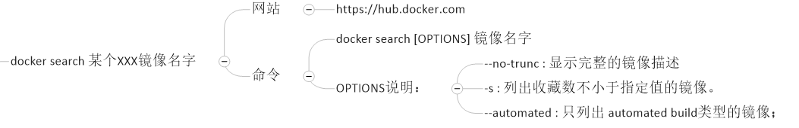
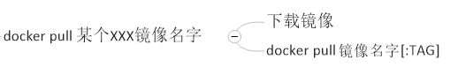
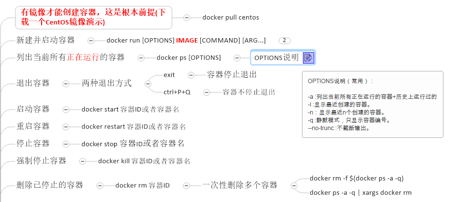
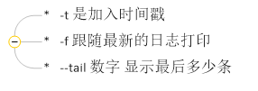
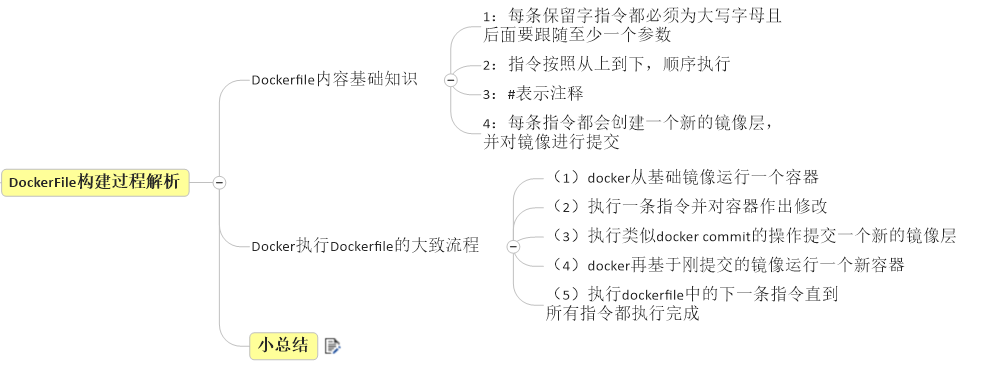
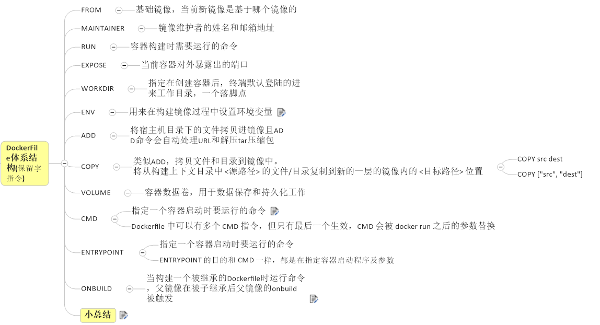

# Docker总结

# 1.Docker的安装与卸载

## 1.1安装

官方参考文档

[英文版](https://docs.docker.com/engine/install/centos/)

1. 卸载旧版本

```bash
yum remove docker \
    docker-client \
    docker-client-latest \
    docker-common \
    docker-latest \
    docker-latest-logrotate \
    docker-logrotate \
    docker-engine
```

2. 安装gcc

```bash
yum -y install gcc
yum -y install gcc-c++
```

3. 安装所需要的软件包

```bash
yum install -y yum-utils device-mapper-persistent-data lvm2
```

4. 设置stable镜像仓库（需要设置镜像）

```shell
yum-config-manager --add-repo http://mirrors.aliyun.com/docker-ce/linux/centos/docker-ce.repo
```

5. 更新yum软件包索引

```shell
yum makecache fast
```

6. 安装docker ce

```shell
yum install docker-ce docker-ce-cli containerd.io
```

7. 测试`docker version`
8. 配置镜像加速

```plain
mkdir -p /etc/docker
vim  /etc/docker/daemon.json
```

**daemon.json内容**

```json
{
  "registry-mirrors": ["https://vypk1miy.mirror.aliyuncs.com"]
}
```

```plain
systemctl daemon-reload
systemctl restart docker
```

## 1.2卸载

```shell
systemctl stop docker 
yum -y remove docker-ce
rm -rf /var/lib/docker
```

# 2.Docker常用命令

## 2.1帮助命令

1. `docker version`
2. `docker info`
3. `docker --help`

## 2.2镜像命令

1. `docker images`列出本地主机上的所有镜像
   **相关options说明**
   - -a：列出本地所有的镜像（含中间层镜像）
   - -q：只显示镜像id
   - --digests：显示镜像的摘要信息
   - --no-trunc：显示完整的镜像信息
2. `docker search` 某个XXX镜像名字



3. `docker pull` 某个XXX镜像名字



4. `docker rmi` 某个XXX镜像名字ID


## 2.3容器命令



**重点掌握**

1. `docker run -d 镜像名`：启动守护式容器

```plain
# 使用镜像centos:latest以后台模式启动一个容器
docker run -d centos
 
问题：然后docker ps -a 进行查看, 会发现容器已经退出
很重要的要说明的一点: Docker容器后台运行,就必须有一个前台进程.
容器运行的命令如果不是那些一直挂起的命令（比如运行top，tail），就是会自动退出的。
 
这个是docker的机制问题,比如你的web容器,我们以nginx为例，正常情况下,我们配置启动服务只需要启动响应的service即可。例如
service nginx start
但是,这样做,nginx为后台进程模式运行,就导致docker前台没有运行的应用,
这样的容器后台启动后,会立即自杀因为他觉得他没事可做了.
所以，最佳的解决方案是,将你要运行的程序以前台进程的形式运行
```

2. `docker logs -f -t --tail n 容器id`：查看容器日志



3. `docker top 容器id`：查看容器内运行的进程
4. `docker inspect 容器id`：查看容器内部细节
5. 进入正在运行的的容器并以命令行交互


6. 容器和主机间文件互相拷贝
   - `docker cp c266117cf738:/etc/profile ./`：拷贝容器内的profile文件到当前目录下
   - `docker cp a.txt c266117cf738:/root/b.txt`：拷贝主机下的a.txt到容器的root目录下并重命名为b.txt

**其他常用命令**


```plain
attach    Attach to a running container                 # 当前 shell 下 attach 连接指定运行镜像
build     Build an image from a Dockerfile              # 通过 Dockerfile 定制镜像
commit    Create a new image from a container changes   # 提交当前容器为新的镜像
cp        Copy files/folders from the containers filesystem to the host path   #从容器中拷贝指定文件或者目录到宿主机中
create    Create a new container                        # 创建一个新的容器，同 run，但不启动容器
diff      Inspect changes on a container's filesystem   # 查看 docker 容器变化
events    Get real time events from the server          # 从 docker 服务获取容器实时事件
exec      Run a command in an existing container        # 在已存在的容器上运行命令
export    Stream the contents of a container as a tar archive   # 导出容器的内容流作为一个 tar 归档文件[对应 import ]
history   Show the history of an image                  # 展示一个镜像形成历史
images    List images                                   # 列出系统当前镜像
import    Create a new filesystem image from the contents of a tarball # 从tar包中的内容创建一个新的文件系统映像[对应export]
info      Display system-wide information               # 显示系统相关信息
inspect   Return low-level information on a container   # 查看容器详细信息
kill      Kill a running container                      # kill 指定 docker 容器
load      Load an image from a tar archive              # 从一个 tar 包中加载一个镜像[对应 save]
login     Register or Login to the docker registry server    # 注册或者登陆一个 docker 源服务器
logout    Log out from a Docker registry server          # 从当前 Docker registry 退出
logs      Fetch the logs of a container                 # 输出当前容器日志信息
port      Lookup the public-facing port which is NAT-ed to PRIVATE_PORT    # 查看映射端口对应的容器内部源端口
pause     Pause all processes within a container        # 暂停容器
ps        List containers                               # 列出容器列表
pull      Pull an image or a repository from the docker registry server   # 从docker镜像源服务器拉取指定镜像或者库镜像
push      Push an image or a repository to the docker registry server    # 推送指定镜像或者库镜像至docker源服务器
restart   Restart a running container                   # 重启运行的容器
rm        Remove one or more containers                 # 移除一个或者多个容器
rmi       Remove one or more images             # 移除一个或多个镜像[无容器使用该镜像才可删除，否则需删除相关容器才可继续或 -f 强制删除]
run       Run a command in a new container              # 创建一个新的容器并运行一个命令
save      Save an image to a tar archive                # 保存一个镜像为一个 tar 包[对应 load]
search    Search for an image on the Docker Hub         # 在 docker hub 中搜索镜像
start     Start a stopped containers                    # 启动容器
stop      Stop a running containers                     # 停止容器
tag       Tag an image into a repository                # 给源中镜像打标签
top       Lookup the running processes of a container   # 查看容器中运行的进程信息
unpause   Unpause a paused container                    # 取消暂停容器
version   Show the docker version information           # 查看 docker 版本号
wait      Block until a container stops, then print its exit code   # 截取容器停止时的退出状态值
```

# 3.docker镜像

## 3.1docker镜像是什么

1. docker镜像是：UnionFS（联合文件系统）：是一种分层、轻量级并且高性能的文件系统，它支持对文件系统的修改作为一次提交来一层层的叠加，同时可以将不同目录挂载到同一个虚拟文件系统下(unite several directories into a single virtual filesystem)。Union 文件系统是 Docker 镜像的基础。镜像可以通过分层来进行继承，基于基础镜像（没有父镜像），可以制作各种具体的应用镜像。
   - 特性：一次同时加载多个文件系统，但从外面看起来，只能看到一个文件系统，联合加载会把各层文件系统叠加起来，这样最终的文件系统会包含所有底层的文件和目录
2. docker为什么采用分层结构

```plain
最大的一个好处就是 - 共享资源
 
比如：有多个镜像都从相同的 base 镜像构建而来，那么宿主机只需在磁盘上保存一份base镜像，
同时内存中也只需加载一份 base 镜像，就可以为所有容器服务了。而且镜像的每一层都可以被共享。
```

## 3.2docker镜像的特点


## 3.3docker镜像的commit操作

可以对已经进行相关操作的**容器**进行二次提交使之成为一个新的镜像

```shell
docker commit -m="描述信息" -a="作者信息" 容器id 镜像名:镜像版本
docker commit -m="带jdk，Tomcat的centos" -a="wjh" 6a5fcedc2832 centos_plus:1.0
```

# 4.docker容器数据卷

主要用于，主机和容器间数据共享，容器数据的持久化（简单使用）

```shell
docker run -it -v /宿主机绝对路径目录:/容器内目录 镜像名
# 如果容器没有写权限，可以加上--privileged=true参数
docker run -it -v /宿主机绝对路径目录:/容器内目录 --privileged=true 镜像名
```

# 5.Dockerfile

Dockerfile是用来构建Docker镜像的构建文件，是由一系列命令和参数构成的脚本。

构建3步骤

1. 编写Dockerfile文件
2. docker build
3. docker run

## 5.1Dockerfile构建过程解析



## 5.2Dockerfile关键字



### 1.相关指令说明

1. ENV：用来设置环境变量，例如在构建过程中设置Java环境变量等
2. CMD和ENTRYPOINT命令

```plain
最终执行的命令只能有一条
CMD是给出容器默认执行的一个命令，如果docker run 后面没有指定任何执行命令，并且Dockerfile中也没有ENTRYPOINT，则就会执行CMD指定的命令
CMD的三种用法
1. CMD ["executable","param1","param2"] (exec form, this is the preferred form)
2. CMD ["param1","param2"] (as default parameters to ENTRYPOINT)
3. CMD command param1 param2 (shell form)
第一种方式需要指定命令的全路径，后面接命令参数
第二种方式将作为exec模式下ENTRYPOINT的参数
第三种方式是只在shell下执行命令
ENTRYPOINT的2种用法
ENTRYPOINT ["executable", "param1", "param2"] (exec form, preferred)
ENTRYPOINT command param1 param2 (shell form)
当ENTRYPOINT使用第一种方式时，CMD命令将被作为它的参数，docker run 后面的CMD命令也将被作为参数
第二种方式和CMD一样，只在shell下执行命令

Dockerfile 中可以有多个 CMD 指令，但只有最后一个生效，CMD 会被 docker run 之后的参数替换
docker run 之后的参数会被当做参数传递给 ENTRYPOINT，之后形成新的命令组合
```

### 2.自定义Tomcat镜像

```dockerfile
FROM         centos
MAINTAINER    wjh<ibytecode2020@gmail.com>
#把宿主机当前上下文的c.txt拷贝到容器/usr/local/路径下
COPY c.txt /usr/local/cincontainer.txt
#把java与tomcat添加到容器中
ADD jdk-8u171-linux-x64.tar.gz /usr/local/
ADD apache-tomcat-9.0.8.tar.gz /usr/local/
#安装vim编辑器
RUN yum -y install vim
#设置工作访问时候的WORKDIR路径，登录落脚点
ENV MYPATH /usr/local
WORKDIR $MYPATH
#配置java与tomcat环境变量
ENV JAVA_HOME /usr/local/jdk1.8.0_171
ENV CLASSPATH $JAVA_HOME/lib/dt.jar:$JAVA_HOME/lib/tools.jar
ENV CATALINA_HOME /usr/local/apache-tomcat-9.0.8
ENV CATALINA_BASE /usr/local/apache-tomcat-9.0.8
ENV PATH $PATH:$JAVA_HOME/bin:$CATALINA_HOME/lib:$CATALINA_HOME/bin
#容器运行时监听的端口
EXPOSE  8080
#启动时运行tomcat
# ENTRYPOINT ["/usr/local/apache-tomcat-9.0.8/bin/startup.sh" ]
# CMD ["/usr/local/apache-tomcat-9.0.8/bin/catalina.sh","run"]
CMD /usr/local/apache-tomcat-9.0.8/bin/startup.sh && tail -F /usr/local/apache-tomcat-9.0.8/bin/logs/catalina.out
```

### 3.构建Dockerfile命令

```shell
docker build -f dockerfile全路径 -t 镜像名称:版本号 .
docker build -f /docker/Dockerfile13 -t centos_plus:1.3 .
```

# 6.附件

[Docker.mmap](https://www.yuque.com/attachments/yuque/0/2020/mmap/1590387/1600763201904-0be7b698-7d01-4eb2-b200-9581e22756ae.mmap)

‍
