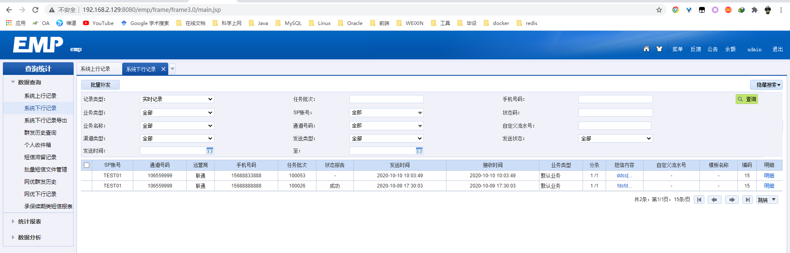

# Docker部署emp

## 1.docker安装mysql

**拉取mysql5.6镜像**

`docker pull mysql:5.6`

**创建MySQL数据挂载目录**

`mkdir -p /docker/mysql/data`

**在**​`**/docker/mysql**`​**下放置mysql配置文件**

```plain
# For advice on how to change settings please see
# http://dev.mysql.com/doc/refman/5.7/en/server-configuration-defaults.html

[mysqld]
character_set_server=utf8
sql_mode=STRICT_TRANS_TABLES,NO_AUTO_CREATE_USER,NO_ENGINE_SUBSTITUTION

default-time_zone = '+8:00'
# 忽略表名大小写
lower_case_table_names=1
innodb_file_per_table=1
innodb_file_format=Barracuda
innodb_file_format_check = ON
innodb_log_file_size = 512M
innodb_strict_mode = 0
# Remove leading # and set to the amount of RAM for the most important data
# cache in MySQL. Start at 70% of total RAM for dedicated server, else 10%.
# innodb_buffer_pool_size = 128M
#
# Remove leading # to turn on a very important data integrity option: logging
# changes to the binary log between backups.
# log_bin
#
# Remove leading # to set options mainly useful for reporting servers.
# The server defaults are faster for transactions and fast SELECTs.
# Adjust sizes as needed, experiment to find the optimal values.
# join_buffer_size = 128M
# sort_buffer_size = 2M
# read_rnd_buffer_size = 2M
pid-file        = /var/run/mysqld/mysqld.pid
socket          = /var/run/mysqld/mysqld.sock
datadir         = /var/lib/mysql
#log-error      = /var/log/mysql/error.log
## By default we only accept connections from localhost
##bind-address   = 127.0.0.1
## Disabling symbolic-links is recommended to prevent assorted security risks
#symbolic-links=0
```

**启动mysql**

```plain
docker run -d -p 3306:3306 --name mysql5.6 \
-e MYSQL_ROOT_PASSWORD=123456 \
-v /docker/mysql/my.cnf:/etc/mysql/mysql.conf.d/mysqld.cnf \
-v /docker/mysql/data:/var/lib/mysql \
--privileged=true 44241dbd4d38
```

赋予远程连接权限

```plain
GRANT ALL PRIVILEGES ON *.* TO 'root'@'%' IDENTIFIED BY 'password' WITH GRANT OPTION;
flush privileges;
```

## 2.centos7镜像配置网关

**拉取centos7镜像**

`docker pull centos:7`

**后台运行centos7，并开放网关所需端口**

```plain
docker run -itd -p 9901:9901 -p 9980:9980 -p 8082:8082 -p 7890:7890 7e6257c9f8d8
```

使用`docker cp`命令将网关包从宿主机拷贝到容器中，然后使用`docker exec -it 容器id /bin/bash`进入容器进行网关部署。安装**unixODBC**时建议使用**root**用户采用**非root**用户的安装方式。可能会遇到`libaio.so.1`找不到的问题，使用yum命令安装后重启即可。

```plain
yum -y install libaio.so.1
```

## 3.tomcat镜像部署web

**拉取Tomcat7镜像**

`docker pull tomcat:7.0`

启动Tomcat镜像，并将webapp目录挂载到宿主机

```plain
docker run -d -p 8080:8080 --name tomcat7 -v /docker/tomcat/webapp:/usr/local/tomcat/webapps -v /docker/tomcat/logs/:/usr/local/tomcat/webapps/logs --privileged=true 88e70ba65de7
```

修改emp配置文件，将emp和emp_files解压后放在`/docker/tomcat/webapp`下，重启Tomcat镜像即可访问emp。



## 4.注意

有时即使在宿主机进行了端口映射也会出现端口不通的情况，这是由于宿主机的端口转发没有打开，可以配置打开端口转发。

`vim /etc/sysctl.conf`

添加

`net.ipv4.ip_forward = 1`

重新加载

`sysctl -p`
