# Elasticsearch

# 1.ES及相关插件安装

1. [下载](https://www.elastic.co/downloads/past-releases#elasticsearch)对应版本的ES，解压到指定目录，需要使用普通用户操作，不能使用root用户
2. 修改`config/elasticsearch.yml`，修改或添加

```plain
cluster.initial_master_nodes: ["node-1"]

http.cors.enabled: true
http.cors.allow-origin: "*"
network.host: 0.0.0.0
```

1. 后台启动，使用普通用户：`bin/elasticsearch -d`

- - 浏览器访问`192.168.2.128:9200`，出现如下界面表示启动成功

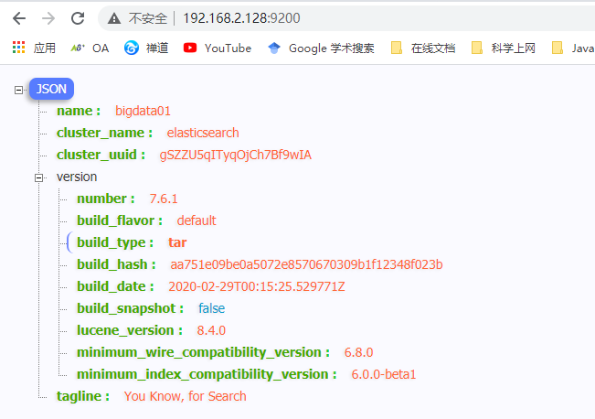

1. elasticsearch head插件安装
2. 1. [github克隆或下载](https://github.com/mobz/elasticsearch-head)代码，安装相关依赖后启动（需要node环境）
   2. Google浏览器安装插件


1. [下载kibana](https://www.elastic.co/downloads/past-releases#kibana)，解压至指定目录，需要与ES版本对应，修改`config/kibana.yml`，指定elasticsearch服务，可以配置多个

```plain
elasticsearch.hosts: ["http://192.168.2.128:9200"]
```

- - `nohup bin/kibaana > /dev/null 2>&1 &`后台启动kibana
  - 访问`192.168.2.128:5601`，出现如下界面启动成功


# 2.IK分词器安装

1. [下载](https://github.com/medcl/elasticsearch-analysis-ik)ik分词器，解压到ES的plugin目录，并重命名为ik，重启ES服务即可加载ik分词器
2. kibana测试中文分词

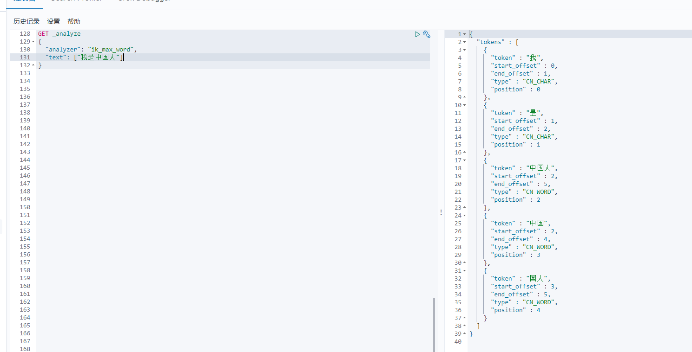

1. 自定义分词

> 在ik分词器的config目录下新建`my.dic`，在该文件中自定义分词，每一行为一个分词，然后在`IKAnalyzer.cfg.xml`配置加载自定义分词字典

```plain
<?xml version="1.0" encoding="UTF-8"?>
<!DOCTYPE properties SYSTEM "http://java.sun.com/dtd/properties.dtd">
<properties>
    <comment>IK Analyzer 扩展配置</comment>
    <!--用户可以在这里配置自己的扩展字典 -->
    <entry key="ext_dict"></entry>
    <entry key="ext_dict">my.dic</entry>
     <!--用户可以在这里配置自己的扩展停止词字典-->
    <entry key="ext_stopwords"></entry>
    <!--用户可以在这里配置远程扩展字典 -->
    <!-- <entry key="remote_ext_dict">words_location</entry> -->
    <!--用户可以在这里配置远程扩展停止词字典-->
    <!-- <entry key="remote_ext_stopwords">words_location</entry> -->
</properties>
```

# 3.ES文档操作

## 1.ES相关概念

|**索引（index）**|ElasticSearch将它的数据存储在一个或多个索引（index）中。用SQL领域的术语来类比，索引就像数据库，可以向索引写入文档或者从索引中读取文档，并通过ElasticSearch内部使用Lucene将数据写入索引或从索引中检索数据。|
| -| ----------------------------------------------------------------------------------------------------------------------------------------------------------------------------------------------------------|
|**文档（document）**|文档（document）是ElasticSearch中的主要实体。对所有使用ElasticSearch的案例来说，他们最终都可以归结为对文档的搜索。文档由字段构成。类似于数据库表中的一行数据|
|**类型（type）**|ES7之后默认文档名为`_doc`<br />无需自己指定，同时一个索引中只能有一个类型。|

## 2.创建索引

> 以下操作均在kibana中进行

```plain
PUT /index_test
{
  "settings": {
    "number_of_shards": 5,
    "number_of_replicas": 1
  },
  "mappings": {
    "properties": {
      "name": {
        "type": "text"
      },
      "age": {
        "type": "integer"
      }
    }
  }
}
```

## 3.创建文档

> 创建文档时索引不必存在，如果索引不存在则会自己创建

```plain
PUT /index_test/_doc/3
{
  "name": "李四",
  "age": 24
}
```

> 3 表示新建文档的id， 添加成功后的响应如下

```plain
{
  "_index" : "index_test",
  "_type" : "_doc",
  "_id" : "3",
  "_version" : 1,
  "result" : "created",
  "_shards" : {
    "total" : 2,
    "successful" : 1,
    "failed" : 0
  },
  "_seq_no" : 0,
  "_primary_term" : 1
}
```

- _index 表示文档索引。
- _type 表示文档的类型。
- _id 表示文档的 id。
- _version 表示文档的版本（更新文档，版本会自动加 1，针对一个文档的）。
- result 表示执行结果。
- _shards 表示分片信息。
- `_seq_no` 和 `_primary_term` 这两个也是版本控制用的（针对当前 index）。

当然，添加文档时，也可以不指定 id，此时系统会默认给出一个 id，如果不指定 id，则需要使用 POST 请求，而不能使用 PUT 请求。

```plain
POST /index_test/_doc
{
  "name": "张三",
  "age": 23
}
# 响应结果，_id为自动生成
{
  "_index" : "index_test",
  "_type" : "_doc",
  "_id" : "2kkfu3UBNFzW5BA45AQx",
  "_version" : 1,
  "result" : "created",
  "_shards" : {
    "total" : 2,
    "successful" : 1,
    "failed" : 0
  },
  "_seq_no" : 1,
  "_primary_term" : 1
}
```

如果是想探测文档是否存在可以使用HEAD请求


## 4.批量获取文档

```plain
GET blog/_mget
{
  "ids":["1","RuWrl3UByGJWB5WucKtP"]
}
```

某些特定的语言，例如 JavaScript 的 HTTP 请求库是不允许 GET 请求有请求体的，实际上在 RFC7231 文档中，并没有规定 GET 请求的请求体该如何处理，这样造成了一定程度的混乱，有的 HTTP 服务器支持 GET 请求携带请求体，有的 HTTP 服务器则不支持。虽然 es 工程师倾向于使用 GET 做查询，但是为了保证兼容性，es 同时也支持使用 POST 查询。例如上面的批量查询案例，也可以使用 POST 请求。

## 5.更新文档

> 建议使用POST请求，后面接`_update`，需要部分更新的命令需要在`doc`中指定，也可以使用脚本来实现；使用PUT请求会直接覆盖原文档。

```plain
# 在doc中指定需要更新的字段
POST /index_test/_update/3
{
  "doc": {
    "name": "李四1"
  }
}
# 使用脚本语言，在行内书写，遇到字符串需要转义
POST index_test/_update/3
{
  "script": {
    "lang": "painless",
    "source": "ctx._source.age=100"
  }
}

# 使用脚本语言，外部书写 params 方式
POST index_test/_update/3
{
  "script": {
    "lang": "painless",
    "source": "ctx._source.age=params.age",  # 指定age为params中的age值
    "params": {
      "age": 200
    }
  }
}
```

在脚本中，lang 表示脚本语言，painless 是 es 内置的一种脚本语言。source 表示具体执行的脚本，ctx 是一个上下文对象，通过 ctx 可以访问到 `_source`、`_title` 等。

也可以向文档中添加字段：

```plain
POST index_test/_update/3
{
  "script": {
    "lang": "painless",
    "source": "ctx._source.tags=params.tags",
    "params": {
      "tags": ["aaa", "bbb", "ccc"]
    }
    
  }
}

POST /index_test/_update/3
{
  "doc": {
    "desc": "新增字段"
  }
}
```

通过条件查询找到文档，然后再去更新。

```plain
POST index_test/_update_by_query
{
  "script": {
    "source": "ctx._source.age=88",
    "lang": "painless"
  },
  "query": {
    "term": {
      "name":"李"
    }
  }
}
```

**
**

## 6.删除文档\删除索引

> 删除文档后文档的version会+1

```plain
# 删除 id 为 1 的文档
DELETE /index_test/_doc/1
# 删除索引
DELETE /index_test
# 根据查询结果删除文档，例如删除 name 中包含 666 的文档
POST index_test/_delete_by_query
{
  "query": {
    "term": {
      "name": "666"
    }
  }
}
```

## 8.文档路由

> 新建一个索引，该索引有两个分片，0个副本，如下：


向索引中添加一个文档

```plain
PUT index01/_doc/a
{
  "title": "a"
}
```

查看文档被保存到那个分片中

```plain
GET _cat/shards/index01?v
```

其结果如下

```plain
index   shard prirep state   docs store ip            node
index01 1     p      STARTED    0  230b 192.168.2.128 bigdata01
index01 0     p      STARTED    1 3.3kb 192.168.2.128 bigdata01
```

可以看出该文档被保存到分片0中。

那么 es 中到底是按照什么样的规则去分配分片的？

es 中的路由机制是通过哈希算法，将具有相同哈希值的文档放到一个主分片中，分片位置的计算方式如下：

```plain
shard=hash(routing) % number_of_primary_shards
```

routing 可以是一个任意字符串，es 默认是将文档的 id 作为 routing 值，通过哈希函数根据 routing 生成一个数字，然后将该数字和分片数取余，取余的结果就是分片的位置。

默认的这种路由模式，最大的优势在于负载均衡，这种方式可以保证数据平均分配在不同的分片上。但是他有一个很大的劣势，就是查询时候无法确定文档的位置，此时它会将请求广播到所有的分片上去执行。另一方面，使用默认的路由模式，后期修改分片数量不方便。

当然我们也可以 自定义routing的值

```plain
PUT index01/_doc/b?routing=www
{
  "title": "b"
}
```

自定义 routing 有可能会导致负载不均衡，这个还是要结合实际情况选择。

典型场景：

对于用户数据，我们可以将 userid 作为 routing，这样就能保证同一个用户的数据保存在同一个分片中，检索时，同样使用 userid 作为 routing，这样就可以精准的从某一个分片中获取数据。

## 7.倒排索引

有两个文档，每个文档的内容域包含如下内容：

1. The quick brown fox jumped over the lazy dog
2. Quick brown foxes leap over lazy dogs in summer

创建倒排索引会根据文档的分词创建一个不包含重复词条的列表，然后列出每个词条出现在那个文档

```plain
Term      Doc_1  Doc_2
-------------------------
Quick   |       |  X
The     |   X   |
brown   |   X   |  X
dog     |   X   |
dogs    |       |  X
fox     |   X   |
foxes   |       |  X
in      |       |  X
jumped  |   X   |
lazy    |   X   |  X
leap    |       |  X
over    |   X   |  X
quick   |   X   |
summer  |       |  X
the     |   X   |
------------------------
```

假如搜索`quick brown` 我们只需要查找包含每个词条的文档

```plain
Term      Doc_1  Doc_2
-------------------------
brown   |   X   |  X
quick   |   X   |
------------------------
Total   |   2   |  1
```

两个文档都匹配，但是第一个文档比第二个匹配度更高。如果我们使用仅计算匹配词条数量的简单 *相似性算法* ，那么，我们可以说，对于我们查询的相关性来讲，第一个文档比第二个文档更佳。

# 4.ES字段类型

## 1.ES 映射

> 分为动态映射和静态映射，动态映射是自动推断，静态映射是指建立索引的时候指定各个字段类型，与建表时指定字段类型一致

**1.动态映射**

顾名思义，就是自动创建出来的映射。es 根据存入的文档，自动分析出来文档中字段的类型以及存储方式，这种就是动态映射。

举一个简单例子，新建一个索引，然后查看索引信息：

```plain
put blog
```

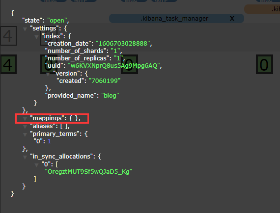

向其中添加一个文档后观察`mappings`的值，其中 title 和 date 的类型都是推断出来的

```plain
PUT blog/_doc/1
{
  "title": "spring boot",
  "date": "2020-11-30"
}
```


默认情况下，文档中如果新增了字段，mappings 中也会自动新增进来。

有的时候，如果希望新增字段时，能够抛出异常来提醒开发者，这个可以通过 mappings 中 `dynamic`属性来配置。

`dynamic`属性有三种取值：

- true，默认即此。自动添加新字段。
- false，忽略新字段。
- strict，严格模式，发现新字段会抛出异常。

具体配置方式如下，创建索引时指定 mappings（这其实就是静态映射）：

```plain
PUT blog
{
  "mappings": {
    "dynamic":"strict",
    "properties": {
      "title":{
        "type": "text"
      },
      "age":{
        "type":"long"
      }
    }
  }
}
```

然后向 blog 中索引中添加数据：

```plain
PUT blog/_doc/2
{
  "title":"1111",
  "date":"2020-11-11",
  "age":99
}
```

在添加的文档中，多出了一个 date 字段，而该字段没有预定义，所以这个添加操作就回报错：

```json
{
  "error" : {
    "root_cause" : [
      {
        "type" : "strict_dynamic_mapping_exception",
        "reason" : "mapping set to strict, dynamic introduction of [date] within [_doc] is not allowed"
      }
    ],
    "type" : "strict_dynamic_mapping_exception",
    "reason" : "mapping set to strict, dynamic introduction of [date] within [_doc] is not allowed"
  },
  "status" : 400
}
```

动态映射还有一个日期检测的问题。

例如新建一个索引，然后添加一个含有日期的文档，如下：

```json
PUT blog/_doc/1
{
  "remark":"2020-11-11"
}
```

添加成功后，remark 字段会被推断是一个日期类型。

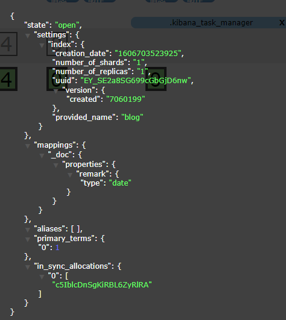

此时，remark 字段就无法存储其他类型了。

```json
PUT blog/_doc/1
{
  "remark":"javaboy"
}
```

此时报错如下：

```json
{
  "error" : {
    "root_cause" : [
      {
        "type" : "mapper_parsing_exception",
        "reason" : "failed to parse field [remark] of type [date] in document with id '1'. Preview of field's value: 'javaboy'"
      }
    ],
    "type" : "mapper_parsing_exception",
    "reason" : "failed to parse field [remark] of type [date] in document with id '1'. Preview of field's value: 'javaboy'",
    "caused_by" : {
      "type" : "illegal_argument_exception",
      "reason" : "failed to parse date field [javaboy] with format [strict_date_optional_time||epoch_millis]",
      "caused_by" : {
        "type" : "date_time_parse_exception",
        "reason" : "Failed to parse with all enclosed parsers"
      }
    }
  },
  "status" : 400
}
```

要解决这个问题，可以使用静态映射，即在索引定义时，将 remark 指定为 text 类型。也可以关闭日期检测。

```json
PUT blog
{
  "mappings": {
    "date_detection": false
  }
}
```

此时日期类型就回当成文本来处理。

**2.静态映射**

创建索引时指定各个字段类型即可

```json
PUT blog
{
  "mappings": {
    "properties": {
      "title": {
        "type": "text"
      },
      "age": {
        "type": "long"
      }
    }
  }
}
```

**3.类型推断**

es 中动态映射类型推断方式如下：

|JSON中的数据|自动推断出来的类型|
| ------------| ------------------------------------|
|null|没有字段被添加|
|true/false|boolean|
|浮点数字|float|
|数字|long|
|JSON对象|object|
|数组|数组中的第一个非空值来决定|
|string|text/keyword/dae/double/long都有可能|

## 2.核心类型

### 2.1字符串类型

- string：这是一个已经过期的字符串类型。在 es5 之前，用这个来描述字符串，现在的话，它已经被 text 和 keyword 替代了。
- text：如果一个字段是要被全文检索的，比如说博客内容、新闻内容、产品描述，那么可以使用 text。用了 text 之后，字段内容会被分析，在生成倒排索引之前，字符串会被分词器分成一个个词项。text 类型的字段不用于排序，很少用于聚合。这种字符串也被称为 analyzed 字段。
- keyword：这种类型适用于结构化的字段，例如标签、email 地址、手机号码等等，这种类型的字段可以用作过滤、排序、聚合等。这种字符串也称之为 not-analyzed 字段。

### 2.2数字类型

|类型|取值范围|
| ------------| -------------------------|
|long|-2<sup>63</sup>~2<sup>63</sup>|
|integer|-2<sup>31</sup>~2<sup>31</sup>|
|short|-2<sup>15</sup>~2<sup>15</sup>|
|byte|-2<sup>7</sup>~2<sup>7</sup>|
|double|64位双精度IEEE754浮点类型|
|float|32位双精度IEEE754浮点类型|
|half_float|16位双精度IEEE754浮点类型|
|scaled_float|缩放类型的浮点类型|

- 在满足需求的情况下，优先使用范围小的字段。字段长度越短，索引和搜索的效率越高。
- 浮点数，优先考虑使用 scaled_float。

scaled_float举例：

```json
PUT product
{
  "mappings": {
    "properties": {
      "name":{
        "type": "text"
      },
      "price":{
        "type": "scaled_float",
        "scaling_factor": 100 # 缩放因子
      }
    }
  }
}
# 存数据
PUT product/_doc/1
{
  "price": 99.99 # 底层以9999来存储
}
```

### 2.4日期类型

由于 JSON 中没有日期类型，所以 es 中的日期类型形式就比较多样：

- 2020-11-11 或者 2020-11-11 11:11:11
- 一个从 1970.1.1 零点到现在的一个秒数或者毫秒数。

es 内部将时间转为 UTC，然后将时间按照 millseconds-since-the-epoch 的长整型来存储。

自定义日期类型：

```json
PUT product
{
  "mappings": {
    "properties": {
      "date":{
        "type": "date"
      }
    }
  }
}
```

这个能够解析出来的时间格式比较多。

```json
PUT product/_doc/1
{
  "date":"2020-11-11"
}

PUT product/_doc/2
{
  "date":"2020-11-11T11:11:11Z"
}


PUT product/_doc/3
{
  "date":"1604672099958"
}
```

上面三个文档中的日期都可以被解析，内部存储的是毫秒计时的长整型数。

### 2.5布尔类型（boolean）

JSON 中的 “true”、“false”、true、false 都可以。

### 2.6二进制类型（binary）

二进制接受的是 base64 编码的字符串，默认不存储，也不可搜索。

### 2.7范围类型

- integer_range
- float_range
- long_range
- double_range
- date_range
- ip_range

定义的时候，指定范围类型即可：

```json
PUT product
{
  "mappings": {
    "properties": {
      "date":{
        "type": "date"
      },
      "price":{
        "type":"float_range"
      }
    }
  }
}
```

插入文档的时候，需要指定范围的界限：

```json
PUT product/_doc/1
{
  "date": "2020-12-02",
  "price": {
    "gt": 20,
    "lt": 100
  }
}
```

指定范围的时，可以使用 gt、gte、lt、lte。

## 3.复合类型

### 3.1数组类型

es 中没有专门的数组类型。默认情况下，任何字段都可以有一个或者多个值。需要注意的是，数组中的元素必须是同一种类型。

添加数组是，数组中的第一个元素决定了整个数组的类型。

### 3.2对象类型（object）

由于 JSON 本身具有层级关系，所以文档包含内部对象。内部对象中，还可以再包含内部对象。

```json
PUT product/_doc/2
{
  "date":"2020-11-11T11:11:11Z",
  "ext_info":{
    "address":"China"
  }
}
```

## 4.地理类型

## 5.特殊类型

### 5.1IP类型

存储 IP 地址，类型是 ip：

```json
PUT blog
{
  "mappings": {
    "properties": {
      "address":{
        "type": "ip"
      }
    }
  }
}
```

添加文档：

```json
PUT blog/_doc/1
{
  "address":"192.168.91.1"
}
```

搜索文档：

```json
GET blog/_search
{
  "query": {
    "term": {
      "address": "192.168.0.0/16"
    }
  }
}
```

### 5.2token_count

用于统计字符串分词后的词项个数。

```json
PUT blog
{
  "mappings": {
    "properties": {
      "title":{
        "type": "text",
        "fields": {
          "length":{
            "type":"token_count",
            "analyzer":"standard"
          }
        }
      }
    }
  }
}
```

相当于新增了 title.length 字段用来统计分词后词项的个数。

添加文档：

```json
PUT blog/_doc/1
{
  "title":"zhang san"
}
```

可以通过 token_count 去查询：

```json
GET blog/_search
{
  "query": {
    "term": {
      "title.length": 2
    }
  }
}
```

# 5.ES映射参数

## 5.1analyzer

自定义文本字段的分词器，默认对索引和查询都是有效的。

假设不使用分词器，我们来看一下索引结果，创建一个索引并添加一个文档：

```json
PUT blog

PUT blog/_doc/1
{
  "title": "员工生日祝福"
}
```

查看词条向量（term vectors）

```json
GET blog/_termvectors/1
{
  "fields": ["title"]
}
```

查看结果如下：

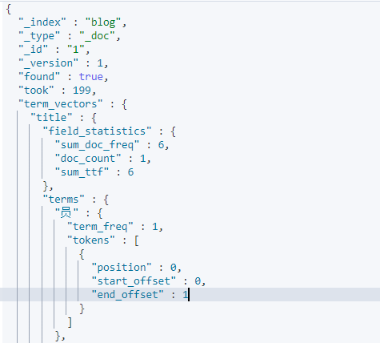

可以看到最终结果是以一个字一个字进行分词的，这种分词方式没有任何意义。如果这样分词，查询就只能按照一个字来进行查询：

```json
GET blog/_search
{
  "query": {
    "term": {
      "title": "生"
    }
  }
}
```

所以需要根据实际情况，配置合适的分词器。

在创建索引的时候对字段指定分词器：

```json
PUT blog
{
  "mappings": {
    "properties": {
      "title": {
        "type": "text",
        "analyzer": "ik_smart"
      }
    }
  }
}
```

查看分词向量

```json
GET blog/_termvectors/1
{
  "fields": ["title"]
}
```

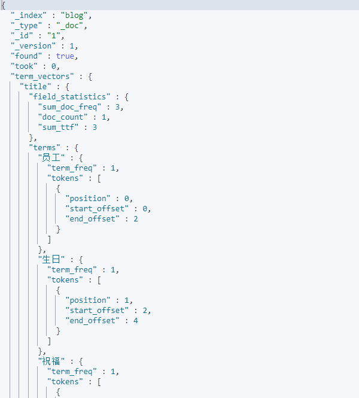

然后可以根据词进行搜索

```json
GET blog/_search
{
  "query": {
    "term": {
      "title": "生日"
    }
  }
}
```

## 5.2search_analyzer

> 查询时的分词器，默认情况下如果没有配置search_analyzer，则查询时首先查看有没有search_analyzer，如果有，就用search_analyzer，进行分词，如果没有，则看有没有analyzer来进行分词，否则使用ES默认的分词器。

## 5.3normalizer

# 6.文档搜索

## 6.1数据导入及搜索入门

### 1.新建文档导入数据

```json
PUT books 
{
  "mappings": {
    "properties": {
      "name": {
        "type": "text",
        "analyzer": "ik_max_word"
      },
      "publish": {
        "type": "text",
        "analyzer": "ik_max_word"
      },
      "type": {
        "type": "text",
        "analyzer": "ik_max_word"
      },
      "author": {
        "type": "keyword"
      },
      "info": {
        "type": "text",
        "analyzer": "ik_max_word"
      },
      "price": {
        "type": "double"
      }
    }
  }
}
```

[下载](https://www.yuque.com/r/resources/download/1680960)数据文件，然后通过以下命令导入

```plain
curl -XPOST "http://192.168.2.128:9200/books/_bulk?pretty" -H "content-type:application/json" --data-binary @bookdata .json
```

## 6.2ES搜索入门

搜索分为两个过程：

1. 当向索引中保存文档时，默认情况下，ES 保存两份内容，一份是`_source`中保存的数据，另一份则是通过分词、排序等一系列过程生成的倒排索引文件，倒排索引中保存了词项和文档之间的对应关系
2. 搜索时，当ES接收到用户的搜索请求之后，就会去倒排索引中查询，通过倒排索引中维护的倒排索引记录表找到关键词对应的文档集合，然后会对文档进行评分、排序、高亮等处理，处理完成后返回文档。

### 1.简单搜索

查询文档：

```json
GET books/_search
{
  "query": {
    "match_all": {}
  }
}
```

查询结果如下：


hits 中就是查询结果，total 是符合查询条件的文档数。

简单搜索可以简写为：

`GET books/_search`

简单搜索默认查询10条记录。

### 2.词项查询

> 即 term 查询，就是根据**词**去查询，查询指定字段中包含给定单词的文档，term查询不被解析，只有搜索的词和文档中的词精确匹配才会返回文档。

查询name中包含**十一五**的文档

```json
GET books/_search
{
  "query": {
    "term": {
      "name": "十一五"
    }
  }
}
```

### 2.分页查询

查询name中包含**十一五**的文档，从第10条开始，查询10条数据

```json
GET books/_search
{
  "query": {
    "term": {
      "name": "十一五"
    }
  },
  "size": 10,
  "from": 10
}
```

### 3.过滤返回字段

指定需要返回的字段(name, author, price)：

```json
GET books/_search
{
  "query": {
    "term": {
      "name": "十一五"
    }
  },
  "size": 10,
  "from": 10,
  "_source": ["name", "author", "price"]
}
```

此时就只会返回name、author和price字段：

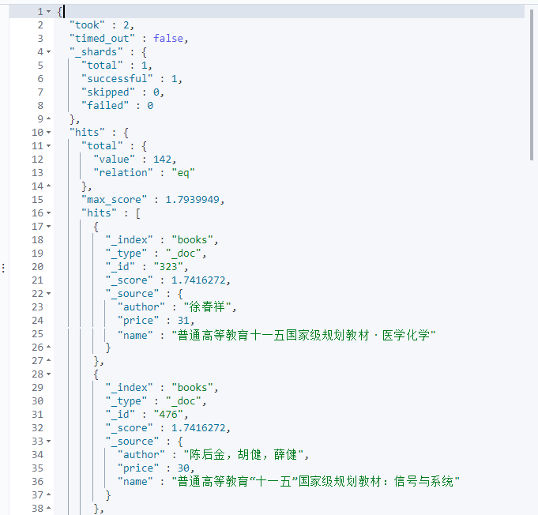

### 4.查询关键字高亮

```json
GET books/_search
{
  "query": {
    "term": {
      "name": "十一五"
    }
  },
  "size": 10,
  "from": 10,
  "_source": ["name", "author", "price"],
  "highlight": {
    "fields": {
      "name": { # 高亮字段
        "pre_tags": "<span sytle='color: red'>", # 前置标签
        "post_tags": "</span>" # 后置标签
      }
    }
  }
}
```

查询结果如下，查询关键字被指定标签包围：

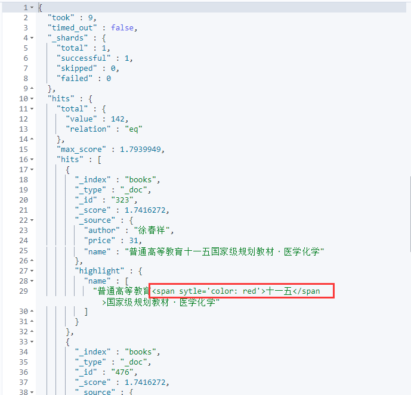

## 6.3ES全文搜索

### 1.match query

match query 会对查询的语句进行分词，分词后，如果查询语句中的任何一个词项被命中就会返回该文档。

```json
GET books/_search
{
  "query": {
    "match": {
      "name": "美术计算机"
    }
  }
}
```

给查询首先会对 `美术计算机` 进行分词，分词之后，再去查询，只要文档中包含一个分词结果，就返回文档。也即各个分词之间默认是 or 的关系，也修改为 and 的关系。

```json
GET books/_search
{
  "query": {
    "match": {
      "name": {
        "query": "美术计算机",
        "operator": "and"
      }
    }
  }
}
```

此时就要求文档中必须严格包含 `美术计算机` 分词之后的各个词项。

### 2.match_phrase query

match_phrash query 也会对查询的关键词进行分词，但是它分词后有两个特点：

1. 分词后的词项出现顺序必须和文档中词项顺序一致
2. 所有的词项都必须出现在文档中

```json
GET books/_search
{
  "query": {
    "match_phrase": {
      "name": {
        "query": "十一五计算机",
        "slop": 5
      }
    }
  }
}
```

query 是查询的关键字，会被分词器分解，分解后去倒排索引中进行匹配。

slop 是关键字之间的最小距离，单不是关键字之间间隔的字数，文档中的字段被分词器分割后，解析出来的词项都包含一个 position 字段，表示词项的位置。查询短语分词后的 position 之间的间隔要满足 slop 的要求。

### 3.match_phrase_prefix query

类似于 match_phrase ，只不过多了一个通配符，match_phrase_prefix 支持最后一个词项的前缀匹配，但是这种匹配方式效率较低。

```json
GET books/_search
{
  "query": {
    "match_phrase_prefix": {
      "name": "计"
    }
  }
}
```

这个查询过程，会自动进行单词匹配，会自动查找以**计**开始的单词，默认是 50 个，可以自己控制：

```json
GET books/_search
{
  "query": {
    "match_phrase_prefix": {
      "name": {
        "query": "计",
        "max_expansions": 5
      }
    }
  }
}
```

match_phrase_prefix 是针对分片级别的查询，假设 max_expansions 为 1，可能返回多个文档，但是只有一个词，这是我们预期的结果。有的时候实际返回结果和我们预期结果并不一致，原因在于这个查询是分片级别的，不同的分片确实只返回了一个词，但是结果可能来自不同的分片，所以最终会看到多个词。

### 4.multi_match query

match 查询的升级版，可以指定多个查询域：

```json
GET books/_search
{
  "query": {
    "multi_match": {
      "query": "java",
      "fields": ["name", "info"]
    }
  }
}
```

这种查询方式还可以指定字段的权重：

```plain
GET books/_search
{
  "query": {
    "multi_match": {
      "query": "阳光",
      "fields": ["name^4","info"]
    }
  }
}
```

这个表示关键字出现在 name 中的权重是出现在 info 中权重的 4 倍。

## 6.4词项查询

### 1.term query

词项查询。词项查询不会分析查询字符，直接拿查询字符去倒排索引中比对。

```json
GET books/_search
{
  "query": {
    "term": {
      "name": "程序设计"
    }
  }
}
```

### 2.terms query

词项查询，但是可以给多个关键字

```json
GET books/_search
{
  "query": {
    "terms": {
      "name": [
        "java",
        "程序设计"
      ]
    }
  }
}
```

### 3.range query

范围查询，可以按照日期范围、数字范围等查询。

range query 中的参数主要有四个：

- gt
- lt
- gte
- lte

```json
GET books/_search
{
  "query": {
    "range": {
      "price": {
        "gte": 10,
        "lte": 30
      }
    }
  },
  "sort": [
    {
      "price": {
        "order": "desc"
      }
    }
  ],
  "_source": ["name", "price"]
}
```

### 4.exists query

exists query 会返回指定字段值不为空的文档

```json
GET books/_search
{
  "query": {
    "exists": {
      "field": "javaboy"
    }
  }
}
```

注意：空字符串也是有值的，null 是空值

### 5.prefix query

前缀查询，效率略低，非必要，一般不建议使用

给定关键字的前缀查询：

```json
GET books/_search
{
  "query": {
    "prefix": {
      "name": {
        "value": "考试"
      }
    }
  }
}
```

### 6.wildcard query

wildcard query 通配符查询。支持单字符通配符和多字符通配符

- ? 表示一个任意字符
- - 表示零个或多个字符

查询所以姓**张**的作者的文档：

```json
GET books/_search
{
  "query": {
    "wildcard": {
      "author": {
        "value": "张*"
      }
    }
  }
}
```

查询所以姓**张**的作者且名字长度为2的文档：

```json

GET books/_search
{
  "query": {
    "wildcard": {
      "author": {
        "value": "张?"
      }
    }
  }
}
```

### 7.regexp query

支持正则表达式查询。

查询所有姓**张**并且名字只有两个字符的文档：

```json
GET books/_search
{
  "query": {
    "regexp": {
      "author": "张."
    }
  }
}
```

### 8.fuzzy query

在实际搜索中，有时我们可能会打错字，从而导致搜索不到，在match query中，可以通过fuzziness属性实现模糊查询。

fuzzy query 返回与搜索关键字相似的文档。怎样算相似？以LevenShtein编辑距离为准。编辑距离是指将一个字符转换为另一个字符所需要更改字符的次数，更改主要包括四种：

- 更改字符（javb --> java）
- 删除字符（javva --> java）
- 插入字符（jaa --> java）
- 转置字符（ajva --> java）

为了找到相似的词，模糊查询会在指定编辑距离中创建搜索关键词的所有变化可能或者扩展的集合，然后进行搜索匹配。

```json
GET books/_search
{
  "query": {
    "fuzzy": {
      "name": "javab"
    }
  }
}
```

### 9.ids查询

根据指定的id查询。

```json
GET books/_search
{
  "query": {
    "ids": {
      "values": [1,2,3]
    }
  }
}
```

## 6.5复合查询

### 1.constant_score query

当我们不关心检索词项的评率（TF）对搜索结果排序影响是，可以使用constant_score 将查询语句或者过滤语句包裹起来。

```json
GET books/_search
{
  "query": {
    "constant_score": {
      "filter": {
        "term": {
          "name": "java"
        }
      },
      "boost": 1.5 # 将所有结果的分数指定为1.5
    }
  }
}
```

### 2.bool query

bool query可以将任意多个简单查询组装在一起，有四个关键字可供选择，四个关键字所描述的条件可以有多个。

- must：文档必须满足 must 选项下的查询条件。
- should：文档可以匹配 should 下的查询条件，可也以不匹配
- must_not：文档必须不满足 must_not 选项下的查询条件。
- filter：类似于 must，但是 filter 不评分，只是过滤数据。

例如查询 name 属性中必须包含 java，同时书价不在 [0,35] 区间内，info 属性可以包含 程序设计 也可以不包含程序设计：

```json
GET books/_search
{
  "query": {
    "bool": {
      "must": [
        {
          "term": {
            "name": {
              "value": "java"
            }
          }
        }
      ],
      "must_not": [
        {
          "range": {
            "price": {
              "gte": 0,
              "lte": 35
            }
          }
        }
      ],
      "should": [
        {
          "match": {
            "info": "程序设计"
          }
        }
      ]
    }
  }
}
```

### 3.function_socre query

场景：例如想要搜索附近的肯德基，搜索的关键字是肯德基，但是我希望能够将评分较高的肯德基优先展示出来。但是默认的评分策略是没有办法考虑到餐厅评分的，他只是考虑相关性，这个时候可以通过 function_score query 来实现。

数据准备：

```json
PUT blog
{
  "mappings": {
    "properties": {
      "title":{
        "type": "text",
        "analyzer": "ik_max_word"
      },
      "votes":{
        "type": "integer"
      }
    }
  }
}

PUT blog/_doc/1
{
  "title":"Java集合详解",
  "votes":100
}

PUT blog/_doc/2
{
  "title":"Java多线程详解，Java锁详解",
  "votes":10
}
```

现在搜索标题中包含 java 关键字的文档：

```json
GET blog/_search
{
  "query": {
    "match": {
      "title": "java"
    }
  }
}
```

查询结果如下：

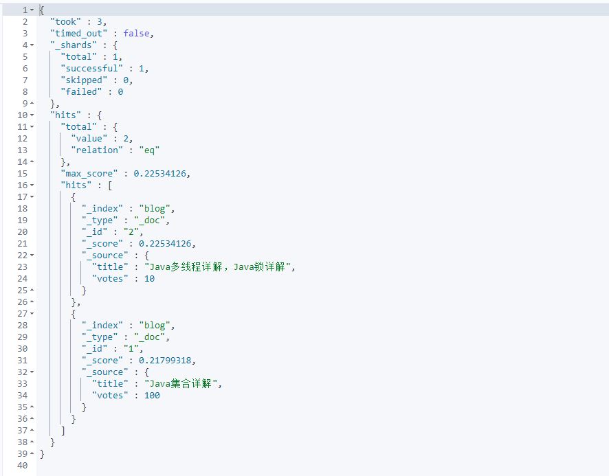

默认情况下，id 为 2 的记录得分较高，因为他的 title 中包含两个 java。

如果我们在查询中，希望能够充分考虑 votes 字段，将 votes 较高的文档优先展示，就可以通过 function_score 来实现。

具体的思路，就是在旧的得分基础上，根据 votes 的数值进行综合运算，重新得出一个新的评分。

具体有几种不同的计算方式：

- weight
- random_score
- script_score
- field_value_factor

**weight**

weight 可以对评分设置权重，就是在旧的评分基础上乘以 weight ，其实它无法解决我们上面所出现的问题。具体用法如下：

```json
GET blog/_search
{
  "query": {
    "function_score": {
      "query": {
        "match": {
          "title": "java"
        }
      },
      "functions": [
        {
          "weight": 10
        }
      ]
    }
  }
}
```

查询结果如下：

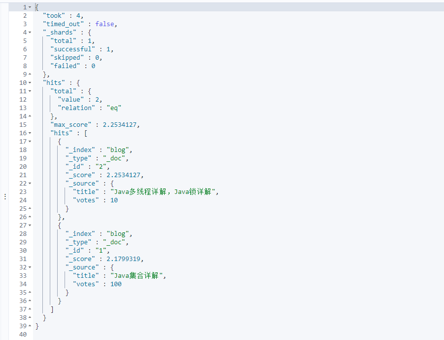

可以看到他在之前的评分基础上 * 10

**random_score**

`random_score` 会根据 uid 字段进行 hash 运算，生成分数，使用 `random_score` 时可以配置一个种子，如果不配置，默认使用当前时间。

```json
GET blog/_search
{
  "query": {
    "function_score": {
      "query": {
        "match": {
          "title": "java"
        }
      },
      "functions": [
        {
          "random_score": {}
        }
      ]
    }
  }
}
```

**script_score**

自定义评分脚本。假设每个文档的最终得分是旧的分数加上votes。查询方式如下：

```json
GET blog/_search
{
  "query": {
    "function_score": {
      "query": {
        "match": {
          "title": "java"
        }
      },
      "functions": [
        {
          "script_score": {
            "script": {
              "lang": "painless",
              "source": "_score + doc['votes'].value"
            }
          }
        }
      ]
    }
  }
}
```

现在，最终得分是 `(oldScore+votes)*oldScore`。

如果不想乘以 oldScore，查询方式如下：

```json
GET blog/_search
{
  "query": {
    "function_score": {
      "query": {
        "match": {
          "title": "java"
        }
      },
      "functions": [
        {
          "script_score": {
            "script": {
              "lang": "painless",
              "source": "_score + doc['votes'].value"
            }
          }
        }
      ],
      "boost_mode": "replace"
    }
  }
}
```

通过 `boost_mode` 参数，可以设置最终的计算方式。该参数还有其他取值：

- multiply：分数相乘
- sum：分数相加
- avg：求平均数
- max：最大分
- min：最小分
- replace：不进行二次计算

**field_value_factor**

这个的功能类似于 `script_score`，但是不用自己写脚本。

假设每个文档的最终得分是旧的分数乘以votes。查询方式如下：

```json
GET blog/_search
{
  "query": {
    "function_score": {
      "query": {
        "match": {
          "title": "java"
        }
      },
      "functions": [
        {
          "field_value_factor": {
            "field": "votes"
          }
        }
      ]
    }
  }
}
```

默认的得分就是`oldScore*votes`。

还可以利用 es 内置的函数进行一些更复杂的运算：

```json
GET blog/_search
{
  "query": {
    "function_score": {
      "query": {
        "match": {
          "title": "java"
        }
      },
      "functions": [
        {
          "field_value_factor": {
            "field": "votes",
            "modifier": "sqrt"
          }
        }
      ],
      "boost_mode": "replace"
    }
  }
}
```

此时，最终的得分是（sqrt(votes)）。

modifier 中可以设置内置函数，其他的内置函数还有：

|参数名|含义|
| ----------| --------------------------|
|none|默认的，不进行任何运算|
|log|对字段值取对数|
|log1p|对字段值+1，然后取对数|
|log2p|对字段值+2，然后取对数|
|ln|对字段值取自然对数|
|ln1p|对字段值+1，然后取自然对数|
|ln2p|对字段值+2，然后取自然对数|
|sqrt|对字段值求平方根|
|square|对字段值求平方|
|reciprocal|倒数|

另外还有个参数 factor ，影响因子。字段值先乘以影响因子，然后再进行计算。以 sqrt 为例，计算方式为 `sqrt(factor*votes)`：

```json
GET blog/_search
{
  "query": {
    "function_score": {
      "query": {
        "match": {
          "title": "java"
        }
      },
      "functions": [
        {
          "field_value_factor": {
            "field": "votes",
            "modifier": "sqrt",
            "factor": 10
          }
        }
      ],
      "boost_mode": "replace"
    }
  }
}
```

还有一个参数 `max_boost`，控制计算结果的范围：

```json
GET blog/_search
{
  "query": {
    "function_score": {
      "query": {
        "match": {
          "title": "java"
        }
      },
      "functions": [
        {
          "field_value_factor": {
            "field": "votes"
          }
        }
      ],
      "boost_mode": "sum",
      "max_boost": 100
    }
  }
}
```

`max_boost` 参数表示 functions 模块中，最终的计算结果上限。如果超过上限，就按照上线计算。

## 6.6搜索高亮和查询排序

### 1.搜索高亮

普通高亮，默认会自动添加 em 标签

```json
GET books/_search
{
  "query": {
    "match": {
      "name": "大学"
    }
  },
  "highlight": {
    "fields": {
      "name": {}
    }
  }
}
```

查询结果如下：

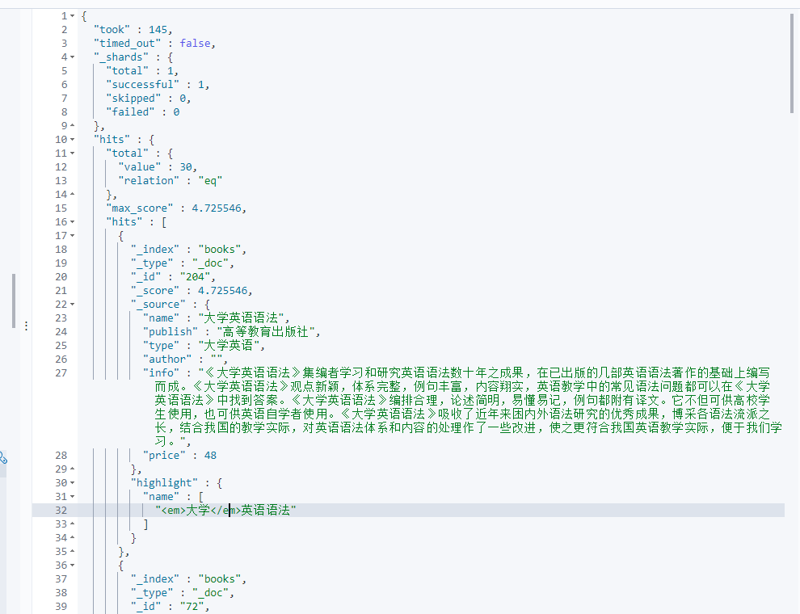

自定义标签搜索高亮：

```json
GET books/_search
{
  "query": {
    "match": {
      "name": "大学"
    }
  },
  "highlight": {
    "fields": {
      "name": {
        "pre_tags": "<span style='color: red'>",
        "post_tags": "</span>"
      }
    }
  }
}
```

有的时候，虽然我们是在 name 字段中搜索的，但是我们希望 info 字段中，相关的关键字也能高亮：

```json
GET books/_search
{
  "query": {
    "match": {
      "name": "大学"
    }
  },
  "highlight": {
    "require_field_match": "false", 
    "fields": {
      "name": {
        "pre_tags": "<span style='color: red'>",
        "post_tags": "</span>"
      },
      "info": {
        "pre_tags": "<span style='color: red'>",
        "post_tags": "</span>"
      }
    }
  }
}
```

### 2.搜索排序

排序很简单，默认是按照查询文档的相关度来排序的，即（`_score` 字段）：

```json
GET books/_search
{
  "query": {
    "term": {
      "name": {
        "value": "java"
      }
    }
  }
}
```

等价于：

```json
GET books/_search
{
  "query": {
    "term": {
      "name": {
        "value": "java"
      }
    }
  },
  "sort": [
    {
      "_score": {
        "order": "desc"
      }
    }
  ]
}
```

match_all 查询只是返回所有文档，不评分，默认按照添加顺序返回，可以通过 `_doc` 字段对其进行排序：

```json
GET books/_search
{
  "query": {
    "match_all": {}
  },
  "sort": [
    {
      "_doc": {
        "order": "desc"
      }
    }
  ],
  "size": 20
}
```

es 同时也支持多字段排序。

```json
GET books/_search
{
  "query": {
    "match_all": {}
  },
  "sort": [
    {
      "price": {
        "order": "asc"
      }
    },
    {
      "_doc": {
        "order": "desc"
      }
    }
  ],
  "size": 20
}
```
