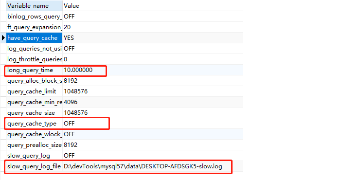

# SQL优化

# 1.慢SQL定位

`show variables like '%quer%';` 可以定位到慢SQL位置及超过多长时间为慢SQL

`show status like '%slow_queries%';` 查看慢SQL的条数

`set global slow_query_log = on;` 开启慢SQL记录

`set global long_query_time = 1;` 修改超过为1 秒为慢SQL

# 2.两种引擎

## 2.1锁机制

|**MyIsam**|**Innodb**|
| ----------------------------------------------------------------| ------------------------------------------|
|只有表级锁，不支持事务|默认行级锁，支持表级锁|
|select默认有共享锁|select没有共享锁，需要添加 `lock in share` 显式使用共享锁|
|无论SQL是否走索引都会锁表|SQL走索引会锁行，否则锁表|
|有共享锁时可以加共享锁，不能加排他锁；有排他锁时，不能加任何锁。||

## 2.2适用场景

**MyIsam**

1. 需要频繁执行全表 count 语句（MyIsam 有一个字段保存表的行数）
2. 对数据的增删改频率不高（有表锁），查询频繁
3. 没有事务的业务场景

**Innodb**

1. 增删改查都比较频繁
2. 可靠性要求较高，要求支持事务

# 3.事务隔离级别

## 3.1事务的四大特性

A：原子性

C：一致性

I：隔离性

D：持久性

## 3.2事务隔离级别

查看MySQL的隔离级别：`SELECT @@tx_isolation;`

设置MySQL的隔离级别为读未提交：`set session transcation isolation level read uncommited;`

## 3.3事务并发访问下可能出现的问题

- 更新丢失 --- MySQL所有事务级别在数据库层面上均可避免
- 脏读 --- 其他事务可以读取当前事务未提交的数据；read-commited 事务隔离级别以上可以避免
- 不可重复读 --- 当前事务读取过程中其他事务可以对该数据进行修改并提交，导致当前事务多次读取数据都不相同；repeatable-read 事务隔离级别以上可以避免
- 幻读 --- 当前事务查询记录时其他事务进行了增删操作，当前事务再次进行读取时会发现记录发生了改变即幻读；serializable 事务隔离级别上可以避免

