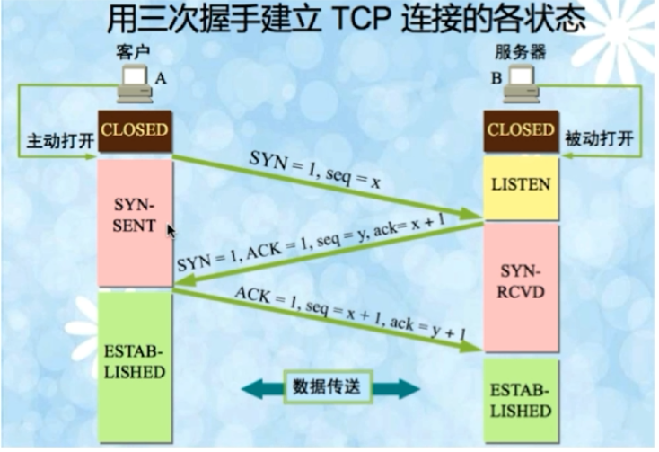
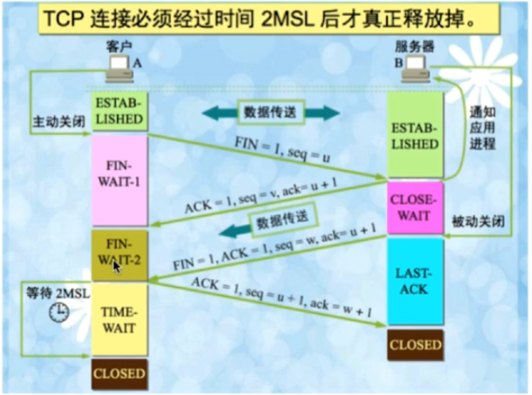

# 网络面试题

# 1.网络分层

|**传统协议**|**TCP/IP协议**|
| --------------| ------|
|应用层（http）|应用层|
|表示层||
|会话层||
|传输层（tcp）|传输层|
|网络层（ip）|网络层|
|数据链路层|链路层|
|物理层||

# 2.三次握手

1. 第一次握手：建立连接时，客户端发送 SYN 包（seq=j）到服务器，进入 SYN_SENT 状态，等待服务器确认
2. 第二次握手：服务器收到 SYN 包，必须确认客户的 SYN（ack=j+1），同时发送一个自己的 SYN（seq=k），即 SYN+ACK 包，此时服务器进入 SYN_RECV 状态
3. 第三次握手：客户端收到服务器的 SYN+ACK 包，向服务器发送确认包 ACK（ack=k+1，seq=j+1），此包发送完毕客户端和服务器进入 ESTABLISHED ，完成三次握手

# 4.四次挥手

1. 第一次挥手：客户端发送 FIN 包（seq=u），测试客户端进入 FIN-WAIT-1 状态
2. 第二次挥手：服务端收到 FIN 后，发送一个 ACK（ack=u+1，seq=v） 给客户端，服务端进入 CLOSE-WAIT 状态
3. 第三次挥手：服务端发送一个 FIN 包（ack=u+1，seq=w）用来关闭服务端到客户端的数据，服务端进入 LAST-ACK 状态
4. 第四次挥手：客户端收到 FIN 后，客户端进入 TIME-WAIT 状态，接着发送一个 ACK 包（ack=w+1，seq=u+1），客户端进入 CLOSED 状态

# 4.为什么会有TIME-WAIT状态

1. 确保有足够的时间让对端收到 ACK 包
2. 避免新旧链接混淆

# 5.UDP的特点

1. 面向非连接
2. 不维护连接状态，支持同时向多个客户端传输相同消息
3. 数据包报头只有8个字节，额外开销较小
4. 吞吐量受限于数据生成速率、传输速率及机器性能
5. 尽最大努力交付，不保证可靠性，不需要维护复杂的链路状态
6. 面向报文，不对应用程序提交的报文信息进行拆分或者合并

# 6.TCP和UDP的区别

1. TCP面向连接，UDP无连接，适合多播发送
2. TCP通过三次握手确认和重传机制保证可靠性，UDP不保证可靠性
3. TCP通过三次握手的序列保证消息的有序性，UDP消息无序
4. TCP需要建立连接速度较慢，UDP速度快
5. TCP有20个字节的报文头属于重量级的，UDP8个字节报文头是轻量级的

# 7.TCP的滑动窗口

# 8.浏览器输入URL后经历的流程

1. DNS进行域名解析得到IP地址
2. 通过IP端口建立TCP连接（三次握手）
3. 发送HTTP请求
4. 服务器处理请求并返回HTTP报文
5. 浏览器渲染解析页面
6. 连接结束（释放TCP连接，四次挥手）

# 9.HTTP状态码

1. 1xx：指示信息--请求已经接收，继续处理
2. 2xx：成功--请求被成功接收、理解、接受
3. 3xx：重定向--要完成请求必须更进一步操作
4. 4xx：客户端错误--请求有语法错误或请求无法实现
5. 5xx：服务端错误--服务端未能实现合法请求

# 10.GET和POST的区别

1. HTTP报文层面：GET将请求信息放在URL，POST放在报文体中
2. 数据库层面：GET请求符合幂等性和安全性，POST不符合
   1. 幂等性：对数据库的一次操作和多次操作获得的结果是一致的
   2. 安全性：GET请求不会改变数据库的数据
3. 其他层面：GET请求可以被缓存、被存储，POST不行

# 11.Cookie和Session的区别

1. Cookie 存放在客户端，Session 存放在服务端
2. Session 比 Cookie 更安全
3. 若考虑减轻服务器负担，应当采用 Cookie

# 12.HTTP和HTTPS的区别

1. HTTPS需要到CA机构申请证书，HTTP不需要
2. HTTPS密文传输，HTTP明文传输
3. 连接方式不同，HTTPS默认使用443端口，HTTP默认使用80端口
4. HTTPS=HTTP+加密+认证+完整性保护，较HTTP安全

# 13.HTTPS数据传输流程

1. 浏览器将支持的加密算法信息发送给服务器
2. 服务器选择一套浏览器支持的加密算法，以证书的形式回发浏览器
3. 浏览器验证证书的合法性，并结合证书公钥加密信息发送给服务器
4. 服务器使用私钥解密信息，验证哈希，加密响应消息回发给浏览器
5. 浏览器解密响应消息，并对消息进行验证，之后进行加密交互数据
