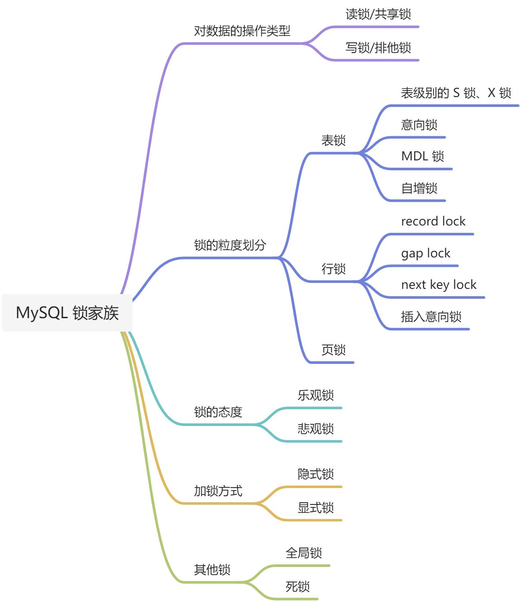
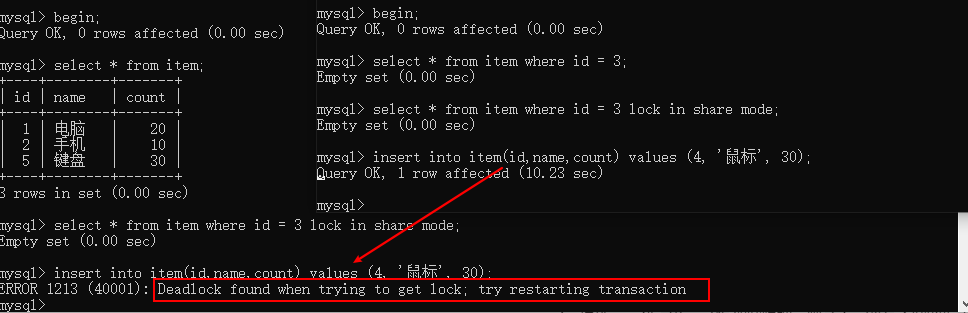
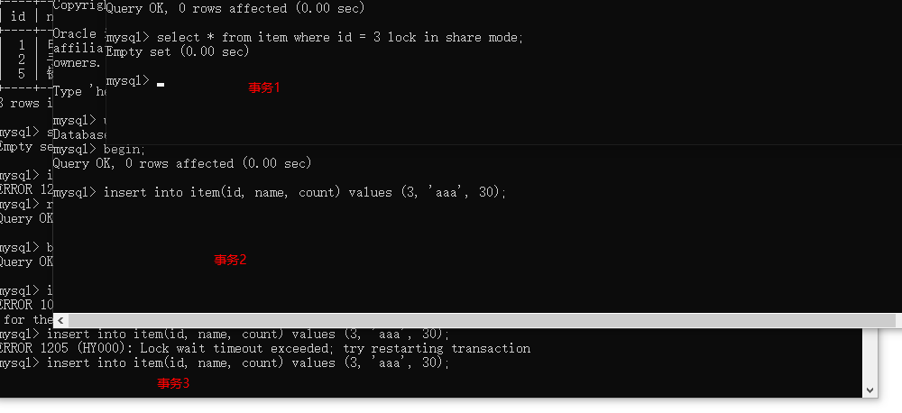
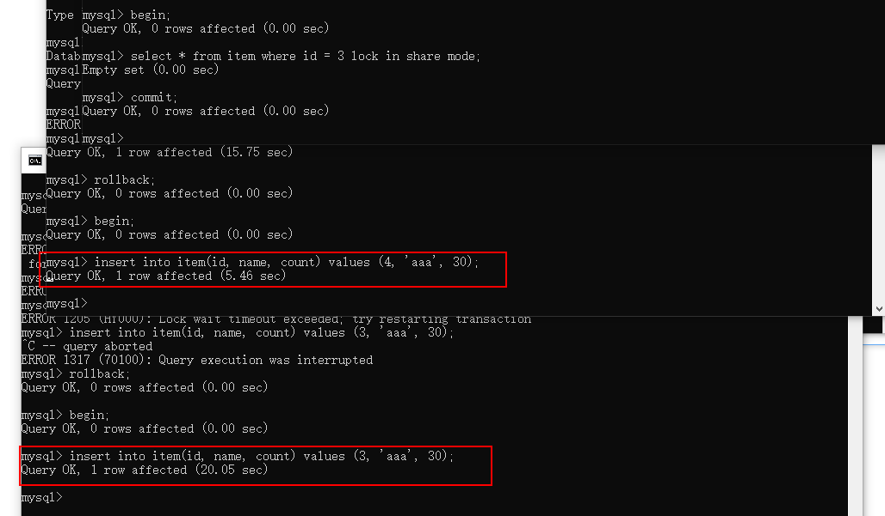
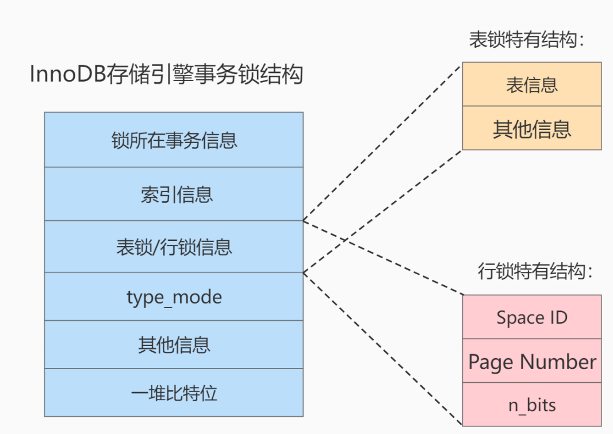
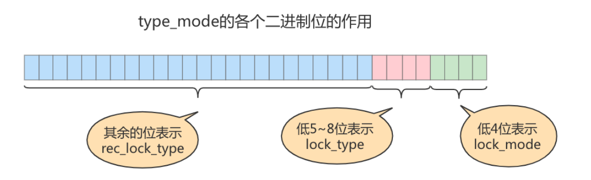
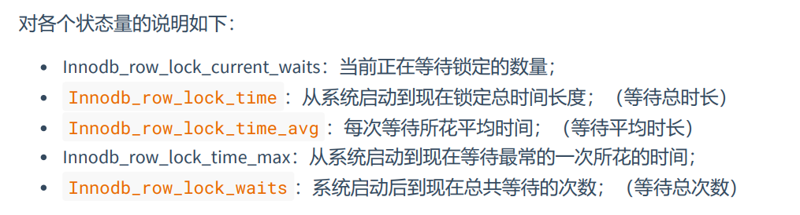

# MySQL 中的锁

# 1.锁的概述

锁是一种对资源并发访问的保护机制，保证了并发访问时数据的正确性。

# 2.MySQL 中事务并发访问相同记录

## 2.1并发读

并发读即两个事务同时对同一条记录进行读取。读操作本身并不会对记录产生影响，所以并不会产生什么问题，因此，并发度是被允许的。

## 2.2并发写

并发写即两个事务同时对一条记录进行写操作。这种情况下会出现`脏写`，这是在任何一种隔离级别下都不允许出现的情况，必须要求两个事务排队进行，这种排队的过程就是通过锁来实现的。

## 2.3并发读写

并发读写即两个事务一个进行读操作，一个进行写操作。这个情况是我们需要重点讨论的，因为它在不同隔离级别下会出现不同的问题，对应的性能也不同，需要在性能和数据一致性中寻求平衡。

- 在读未提交（read uncommited）隔离级别下会出现`**脏读**`的问题
- 在读已提交（read commited）隔离级别下会出现`**不可重复读**`的问题
- 在可重复读（repeatable read）隔离级别下会出现`**幻读**`的问题，可以通过 MVCC 解决一部分，但最终还是需要 gap lock（间隙锁）来解决
- 在串行化（serializable）隔离级别下可以解决以上所有问题，但性能较差。

## 2.4并发问题的解决方案

如何解决`脏读`、`不可重复读`、`幻读`这些问题，其实总共有两种方案可供选择。

### 2.4.1使用 MVCC 进行解决

MVCC 即多版本并发控制。

> 普通的 SELECT 语句在 read commited 和 repeatable read 的隔离级别下会使用到 MVCC 进行记录读取
>
> - 在 read commited 情况下每次 SELECT 都会产生一个新的 ReadView ，ReadView 本身就避免了事务读取到未提交事务所作出的更改，也就避免了脏读的情况。
> - 在 repeatable read 情况下只会在第一次 SELECT 产生一个 ReadView ，之后的每一次 SLEECT 都使用这个 ReadView ，也就避免了不可重复读和幻读的问题。

### 2.4.2读写操作都加锁

这种方案也就是串行化的方式，效率较低，但也有应用场景。

## 2.5二者对比

- 采用 MVCC 方式，读写并不冲突，性能较高
- 采用加锁方式，读写排队执行，性能较差

一般情况下更倾向于采用 MVCC 的方式，但在一些特殊的场景也必须使用加锁的方式，例如银行转账必须保证数据的正确性。

# 3.锁的分类



## 3.1对数据的操作类型

- 读锁：也称共享锁，用 S 表示。针对同一份数据，多个事务的读操作可以同时进行，互不影响，相互之间不会阻塞
- 写锁：也称排他锁，用 X 表示。当前事务写操作没有完成之前，会阻塞其他事务的写操作。这样能够保证在给定时间内只有一个事务能够执行写入，并防止其他事务读取正在写入的数据。

在 Innodb 引擎中读锁和写锁既可以加在表上，也可以加载行上。

### 3.1.1读操作加锁

在采用加锁的方式解决脏读、不可重复读和幻读的时候，读取记录时需要获取这条记录的 S 锁。但是这种说法并不正确，因为有时候需要获取该记录的 X 锁。基于这些需求，MySQL 提供了以下几种特殊的 SELECT 格式。

- 对记录加 S 锁

```sql
select ... from ... lock in share mode;
-- 8.0 新语法
select ... from ... for share;
```

- 对记录加 X 锁

```sql
select ... from ... for update;
```

**MySQL8.0 的新特性**

在 MySQL5.7及之前的版本，如果`select for update`获取不到锁，就会一直阻塞，直到`innodb_lock_wait_timeout`超时。

在 MySQL8.0 版本中提供了`NOWAIT、SKIP LOCKED`语法，用来跳过锁等待但是会报错（NOWATI）；或者跳过锁定的记录，直接返回未锁定的记录（SKIP LOCKED）。

### 3.1.2写操作加锁

针对`INSERT、UPDATE、DELETE`操作统称为写操作，写操作会自动加上 X 锁。

- DELETE：DELETE 操作其过程相当于先在 B+ 树中定位到需要删除的记录，然后对该记录加 X 锁，最后执行 delete mark 操作。
- UPDATE：对一条记录的 UPDATE 操作分为以下三种情况
  - 不修改主键值，且被更新的列所占用的存储空间在修改前后不改变，则其过程相当于先在 B+ 树中定位到这条记录，然后获取到这条记录的 X 锁，最后在原位置进行记录的修改。
  - 不修改主键值，但至少有一个被更新的列所占用的存储空间在修改前后发生改变，则其过程相当于先在 B+ 树中获取待修改记录的位置，然后对该记录加 X 锁，最后删除这条记录，并插入一条新纪录，插入过程由 INSERT 操作提供的`隐式锁`进行保护。
  - 修改了主键值，则其过程相当于先在 B+ 树中获取待修改记录的位置，然后对该记录加 X 锁，最后删除这条记录并插入一条新纪录。
- INSERT：一般情况下插入一条新纪录并不加锁，而是通过一种`隐式锁`对其进行保护，防止这条记录在提交前被其他事务访问。

## 3.2从数据操作的粒度

锁的粒度越小，并发性越高，系统消耗越大。

### 3.2.1表锁

表锁会锁住整张表，它是 MySQL 最基本的锁策略，即无论是什么存储引擎都支持表锁，并且表锁是开销最小的策略，因为它的粒度最大。由于表级锁一次将整张表锁住，所以可以很好的避免死锁。

#### 1.表级别的 S 锁、X 锁

一般情况下，不会在 Innodb 引擎下使用表锁。只会在一些特殊情况下，例如崩溃恢复使用。在系统变量`autocommit=0、innodb_table_locks=1`时手动获取 Innodb 引擎下的表级锁语法如下：

- `lock table t read;`：获取表 t 的 S 锁。
- `lock table t write;`：获取表 t 的 X 锁。

查看系统中是否有表被锁可以使用如下语句：

`show open tables where in_use > 0;`


释放表级锁：

`unlock tables;`

表级别的 S 锁和 X 锁对比：

|**锁类型**|**自己是否可以读**|**自己是否可写**|**自己是否可以操作其他表**|**他人可读**|**他人可写**|
| ----| --| --| --| ----------| ----------|
|S 锁|是|否|否|是|否，需等待|
|X 锁|是|是|否|否，需等待|否，需等待|

MyISAM 在执行 SELECT 操作前会给表加 S 锁，在执行增删改操作前会给表加 X 锁。Innodb 引擎则不会对这些操作加表级锁。

#### 2.意向锁

Innodb 支持多粒度的锁，它允许行级锁和表级锁共存，而意向锁就是其中一种表锁。

意向锁分为两种：

- 意向共享锁：事务有意向给表中的某些行加共享锁

```sql
-- 事务要获取某些行的共享锁必须要先获取表的 IS 锁
select ... from ... lock in share mode;
```

- 意向排他锁：事务有意向给表中的某些行加排他锁

```sql
-- 事务要获取某些行的排他锁必须先要获取表的 IX 锁
select ... from ... for update;
```

即：意向锁是由存储引擎维护的，不需要用户显式加锁。在为数据行加共享/排他锁之前，Innodb 会对所在表加意向共享/排他锁

**意向锁解决的问题：**

> 例如：
>
> 事务 A 对 user 表中的一行数据加了 X 锁
>
> 事务 B 希望获取 user 表的 X 锁
>
> 此时如果没有意向排他锁就需要逐行判断是否存在某些行被加 X 锁，效率很低，而有了意向排他锁后事务 B 的排他锁会与表的意向排他锁竞争失败。
>
> 意向排他锁为表锁，可以与行锁共存，但与其他表锁存在竞争关系

意向锁相关结论：

1. Innodb 支持多粒度锁，特定场景下，行级锁与表级锁共存。
2. 意向锁直接可以共存，但除了 IS 和 S 之间共存外，其他场景均互斥
3. IS、IX 是表级锁，不会与行级 S 锁、X 锁发生冲突，只会和表记的 X 锁、S 锁冲突
4. 意向锁在保证并发性能的前提下，实现了表级锁和行级锁共存且满足事务隔离性的要求

#### 3.自增锁

对于某些表可以设置其主键为 auto_increment，这样在插入时就不用对其进行显式赋值，系统会自动为其赋上递增的值。对于所有的 INSERT 语句都会获取一个表级别的 AUTO_INC 锁。

#### 4.元数据锁（MDL 锁）

当对一个表进行增上改查操作时，会加上 MDL 读锁；对表结构进行改变时会加上 MDL 写锁。MDL 读锁之间不互斥，MDL 读写锁、读读锁间互斥。

元数据锁不需要显式使用，在访问一个表时会自动加上。

### 3.2.2Innodb 中的行锁

#### 1.记录锁

记录锁分为 S 锁和 X 锁，获取一条记录的 S 锁和 X 锁的方式如下：

```sql
-- 获取 S 锁
select * from table_name where id = 1 lock in share mode;
-- 获取 X 锁 有两种方式，查询或者修改 删除
select * from table_name where id = 1 for update;
-- 或者
update table table_name set xxx = xxx where id = 1;
```

#### 2.间隙锁

MySQL 在`repeatable read`隔离级别下可以解决幻读的问题，其方法有两种：加锁和 MVCC。但是在加锁的方案下有个问题：对于还没有插入的记录 MySQL 无法对这些幻影行进行加锁。因此 Innodb 提出了一种`gap locks`的锁，用来防止在某个间隙内插入新的数据。

举例：

假设现在有如下记录：


1. 情况一：对`id = 3`加间隙锁，则`(2, 5)`之间的记录都被加上间隙锁。即，无法在 2 到 5 之间插入记录。
2. 情况二：对 `id = 10`加间隙锁，则`(5, +∞)`之间的记录都被加上间隙锁。即，无法插入大于 5 的记录。

> 共享间隙锁和排他间隙锁之间时可以共存的。
>
> 间隙锁的提出仅仅是为了防止插入幻影记录而提出的。

间隙锁可能会导致出现死锁：

假设事务 1 和事务 2 都对`(2, 5)`添加一个间隙锁，然后又都插入`(2, 5)`之间的记录，那么二者将会互相影响，相互等待。



#### 3.临键锁

临键锁相当于记录锁和间隙锁的一个组合，有时候我们希望既能锁定某些记录，防止在这些记录之间插入数据，所以 Innodb 就提出了一种称为`next-key locks`的锁。Innodb 默认的就是`next-key lock`。

例如对于上述案例在`(2, 5]`之间加临键锁：

```sql
select * from item where id > 2 and id <= 5 for update;
```

难么对于事务 2 既不能对`id = 5`的记录加记录锁，也不能在`(2, 5)`之间插入记录。

#### 4.插入意向锁

对于上述案例，假如事务 1 对于`(2, 5)`之间加了间隙锁，那么事务 2 在`(2, 5)`之间插入记录时会发生等待，同时事务 2 也会获取一把锁，称为插入意向锁`insert intention locks`，表示事务 2 有意向在这个区间内插入记录，当事务 1 释放间隙锁后，事务 2 就可以正常执行插入操作。注意：插入意向锁不是意向锁，意向锁是表级锁，而是`gap 锁`。

同时插入意向锁之间互不影响，也不会影响其他事务继续获取该记录上的任何类型的锁。

演示插入意向锁之间互不影响：

事务 1 获取了(2, 5)之间的间隙锁，事务 2 插入 id = 3 的记录，事务 3 插入 id = 4 的记录。



此时提交事务 1 则事务 2 和事务 3 同时插入成功：



### 3.2.3页锁

页锁的粒度介于行锁和表锁之间，并发性也介于二者之间，会出现死锁情况。

每个层级的锁的数量是有限的，因为锁会占用内存空间，而锁的内存空间是有限的，当锁的数量达到阈值时，就会发生`锁升级`例如将行锁升级为表锁以达到降低锁内存空间占用的目的，但同时并发度也会降低。

## 3.3按加锁的方式

### 3.3.1隐式锁

隐式锁的出现场景：

1. 当事务 1 插入一条记录而未提交时，事务 2 希望读或写该记录时就会给事务 1 的这条记录添加一个隐式锁，这是一个延迟加载的机制。
2. 当事务 1 对于某区间加了间隙锁或临键锁时，事务 2 希望在这个区间内插入一条记录时会产生一个插入意向锁，这个插入意向锁就是一个隐式锁。

> 一级索引的隐藏列：row_id、trx_id 和回滚指针
>
> MySQL8 中查看数据库中的锁：
>
> `select * from performance_schema.data_lock_waits \G;`
>
> MySQL5.7 中查看数据库中的锁：
>
> `select * from information_schema.innodb_lock_waits \G`

### 3.3.2显示锁

以下都为显示锁：

```sql
lock table table_name read;
lock table table_name write;
select ... lock in share mode;
update ...
...
```

## 3.4全局锁

全局锁是针对整个数据库进行加锁。当你的数据库只需要读取时，可以使用这个命令。全局锁的使用场景是：做全库的逻辑备份。

```sql
flush tables with read lock;
```

## 3.5死锁

死锁也就是两个事务都持有对方需要的锁，并且都等待对方释放，此时就会出现死锁。对于死锁的处理策略有两种：

- 第一种策略是直接进入等待，直到超时。这个超时参数通过`innodb_lock_wait_timeout`设置。
- 第二种策略是当检测到死锁后，主动回滚死锁链条中的某一个事务（将持有最少行级排他锁的事务回滚），让其他事务得以继续运行。参数`innodb_deadlock_detect`设置为 on 时表示开启这个逻辑。

# 4.锁的内存结构

在 Innodb 存储引擎中，锁的内存结构如下：



相关结构解析如下：

1. 锁所在事务信息：所有的锁都是由事务产生的，那个事务产生了这个锁结构，这里就记录了相关信息。这是一个指针，方便从内存中获取锁的事务信息，例如事务 id 等。
2. 索引信息：对于行锁而言，需要记录加锁的记录时属于那个索引的。
3. 表锁/行锁信息：表锁/行锁在这个位置所记录的信息是不同的。
   1. 表锁记录的是对于那张表加的锁，及一些其他信息。
   2. 行锁记录了以下三个重要信息：
      1. Space ID：记录所在的表空间。
      2. Page Nunber：记录所在页号。
      3. n_bits：对于行锁而言，一条记录就对应一个比特位，因此在锁结构的末尾就存放了一堆比特位用来记录这些行信息。
4. type_mode：这是一个 32 位的数，被分成了 lock_mode、lock_type 和 rec_lock_type 三部分：



1. lock_mode：锁的模式，占低四位，可选参数如下：
1. LOCK_IS：十进制 0 表示，表示意向共享锁。
2. LOCK_IX：十进制 1 表示，表示意向排他锁。
3. LOCK_S：十进制 2 表示，表示 S 锁。
4. LOCK_X：十进制 3 表示，表示 X 锁。
5. LOCK_AUTO_INC：十进制 4 表示，表示自增锁。
2. lock_type：锁的类型，占 5~8 位，现阶段只有 5、6 位被使用：
1. LOCK_TABLE：十进制的 16 表示，即第 5 位为 1，表示表级锁。
2. LOCK_REC：十进制的 32 表示，即第 6 位为 1，表示行级锁。
3. rec_lock_type：锁的具体类型，使用其余剩余位。只有在 lock_type 为 LOCK_REC 时，才会被细分为更多的类型：
1. LCOK_ORDINARY：十进制的 0 表示，临键锁。
2. LOCK_GAP：十进制的 512，第 10 位为 1，间隙锁。
3. LOCK_REC_NOT_GAP：十进制的 1024，第 11 位为 1，记录锁。
4. LOCK_INSERT_INTENTION：十进制的 2048，第 12 位为 1，插入意向锁。
5. is_waiting：十进制 256 第九位为 1，表示 is_waiting 为 true，也即当前事务尚未获取到锁，处于等待状态。
5. 其他信息：为了更好的管理系统运行过程中生成的各种锁结构而设计了各种哈希表和链表。
6. 一堆比特位：对应行锁结构中的 n_bits。

# 5.锁监控

1. 在 8.0 版本通过检查`innodb_row_lock`等状态变量，来分析系统中的锁争夺情况：

```sql
show variables like 'innodb_row_lock%';
```



2. 查看系统表中的锁信息：
   1. 在 5.7 版本中可以查看以下表：
      1. `information_schema.innodb_trx`
      2. `information_schema.innodb_locks`
      3. `information_schema.innodb_lock_waits`
   2. 在 8.0 版本中可以查看以下表：
      1. `information_schema.innodb_trx`
      2. `performance_schema.data_locks`
      3. `performance_schema.data_lock_waits`
