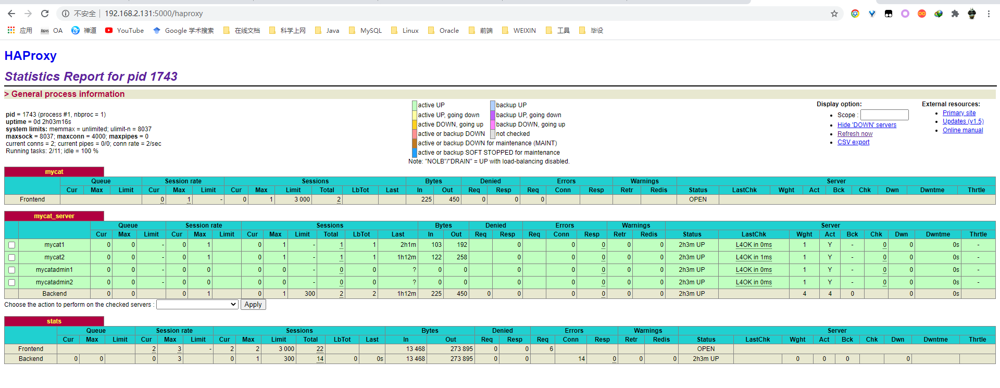
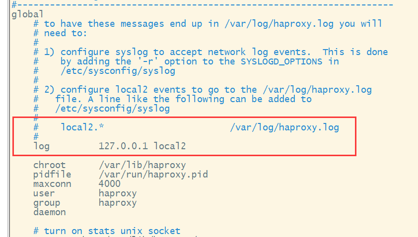
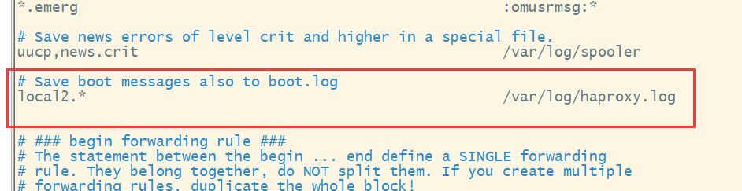
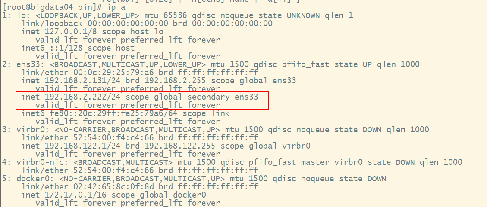

# HAProxy Keepalived

## 1. HAproxy安装配置

`yum -y install haproxy.x86_64`在线安装，配置文件在`/etc/haproxy/haproxy.cfg`修改配置文件如下

```plain
#---------------------------------------------------------------------
# Example configuration for a possible web application.  See the
# full configuration options online.
#
#   http://haproxy.1wt.eu/download/1.4/doc/configuration.txt
#
#---------------------------------------------------------------------

#---------------------------------------------------------------------
# Global settings
#---------------------------------------------------------------------
global
    # to have these messages end up in /var/log/haproxy.log you will
    # need to:
    #
    # 1) configure syslog to accept network log events.  This is done
    #    by adding the '-r' option to the SYSLOGD_OPTIONS in
    #    /etc/sysconfig/syslog
    #
    # 2) configure local2 events to go to the /var/log/haproxy.log
    #   file. A line like the following can be added to
    #   /etc/sysconfig/syslog
    #
    #    local2.*                       /var/log/haproxy.log
    #
    log         127.0.0.1 local2

    chroot      /var/lib/haproxy
    pidfile     /var/run/haproxy.pid
    maxconn     4000
    user        haproxy
    group       haproxy
    daemon

    # turn on stats unix socket
    stats socket /var/lib/haproxy/stats

#---------------------------------------------------------------------
# common defaults that all the 'listen' and 'backend' sections will
# use if not designated in their block
#---------------------------------------------------------------------
defaults
    mode                    tcp
    log                     global
    option                  tcplog
    option                  dontlognull
    option http-server-close
    option forwardfor       except 127.0.0.0/8
    option                  redispatch
    retries                 3
    timeout http-request    10s
    timeout queue           1m
    timeout connect         10s
    timeout client          1m
    timeout server          1m
    timeout http-keep-alive 10s
    timeout check           10s
    maxconn                 3000  

#---------------------------------------------------------------------
# main frontend which proxys to the backends
#---------------------------------------------------------------------
frontend  mycat
bind 0.0.0.0:8066
bind 0.0.0.0:9066
mode tcp
log global
default_backend mycat_server

#---------------------------------------------------------------------
# static backend for serving up images, stylesheets and such
#---------------------------------------------------------------------
backend mycat_server
    balance     roundrobin
    server   mycat1   192.168.2.129:8066 check inter 5s rise 2 fall 3
    server   mycat2   192.168.2.130:8066 check inter 5s rise 2 fall 3
    server   mycatadmin1   192.168.2.129:9066 check inter 5s rise 2 fall 3
    server   mycatadmin2   192.168.2.130:9066 check inter 5s rise 2 fall 3	
listen stats
mode http
bind 0.0.0.0:5000
stats enable
stats hide-version
stats uri /haproxy
stats realm Haproxy\ Statistics
stats auth admin:admin
stats admin if TRUE
```

启动HAproxy：`systemctl start haproxy.service`但是可能启动失败，建议使用`haproxy -D -f /etc/haproxy/haproxy.cfg`启动，通过`netstat -lnp | grep 66`可以查看到配置文件中配置的监听端口8066和9066，同时可以查看到5000端口也被haproxy监听了，在浏览器中输入`http://ip:5000/haproxy`即可看到各个服务的状态



注意修改日志配置文件`/etc/rsyslog.conf`将以下2个指令的注释释放：

```plain
$ModLoad imudp
$UDPServerRun 514
```

同时localX.*中的X要与haproxy配置文件对应





## 2. Keepalived安装配置

通过`yum -y install keepalived.x86_64`安装Keepalived，配置文件在`/etc/keepalived/keepalived.conf` ，修改如下

```plain
global_defs {
    router_id NodeA
}

vrrp_script chk_haproxy {
        script "/etc/check_haproxy.sh"
        interval 4
        weight 3
}
vrrp_instance VI_1 {
    state MASTER
    interface ens33
    virtual_router_id 10
    priority 100
    advert_int 1
    track_script {
    chk_haproxy
    }

    authentication {
    auth_type PASS
    auth_pass 1234
}
virtual_ipaddress {
      192.168.2.222/24
}
}
```

其中第6行script中指定的检查脚本如下，脚本名称需要为check_haproxy.sh并且需要放在etc下

```shell
#!/bin/bash
A=`ps -C haproxy --no-header |wc -l`
if [ $A -eq 0 ];then
/usr/sbin/haproxy -D -f /etc/haproxy/haproxy.cfg
fi
```

在另一台服务器上进行相同的配置即可，但是需要修改配置中第2行的NodeA为NodeB，以及第14行的权重值为90。然后通过`systemctl start keepalived.service`启动两台机器的Keepalived服务。然后通过ip a命令查看ip情况，正常情况是NodeA，权重值为100的机器上有虚拟ip192.168.2.222



此时如果关闭配置了NodeA的机器则经过一定延时后虚拟ip会在NodeB上产生，这样就达到了无缝切换主机和高可用的目的。

## 3.Keepalived编译安装

解决前置依赖：

```sql
yum install -y gcc openssl-devel popt-devel
yum install -y curl gcc openssl-devel libnl3-devel net-snmp-devel ipvsadm
yum install -y libnfnetlink-devel
```

1. 下载`wget http://www.keepalived.org/software/keepalived-1.4.2.tar.gz`
2. 解压`tar -zxvf keepalived-1.4.2.tar.gz`
3. 编译安装`./configure --prefix=/usr/local/keepalived` 然后 `make && make install`
4. 创建目录`/etc/keepalived`
5. 复制配置文件`cp /usr/local/keepalived/etc/keepalived/keepalived.conf /etc/keepalived/`
6. 启动`/usr/local/keepalived/sbin/keepalived`
7. 查看日志`tail -f /var/log/messages`

**master keepalived.conf文件内容**

```sql
global_defs {
    notification_email {
        1602526012@qq.com
    }
    notification_email_from sns-lvs@gmail.com
    smtp_server smtp.hysec.com
    smtp_connection_timeout 30
    router_id nginx_master        # 设置nginx master的id，在一个网络应该是唯一的
}
vrrp_script chk_http_port {
    script "/usr/local/src/check_nginx_pid.sh"    #最后手动执行下此脚本，以确保此脚本能够正常执行
    interval 2                          #（检测脚本执行的间隔，单位是秒）
    weight 2
}
vrrp_instance VI_1 {
    state MASTER            # 指定keepalived的角色，MASTER为主，BACKUP为备
    interface eth0            # 当前进行vrrp通讯的网络接口卡(当前centos的网卡)
    virtual_router_id 66        # 虚拟路由编号，主从要一直
    priority 100            # 优先级，数值越大，获取处理请求的优先级越高
    advert_int 1            # 检查间隔，默认为1s(vrrp组播周期秒数)
    authentication {
        auth_type PASS
        auth_pass 1111
    }
    track_script {
    chk_http_port            #（调用检测脚本）
    }
    virtual_ipaddress {
        192.168.0.200            # 定义虚拟ip(VIP)，可多设，每行一个
    }
}
```

**backup **​**keepalived.conf文件内容**

```sql
global_defs {
    notification_email {
        1602526012@qq.com
    }
    notification_email_from sns-lvs@gmail.com
    smtp_server smtp.hysec.com
    smtp_connection_timeout 30
    router_id nginx_backup              # 设置nginx backup的id，在一个网络应该是唯一的
}
vrrp_script chk_http_port {
    script "/usr/local/src/check_nginx_pid.sh"
    interval 2                          #（检测脚本执行的间隔）
    weight 2
}
vrrp_instance VI_1 {
    state BACKUP                        # 指定keepalived的角色，MASTER为主，BACKUP为备
    interface eth0                      # 当前进行vrrp通讯的网络接口卡(当前centos的网卡)
    virtual_router_id 66                # 虚拟路由编号，主从要一直
    priority 99                         # 优先级，数值越大，获取处理请求的优先级越高
    advert_int 1                        # 检查间隔，默认为1s(vrrp组播周期秒数)
    authentication {
        auth_type PASS
        auth_pass 1111
    }
    track_script {
        chk_http_port                   #（调用检测脚本）
    }
    virtual_ipaddress {
        192.168.0.200                   # 定义虚拟ip(VIP)，可多设，每行一个
    }
}
```

**check_nginx_pid.sh内容**

```sql
#!/bin/bash
A=`ps -C nginx --no-header |wc -l`        
if [ $A -eq 0 ];then                            
    /usr/local/nginx/sbin/nginx                #重启nginx
    if [ `ps -C nginx --no-header |wc -l` -eq 0 ];then    #nginx重启失败
        exit 1
    else
        exit 0
    fi
else
    exit 0
fi
```

修改check_nginx_pid.sh可执行

`chmod 777 /usr/local/src/check_nginx_pid.sh`****
