# Netty学习总结

# 1.BIO应用实例

对于客户端的每个请求创建一个线程来进行数据处理，其中主线程（main线程）会阻塞在`accept`操作上，而处理数据的线程会阻塞在`read`操作上，当没有数据发送时会一直阻塞在`read`操作上。

```java
package cn.junhaox.bio;
import java.io.InputStream;
import java.net.ServerSocket;
import java.net.Socket;
import java.util.concurrent.*;

/**
 * @Author WJH
 * @Description
 * @date 2020/8/31 9:42
 * @Email ibytecode2020@gmail.com
 */
public class BIOServer {

    public static void main(String[] args) throws Exception {
        // 创建线程池
        ExecutorService newCachedThreadPool = Executors.newCachedThreadPool();
        // 如果有客户端连接 创建线程与之通信
        ServerSocket socket = new ServerSocket(6666);
        System.out.println("服务端启动...");
        while (true) {
            // 监听等待连接，accept会阻塞
            System.out.println("等待连接...");
            final Socket accept = socket.accept();
            System.out.println("连接到一个客户端...");
            // 创建一个线程， 与之通信
            newCachedThreadPool.execute(() -> {
                System.out.println(Thread.currentThread().getName());
                // 与客户端通信
                handler(accept);
            });
        }
    }

    public static void handler(Socket socket) {
        System.out.println(Thread.currentThread().getName());
        InputStream in = null;
        try {
            byte[] bytes = new byte[5];
            in = socket.getInputStream();
            while (true) {
                // 管道中无数据，read会阻塞
                System.out.println("阻塞在这里 等待read...");
                int len = in.read(bytes);
                if (len != -1) {
                    System.out.println("阻塞解除，读取数据为：" + new String(bytes, 0, len, "GBK"));
                } else {
                    System.out.println("永远执行不到...");
                    break;
                }
            }
        } catch (Exception e) {
            e.printStackTrace();
        } finally {
            try {
                if (in != null) {
                    in.close();
                }
                if (socket != null) {
                    socket.close();
                }
            } catch (Exception e) {
                e.printStackTrace();
            }
        }
    }
}
```

# 2.NIO应用实例

1. 将字符串写入文本
2. 从文本中读取内容
3. 使用一个ByteBuffer实现文件的拷贝
4. 使用`transferFrom`实现文件拷贝

`OutputStream`和`InputStream`中是包含`Channel`，通过`getChannel`方法即可获取channel，`ByteBuffer`就相当于一个字节数组（其他Buffer也类似于各种数组，不过是由JDK来维护的），Channel就类似于原本的流。

```java
// 案例3
public class NIOFileChannel03 {
    public static void main(String[] args) throws Exception {
        FileInputStream in = new FileInputStream("src/file01.txt");
        FileChannel inChannel = in.getChannel();
        FileOutputStream out = new FileOutputStream("src/file02.txt");
        FileChannel outChannel = out.getChannel();
        ByteBuffer byteBuffer = ByteBuffer.allocate(2);
        while (inChannel.read(byteBuffer) != -1) {
            byteBuffer.flip();
            outChannel.write(byteBuffer);
            byteBuffer.clear();
        }
        in.close();
        out.close();
    }
}
```

```java
// 案例4
public class NIOFileChannel04 {
    public static void main(String[] args) throws Exception {
        FileInputStream in = new FileInputStream("C:\\Users\\dell\\Desktop\\admin.jpg");
        FileChannel inChannel = in.getChannel();
        FileOutputStream out = new FileOutputStream("src/admin.jpg");
        FileChannel outChannel = out.getChannel();
        outChannel.transferFrom(inChannel, 0, inChannel.size());
        in.close();
        out.close();
    }
}
```

## 2.1NIO实现聊天室

**1.服务端实现步骤**

1. 创建ServerSocketChannel，并监听端口将其设置为非阻塞模式（否则无法加入到Selector中）
2. 创建Selector
3. 将ServerSocketChannel注册到Selector中，并设置其感兴趣的事件监听
4. 循环处理，阻塞（或非阻塞）式的监听是否有已经注册的事件发生
5. 获取已经发生的事件的SelectionKeys
6. 遍历SelectionKeys判断其事件类型，做出相应处理
   - 当有客户端连接时，获取客户端的Channel并注册Read事件到Selector
   - 当客户端Channel发送Read事件时读取客户端的数据，并分发到其他客户端

```java
package cn.junhaox.nio.groupchat;


import java.io.IOException;
import java.net.InetSocketAddress;
import java.nio.ByteBuffer;
import java.nio.channels.*;
import java.nio.charset.StandardCharsets;
import java.util.Iterator;
import java.util.Set;

/**
 * @Author WJH
 * @Description
 * @date 2020/9/1 17:16
 * @Email ibytecode2020@gmail.com
 */
public class GroupChatServer {
    private Selector selector;
    private ServerSocketChannel listenChannel;
    private static final int PORT = 6667;

    public GroupChatServer() {
        try {
            // 得到选择器
            selector = Selector.open();
            listenChannel = ServerSocketChannel.open();
            // 设置端口
            listenChannel.bind(new InetSocketAddress(PORT));
            // 设置非阻塞模式
            listenChannel.configureBlocking(false);
            // 将channel 注册到Selector 此时只注册的Accept事件
            listenChannel.register(selector, SelectionKey.OP_ACCEPT);
        } catch (IOException e) {
            e.printStackTrace();
        }
    }

    private void listen() {
        try {
            // 循环处理
            while (true) {
                // 阻塞式的等待是否有已经注册的事件发生 第一次时只有当Accept事件发生时才会解除阻塞
                // 但是下面又将得到的SocketChannel 注册到了Selector，并监听了Read事件
                int count = selector.select();
                // 有事件处理
                if (count > 0) {
                    Set<SelectionKey> keys = selector.selectedKeys();
                    Iterator<SelectionKey> it = keys.iterator();
                    while (it.hasNext()) {
                        SelectionKey key = it.next();
                        // 有连接
                        if (key.isAcceptable()) {
                            SocketChannel sc = listenChannel.accept();
                            sc.configureBlocking(false);
                            // 注册sc到selector
                            sc.register(selector, SelectionKey.OP_READ);
                            // 给出提示
                            System.out.println(sc.getRemoteAddress() + " 上线 ");
                        }
                        if (key.isReadable()) {
                            // 处理读...
                            readData(key);
                        }
                        it.remove();
                    }
                } else {
                    System.out.println("等待...");
                }
            }
        } catch (IOException e) {
            e.printStackTrace();
        }
    }

    private void readData(SelectionKey key) {
        SocketChannel channel = null;
        try {
            channel = (SocketChannel) key.channel();
            ByteBuffer byteBuffer = ByteBuffer.allocate(1024);

            int len = channel.read(byteBuffer);
            if (len > 0) {
                String msg = new String(byteBuffer.array(), StandardCharsets.UTF_8);
                System.out.println("from client : " + msg);
                // 向其他客户端发送消息
                sendMsgToOtherClient(msg, channel);
            }

        } catch (IOException e) {
            try {
                System.out.println(channel.getRemoteAddress() + " 离线了... ");
                // 取消注册
                key.channel();
                // 关闭通道
                channel.close();
            } catch (IOException ex) {
                ex.printStackTrace();
            }
        }
    }

    private void sendMsgToOtherClient(String msg, SocketChannel self) throws IOException {
        System.out.println("服务器转发消息中...");
        // 遍历所有注册到selector中的channel 并排除自己
        for (SelectionKey key : selector.keys()) {
            Channel targetChannel = key.channel();
            if (targetChannel instanceof SocketChannel && targetChannel != self) {
                // 转型
                SocketChannel dest = (SocketChannel) targetChannel;
                // 获取buffer
                ByteBuffer byteBuffer = ByteBuffer.wrap(msg.getBytes(StandardCharsets.UTF_8));
                // 写数据
                dest.write(byteBuffer);
            }
        }
    }


    public static void main(String[] args) {
        GroupChatServer server = new GroupChatServer();
        server.listen();
    }

}

```

**1.客户端实现步骤**

1. 创建SocketChannel，并监听服务端ip+端口，将SocketChannel设置为非阻塞
2. 创建Selector，将SocketChannel注册到Selector，并监听Read事件
3. 从控制台获取输入发送至服务端
4. 创建一个线程，监听Read事件，并将服务端转发的数据显示在本地

```java
package cn.junhaox.nio.groupchat;


import java.io.IOException;
import java.net.InetSocketAddress;
import java.nio.ByteBuffer;
import java.nio.channels.SelectionKey;
import java.nio.channels.Selector;
import java.nio.channels.SocketChannel;
import java.nio.charset.StandardCharsets;
import java.util.Iterator;
import java.util.Scanner;

/**
 * @Author WJH
 * @Description
 * @date 2020/9/1 17:40
 * @Email ibytecode2020@gmail.com
 */
public class GroupChatClient {
    private static final String HOST = "127.0.0.1";
    private static final int SERVER_PORT = 6667;
    private Selector selector;
    private SocketChannel socketChannel;
    private String username;

    public GroupChatClient() {
        try {
            selector = Selector.open();
            socketChannel = SocketChannel.open(new InetSocketAddress(HOST, SERVER_PORT));
            socketChannel.configureBlocking(false);
            socketChannel.register(selector, SelectionKey.OP_READ);
            username = socketChannel.getLocalAddress().toString().substring(1);
            System.out.println(username + " is ok ... ");
        } catch (IOException e) {
            e.printStackTrace();
        }

    }

    /**
     * 向服务器发送消息
     * @param msg 消息
     */
    private void sendMsg(String msg) {
        msg = username + "说： " + msg;
        try {
            socketChannel.write(ByteBuffer.wrap(msg.getBytes(StandardCharsets.UTF_8)));
        } catch (IOException e) {
            e.printStackTrace();
        }
    }

    private void readMsg() {
        try {
            int readChannel = selector.select();
            // 有可用通道
            if (readChannel > 0) {
                Iterator<SelectionKey> it = selector.selectedKeys().iterator();
                while (it.hasNext()) {
                    SelectionKey key = it.next();
                    if (key.isReadable()) {
                        SocketChannel sc = (SocketChannel) key.channel();
                        ByteBuffer byteBuffer = ByteBuffer.allocate(1024);
                        sc.read(byteBuffer);
                        String msg = new String(byteBuffer.array(), StandardCharsets.UTF_8);
                        System.out.println(msg.trim());
                    }
                }
                it.remove();
            }
        } catch (IOException e) {
            e.printStackTrace();
        }
    }

    public static void main(String[] args) {
        GroupChatClient client = new GroupChatClient();
        // 读取服务器发送数据
        new Thread(() -> {
            while (true) {
                client.readMsg();
            }
        }).start();

        Scanner scanner = new Scanner(System.in);
        while (scanner.hasNextLine()) {
            client.sendMsg(scanner.nextLine());
        }
    }
}
```

# 3.Netty简介

Netty是基于NIO的异步事件驱动模型的网络应用程序框架，用于快速开发可维护的高性能协议服务器和客户端。

# 4.Netty的工作架构图

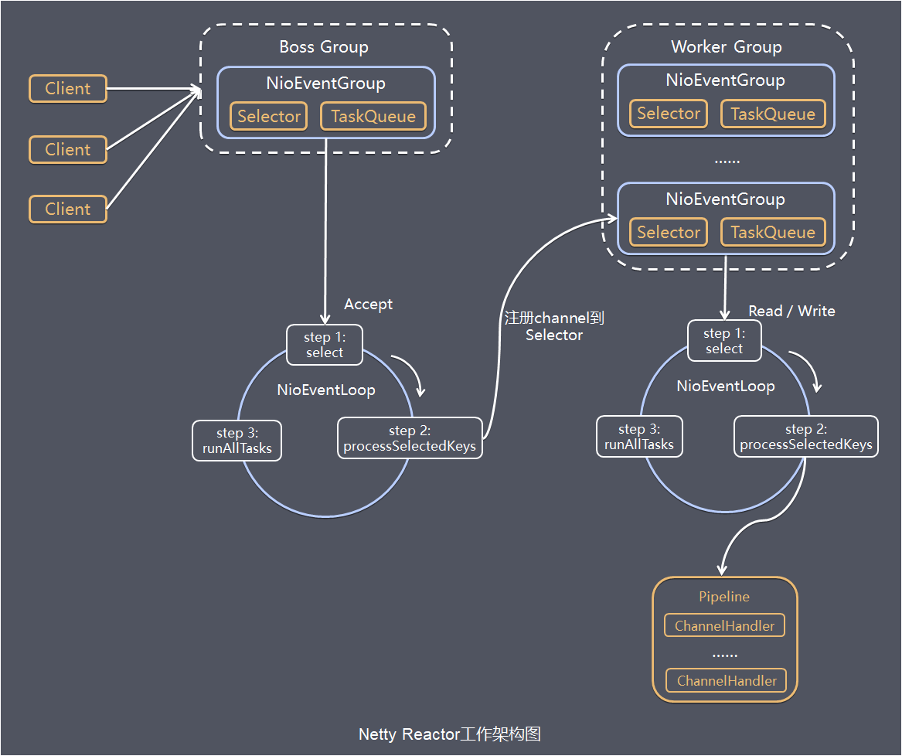

1. 首先是一个`BossGroup（NioEventGroup）`，其中包含多个`NioEventLoop（一般情况下只设置1个，默认情况下为CPU核心数 * 2）`，进行`accept`轮训事件，即BossGroup只处理连接事件。`Boss NioEventLoop`循环执行的步骤：
   - 轮训accept事件
   - 处理accept事件，与client建立连接，生成NioSocketChannel，并将其注册到某个WorkerNioEventLoop上的selector
   - 处理任务队列即`runAlltasks`
2. 第二个是`WorkerEventGroup（NioEventGroup）`，`其中默认包含CPU核心数 * 2个NioEventLoop`，负责处理读、写事件。`Worker NioEventLoop`循环执行步骤：
   - 轮训read、write事件
   - 处理i/o事件（读写事件），在对应的NioSocketChannel处理
   - 处理任务队列即`runAlltasks`
3. 第三个是向Worker NioEventLoop中添加ChannelHandler（自定义或者Netty预定义的），用来进行业务处理，一般情况下建议自定义的用来处理业务逻辑的有读写操作的ChannelHandler放在最后，自定义编解码器也需要放在该ChannelHandler前面（目前认知，原因未知）

# 5.快速构建Netty服务端和客户端

## 5.1构建服务端

1. 构建两个EventLoopGroup，bossGroup和workerGroup
2. 创建服务端引导`ServerBootstrap`，并设置bossGroup和workerGroup
3. 设置服务端channel为NioServerSocketChannel
4. 设置option：给bossGroup设置相关参数（可选）
5. 设置childOption：给workerGroup设置相关参数（可选）
6. 设置handler：给bossGroup设置ChannelHandler（一般不设置，目前没设置过。2020年9月8日17:24:12）
7. 设置childHandler：给workerGroup设置ChannelHandler（重要），通过实例化`ChannelInitializer`来初始化`ChannelHandler`并向SocketChannel中的pipeline添加其他ChannelHandler进行业务处理
8. 服务端引导ServerBootstrap绑定端口

```java
private void start() throws InterruptedException {
    EventLoopGroup workerGroup = new NioEventLoopGroup(4);
    EventLoopGroup bossGroup = new NioEventLoopGroup(1);
    try {
        ServerBootstrap bootstrap = new ServerBootstrap();
        bootstrap.group(bossGroup, workerGroup)
            .channel(NioServerSocketChannel.class)
            .option(ChannelOption.SO_BACKLOG, 128)
            .childOption(ChannelOption.SO_KEEPALIVE, true)
            .childHandler(new ChannelInitializer<SocketChannel>() {
                @Override
                protected void initChannel(SocketChannel socketChannel) throws Exception {
                    socketChannel.pipeline().addLast(new EchoServerHandler());
                }
            });
        System.out.println("server is ready...");
        ChannelFuture f = bootstrap.bind(PORT).sync();
        f.channel().closeFuture().sync();
    } finally {
        bossGroup.shutdownGracefully().sync();
        workerGroup.shutdownGracefully().sync();
    }
}
```

## 5.2构建客户端

1. 构建一个EventLoopGroup，服务端只需要一个EventLoopGroup处理读写事件
2. 创建客户端引导`Bootstrap`，EventLoopGroup
3. 设置服务端channel为NioSocketChannel
4. 设置option：给EventLoopGroup设置相关参数（可选）
5. 设置handler：给EventLoopGroup设置ChannelHandler（重要），通过实例化`ChannelInitializer`来初始化`ChannelHandler`并向SocketChannel中的pipeline添加其他ChannelHandler进行业务处理
6. 客户端引导Bootstrap连接服务端，发送accept请求

```java
private void start() throws Exception {
    EventLoopGroup group = new NioEventLoopGroup();
    try {
        Bootstrap b = new Bootstrap();
        b.group(group)
            .channel(NioSocketChannel.class)
            .remoteAddress(new InetSocketAddress(HOST, PORT))
            .handler(new ChannelInitializer<SocketChannel>() {
                @Override
                public void initChannel(SocketChannel ch)
                    throws Exception {
                    ch.pipeline().addLast(
                        new EchoClientHandler());
                }
            });
        ChannelFuture f = b.connect().sync();
        f.channel().closeFuture().sync();
    } finally {
        group.shutdownGracefully().sync();
    }
}
```

# 6.Netty中的核心组件

## 6.1Channel

Channel是NIO中的一个基本构造，它可以表示为客户端和服务端之间的通道，是双向的，用作于数据传输的载体，因此它可以被打开或关闭，连接或者断开连接。传输中的Channel类型多为`NioSocketChannel`，常用的Channel多为`SocketChannel`

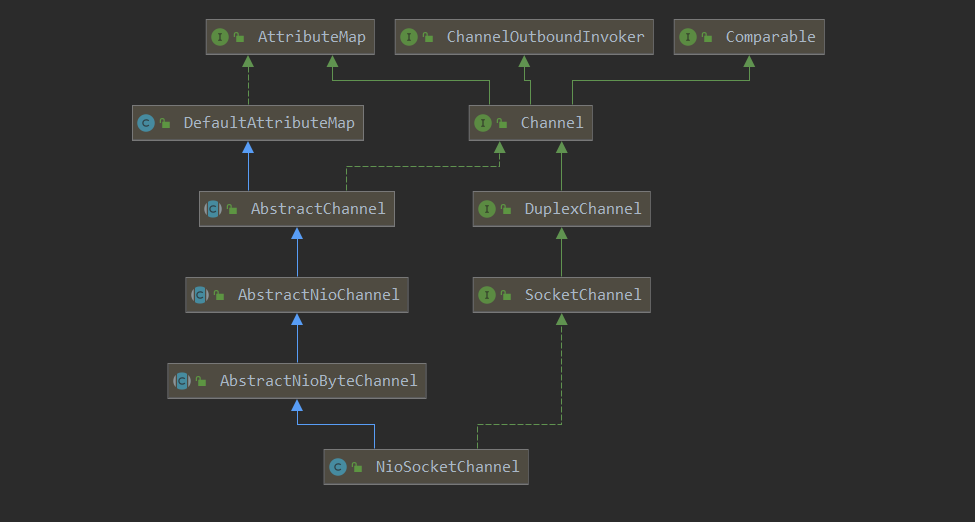

## 6.2ChannelFuture

`ChannelFuture`继承自`Future`而`Future`继承自JDK的`Future`，用来保存Channel异步操作的结果，在Netty中所有的I/O操作都是异步的。这意味着任何的I/O调用都将立即返回，而不保证这些被请求的I/O操作在调用结束的时候已经完成。取而代之地，你会得到一个返回的ChannelFuture实例，这个实例将给你一些关于I/O操作结果或者状态的信息。每个Future对应一个Channel对象，当一个新的I/O开始时，一个新的Channel对象被创建，一个新的Future对象也将被创建。

对于一个ChannelFuture可能已经完成，也可能未完成。当一个I/O操作开始的时候，一个新的future对象就会被创建。在开始的时候，新的future是未完成的状态－－它既非`成功`、`失败`，也非`被取消`，因为I/O操作还没有结束。如果I/O操作以`成功`、`失败`或者`被取消`中的任何一种状态结束了，那么这个future将会被标记为`已完成`，并包含更多详细的信息（例如：失败的原因）。请注意，即使是`失败`和`被取消`的状态，也是属于`已完成`的状态。

                        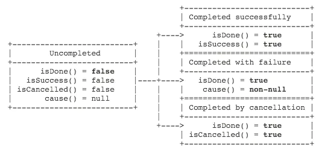

`ChannelFuture的状态`

## 6.3ChannelHandler

ChannelHandler是用来处理入站和出站数据的应用程序逻辑的容器，也可以将数据从一种格式转换为另外一种格式，或者处理转换过程中所抛出的异常，并将其转发到其`ChannelPipeline`（业务处理链）中的下一个处理程序。

通常情况下我们需要继承`SimpleChannelInboundHandler<I>`（已知通信数据类型例如`String`或者`TextWebSocketFrame`：WebSocket通信中的帧）或者基础`ChannelInboundHandlerAdapter`，此时传输的数据多为Bytebuf。

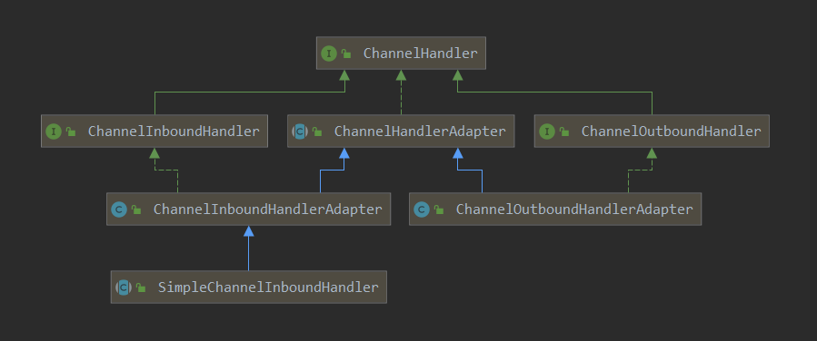**ChannelInboundHandler中相关回调方法的调用时机**

|channelRegistered|当前channel注册到EventLoop|
| -------------------------| ----------------------------------------------------------|
|channelUnregistered|当前channel从EventLoop取消注册|
|channelActive|当前channel活跃的时候|
|channelInactive|当前channel不活跃的时候，也就是当前channel到了它生命周期末|
|channelRead|当前channel从远端读取到数据|
|channelReadComplete|channel read消费完读取的数据的时候被触发|
|userEventTriggered|用户事件触发的时候，可以用来实现Netty心跳机制|
|channelWritabilityChanged|channel的写状态变化的时候触发|

**ChannelOutboundHandler****中相关回调方法的调用时机**

|bind |bind操作执行前触发 |
| -----------| --------------------------|
|connect |connect 操作执行前触发 |
|disconnect |disconnect 操作执行前触发 |
|close |close操作执行前触发 |
|deregister |deregister操作执行前触发 |
|read |read操作执行前触发 |
|write |write操作执行前触发 |
|flush |flush操作执行前触发|

## 6.4ChannelPipeline

ChannelPipeline提供了ChannelHandler链的容器，并定义了用于在该链上传播入站和出站事件流的API（它负责处理和拦截inbound和outbound的事件和操作）。当Channel 被创建时，它会被自动地分配到它专属的ChannelPipeline，Netty中没个Channel都有且仅有一个ChannelPipeline与之对应：

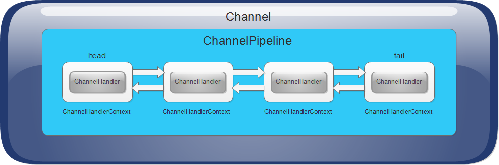

- 一个Channel中包含一个ChannelPipeline，而ChannelPipeline中又维护了由ChannelHandlerConetxt组成的双向链表，并且每个ChannelHandlerContext中又关联着一个ChannelHandler
- 入站事件和出站事件在一个双向链表中，入站事件会从链表head往后传递到最后一个入站的handler,出站事件会从链表tail往前传递到最前一个出站的handler,两种类型的handler互不干扰

**ChannelHandler被安装到ChannelPipeline的过程如下：**

1. 一个ChannelInitializer的实现被注册到了ServerBootstrap中或者Bootstrap中
2. 当ChannelInitializer.initChannel()方法被调用时，ChannelInitializer将在ChannelPipeline 中安装一组自定义的ChannelHandler
3. ChannelInitializer 将它自己从ChannelPipeline 中移除。

## 6.5ChannelHandlerConetxt

1. 保存Channel相关的所有上下文信息，同时关联一个ChannelHandler对象
2. ChannelHandlerContext中包含一个具体的事件处理器ChannelHandler，同时ChannelHandlerContext中也绑定了pipeline和Channel的相关信息，方便对ChannelHandler的调用
3. 常用方法
   - `ChannelFuture close();`=》关闭通道
   - `ChannelHandlerContext flush();`=》刷新
   - `ChannelFuture writeAndFlush(Object msg);`=》将数据写到ChannelPipeline中当前ChannelHandler的下一个ChannelHandler处理（出站）

## 6.6EventLoopGroup和EventLoop

1. EventLoopGroup 是一组EventLoop 的抽象，Netty 为了更好的利用多核CPU 资源，一般会有多个EventLoop同时工作，每个EventLoop 维护着一个Selector 实例。
2. EventLoopGroup 提供next 接口，可以从组里面按照一定规则获取其中一个EventLoop 来处理任务。在Netty服务器端编程中， 我们一般都需要提供两个EventLoopGroup ， 例如： BossEventLoopGroup 和WorkerEventLoopGroup。
3. 通常一个服务端口即一个ServerSocketChannel 对应一个Selector 和一个EventLoop 线程。BossEventLoop 责接收客户端的连接并将SocketChannel 交给WorkerEventLoopGroup 来进行IO 处理，如下图所示

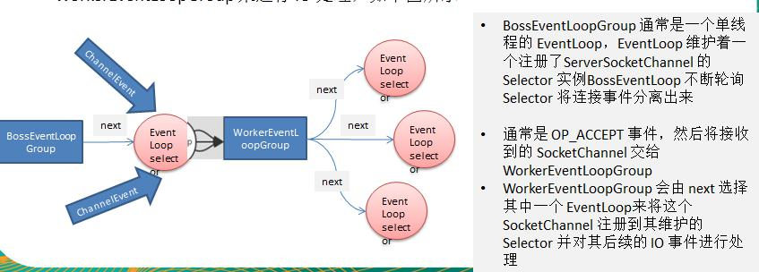

# 7.Netty应用实例

## 7.1向EventLoop中添加自定义任务

在自定义ChannelHandler中通过ChannelHandlerContext获取EventLoop，并向EventLoop中添加普通任务（存储在taskQueue中）和定时任务（存储在scheduledTaskQueue中）如图：

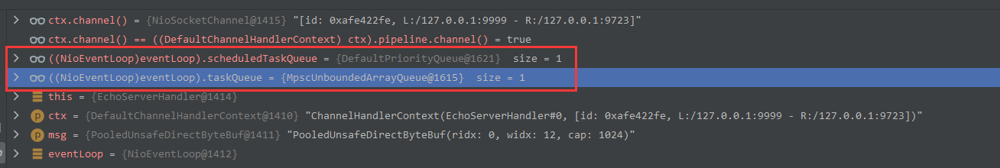

**自定义Handler代码**

```java
import io.netty.buffer.Unpooled;
import io.netty.channel.*;
import io.netty.util.CharsetUtil;
import java.util.concurrent.TimeUnit;
public class EchoServerHandler extends ChannelInboundHandlerAdapter {
    @Override
    public void channelRead(ChannelHandlerContext ctx, Object msg) {
        ctx.writeAndFlush(Unpooled.copiedBuffer("hello 1", CharsetUtil.UTF_8));
        EventLoop eventLoop = ctx.channel().eventLoop();
        // 执行任务
        eventLoop.execute(() -> {
            try {
                Thread.sleep(10000);
                ctx.writeAndFlush(Unpooled.copiedBuffer("hello 3", CharsetUtil.UTF_8));
            } catch (Exception e) {
                e.printStackTrace();
            }
        });
        // 延迟 5s 后执行 任务，但是需要等到上一个任务执行完成之后
        eventLoop.schedule(() -> {
            ctx.writeAndFlush(Unpooled.copiedBuffer("hello 4", CharsetUtil.UTF_8));
        }, 5, TimeUnit.SECONDS);
        System.out.println("go on ...");
    }
    @Override
    public void channelReadComplete(ChannelHandlerContext ctx) {
        ctx.writeAndFlush(Unpooled.copiedBuffer("hello 2", CharsetUtil.UTF_8));
    }
    @Override
    public void exceptionCaught(ChannelHandlerContext ctx, Throwable cause) {
        cause.printStackTrace();
        ctx.close();
    }
}

```

## 7.2Netty编写Http服务端

与普通Netty服务端基本相同，注意在添加自定义ChannelHandler之前需要先添加`HttpServerCodec`用来实现Http请求响应的编解码，在自定义ChannelHandler时继承`SimpleChannelInboundHandler`时可以将消息类型指定为HttpObject。

**相关代码**

```java
public class TestServer {
    public static void main(String[] args) throws Exception {
        EventLoopGroup bossGroup = new NioEventLoopGroup();
        EventLoopGroup workGroup = new NioEventLoopGroup();
        try {
            ServerBootstrap bootstrap = new ServerBootstrap();
            bootstrap.group(bossGroup, workGroup)
                    .channel(NioServerSocketChannel.class)
                    .childHandler(new TestServerInitializer());
            ChannelFuture future = bootstrap.bind(8000).sync();
            future.channel().closeFuture().sync();
        } finally {
            bossGroup.shutdownGracefully();
            workGroup.shutdownGracefully();
        }
    }
}
```

```java
public class TestServerInitializer extends ChannelInitializer<SocketChannel> {
    @Override
    protected void initChannel(SocketChannel ch) throws Exception {
        ch.pipeline()
                // Http 相关编解码器
                .addLast("myHttpServerCodec", new HttpServerCodec())
                // 自定义 ChannelHandler
                .addLast("TestHttpServerHandler", new TestHttpServerHandler());
    }
}
```

```java
public class TestHttpServerHandler extends SimpleChannelInboundHandler<HttpObject> {
    private static final String ICO = "/favicon.ico";
    @Override
    protected void channelRead0(ChannelHandlerContext ctx, HttpObject msg) throws Exception {
        if (msg instanceof HttpRequest) {
            ByteBuf byteBuf = Unpooled.copiedBuffer("hello , 我是服务器...", CharsetUtil.UTF_8);
            DefaultFullHttpResponse response = new DefaultFullHttpResponse(HttpVersion.HTTP_1_1, HttpResponseStatus.OK, byteBuf);
            HttpRequest httpRequest = ((HttpRequest) msg);
            URI uri = new URI(httpRequest.getUri());
            if (ICO.equals(uri.getPath())) {
                System.out.println("不做响应...");
                return;
            }
            response.headers().set(HttpHeaderNames.CONTENT_TYPE, "text/plain; charset=utf-8")
                    .set(HttpHeaderNames.CONTENT_LENGTH, byteBuf.readableBytes());
            ctx.writeAndFlush(response);
        }
    }
}
```

## 7.3Netty心跳机制和WebSocket长连接

通过Netty开发WebSocket服务端，通过网页与服务端建立长连接，服务端将客户端发送的消息重新转发回去，如果客户端超过一定时间没有发送消息则自动关闭连接，下次发送时重新建立连接。

```java
public class WebSocketServer {
    public void run() {
        EventLoopGroup bossGroup = new NioEventLoopGroup();
        EventLoopGroup workerGroup = new NioEventLoopGroup();
        try {
            ServerBootstrap bootstrap = new ServerBootstrap();
            bootstrap.group(workerGroup, workerGroup)
                    .channel(NioServerSocketChannel.class)
                    .handler(new LoggingHandler(LogLevel.INFO))
                    .childHandler(new ChannelInitializer<SocketChannel>() {
                        @Override
                        protected void initChannel(SocketChannel ch) throws Exception {
                            ChannelPipeline pipeline = ch.pipeline();
                            // WebSocket 基于http 需要 Http编解码器
                            pipeline.addLast(new HttpServerCodec())
                                    // 是以块方式写，添加ChunkedWriteHandler 处理器
                                    .addLast(new ChunkedWriteHandler())
                                    /*
                                    说明
                                    1. http 数据在传输过程中是分段, HttpObjectAggregator ，就是可以将多个段聚合
                                    2. 这就就是为什么，当浏览器发送大量数据时，就会发出多次http 请求
                                     */
                                    .addLast(new HttpObjectAggregator(1024 * 64))
                                    /*
                                    说明
                                    1. 对应websocket ，它的数据是以帧(frame) 形式传递
                                    2. 可以看到WebSocketFrame 下面有六个子类
                                    3. 浏览器请求时ws://localhost:7000/hello 表示请求的uri
                                    4. WebSocketServerProtocolHandler 核心功能是将http 协议升级为ws 协议, 保持长连接
                                    5. 是通过一个状态码101
                                     */
                                    .addLast(new WebSocketServerProtocolHandler("/ws"))
                                    /*
                                    表示监听空闲事件
                                    long readerIdleTime 服务端读空闲的时间 0 表示不监听
                                    long writerIdleTime 服务端写空闲的时间 0 表示不监听
                                    long allIdleTime 服务端读写空闲的时间 0 表示不监听
                                     */
                                    .addLast(new IdleStateHandler(10, 0, 0, TimeUnit.SECONDS))
                                    .addLast(new WebSocketServerHandler());
                        }
                    });
            ChannelFuture future = bootstrap.bind(7000).sync();
            future.channel().closeFuture().sync();
        } catch (Exception e) {
            e.printStackTrace();
        } finally {
            bossGroup.shutdownGracefully();
            workerGroup.shutdownGracefully();
        }
    }
}
```

```java
/**
 * @Author WJH
 * @Description 这里TextWebSocketFrame 类型，表示一个文本帧(frame)
 * @date 2020/9/7 15:46
 * @Email ibytecode2020@gmail.com
 */
public class WebSocketServerHandler extends SimpleChannelInboundHandler<TextWebSocketFrame> {

    @Override
    public void handlerAdded(ChannelHandlerContext ctx) throws Exception {
        System.out.printf("客户端【%s】建立连接\n", ctx.channel().id().asLongText());
    }

    @Override
    protected void channelRead0(ChannelHandlerContext ctx, TextWebSocketFrame msg) throws Exception {
        String text = msg.text();
        System.out.printf("服务端收到消息【%s】\n", text);
        ctx.channel().writeAndFlush(new TextWebSocketFrame(String.format("服务端收到消息【%s】\n", text)));
    }

    @Override
    public void handlerRemoved(ChannelHandlerContext ctx) throws Exception {
        System.out.printf("客户端【%s】断开连接\n", ctx.channel().id().asLongText());
    }

    /**
     * 用户自定义事件 监听 这里 监听空闲事件
     * @param ctx
     * @param evt
     * @throws Exception
     */
    @Override
    public void userEventTriggered(ChannelHandlerContext ctx, Object evt) throws Exception {
        if(evt instanceof IdleStateEvent) {
            //将  evt 向下转型 IdleStateEvent
            IdleStateEvent event = (IdleStateEvent) evt;
            String eventType = null;
            switch (event.state()) {
                case READER_IDLE:
                    eventType = "读空闲";
                    ctx.channel().close();
                    break;
                case WRITER_IDLE:
                    eventType = "写空闲";
                    break;
                case ALL_IDLE:
                    eventType = "读写空闲";
                    break;
                default:
                    break;
            }
            System.out.println(eventType);
        } else {
            System.out.println("evt.getClass() = " + evt.getClass());
        }
    }
}
```

```html
<html>
<head>
  <meta charset="UTF-8">
  <title>Title</title>
</head>
<body>
<form onsubmit="return false">
  <textarea id="sendTextarea" name="message" style="width: 300px; height: 300px"></textarea>
  <button onclick="send(this.form.message.value)">发送消息</button>
  <button onclick="reConnect()">断线重连</button>
  <textarea style="width: 300px; height: 300px" id="respTextarea" readonly></textarea>
  <button onclick="document.getElementById('respTextarea').value = ''">清空消息</button>
</form>
</body>
<script>

  let socket;
  const rt = document.getElementById("respTextarea");

  function getConnect() {
    if (window.WebSocket) {
      socket = new WebSocket("ws://localhost:7000/ws");

      /**
       * 连接开启，与服务端建立连接
       * @param ev
       */
      socket.onopen = function (ev) {
        rt.value = "连接开启了...";
        console.log(ev);
      };

      /**
       * 相当于 channelRead0 方法 读取服务端发送的消息
       * @param ev 服务端收到的消息
       */
      socket.onmessage = function (ev) {
        rt.value = rt.value + "\n" + ev.data;
        console.log(ev);
      };

      /**
       * 断开连接
       * @param ev
       */
      socket.onclose = function (ev) {
        rt.value = rt.value + "\n" + "连接关闭了";
        socket = null;
        console.log(ev);
      }

    } else {
      alert("您的浏览器不支持WebSocket")
    }
  }

  getConnect();

  function reConnect() {
    if (!socket) {
      getConnect();
    } else {
      alert("连接已打开");
    }
  }

  function send(obj) {
    if (!socket) {
      alert("与服务端建立连接失败...");
      return;
    }
    if (socket.readyState === WebSocket.OPEN) {
      socket.send(obj);
      document.getElementById("sendTextarea").value = '';
    } else {
      alert("连接未开启...");
    }
  }
</script>
</html>
```

## 7.4自定义编解码器

当Netty 发送或者接受一个消息的时候，就将会发生一次数据转换。入站消息会被解码：从字节转换为另一种格式（比如java 对象）；如果是出站消息，它会被编码成字节。

Netty 提供一系列实用的编解码器，他们都实现了ChannelInboundHadnler 或者ChannelOutboundHandler接口。在这些类中，channelRead 方法已经被重写了。以入站为例，对于每个从入站Channel 读取的消息，这个方法会被调用。随后，它将调用由解码器所提供的decode()方法进行解码，并将已经解码的字节转发给ChannelPipeline中的下一个ChannelInboundHandler。

**相关代码**

**自定义编码器**

```java
public class MyLong2ByteEncoder extends MessageToByteEncoder<Long> {
    @Override
    protected void encode(ChannelHandlerContext ctx, Long msg, ByteBuf out) throws Exception {
        System.out.println("MyLong2ByteEncoder 被调用");
        out.writeLong(msg);
    }
}
```

**自定义解码器**

```java
public class MyByte2LongDecoder extends ByteToMessageDecoder {
    private static final int LONG_BYTE_LEN = 8;
    @Override
    protected void decode(ChannelHandlerContext ctx, ByteBuf in, List<Object> out) throws Exception {
        System.out.println("MyByte2LongDecoder 被调用");
        if (in.readableBytes() >= LONG_BYTE_LEN) {
            out.add(in.readLong());
        }
    }
}
```

源码[mycodec.zip](https://www.yuque.com/attachments/yuque/0/2020/zip/1590387/1599637051032-c70380bb-0b82-4589-8546-5548b67c801b.zip)

**ChannelHandler执行流程**

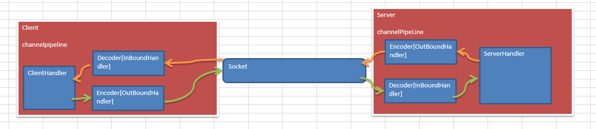

# 8.TCP粘包拆包问题

## 8.1TCP 粘包和拆包基本介绍

1. TCP 是面向连接的，面向流的，提供高可靠性服务。收发两端（客户端和服务器端）都要有一一成对socket，因此，发送端为了将多个发给接收端的包，更有效的发给对方，使用了优化方法（Nagle 算法），将多次间隔较小且数据量小的数据，合并成一个大的数据块，然后进行封包。这样做虽然提高了效率，但是接收端就难于分辨出完整的数据包了，因为面向流的通信是无消息保护边界的
2. 由于TCP 无消息保护边界, 需要在接收端处理消息边界问题，也就是我们所说的粘包、拆包问题, 看一张图
3. 示意图TCP 粘包、拆包图解

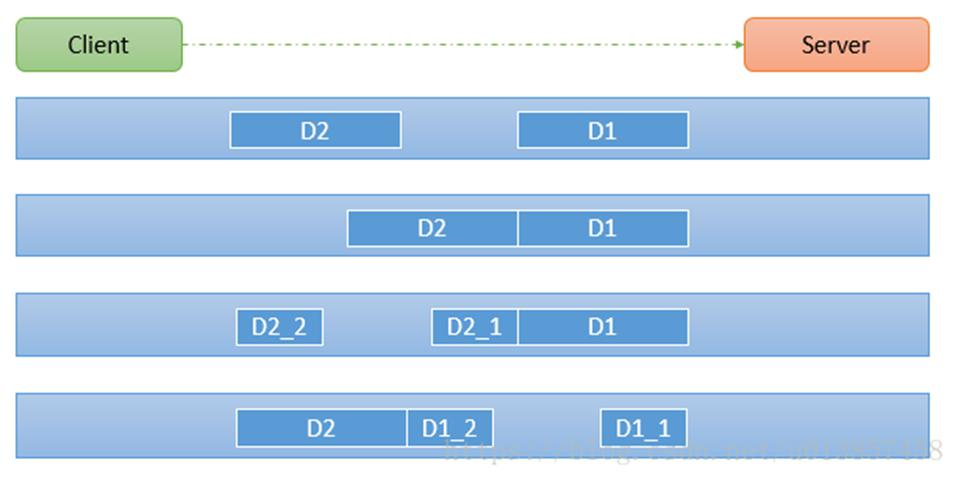

**对图的说明**

假设客户端分别发送了两个数据包D1 和D2 给服务端，由于服务端一次读取到字节数是不确定的，故可能存在以

下四种情况：

- 服务端分两次读取到了两个独立的数据包，分别是D1 和D2，没有粘包和拆包
- 服务端一次接受到了两个数据包，D1 和D2 粘合在一起，称之为TCP 粘包
- 服务端分两次读取到了数据包，第一次读取到了完整的D1 包和D2 包的部分内容，第二次读取到了D2 包的剩余内容，这称之为TCP 拆包
- 服务端分两次读取到了数据包，第一次读取到了D1 包的部分内容D1_1，第二次读取到了D1 包的剩余部分内容D1_2 和完整的D2 包。

## 8.2使用Netty模拟粘包问题

客户端一次发送10次数据，观察服务端接收数据情况

```java
// 客户端发送数据
public void channelActive(ChannelHandlerContext ctx) throws Exception {
    //使用客户端发送10条数据 hello,server 编号
    for(int i= 0; i< 10; ++i) {
        ByteBuf buffer = Unpooled.copiedBuffer("hello,server " + i, StandardCharsets.UTF_8);
        ctx.writeAndFlush(buffer);
    }
}
```

```java
// 服务端接收数据
protected void channelRead0(ChannelHandlerContext ctx, ByteBuf msg) throws Exception {
    byte[] buffer = new byte[msg.readableBytes()];
    msg.readBytes(buffer);
    //将buffer转成字符串
    String message = new String(buffer, StandardCharsets.UTF_8);
    System.out.println("服务器接收到数据 " + message);
    System.out.println("服务器接收到消息量=" + (++this.count));
    //服务器回送数据给客户端, 回送一个随机id ,
    ByteBuf responseByteBuf = Unpooled.copiedBuffer(UUID.randomUUID().toString() + " ", StandardCharsets.UTF_8);
    ctx.writeAndFlush(responseByteBuf);
}
```

 ****​**不同情况：**​ ****

**一次性全部接收**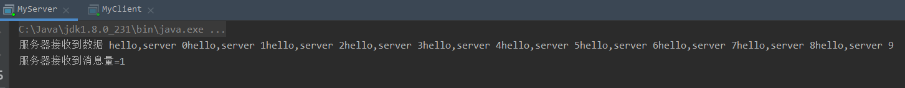

**分5次接收**

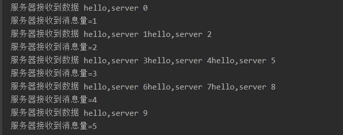

**分4次接收**

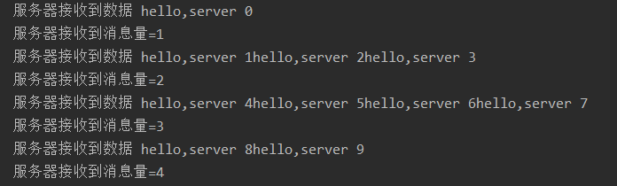

源码[tcp.zip](https://www.yuque.com/attachments/yuque/0/2020/zip/1590387/1599643401043-47fce6de-0264-468d-8eb3-5cc43cbb2661.zip)

## 8.3TCP粘包和拆包解决方案

1. 使用自定义协议（数据包）+ 编解码器来解决
2. 关键就是要解决服务器端每次读取数据长度的问题, 这个问题解决，就不会出现服务器多读或少读数据的问题，从而避免的TCP 粘包、拆包。

**自定义协议**

```java
public class MessageProtocol {
    private int len;
    private byte[] content;
}
```

**自定义编码器**

```java
public class MyMessageEncoder extends MessageToByteEncoder<MessageProtocol> {
    @Override
    protected void encode(ChannelHandlerContext ctx, MessageProtocol msg, ByteBuf out) throws Exception {
        out.writeInt(msg.getLen());
        out.writeBytes(msg.getContent());
    }
}
```

**自定义解码器**

```java
public class MyMessageDecoder extends ByteToMessageDecoder {
    @Override
    protected void decode(ChannelHandlerContext ctx, ByteBuf in, List<Object> out) throws Exception {
        int len = in.readInt();
        byte[] content = new byte[len];
        in.readBytes(content);
        MessageProtocol protocol = new MessageProtocol(content);
        out.add(protocol);
    }
}
```

源码[protocoltcp.zip](https://www.yuque.com/attachments/yuque/0/2020/zip/1590387/1599643974595-f42f4f0a-4280-4f38-88c3-ab82fbeab6d1.zip)

# 9.相关链接和文档

1. [一文理解Netty模型架构](https://juejin.im/post/6844903712435994631)
2. [Netty学习笔记之ChannelHandler](https://juejin.im/post/6844903597302349831)
3. [深入研究Netty框架之ChannelHandler和ChannelPipeline](https://my.oschina.net/7001/blog/994219/print)
4. [ChannelFuture的用法](https://www.jianshu.com/p/4835eb4e91ab)
5. [channel.close和closeFutrue](https://www.jianshu.com/p/a0edfd1d5ddd)

[Netty in Action-中文版.pdf](https://www.yuque.com/attachments/yuque/0/2020/pdf/1590387/1599644402628-4f9b28ba-cad5-4fae-91ae-a7ab29464bf7.pdf)

[尚硅谷Netty核心技术及源码剖析.pdf](https://www.yuque.com/attachments/yuque/0/2020/pdf/1590387/1599644454124-c4794ace-2740-4a31-8d8c-e502c820752f.pdf)
