# Prometheus Grafana 搭建

**安装包如下：**

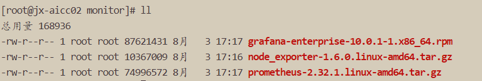

## 1.xxx_exporter 安装

以 node_exporter 为例，解压 node_exporter-1.6.0.linux-amd64.tar.gz：

```properties
tar -zxvf node_exporter-1.6.0.linux-amd64.tar.gz
```

指定端口启动 node_exporter：

```properties
nohup ./node_exporter --web.listen-address=:9100 &
```

## 2.Prometheus 安装

解压 prometheus-2.32.1.linux-amd64.tar.gz：

```properties
tar -zxvf prometheus-2.32.1.linux-amd64.tar.gz
```

修改 prometheus.yml 配置文件：

```yaml
global:
  scrape_interval: 15s
  evaluation_interval: 15s
  scrape_timeout: 3s

scrape_configs:
  - job_name: 'linux'
    static_configs:
    # 可配置多台服务器
    - targets: ['172.30.35.243:9100']
```

启动 Prometheus：

```bash
nohup ./prometheus --config.file=prometheus.yml &
```

访问页面是否启动成功：http://ip:9090

## 3.Grafana 安装

使用 yum 直接安装：

```plain
[root@jx-aicc02 monitor]# ll
总用量 168936
-rw-r--r-- 1 root             root 87621431 8月   3 17:17 grafana-enterprise-10.0.1-1.x86_64.rpm
drwxr-xr-x 2 dolphinscheduler 1002       73 8月   3 17:30 node_exporter-1.6.0.linux-amd64
-rw-r--r-- 1 root             root 10367009 8月   3 17:16 node_exporter-1.6.0.linux-amd64.tar.gz
drwxr-xr-x 5 root             root      265 8月   3 17:37 prometheus-2.32.1.linux-amd64
-rw-r--r-- 1 root             root 74996572 8月   3 17:17 prometheus-2.32.1.linux-amd64.tar.gz
[root@jx-aicc02 monitor]# pwd
/opt/softs/monitor
[root@jx-aicc02 monitor]# yum -y localinstall grafana-enterprise-10.0.1-1.x86_64.rpm
```

启动 grafana：`systemctl start grafana-server.service`

访问页面查看是否安装成功：默认密码 `admin/admin`

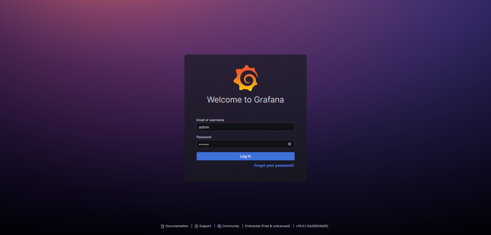

### 3.1配置 grafnan 数据源：

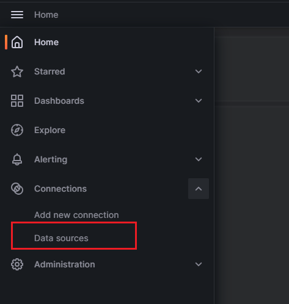

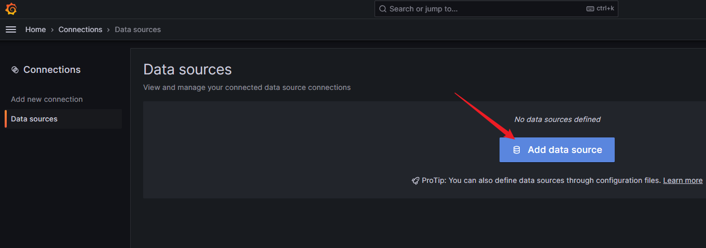

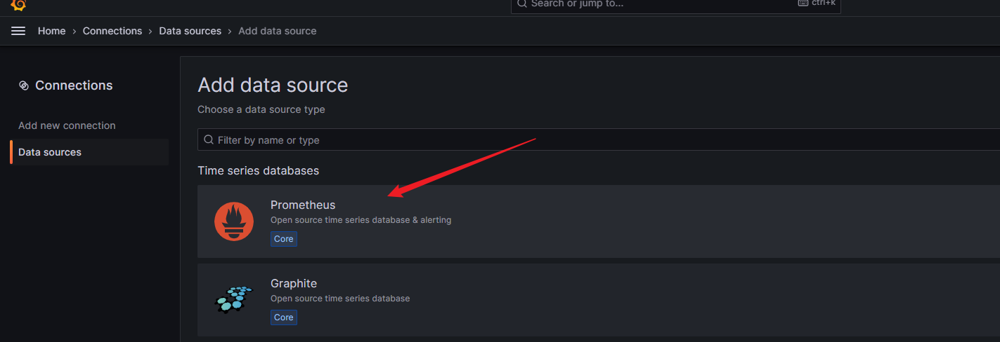

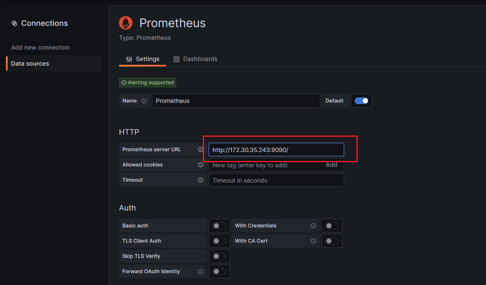


### 3.2添加仪表盘

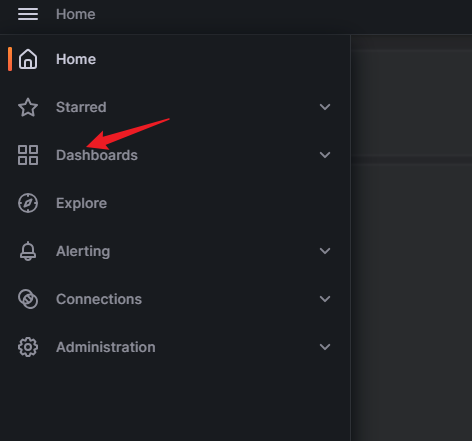

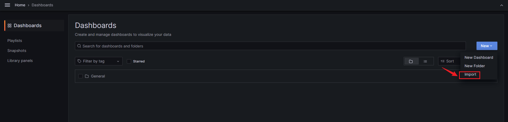

 ****​**访问 grafana 官方仪表盘地址，选择对应 exporter 仪表盘即可：**​ ****

[Dashboards | Grafana Labs](https://grafana.com/grafana/dashboards/)

浏览器有外网直接通过 id 导入即可，无外网可以先下载 JSON 然后通过导入JSON 的形式下载：

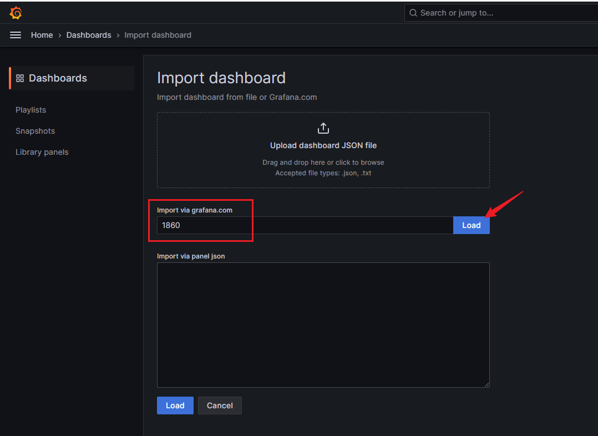

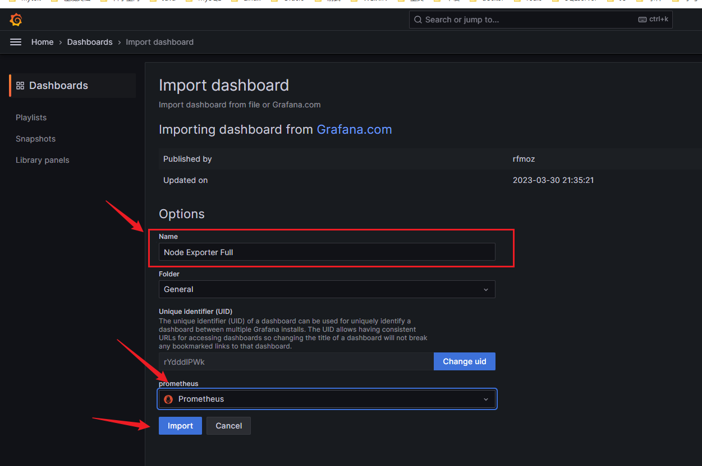

## 4.Grafana 免登录访问

配置 Grafana 免登录访问需要配合使用 nginx 其基本原理是在请求 nginx 代理地址时，将用户 token 添加到请求头上，以此来达到免登录访问的需求。

### 4.1实现步骤

#### ①grafana 面板添加新用户，并生成 token

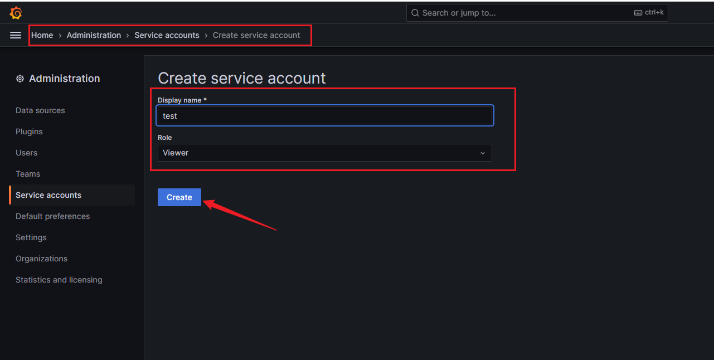

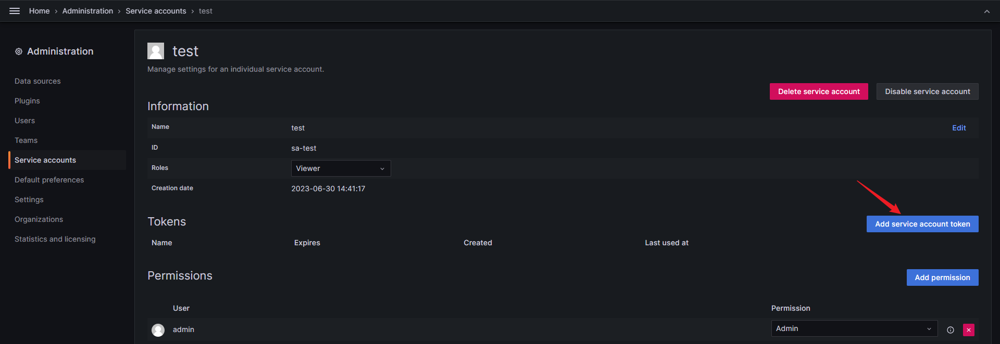

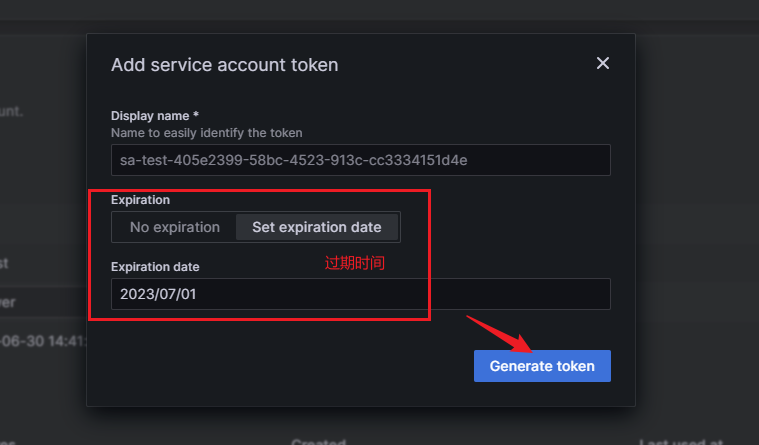

最终生成的 token 为`glsa_18jsK51ALMvwoM7wnaevzGKSLp6UOsTm_07394f66`

#### ②修改 nginx 配置

```nginx
upstream archery-dev {
    server 127.0.0.1:3000;
}

location /grafana/ {
  proxy_buffer_size 128k;
  proxy_buffers   32 128k;
  proxy_busy_buffers_size 128k;
  
  add_header Access-Control-Allow-Origin '*';
  add_header Access-Control-Allow-Methods '*';
  add_header Access-Control-Allow-Credentials true;
  # 在此处添加 token 配置
  set $auth 'Bearer glsa_18jsK51ALMvwoM7wnaevzGKSLp6UOsTm_07394f66';
  
  proxy_set_header     Host $host;
  proxy_set_header     Authorization $auth;
  proxy_set_header     X-Real-IP $remote_addr;
  proxy_set_header     X-Forwarded-For $proxy_add_x_forwarded_for;
  proxy_set_header     X-Forwarded-Proto $scheme;
  proxy_pass           http://archery-dev/grafana/;
}

```

#### ③修改 grafana 配置

修改 `/etc/grafana/grafana.ini`文件，添加或修改如下配置：

```properties
[server]
root_url = %(protocol)s://%(domain)s:3000/grafana/
serve_from_sub_path = true
[security]
allow_embedding = true
```

重启 grafana：`systemctl restart grafana.server`

#### ④重启 nginx

重启 nginx 后就可以使用 nginx 代理的端口和路径免登录访问 grafana 了！
