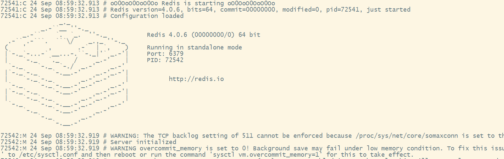
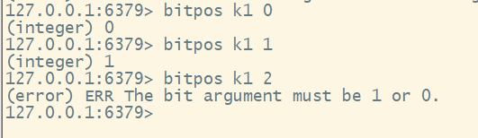

# Redis基本使用

# 1.Redis简介

Redis 是我们在互联网应用中使用最广泛的一个 NoSQL 数据库，基于 C 开发的键值对存储数据库，Redis 这个名字是 Remote Dictionary Service 字母缩写。

很多人想到 Redis，就想到缓存。但实际上 Redis 除了缓存之外，还有许多更加丰富的使用场景。比如分布式锁，限流。

**特点：**

- 支持数据持久化
- 支持多种不同的数据结构类型之间的映射
- 支持主从模式的数据备份
- 自带了发布订阅系统
- 定时器、计数器

# 2.Redis编译安装

- Redis是基于C语言的，所以需要先安装C语言开发环境

```bash
yum -y install gcc-c++
```

- 下载并安装Redis

```bash
wget http://download.redis.io/releases/redis-5.0.7.tar.gz
tar -zxvf redis-5.0.7.tar.gz
cd redis-5.0.7/
make
make install
```

- 启动Redis

```bash
redis-server redis.conf
```



# 3.Redis基本数据结构

## 1.String

String 是 Redis 里边最最简单的一种数据结构。在 Redis 中，所以的 key 都是字符串，但是，不同的

key 对应的 value 则具备不同的数据结构，我们所说的五种不同的数据类型，主要是指 value 的数据类

型不同。

Redis 中的字符串是动态字符串，内部是可以修改的，像 Java 中的 StringBuffer，它采用分配冗余空间

的方式来减少内存的频繁分配。在 Redis 内部结构中，一般实际分配的内存会大于需要的内存，当字符

串小于 1M 的时候，扩容都是在现有的空间基础上加倍，扩容每次扩 1M 空间，最大 512M。

**基本API的使用：**

- set

set 就是给一个 key 赋值的。

- append

使用 append 命令时，如果 key 已经存在，则直接在对应的 value 后追加值，否则就创建新的键值对。

- decr

可以实现对 value 的减 1 操作（前提是 value 是一个数字），如果 value 不是数字，会报错，如果

value 不存在，则会给一个默认的值为 0，在默认值的基础上减一。

- decrby

和 decr 类似，但是可以自己设置步长，该命令第二个参数就是步长。

- get

get 用来获取一个 key 的 value。

- getrange

getrange 可以用来返回 key 对应的 value 的子串，这有点类似于 Java 里边的 substring。这个命令第

二个和第三个参数就是截取的起始和终止位置，其中，-1 表示最后一个字符串，-2 表示倒数第二个字符

串，以此类推...

- getset

获取并更新某一个 key。

- incr

给某一个 key 的 value 自增。

- incrby

给某一个 key 的 value 自增，同时还可以设置步长。

- incrbyfloat

和 incrby 类似，但是自增的步长可以设置为浮点数。

- mget 和 mset

批量获取和批量存储

- ttl

查看 key 的有效期

- setex

在给 key 设置 value 的同时，还设置过期时间。

- psetex

和 setex 类似，只不过这里的时间单位是毫秒。

- setnx

默认情况下， set 命令会覆盖已经存在的 key，setnx 则不会。

- msetnx

批量设置。

- setrange

覆盖一个已经存在的 key 的value。

- strlen

查看字符串长度

### 2.Bit

Bit并不算redis的基本数据结构，在 Redis 中，字符串都是以二进制的方式来存储的。例如 set k1 a，a 对应的 ASCII 码是 97，97 转为二进制是 01100001，BIT 相关的命令就是对二进制进行操作的。


- getbit

key的value在对应offset处的bit值（0或1）

- setbit

修改key的value在对应offset处的bit值

- bitcount

统计二进制中1的个数

**Bit的应用：**

```bash
# 用户2月17号签到
SETBIT u:sign:1000:201902 16 1 # 偏移量是从0开始，所以要把17减1

# 检查2月17号是否签到
GETBIT u:sign:1000:201902 16 # 偏移量是从0开始，所以要把17减1

# 统计2月份的签到次数
BITCOUNT u:sign:1000:201902

# 获取2月份前28天的签到数据
BITFIELD u:sign:1000:201902 get u28 0

# 获取2月份首次签到的日期
BITPOS u:sign:1000:201902 1 # 返回的首次签到的偏移量，加上1即为当月的某一天
```

- bitfield 完整命令

> BITFIELD key [GET type offset] [SET type offset value] [INCRBY type offset increment] [OVERFLOW WRAP|SAT|FAIL]
>
> type：是指符号类型`i`为有符号`u`为无符号`u28`表示28为无符号整数
>
> offset：指偏移量
>
> increment 增量

**以**​`**set k1 a**`​**为例：**

```plain
# a 的二进制表示01100001

127.0.0.1:6379> bitfield k1 get u8 0 # 从第0位开始获取8位无符号二进制
1) (integer) 97 # 97的二进制为1100001只有7为因为首位为0需要补齐 即 0100001

127.0.0.1:6379> BITFIELD k1 set u3 0 103 # 将从偏移量为0的3位无符号二进制数设置为103（1100111）即       01100001 -->
110011100001 --> 与上方对齐即取103 的 后3位补齐到原来的3位最终得到下方的225（11100001）
1) (integer) 3 ------> set操作会返回旧值 即 011（3）
127.0.0.1:6379> bitfield k1 get u8 0
1) (integer) 225   <--------------------------------------------------得到的225

127.0.0.1:6379> BITFIELD k1 incrby u3 0 4 # 将从0开始的无符号3位二进制（011） + 4返回最后的结果（3+4）---> 7，然后将7转换为二进制取后3三位填回原来的位置最终得到下方的225（11100001）
1) (integer) 7
127.0.0.1:6379> bitfield k1 get u8 0
1) (integer) 225   <--------------------------------------------------得到的225
```

> - **OVERFLOW** `[WRAP|SAT|FAIL]`在期望整数类型的情况下，可以通过`i`为有符号整数和`u`无符号整数加上整数类型的位数来构成它。例如`u8`，一个8位的无符号整数，`i16`是一个16位的有符号整数。支持的类型对于有符号整数最多为64位，对于无符号整数最多为63位。使用无符号整数的限制是由于当前Redis协议无法将64位无符号整数作为答复返回。位和位置偏移有两种方式可以指定位域命令中的偏移量。如果指定了一个没有任何前缀的数字，它将被用作字符串内的基于零的位偏移量。但是如果偏移量前缀为a`#`字符，指定的偏移量乘以整数类型的宽度，例如：BITFIELD mystring SET i8＃0 100 i8＃1 200将设置第一个i8整数在偏移量0和第二个偏移量为8.这种方式你没有如果你想要的是一个给定大小的整数数组，你可以在你的客户端内部进行数学运算。溢出控制使用该`OVERFLOW`命令，用户可以通过指定一个来微调增量的行为或减少溢出（或下溢）以下行为：
> - **WRAP**：环绕，包含有符号和无符号整数。在无符号整数的情况下，包装类似于以整数可以包含的最大值（C标准行为）来执行操作。使用带符号整数，而不是包装意味着溢出重新开始朝向最负值，并且溢出朝向最正值，例如，如果`i8`整数设置为127，则将其递增1 `-128`。
> - **SAT**：使用饱和算术，即在下溢时将该值设置为最小整数值，并在溢出时将其设置为最大整数值。例如，`i8`从数值120开始递增一个以10 为增量的整数将导致数值127，并且进一步增量将始终使数值保持在127.在下溢时发生同样的情况，但是朝向该数值被阻塞在最大负值。
> - **FAIL**：在这种模式下，没有检测到溢出或下溢操作。相应的返回值设置为 NULL，以向调用者发送信号。
>
> 请注意，每条`OVERFLOW`语句只影响子命令列表中后面的 INCRBY命令，直到下一条`OVERFLOW`语句为止。
>
> 默认情况下，如果未另外指定，则使用 **WRAP**。

- bitpos

返回位图中第一个值为 `bit` 的二进制位的位置。



## 2.List

- lpush

将所有指定的值插入到存于 key 的列表的头部。如果 key 不存在，那么在进行 push 操作前会创建一个

空列表。 如果 key 对应的值不是一个 list 的话，那么会返回一个错误。

- lrange

返回列表指定区间内的元素。

- rpush

向存于 key 的列表的尾部插入所有指定的值。

- rpop

移除并返回列表的尾元素。

- lpop

移除并返回列表的头元素。

- lindex

返回列表中，下标为 index 的元素。

- ltrim

ltrim 可以对一个列表进行修剪。

- blpop

阻塞式的弹出，相当于 lpop 的阻塞版。

## 3.Set

- sadd

添加元素到一个 key 中

- smembers

获取一个 key 下的所有元素

- srem

移除指定的元素

- sismemeber

返回某一个成员是否在集合中

- scard

返回集合的数量

- srandmember

随机返回一个元素

- spop

随机返回并且出栈一个元素。

- smove

把一个元素从一个集合移到另一个集合中去。

- sdiff

返回两个集合的差集。

- sinter

返回两个集合的交集。

- sdiffstore

这个类似于 sdiff ，不同的是，计算出来的结果会保存在一个新的集合中。

- sinterstore

类似于 sinter，只是将计算出来的交集保存到一个新的集合中。

- sunion

求并集。

- sunionstore

求并集并且将结果保存到新的集合中。

## 4.Hash

在 hash 结构中，key 是一个字符串，value 则是一个 key/value 键值对。

- hset

添加值。

- hget

获取值

- hmset

批量设置

- hmget

批量获取

- hdel

删除一个指定的 field

- hsetnx

默认情况下，如果 key 和 field 相同，会覆盖掉已有的 value，hsetnx 则不会。

- hvals

获取所有的 value

- hkeys

获取所有的 key

- hgetall

同时获取所有的 key 和 value

- hexists

返回 field 是否存在

- hincrby

给指定的 value 自增

- hincrbyfloat

可以自增一个浮点数

- hlen

返回 某一个 key 中 value 的数量

- hstrlen

返回某一个 key 中的某一个 field 的字符串长度

## 5.ZSet

- zadd

将指定的元素添加到有序集合中。

- zscore

返回 member 的 score 值

- zrange

返回集合中的一组元素。

- zrevrange

返回一组元素，但是是倒序。

- zcard

返回元素个数

- zcount

返回 score 在某一个区间内的元素。

- zrangebyscore

按照 score 的范围返回元素。

- zrank

返回元素的排名（从小到大

- zrevrank

返回元素排名（从大到小

- zincrby

score 自增

- zinterstore

给两个集合求交集。

- zrem

弹出一个元素

- zlexcount

计算有序集合中成员数量

- zrangebylex

返回指定区间内的成员。

```plain
127.0.0.1:6379> ZRANGEBYLEX zset1 [a (d    ---> 表示 >= a和<b
1) "a"
2) "b"
3) "c"
```

## 6.Key

- del

删除一个 key/value

- dump

序列化给定的 key

- exists

判断一个 key 是否存在

- ttl

查看一个 key 的有效期

- expire

给一个 key 设置有效期，如果 key 在过期之前被重新 set 了，则过期时间会失效。

- persist

移除一个 key 的过期时间

- keys *

查看所有的 key

- pttl

和 ttl 一样，只不过这里返回的是毫秒

## 7.Redis Geo

Redis GEO 主要用于存储地理位置信息，并对存储的信息进行操作，该功能在 Redis 3.2 版本新增。

Redis GEO 操作方法有：

- geoadd：添加地理位置的坐标。
- geopos：获取地理位置的坐标。
- geodist：计算两个位置之间的距离。
- georadius：根据用户给定的经纬度坐标来获取指定范围内的地理位置集合。
- georadiusbymember：根据储存在位置集合里面的某个地点获取指定范围内的地理位置集合。
- geohash：返回一个或多个位置对象的 geohash 值。

## 

Redis 在 2.8.9 版本添加了 HyperLogLog 结构。

Redis HyperLogLog 是用来做基数统计的算法，HyperLogLog 的优点是，在输入元素的数量或者体积非常非常大时，计算基数所需的空间总是固定 的、并且是很小的。

在 Redis 里面，每个 HyperLogLog 键只需要花费 12 KB 内存，就可以计算接近 2^64 个不同元素的基 数。这和计算基数时，元素越多耗费内存就越多的集合形成鲜明对比。

但是，因为 HyperLogLog 只会根据输入元素来计算基数，而不会储存输入元素本身，所以 HyperLogLog 不能像集合那样，返回输入的各个元素。

|序号|命令及描述|
| ----| -----------------------------------------|
|1|[PFADD key element [element ...]](https://www.runoob.com/redis/hyperloglog-pfadd.html)<br />添加指定元素到 HyperLogLog 中。|
|2|[PFCOUNT key [key ...]](https://www.runoob.com/redis/hyperloglog-pfcount.html)<br />返回给定 HyperLogLog 的基数估算值。|
|3|[PFMERGE destkey sourcekey [sourcekey ...]](https://www.runoob.com/redis/hyperloglog-pfmerge.html)<br />将多个 HyperLogLog 合并为一个 HyperLogLog|

## 7.注意

1. 四种数据类型（list/set/zset/hash），在第一次使用时，如果容器不存在，就自动创建一个
2. 四种数据类型（list/set/zset/hash），如果里边没有元素了，那么立即删除容器，释放内存。

# 4.Redis集群搭建（3主3从）

Redis主要是通过`redis-trib.rb`来进行集群管理，所以首先需要安装ruby环境，然后再安装安装rubygem redis依赖`redis-3.3.0.gem`。ruby依赖OpenSSL、zlib、gcc。

相关依赖和文档

[centos7离线部署redis集群.zip](https://www.yuque.com/attachments/yuque/0/2020/zip/1590387/1601287088852-5ae12aee-134a-4e20-b9b3-c1d5cd5575bc.zip)

博客：[https://www.cnblogs.com/xuliangxing/p/7146868.html](https://www.cnblogs.com/xuliangxing/p/7146868.html)
