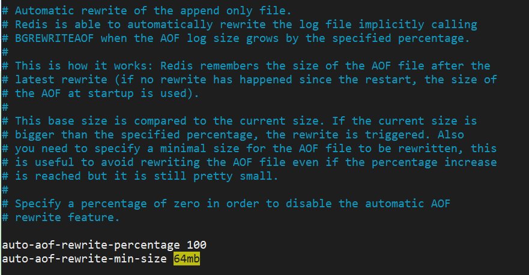

# Redis持久化

**Redis 提供了不同级别的持久化方式:**

- RDB持久化方式能够在指定的时间间隔能对你的数据进行快照存储.
- AOF持久化方式记录每次对服务器写的操作,当服务器重启的时候会重新执行这些命令来恢复原始的数据,AOF命令以redis协议追加保存每次写的操作到文件末尾.Redis还能对AOF文件进行后台重写,使得AOF文件的体积不至于过大.
- 如果你只希望你的数据在服务器运行的时候存在,你也可以不使用任何持久化方式.
- 你也可以同时开启两种持久化方式, 在这种情况下, 当redis重启的时候会优先载入AOF文件来恢复原始的数据,因为在通常情况下AOF文件保存的数据集要比RDB文件保存的数据集要完整.

# 1.RDB

在指定的时间间隔内将内存中的数据集快照写入磁盘，也就是行话讲的Snapshot快照，它恢复时是将快照文件直接读到内存里

Redis会单独创建（fork）一个子进程来进行持久化，会先将数据写入到一个临时文件中，待持久化过程都结束了，再用这个临时文件替换上次持久化好的文件。整个过程中，主进程是不进行任何IO操作的，这就确保了极高的性能如果需要进行大规模数据的恢复，且对于数据恢复的完整性不是非常敏感，那RDB方式要比AOF方式更加的高效。RDB的缺点是最后一次持久化后的数据可能丢失。

Fork的作用是复制一个与当前进程一样的进程。新进程的所有数据（变量、环境变量、程序计数器等）

数值都和原进程一致，但是是一个全新的进程，并作为原进程的子进程

## （1）配置文件

```plain
# 触发机制
save 900 1 # 900秒内修改1次则触发存储
save 300 10 # 300秒内修改10次则触发存储
save 60 10000 # 60秒内修改10000次则触发存储
# 文件名
dbfilename dump.rdb

# 指定文件位置，不指定默认为 dir ./
dir /etc/redis/data
```

除了满足配置文件中配置的触发条件是会进行存储外，还可以手动执行`save`或`bgsave`命令：

- save

save时只管保存，其它不管，全部阻塞

- bgsave

Redis会在后台异步进行快照操作，快照同时还可以响应客户端请求。可以通过lastsave命令获取最后一次成功执行快照的时间

## （2）数据恢复

将备份文件dump.rdb移动到配置文件配置的指定位置启动redis即可

可以通过`config get dir`获取路径

## （3）优劣势

**RDB的优点**

- RDB是一个非常紧凑的文件,它保存了某个时间点得数据集,非常适用于数据集的备份,比如你可以在每个小时报保存一下过去24小时内的数据,同时每天保存过去30天的数据,这样即使出了问题你也可以根据需求恢复到不同版本的数据集.
- RDB是一个紧凑的单一文件,很方便传送到另一个远端数据中心或者亚马逊的S3（可能加密），非常适用于灾难恢复.
- RDB在保存RDB文件时父进程唯一需要做的就是fork出一个子进程,接下来的工作全部由子进程来做，父进程不需要再做其他IO操作，所以RDB持久化方式可以最大化redis的性能.
- 与AOF相比,在恢复大的数据集的时候，RDB方式会更快一些.

**RDB的缺点**

- 如果你希望在redis意外停止工作（例如电源中断）的情况下丢失的数据最少的话，那么RDB不适合你.虽然你可以配置不同的save时间点(例如每隔5分钟并且对数据集有100个写的操作),是Redis要完整的保存整个数据集是一个比较繁重的工作,你通常会每隔5分钟或者更久做一次完整的保存,万一在Redis意外宕机,你可能会丢失几分钟的数据.
- RDB 需要经常fork子进程来保存数据集到硬盘上,当数据集比较大的时候,fork的过程是非常耗时的,可能会导致Redis在一些毫秒级内不能响应客户端的请求.如果数据集巨大并且CPU性能不是很好的情况下,这种情况会持续1秒,AOF也需要fork,但是你可以调节重写日志文件的频率来提高数据集的耐久度.

## （4）停止RDB数据备份

`redis-cli config set save ""`

# 2.AOF

以日志的形式来记录每个写操作，将Redis执行过的所有写指令记录下来(读操作不记录)，只许追加文件但不可以改写文件，redis启动之初会读取该文件重新构建数据，换言之，redis重启的话就根据日志文件的内容将写指令从前到后执行一次以完成数据的恢复工作

## （1）配置文件

```plain
# 默认是no 开启aof需要设置为yes
appendonly no

# The name of the append only file (default: "appendonly.aof")
# 文件名
appendfilename "appendonly.aof"
```

## （2）aof修复

`Redis-check-aof --fix appendonly.aof`

## （3）log rewriting

AOF采用文件追加方式，文件会越来越大为避免出现此种情况，新增了重写机制,当AOF文件的大小超过所设定的阈值时，Redis就会启动AOF文件的内容压缩，只保留可以恢复数据的最小指令集.可以使用命令bgrewriteaof

AOF文件持续增长而过大时，会fork出一条新进程来将文件重写(也是先写临时文件最后再rename)，遍历新程的内存中数据，每条记录有一条的Set语句。重写aof文件的操作，并没有读取旧的aof文件，而是将整个内存中的数据库内容用命令的方式重写了一个新的aof文件，这点和快照有点类似

Redis会记录上次重写时的AOF大小，默认配置是当AOF文件大小是上次rewrite后大小的一倍且文件大于64M（默认配置）时触发



## （4）aof优劣势

**aof优势**

- 每修改同步：appendfsync always   同步持久化 每次发生数据变更会被立即记录到磁盘  性能较差但数据完整性比较好
- 每秒同步：appendfsync everysec    异步操作，每秒记录   如果一秒内宕机，有数据丢失
- 不同步：appendfsync no   从不同步

**aof劣势**

- 对于相同的数据集来说，AOF 文件的体积通常要大于 RDB 文件的体积。
- 根据所使用的 fsync 策略，AOF 的速度可能会慢于 RDB 。 在一般情况下， 每秒 fsync 的性能依然非常高， 而关闭 fsync 可以让 AOF 的速度和 RDB 一样快， 即使在高负荷之下也是如此。 不过在处理巨大的写入载入时，RDB 可以提供更有保证的最大延迟时间（latency）。

# 3.如何选择

- RDB持久化方式能够在指定的时间间隔能对你的数据进行快照存储
- AOF持久化方式记录每次对服务器写的操作,当服务器重启的时候会重新执行这些命令来恢复原始的数据,AOF命令以redis协议追加保存每次写的操作到文件末尾.Redis还能对AOF文件进行后台重写,使得AOF文件的体积不至于过大
- AOF持久化方式记录每次对服务器写的操作,当服务器重启的时候会重新执行这些命令来恢复原始的数据,AOF命令以redis协议追加保存每次写的操作到文件末尾.Redis还能对AOF文件进行后台重写,使得AOF文件的体积不至于过大
- 同时开启两种持久化方式
  - 在这种情况下,当redis重启的时候会优先载入AOF文件来恢复原始的数据,因为在通常情况下AOF文件保存的数据集要比RDB文件保存的数据集要完整.
  - RDB的数据不实时，同时使用两者时服务器重启也只会找AOF文件。那要不要只使用AOF呢？作者建议不要，因为RDB更适合用于备份数据库(AOF在不断变化不好备份)，快速重启，而且不会有AOF可能潜在的bug，留着作为一个万一的手段。

> 因为RDB文件只用作后备用途，建议只在Slave上持久化RDB文件，而且只要15分钟备份一次就够了，只保留save 900 1这条规则。
>
>

> 如果Enalbe AOF，好处是在最恶劣情况下也只会丢失不超过两秒数据，启动脚本较简单只load自己的AOF文件就可以了。代价一是带来了持续的IO，二是AOF rewrite的最后将rewrite过程中产生的新数据写到新文件造成的阻塞几乎是不可避免的。只要硬盘许可，应该尽量减少AOF rewrite的频率，AOF重写的基础大小默认值64M太小了，可以设到5G以上。默认超过原大小100%大小时重写可以改到适当的数值。

>

> 如果不Enable AOF ，仅靠Master-Slave Replication 实现高可用性也可以。能省掉一大笔IO也减少了rewrite时带来的系统波动。代价是如果Master/Slave同时倒掉，会丢失十几分钟的数据，启动脚本也要比较两个Master/Slave中的RDB文件，载入较新的那个。新浪微博就选用了这种架构
