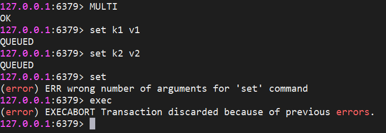
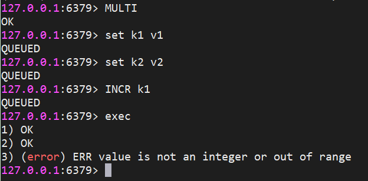
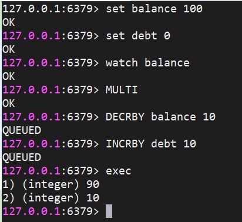
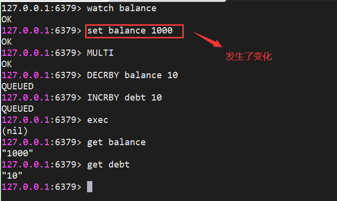
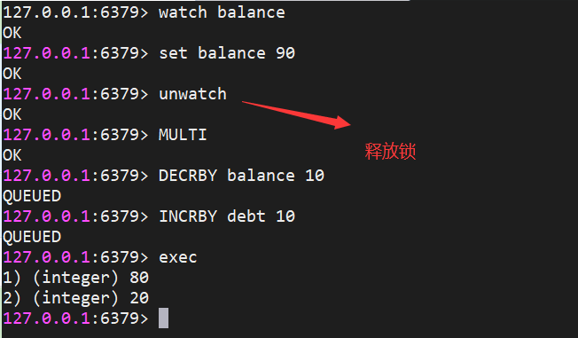
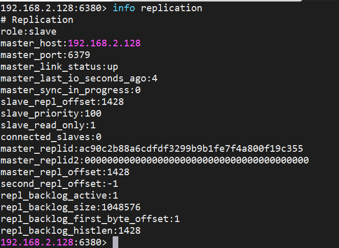
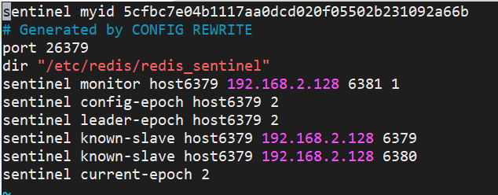

# Redis高级特性

# 1.Redis事务

可以一次执行多个命令，本质是一组命令的集合。一个事务中的所有命令都会序列化，按顺序地串行化执行而不会被其它命令插入，不许加塞。在事务提交之前队列中的命令没有被实际执行，提交后顺序执行。

```plain
127.0.0.1:6379> MULTI # 开启事务
OK
127.0.0.1:6379> set name zs 
QUEUED
127.0.0.1:6379> set age 12
QUEUED
127.0.0.1:6379> set sex man
QUEUED
127.0.0.1:6379> exec # 提交事务，discard 表示事务回滚，不执行任何命令
1) OK
2) OK
3) OK
```

当开启事务后，在加入队列过程中如果命令执行报错（类似编译报错）则整个事务失败，如果提交事务后有命令执行报错（运行时异常）则其他命令不受影响（redis部分支持事务）

**入队时报错：**



**执行时报错：**



# 2.watch命令实现乐观锁

在开启事务前使用`watch`命令监控数据，开启事务之后如果提交时监控数据发生了改变则事务提交失败；如果事务正常提交则`exec`之前的所有监控锁都会被取消；也可以执行`unwatch`手动取消监控（所有的监控都将被取消）

**加锁正常执行：**



**加锁后修改数据：**



**手动释放锁：**



# 3.Redis发布订阅

**发布消息**

```plain
127.0.0.1:6379> PUBLISH channela hello
(integer) 1
127.0.0.1:6379>
```

**订阅频道**

```plain
127.0.0.1:6379> SUBSCRIBE channela
Reading messages... (press Ctrl-C to quit)
1) "subscribe"
2) "channela"
3) (integer) 1
1) "message"
2) "channela"
3) "hello"
```

订阅频道可以一次订阅多个，同时也支持通配符`subscribe news*`表示订阅所有以news开头的频道

# 4.Redis主从同步

## （1）如何部署

如果主从节点都不想设置密码则需要将`protected-mode`设置为`no`，否则主节点需要设置密码`requirepass`，从节点需要设置主节点密码`masterauth`和自己节点的密码`requirepass`，否则无法连通。使用命令`slaveof ip port`即可连接到主节点。

`info replication`查看主节点或从节点信息。

**主节点：**


**从节点：**



## （2）什么是主从同步

行话：也就是我们所说的主从复制，主机数据更新后根据配置和策略，自动同步到备机的master/slaver机制，Master以写为主，Slave以读为主。

- 确定主从关系后，主节点可以读写，从节点只能读。
- 从节点也可以作为其他节点的主节点，但是通过`info replication`查看信息，角色还是slave
- 每次与master断开之后，都需要重新连接，除非你配置进redis.conf文件
- 中途变更转向:会清除之前的数据，重新建立拷贝最新的
- `SLAVEOF no one`可以使当前数据库停止与其他数据库的同步，转成主数据库
- Slave启动成功连接到master后会发送一个sync命令，Master接到命令启动后台的存盘进程，同时收集所有接收到的用于修改数据集命令， 在后台进程执行完毕之后，master将传送整个数据文件到slave,以完成一次完全同步
- 全量复制：而slave服务在接收到数据库文件数据后，将其存盘并加载到内存中。
- 增量复制：Master继续将新的所有收集到的修改命令依次传给slave,完成同步
- 但是只要是重新连接master,一次完全同步（全量复制)将被自动执行

## （3）哨兵模式

当主节点宕机后，从节点会持续等待直到主节点重新恢复工作，这样做效率非常低下且不满足高可用，这时候可以手动将其中一个从节点使用命令`SLAVEOF no one`设置为主节点

哨兵模式就是将手动执行`SLAVEOF no one`的过程变成自动实现，能够后台监控主机是否故障，如果故障了根据投票数自动将从库转换为主库。

### 一、设置哨兵

新建配置文件`sentinel.conf`，名字不能修改，内容如下

```plain
sentinel monitor 被监控的节点名称（自定义）ip port 票数
sentinel monitor host6379 192.168.2.128 6379 1
```

表示当前监听的主节点是`192.168.2.128 6379`，当主节点宕机后，从节点的票数大于1的将被作为新的主节点，同时`sentinel.conf`配置文件也会被动态修改。启动哨兵：`./redis-sentinel ./sentinel.conf`



当主节点重新恢复工作后将会被作为从节点，连接到新的master下。

### 二、主从复制缺点

由于所有的写操作都是先在Master上操作，然后同步更新到Slave上，所以从Master同步到Slave机器有一定的延迟，当系统很繁忙的时候，延迟问题会更加严重，Slave机器数量的增加也会使这个问题更加严重。

所以现在一般不用主从复制，改用redis集群
