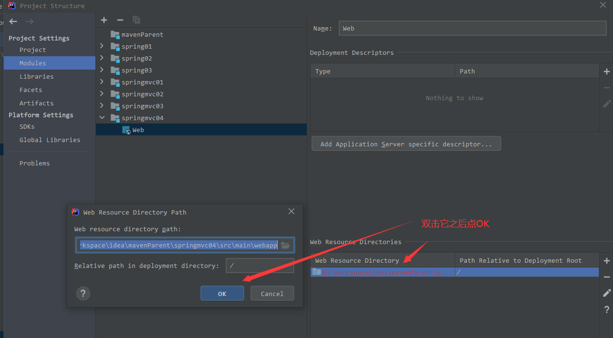
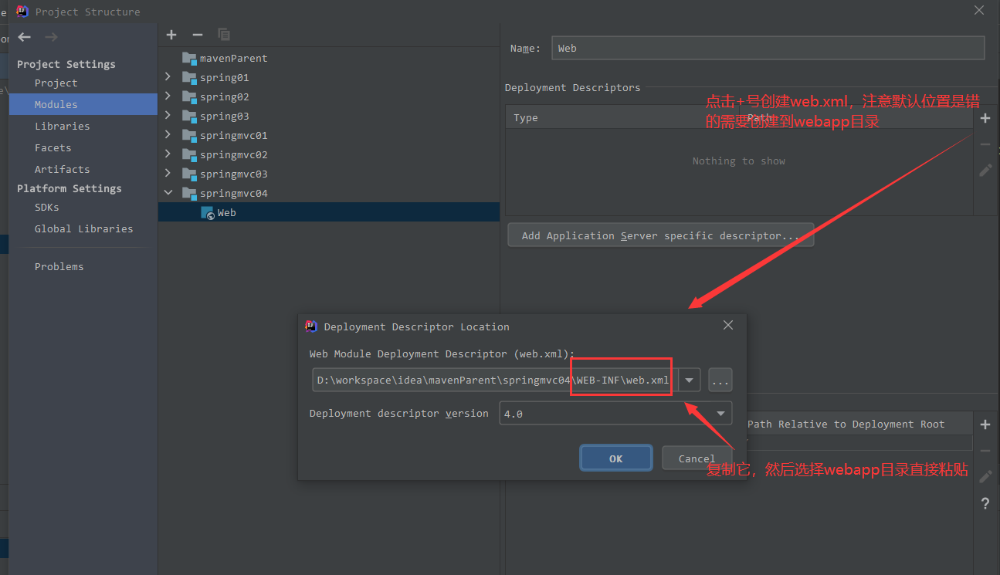
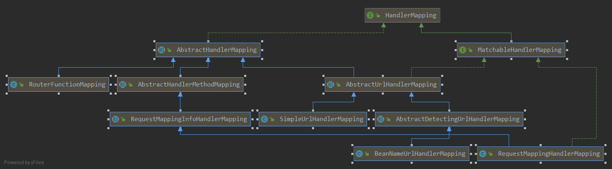
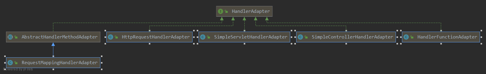
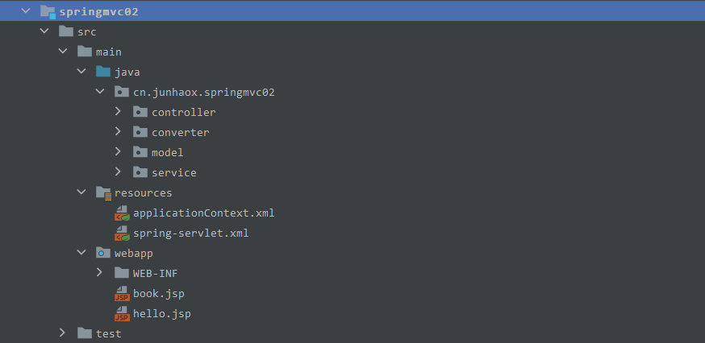

# SpringMVC01

# 1.Springmvc初级版本

## 1.1项目初始化

idea新建maven项目，然后修改POM文件打包方式为war包 `<packaging>war</packaging>` ，然后打开模块设置然后创建`webapp`目录并在`webapp`目录下创建`WEB-INF`和`web.xml`文件。





## 1.2springmvc依赖

在POM文件中添加如下依赖，然后`reload project`。

```xml
<dependencies>
  <dependency>
    <groupId>org.springframework</groupId>
    <artifactId>spring-webmvc</artifactId>
    <version>RELEASE</version>
  </dependency>
  <dependency>
    <groupId>javax.servlet</groupId>
    <artifactId>javax.servlet-api</artifactId>
    <version>4.0.1</version>
  </dependency>
  <dependency>
    <groupId>javax.servlet.jsp</groupId>
    <artifactId>javax.servlet.jsp-api</artifactId>
    <version>2.3.3</version>
  </dependency>
</dependencies>
```

## 1.3springmvc配置文件

在`resources`目录下创建spring和springmvc的配置文件（习惯上）。然后在`web.xml`中引入这两个配置文件

```xml
<?xml version="1.0" encoding="UTF-8"?>
<web-app xmlns="http://xmlns.jcp.org/xml/ns/javaee"
         xmlns:xsi="http://www.w3.org/2001/XMLSchema-instance"
         xsi:schemaLocation="http://xmlns.jcp.org/xml/ns/javaee http://xmlns.jcp.org/xml/ns/javaee/web-app_4_0.xsd"
         version="4.0">
    <context-param>
        <param-name>contextConfigLocation</param-name>
        <param-value>classpath:applicationContext.xml</param-value>
    </context-param>
    <listener>
        <listener-class>org.springframework.web.context.ContextLoaderListener</listener-class>
    </listener>
    <servlet>
        <servlet-name>springmvc</servlet-name>
        <servlet-class>org.springframework.web.servlet.DispatcherServlet</servlet-class>
        <init-param>
            <param-name>contextConfigLocation</param-name>
            <param-value>classpath:spring-servlet.xml</param-value>
        </init-param>
    </servlet>
    <servlet-mapping>
        <servlet-name>springmvc</servlet-name>
        <url-pattern>/</url-pattern>
    </servlet-mapping>
</web-app>
```

## 1.4请求接口的创建

创建一个`controller`接口的实现类，例如`HelloController`，实现其中的方法，然后在springmvc的配置文件中注入相关been。

`ModelAndView`中的viewName表示视图名，需要在springmvc配置文件中配置视图解析器才能正常访问

```java
public class HelloController implements Controller {
    @Override
    public ModelAndView handleRequest(HttpServletRequest httpServletRequest, HttpServletResponse httpServletResponse) throws Exception {
        // hello 表示视图名
        ModelAndView modelAndView = new ModelAndView("hello");
        // 响应到对应视图中的数据，在jsp中可以直接用 ${name} 获取到响应的值
        modelAndView.addObject("name","zhang san");
        return modelAndView;
    }
}
```

springmvc配置文件内容

```xml
<?xml version="1.0" encoding="UTF-8"?>
<beans xmlns="http://www.springframework.org/schema/beans"
       xmlns:xsi="http://www.w3.org/2001/XMLSchema-instance"
       xmlns:context="http://www.springframework.org/schema/context"
       xsi:schemaLocation="http://www.springframework.org/schema/beans http://www.springframework.org/schema/beans/spring-beans.xsd http://www.springframework.org/schema/context https://www.springframework.org/schema/context/spring-context.xsd">
  	<!-- 注入controller -->
    <bean class="cn.junhaox.springmvc01.controller.HelloController" name="/hello" />
  	<!-- 处理器映射器 请求地址和controller been name需要对应 -->
		<bean class="org.springframework.web.servlet.handler.BeanNameUrlHandlerMapping" id="handlerMapping">
        <property name="beanName" value="/hello" />
    </bean>
    <!-- 处理器适配器 -->
    <bean class="org.springframework.web.servlet.mvc.SimpleControllerHandlerAdapter" id="handlerAdapter" />
    <!-- 视图器解析器 -->
    <bean class="org.springframework.web.servlet.view.InternalResourceViewResolver" id="viewResolver">
        <property name="prefix" value="/jsp/" />
        <property name="suffix" value=".jsp" />
    </bean>
</beans>
```

## 1.5接口访问

当访问`/hello`地址时会自动交给`HelloController`中的`handleRequest`方法处理，该方法返回一个视图，通过视图解析器找到`/jsp/hello.jsp`，在`hello.jsp`中可以通过`${name}`获取到设置的值。

# 2.进阶版本

对于初始版本，每个请求都需要在springmvc配置文件中配置一个处理器映射器，用于找到对应的`controller`进行处理，现在可以将处理器映射器由`BeanNameUrlHandlerMapping`换成`SimpleUrlHandlerMapping`，该处理器映射器可以将请求路径和been name一一映射。

```xml
<bean class="cn.junhaox.springmvc01.controller.HelloController" name="helloController" />
    <bean class="cn.junhaox.springmvc01.controller.HelloController2" name="HelloController2" />
    <bean class="cn.junhaox.springmvc01.controller.HelloController3" name="HelloController3" />
<bean class="org.springframework.web.servlet.handler.SimpleUrlHandlerMapping" id="handlerMapping">
  <property name="mappings">
    <props>
      <prop key="/hello">helloController</prop>
      <prop key="/hello2">HelloController2</prop>
      <prop key="/hello3">HelloController3</prop>
    </props>
  </property>
</bean>

<!-- 处理器适配器 -->
<bean class="org.springframework.web.servlet.mvc.HttpRequestHandlerAdapter" id="requestHandlerAdapter" />
<bean class="org.springframework.web.servlet.mvc.SimpleControllerHandlerAdapter" id="handlerAdapter" />
```

# 3.Springmvc工作流程


## 3.1springmvc中的组件

1. DispatcherServlet：前端控制器

用户请求到达前端控制器，它就相当于 mvc 模式中的c，DispatcherServlet 是整个流程控制的中心，相当于是 SpringMVC 的大脑，由它调用其它组件处理用户的请求，DispatcherServlet 的存在降低了组件之间的耦合性。

2. HandlerMapping：处理器映射器

HandlerMapping 负责根据用户请求找到 Handler 即处理器（也就是我们所说的 Controller），SpringMVC 提供了不同的映射器实现不同的映射方式，例如：配置文件方式，实现接口方式，注解方式等，在实际开发中，我们常用的方式是注解方式。

3. Handler：处理器

Handler 是继 DispatcherServlet 前端控制器的后端控制器，在DispatcherServlet 的控制下 Handler 对具体的用户请求进行处理。由于 Handler 涉及到具体的用户业务请求，所以一般情况需要程序员根据业务需求开发 Handler。（这里所说的 Handler 就是指我们的 Controller）

4. HandlerAdapter：处理器适配器

通过 HandlerAdapter 对处理器进行执行，这是适配器模式的应用，通过扩展适配器可以对更多类型的处理器进行执行。

5. ViewResolver：视图解析器

ViewResolver 负责将处理结果生成 View 视图，ViewResolver 首先根据逻辑视图名解析成物理视图名即具体的页面地址，再生成 View 视图对象，最后对 View 进行渲染将处理结果通过页面展示给用户。 SpringMVC 框架提供了很多的 View 视图类型，包括：jstlView、freemarkerView、pdfView 等。一般情况下需要通过页面标签或页面模版技术将模型数据通过页面展示给用户，需要由程序员根据业务需求开发具体的页面。

# 4.DispatchServlet

## 4.1DispatcherServlet作用

DispatcherServlet 是前端控制器设计模式的实现，提供 Spring Web MVC 的集中访问点，而且负责职责的分派，而且与 Spring IoC 容器无缝集成，从而可以获得 Spring 的所有好处。DispatcherServlet 主要用作职责调度工作，本身主要用于控制流程，主要职责如下：

1. 文件上传解析，如果请求类型是 multipart 将通过 MultipartResolver 进行文件上传解析；
2. 通过 HandlerMapping，将请求映射到处理器（返回一个 HandlerExecutionChain，它包括一个处理器、多个 HandlerInterceptor 拦截器）；
3. 通过 HandlerAdapter 支持多种类型的处理器(HandlerExecutionChain 中的处理器)；
4. 通过 ViewResolver 解析逻辑视图名到具体视图实现；
5. 本地化解析；
6. 渲染具体的视图等；
7. 如果执行过程中遇到异常将交给 HandlerExceptionResolver 来解析

## 4.2DispatcherServlet配置详解

```xml
<servlet>
    <servlet-name>springmvc</servlet-name>
    <servlet-class>org.springframework.web.servlet.DispatcherServlet</servlet-class>
    <init-param>
        <param-name>contextConfigLocation</param-name>
        <param-value>classpath:spring-servlet.xml</param-value>
    </init-param>
    <load-on-startup>1</load-on-startup>
</servlet>
<servlet-mapping>
    <servlet-name>springmvc</servlet-name>
    <url-pattern>/</url-pattern>
</servlet-mapping>
```

- load-on-startup：表示启动容器时初始化该 Servlet；
- url-pattern：表示哪些请求交给 Spring Web MVC 处理， “/” 是用来定义默认 servlet 映射的。也可以如 `*.html` 表示拦截所有以 html 为扩展名的请求
- contextConfigLocation：表示 SpringMVC 配置文件的路径其他的参数配置：

|参数|描述|
| ---------------------| ---------------------------------------------------------------------------------------------------------------------------------------------------------------------------------------------------------|
|contextClass|实现WebApplicationContext接口的类，当前的servlet用它来创建上下文。如果这个参数没有指定， 默认使用XmlWebApplicationContext。|
|contextConfigLocation|传给上下文实例（由contextClass指定）的字符串，用来指定上下文的位置。这个字符串可以被分成多个字符串（使用逗号作为分隔符） 来支持多个上下文（在多上下文的情况下，如果同一个bean被定义两次，后面一个优先）。|
|namespace|WebApplicationContext命名空间。默认值是[server-name]-servlet。|

# 5.Spring配置

对于上面的案例 spring 的配置文件只是一个空配置文件，现在添加一个 service 层的类，并将它注入到 controller 中。

```java
@Service
public class HelloService {
    public String hello(String name) {
        return "hello " + name;
    }
}
```

现在，假设我需要将 HelloService 注入到 Spring 容器中并使用它，这个是属于 Spring 层的 Bean，所以我们一般将除了 Controller 之外的所有 Bean 注册到 Spring 容器中，而将 Controller 注册到 SpringMVC 容器中，spring 配置文件：

```xml
<?xml version="1.0" encoding="UTF-8"?>
<beans xmlns="http://www.springframework.org/schema/beans"
       xmlns:xsi="http://www.w3.org/2001/XMLSchema-instance"
       xmlns:context="http://www.springframework.org/schema/context"
       xsi:schemaLocation="http://www.springframework.org/schema/beans http://www.springframework.org/schema/beans/spring-beans.xsd http://www.springframework.org/schema/context https://www.springframework.org/schema/context/spring-context.xsd">
    <context:component-scan base-package="org.javaboy" use-default-filters="true">
        <context:exclude-filter type="annotation" expression="org.springframework.stereotype.Controller"/>
    </context:component-scan>
</beans>
```

这个配置文件默认不会被加载，需要在 web.xml 中进行相关配置：

```xml
<context-param>
    <param-name>contextConfigLocation</param-name>
    <param-value>classpath:applicationContext.xml</param-value>
</context-param>
<listener>
    <listener-class>org.springframework.web.context.ContextLoaderListener</listener-class>
</listener>
```

首先通过 context-param 指定 Spring 配置文件的位置，这个配置文件也有一些默认规则，它的配置文件名默认就叫 applicationContext.xml ，并且，如果你将这个配置文件放在 WEB-INF 目录下，那么这里就可以不用指定配置文件位置了，只需要指定监听器就可以了。这段配置是 Spring 集成 Web 环境的通用配置；一般用于加载除 Web 层的 Bean（如DAO、Service 等），以便于与其他任何Web框架集成。

- contextConfigLocation：表示用于加载 Bean 的配置文件；
- contextClass：表示用于加载 Bean 的 ApplicationContext 实现类，默认 WebApplicationContext。

中注入 HelloSerivce:

```java
@org.springframework.stereotype.Controller("/hello")
public class HelloController implements Controller {
    @Autowired
    HelloService helloService;
    /**
     * 这就是一个请求处理接口
     * @param req 这就是前端发送来的请求
     * @param resp 这就是服务端给前端的响应
     * @return 返回值是一个 ModelAndView，Model 相当于是我们的数据模型，View 是我们的视图
     * @throws Exception
     */
    public ModelAndView handleRequest(HttpServletRequest req, HttpServletResponse resp) throws Exception {
        System.out.println(helloService.hello("javaboy"));
        ModelAndView mv = new ModelAndView("hello");
        mv.addObject("name", "javaboy");
        return mv;
    }
}
```

**注意：**

为了在 SpringMVC 容器中能够扫描到 MyController ，这里给 MyController 添加了 @Controller 注解，同时，由于我们目前采用的 HandlerMapping 是 BeanNameUrlHandlerMapping（意味着请求地址就是处理器 Bean 的名字），所以，还需要手动指定 MyController 的名字。

最后，修改 SpringMVC 的配置文件，将 Bean 配置为扫描形式：

```xml
<context:component-scan base-package="org.javaboy.helloworld" use-default-filters="false">
    <context:include-filter type="annotation" expression="org.springframework.stereotype.Controller"/>
</context:component-scan>
<!--这个是处理器映射器，这种方式，请求地址其实就是一个 Bean 的名字，然后根据这个 bean 的名字查找对应的处理器-->
<bean class="org.springframework.web.servlet.handler.BeanNameUrlHandlerMapping" id="handlerMapping">
    <property name="beanName" value="/hello"/>
</bean>
<bean class="org.springframework.web.servlet.mvc.SimpleControllerHandlerAdapter" id="handlerAdapter"/>
<!--视图解析器-->
<bean class="org.springframework.web.servlet.view.InternalResourceViewResolver" id="viewResolver">
    <property name="prefix" value="/jsp/"/>
    <property name="suffix" value=".jsp"/>
</bean>
```

配置完成后，再次启动项目，Spring 容器也将会被创建。访问 /hello 接口，HelloService 中的 hello 方法就会自动被调用。

## 5.1父子容器

当 Spring 和 SpringMVC 同时出现，我们的项目中将存在两个容器，一个是 Spring 容器，另一个是 SpringMVC 容器，Spring 容器通过 ContextLoaderListener 来加载，SpringMVC 容器则通过 DispatcherServlet 来加载，这两个容器不一样：

                                       

从图中可以看出：

- ContextLoaderListener 初始化的上下文加载的 Bean 是对于整个应用程序共享的，不管是使用什么表现层技术，一般如 DAO 层、Service 层 Bean；
- DispatcherServlet 初始化的上下文加载的 Bean 是只对 Spring Web MVC 有效的 Bean，如 Controller、HandlerMapping、HandlerAdapter 等等，该初始化上下文应该只加载 Web相关组件。

1. 为什么不在 Spring 容器中扫描所有 Bean？

这个是不可能的。因为请求达到服务端后，找 DispatcherServlet 去处理，只会去 SpringMVC 容器中找，这就意味着 Controller 必须在 SpringMVC 容器中扫描。

2. 为什么不在 SpringMVC 容器中扫描所有 Bean？

这个是可以的，可以在 SpringMVC 容器中扫描所有 Bean。不写在一起，有两个方面的原因：

1. 为了方便配置文件的管理
2. 在 Spring+SpringMVC+Hibernate 组合中，实际上也不支持这种写法

## 5.3Springmvc处理器详解

### 5.3.1.HandlerMapping

HandlerMapping ，中文译作处理器映射器，在 SpringMVC 中，系统提供了很多 HandlerMapping：



HandlerMapping 是负责根据 request 请求找到对应的 Handler 处理器及 Interceptor 拦截器，将它们封装在 HandlerExecutionChain 对象中返回给前端控制器。

- BeanNameUrlHandlerMapping

BeanNameUrl 处理器映射器，根据请求的 url 与 Spring 容器中定义的 bean 的 name 进行匹配，从而从 Spring 容器中找到 bean 实例，就是说，请求的 Url 地址就是处理器 Bean 的名字。

这个 HandlerMapping 配置如下：

```xml
<bean class="org.springframework.web.servlet.handler.BeanNameUrlHandlerMapping" id="handlerMapping">
    <property name="beanName" value="/hello"/>
</bean>
```

- SimpleUrlHandlerMapping

SimpleUrlHandlerMapping 是 BeanNameUrlHandlerMapping 的增强版本，它可以将 url 和处理器 bean 的 id 进行统一映射配置:

```xml
<bean class="org.springframework.web.servlet.handler.SimpleUrlHandlerMapping" id="handlerMapping">
    <property name="mappings">
        <props>
            <prop key="/hello">myController</prop>
            <prop key="/hello2">myController2</prop>
        </props>
    </property>
</bean>
```

注意，在 props 中，可以配置多个请求路径和处理器实例的映射关系。

### 5.3.2.HandlerAdapter

HandlerAdapter 译作处理器适配器。

HandlerAdapter 会根据适配器接口对后端控制器进行包装（适配），包装后即可对处理器进行执行，通过扩展处理器适配器可以执行多种类型的处理器，这里使用了适配器设计模式。

Springmvc 中 HandlerAdapter 也有诸多实现类：



- SimpleControllerHandlerAdapter

SimpleControllerHandlerAdapter 简单控制器处理器适配器，所有实现了 org.springframework.web.servlet.mvc.Controller 接口的 Bean 通过此适配器进行适配、执行，也就是说，如果我们开发的接口是通过实现 Controller 接口来完成的（不是通过注解开发的接口），那么 HandlerAdapter 必须是 SimpleControllerHandlerAdapter。

```xml
<bean class="org.springframework.web.servlet.mvc.SimpleControllerHandlerAdapter" />
```

- HttpRequestHandlerAdapter

HttpRequestHandlerAdapter，http 请求处理器适配器，所有实现了 org.springframework.web.HttpRequestHandler 接口的 Bean 通过此适配器进行适配、执行。

例如存在如下接口：

```java
@Controller
public class MyController2 implements HttpRequestHandler {
    public void handleRequest(HttpServletRequest request, HttpServletResponse response) throws ServletException, IOException {
        System.out.println("-----MyController2-----");
    }
}
```

```xml
<bean class="org.springframework.web.servlet.handler.SimpleUrlHandlerMapping" id="handlerMapping">
    <property name="mappings">
        <props>
            <prop key="/hello2">myController2</prop>
        </props>
    </property>
</bean>
<bean class="org.springframework.web.servlet.mvc.HttpRequestHandlerAdapter" id="handlerAdapter"/>
```

# 6.最佳实践

## 6.1组件自动扫描

- spring配置文件

在spring配置中配置除 controller 以外的其它组件扫描

```xml
<context:component-scan base-package="cn.junhaox.springmvc03" use-default-filters="true">
  	<context:exclude-filter type="annotation" expression="org.springframework.stereotype.Controller"/>
</context:component-scan>
```

- springmvc配置文件中只扫描 controller 组件

```xml
<context:component-scan base-package="cn.junhaox.springmvc03" use-default-filters="false">
  	<context:include-filter type="annotation" expression="org.springframework.stereotype.Controller"/>
</context:component-scan>
```

## 6.2HandlerMapping

正常情况下，我们在项目中使用的是 RequestMappingHandlerMapping，这个是根据处理器中的注解，来匹配请求（即 @RequestMapping 注解中的 url 属性）。因为在上面我们都是通过实现类来开发接口的，相当于还是一个类一个接口，所以，我们可以通过 RequestMappingHandlerMapping 来做处理器映射器，这样我们可以在一个类中开发出多个接口。

## 6.3HandlerAdapter

对于上面提到的通过 @RequestMapping 注解所定义出来的接口方法，这些方法的调用都是要通过 RequestMappingHandlerAdapter 这个适配器来实现。

例如我们开发一个接口：

```java
@Controller
public class MyController3 {
    @RequestMapping("/hello3")
    public ModelAndView hello() {
        return new ModelAndView("hello3");
    }
}
```

要能够访问到这个接口，我们需要 RequestMappingHandlerMapping 才能定位到需要执行的方法，需要 RequestMappingHandlerAdapter，才能执行定位到的方法，修改 springmvc 的配置文件，添加如下配置：

```xml
<bean class="org.springframework.web.servlet.mvc.method.annotation.RequestMappingHandlerMapping" id="handlerMapping"/>
<bean class="org.springframework.web.servlet.mvc.method.annotation.RequestMappingHandlerAdapter" id="handlerAdapter"/>
<!--视图解析器-->
<bean class="org.springframework.web.servlet.view.InternalResourceViewResolver" id="viewResolver">
    <property name="prefix" value="/jsp/"/>
    <property name="suffix" value=".jsp"/>
</bean>
```

**优化：**

由于开发中，我们常用的是 RequestMappingHandlerMapping 和 RequestMappingHandlerAdapter ，这两个有一个简化的写法，如下：

```xml
<mvc:annotation-driven>
```

可以用这一行配置，代替 RequestMappingHandlerMapping 和 RequestMappingHandlerAdapter 的两行配置。

## 6.4最终配置形态

- spring 配置文件

```xml
<?xml version="1.0" encoding="UTF-8"?>
<beans xmlns="http://www.springframework.org/schema/beans"
       xmlns:xsi="http://www.w3.org/2001/XMLSchema-instance"
       xmlns:context="http://www.springframework.org/schema/context"
       xsi:schemaLocation="http://www.springframework.org/schema/beans http://www.springframework.org/schema/beans/spring-beans.xsd http://www.springframework.org/schema/context https://www.springframework.org/schema/context/spring-context.xsd">
    <context:component-scan base-package="cn.junhaox.springmvc03" use-default-filters="true">
        <context:exclude-filter type="annotation" expression="org.springframework.stereotype.Controller"/>
    </context:component-scan>
</beans>
```

- springmvc 配置文件：

```xml
<?xml version="1.0" encoding="UTF-8"?>
<beans xmlns="http://www.springframework.org/schema/beans"
       xmlns:xsi="http://www.w3.org/2001/XMLSchema-instance"
       xmlns:context="http://www.springframework.org/schema/context"
       xmlns:mvc="http://www.springframework.org/schema/mvc"
       xsi:schemaLocation="http://www.springframework.org/schema/beans http://www.springframework.org/schema/beans/spring-beans.xsd http://www.springframework.org/schema/context https://www.springframework.org/schema/context/spring-context.xsd http://www.springframework.org/schema/mvc https://www.springframework.org/schema/mvc/spring-mvc.xsd">

    <context:component-scan base-package="cn.junhaox.springmvc03" use-default-filters="false">
  			<context:include-filter type="annotation" expression="org.springframework.stereotype.Controller"/>
		</context:component-scan>

    <mvc:annotation-driven/>
    <!--视图解析器-->
    <bean class="org.springframework.web.servlet.view.InternalResourceViewResolver" id="viewResolver">
        <property name="prefix" value="/jsp/"/>
        <property name="suffix" value=".jsp"/>
    </bean>
</beans>
```

- 包目录结构


