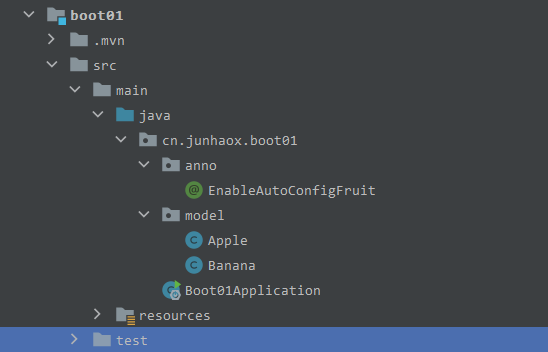

# Springboot01

# 1.纯Java配置SSM

# 2.SpringBoot常用注解

## 2.1@Import使用

新建一个 Springboot 工程，创建两个实体类，和一个自定义注解类，项目目录如下：



一般 @Import 配合 @Enablexxx 使用，并且需要将 @Enablexxx 添加到项目启动类上，然后直接通过 @Autowired 导入即可，使用方式主要有以下四种：

1. 直接在 @Import 中指定需要导入的组件

```java
@Target(ElementType.TYPE)
@Retention(RetentionPolicy.RUNTIME)
@Inherited
@Import({Apple.class, Banana.class})
public @interface EnableAutoConfigFruit {
}
```

2. 在普通类中通过 @Bean 定义 bean ，然后在 @Import 中导入该类即可

定义 bean 的类：

```java
public class MyConfig {
    @Bean
    public Apple apple() {
        return new Apple();
    }
    @Bean
    public Banana banana() {
        return new Banana();
    }
}
```

注解类：

```java
@Target(ElementType.TYPE)
@Retention(RetentionPolicy.RUNTIME)
@Inherited
@Import({MyConfig.class})
public @interface EnableAutoConfigFruit {
}
```

3. 定义一个 Selector 实现 ImportSelector 接口，然后在 @Import 中导入

Selector 类：

```java
public class MySelector implements ImportSelector {
    @Override
    public String[] selectImports(AnnotationMetadata annotationMetadata) {
        return new String[] {Apple.class.getName(), Banana.class.getName()};
    }
}
```

注解类：

```java
@Target(ElementType.TYPE)
@Retention(RetentionPolicy.RUNTIME)
@Inherited
@Import({MySelector.class})
public @interface EnableAutoConfigFruit {
}
```

4. 定义一个 Registrar 实现 ImportBeanDefinitionRegistrar 接口，并重写`registrarBeanDefinitions(arg0, arg1)`方法，然后在 @Import 中导入 Registrar 即可

Registrar 类：

```java
public class MyRegistrar implements ImportBeanDefinitionRegistrar {
    @Override
    public void registerBeanDefinitions(AnnotationMetadata importingClassMetadata, BeanDefinitionRegistry registry) {
        registry.registerBeanDefinition("apple", new RootBeanDefinition(Apple.class));
        registry.registerBeanDefinition("banana", new RootBeanDefinition(Banana.class));
    }
}
```

注解类：

```java
@Target(ElementType.TYPE)
@Retention(RetentionPolicy.RUNTIME)
@Inherited
@Import({MyRegistrar.class})
public @interface EnableAutoConfigFruit {
}
```

## 2.2启动类上的@ComponentScan

@SpringBootApplication 注解：

```java
@Target(ElementType.TYPE)
@Retention(RetentionPolicy.RUNTIME)
@Documented
@Inherited
@SpringBootConfiguration
@EnableAutoConfiguration
@ComponentScan(excludeFilters = { @Filter(type = FilterType.CUSTOM, classes = TypeExcludeFilter.class),
		@Filter(type = FilterType.CUSTOM, classes = AutoConfigurationExcludeFilter.class) })
public @interface SpringBootApplication {}
```

@ComponentScan 用于包扫描，可以指定 basePackages ，如果不指定默认扫描启动类所在包及其子包，excludeFilters ，用来指定不扫描的类型。`@Filter(type = FilterType.CUSTOM, classes = TypeExcludeFilter.class` 用来指定用户自定义的过滤器，需要继承 TypeExcludeFilter 类，并重写 match 方法。

1. TypeExcludeFilter 类：如果容器中有和 HelloService 的 bean 那么返回 true 表示过滤掉 HelloService ，即不扫描 HelloService。

```java
public class MyTypeExcludeFilter extends TypeExcludeFilter {
    @Override
    public boolean match(MetadataReader metadataReader, MetadataReaderFactory metadataReaderFactory) throws IOException {
        return HelloService.class.getName().equals(metadataReader.getClassMetadata().getClassName());
    }
}
```

2. 添加一个 spring 项目初始化类，用于修改 spring 上下文：

```java
public class MyAppInit implements ApplicationContextInitializer<ConfigurableApplicationContext> {
    @Override
    public void initialize(ConfigurableApplicationContext configurableApplicationContext) {
        configurableApplicationContext.addBeanFactoryPostProcessor(new MyTypeExcludeFilterPostProcessor());
    }
    private static class MyTypeExcludeFilterPostProcessor implements PriorityOrdered, BeanDefinitionRegistryPostProcessor {
       	/**
         * 在这里面添加 TypeExcludeFilter
         * @param beanDefinitionRegistry
         * @throws BeansException
         */
        @Override
        public void postProcessBeanDefinitionRegistry(BeanDefinitionRegistry beanDefinitionRegistry) throws BeansException {
            beanDefinitionRegistry.registerBeanDefinition(MyTypeExcludeFilter.class.getName(), new RootBeanDefinition(MyTypeExcludeFilter.class));
        }
        @Override
        public void postProcessBeanFactory(ConfigurableListableBeanFactory configurableListableBeanFactory) throws BeansException {

        }
        @Override
        public int getOrder() {
            return 1;
        }
    }
}
```

3. 修改 spring 默认的 ApplicationContextInitializer ，在 resources 目录下新建 `META-INF/spring.factories`，类容：

```plain
org.springframework.context.ApplicationContextInitializer=cn.junhaox.boot01.config.MyAppInit
```

此时通过 @Autowired 无法注入 HelloService
