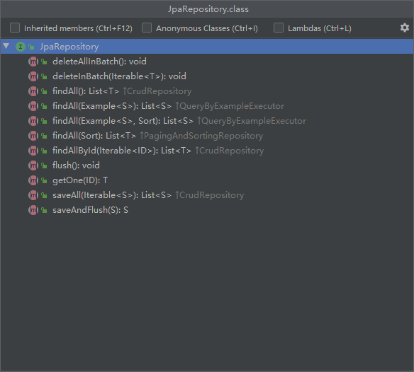
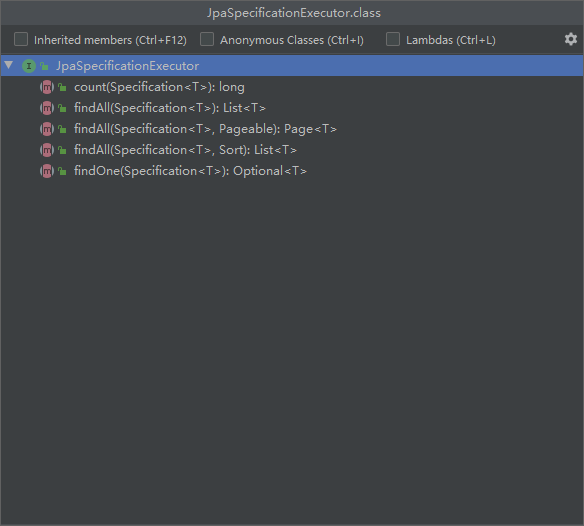
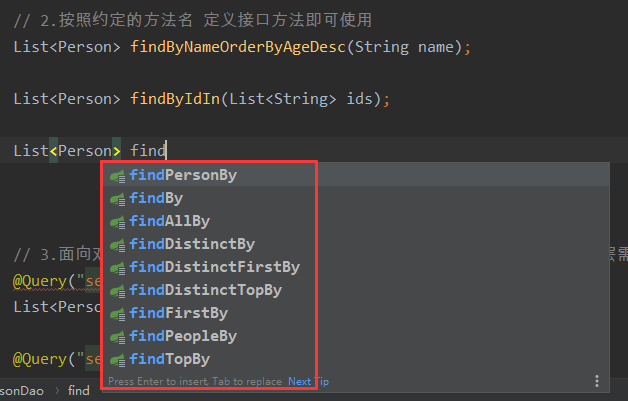
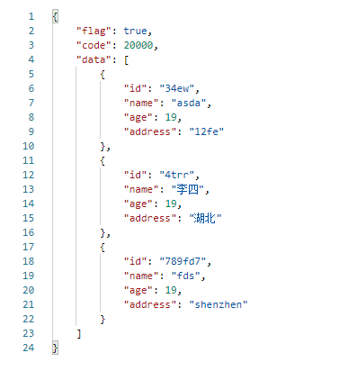
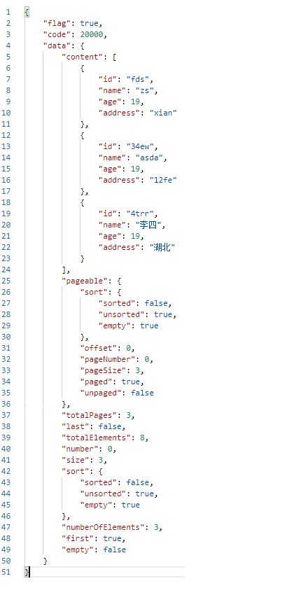
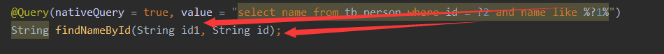

# SpringData JPA

## 1.相关依赖

```xml
<dependency>
  <groupId>mysql</groupId>
  <artifactId>mysql-connector-java</artifactId>
  <scope>runtime</scope>
</dependency>
<dependency>
  <groupId>org.springframework.boot</groupId>
  <artifactId>spring-boot-starter-data-jpa</artifactId>
</dependency>
```

## 2.配置JPA通过实体逆向生成表

1. **yaml配置**

```yaml
server:
  port: 8004
spring:
  datasource:
    username: root
    password: root
    driver-class-name: com.mysql.cj.jdbc.Driver
#    url: jdbc:mysql://192.168.0.20:3306/micro_person?characterEncoding=utf-8
    url: jdbc:mysql://192.168.2.128:3306/micro_person?characterEncoding=utf-8
  jpa:
    database: mysql
    generate-ddl: true # 利用jpa，根据实体类自动生成相应表
    show-sql: true
    properties:
      hibernate:
        dialect:
          org.hibernate.dialect.MySQL5InnoDBDialect
    hibernate:
      ddl-auto: update
```

2. **dao层接口定义**

```java
public interface PersonDao extends JpaRepository<Person, String>, 
JpaSpecificationExecutor<Person> {
}
```

## 3.JPA的5中使用方法

### 1.使用父接口中的预定义方法

直接使用父接口中的方法可以使用基础增删改查方法





### 2.按照约定定义接口方法

主要针对一些查询方法，注意需要先写返回值，然后写方法名才会有提示



### 3. 面向对象的SQL操作  JQL

例如：select 别名 from 类名 别名，就是将普通的SQL中的表名换成类名，字段名换成属性名，注意需要给类名起别名。

不支持添加操作，只能查询、删除、修改，进行删除、修改操作时需要在接口方法上添加注解

```java
// 3.面向对象的SQL查询  JQL 增删改 需要加上 @Modifying 注解 service层需要加上@Transactional注解
@Query("select p from Person p where age = ?1")
List<Person> findByAge(Integer age);

@Query("select p from Person p where age = ?1")
List<Person> findByAgeWithPage(Integer age, Pageable pageable);

@Modifying
@Query("update Person p set p.age = :#{#person.age}, p.address = :#{#person.address}, p.name = :#{#person.name} where p.id = :#{#person.id}")
Integer updatePerson(@Param("person") Person person);
```

### 4.原生SQL操作

需要在@Query注解中指定注解

```java
// 4.原生SQL查询 nativeQuery = true 增删改 需要加上 @Modifying 注解 service层需要加上@Transactional注解
@Query(nativeQuery = true, value = "select name from tb_person where id = ?2 and name like %?1%")
String findNameById(String id1, String id);

@Query(nativeQuery = true, value = "select * from tb_person where age in (:ages) order by age")
Page<Person> findPersonByAgeWithPage(@Param("ages") List<Integer> ages, Pageable pageable);

@Query(nativeQuery = true, value = "select * from tb_person where id = :#{#person.id}")
Person findPersonById(@Param("person") Person person);

@Modifying
@Query(nativeQuery = true, value = "insert into tb_person(id, name, age, address) values (:#{#per.id}, :#{#per.name}, :#{#per.age}, :#{#per.address})")
Integer addPerson(@Param("per") Person person);

@Modifying
@Query(nativeQuery = true, value = "update tb_person set name = :#{#per.name}, age = :#{#per.age}, address = :#{#per.address} where id = :#{#per.id}")
Integer updatePersonById(@Param("per") Person person);

@Modifying
@Query(nativeQuery = true, value = "delete from tb_person where id = :id")
Integer deletePersonById(@Param("id") String id);
```

### 5.面向对象方式

## 4.分页操作

只需要在dao层接口方法中添加一个Pageable参数（放在最后）即可完成分页操作，Pageable有两个属性：

```java
public abstract class AbstractPageRequest implements Pageable, Serializable {
    private static final long serialVersionUID = 1232825578694716871L;
    private final int page; // 当前页，从0开始
    private final int size; // 每页数据大小
}
```

构造Pageable对象：

```java
public List<Person> findByAgeWithPage(Integer age, int page, int size) {
    // JPA分页从0开始，所以需要将实际页码 - 1
    PageRequest pageOf = PageRequest.of(page - 1, size);
    return personDao.findByAgeWithPage(age, pageOf);
}
```

分页返回值可以直接是当前页数据，也可以返回分页对象

**知己返回数据**

```java
@Query("select p from Person p where age = ?1")
List<Person> findByAgeWithPage(Integer age, Pageable pageable);
```



**返回分页对象**

```java
@Query(nativeQuery = true, value = "select * from tb_person where age in (:ages) order by age")
Page<Person> findPersonByAgeWithPage(@Param("ages") List<Integer> ages, Pageable pageable);
```



## 5.JPA中取值操作

1. SQL中使用?1,?2,?3...来对应接口方法中的参数

```java
@Query(nativeQuery = true, value = "select name from tb_person where id = ?2 and name like %?1%")
String findNameById(String id1, String id);
```



2. 普通参数（数值，字符串，集合，数值等）使用`@Param`取别名后，在SQL中使用`:ages`来取值

```java
@Query(nativeQuery = true, value = "select * from tb_person where age in (:ages) order by age")
Page<Person> findPersonByAgeWithPage(@Param("ages") List<Integer> ages, Pageable pageable);


@Modifying
@Query(nativeQuery = true, value = "delete from tb_person where id = :id")
Integer deletePersonById(@Param("id") String id);
```

3. 对象取值，首先使用`@Param`给对象起别名然后在SQL中使用`:#{#per.address}`来取值

```java
@Modifying
@Query(nativeQuery = true, value = "update tb_person set name = :#{#per.name}, age = :#{#per.age}, address = :#{#per.address} where id = :#{#per.id}")
Integer updatePersonById(@Param("per") Person person);
```
