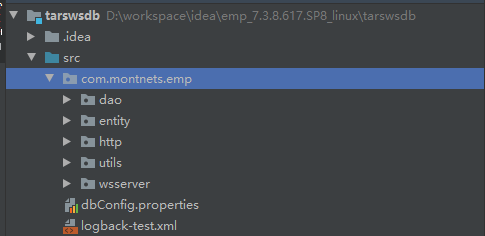
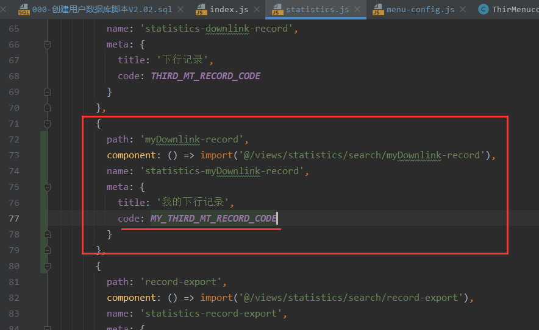
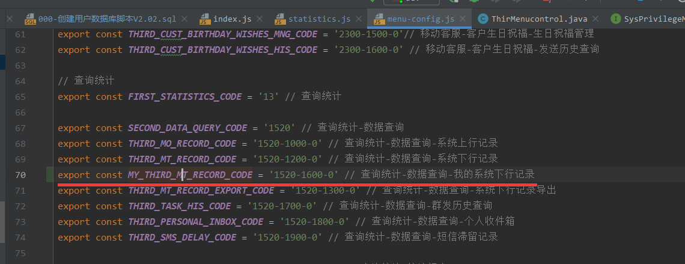
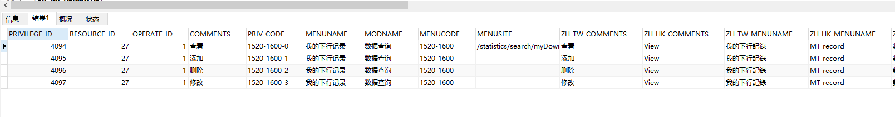
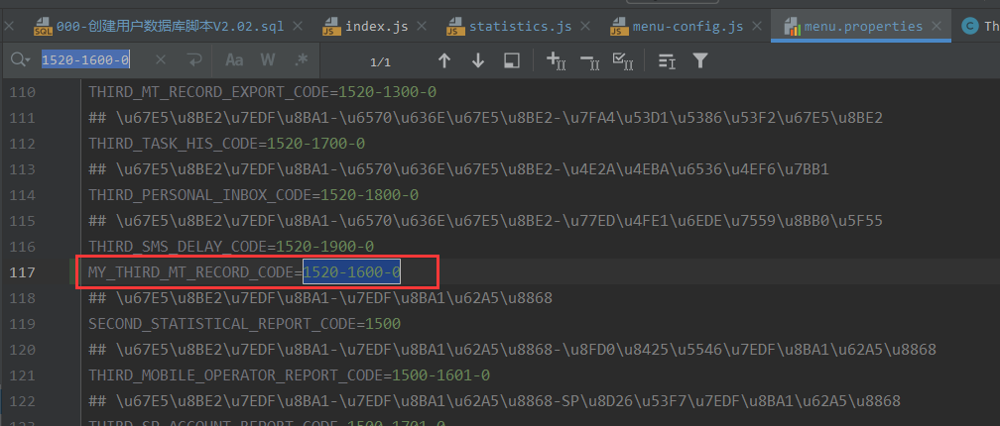

# TARS总结

## 1. 部署Webservice到Tomcat

参考这篇[文章](https://www.yuque.com/wjh9102/rtezcm/utbgb2)，注意要在业务类上加上注解`@SOAPBinding(style = SOAPBinding.Style.RPC)`

## 2. 关于日志

对于项目中我们推荐采用slf4j+logback来进行日志记录，其中logback的配置文件需要放在src目录下，或者放在项目类路径文件夹下，即：将普通文件夹通过开发软件标记为Resources Root等；对于logback的配置文件名称推荐使用`logback-test.xml` （读取的优先级较高）。

关于日志文件的输出位置，对于springboot项目，可以采用相对路径的方式来保存日志文件，例如logs/sys.log，这样就会在当前项目路径下创建文件夹logs并将日志文件存储到该文件夹下。但是对于普通的web项目则无法通过相对路径的方式指定日志文件的输出位置（至少目前是这样的），如果不想在部署时手动修改日志文件的存储位置则可以使用Tomcat的环境变量来动态配置日志的输出位置，例如以下给出的配置文件参考就是使用的Tomcat环境变量，`catalina.base`指向的是Tomcat的根目录，或者说是Tomcat的bin目录、conf目录的父级目录，则最终打包部署后的日志会存储在`%Tomcat_Paht%/myLog/`下。如果在开发时也使用如下配置，对于idea，日志文件保存在`C:\Users\系统用户\.IntelliJIdea2019.2\system\tomcat\项目名\`下。

**logback配置文件参考**

```xml
<configuration>
    <!-- %m输出的信息,%p日志级别,%t线程名,%d日期,%c类的全名,%i索引【从数字0开始递增】,,, -->
    <!-- appender是configuration的子节点，是负责写日志的组件。 -->
    <!-- ConsoleAppender：把日志输出到控制台 -->
    <appender name="STDOUT" class="ch.qos.logback.core.ConsoleAppender">
        <encoder>
            <pattern>%d %p (%file:%line\)- %m%n</pattern>
            <!-- 控制台也要使用UTF-8，不要使用GBK，否则会中文乱码 -->
            <charset>GBK</charset>
        </encoder>
    </appender>
    <!-- RollingFileAppender：滚动记录文件，先将日志记录到指定文件，当符合某个条件时，将日志记录到其他文件 -->
    <!-- 以下的大概意思是：1.先按日期存日志，日期变了，将前一天的日志文件名重命名为XXX%日期%索引，新的日志仍然是sys.log -->
    <!--             2.如果日期没有发生变化，但是当前日志的文件大小超过1KB时，对当前日志进行分割 重命名-->
    <appender name="syslog"
              class="ch.qos.logback.core.rolling.RollingFileAppender">
        <File>${catalina.base}/myLog/sys.log</File>
        <!-- rollingPolicy:当发生滚动时，决定 RollingFileAppender 的行为，涉及文件移动和重命名。 -->
        <!-- TimeBasedRollingPolicy： 最常用的滚动策略，它根据时间来制定滚动策略，既负责滚动也负责出发滚动 -->
        <rollingPolicy class="ch.qos.logback.core.rolling.TimeBasedRollingPolicy">
            <!-- 活动文件的名字会根据fileNamePattern的值，每隔一段时间改变一次 -->
            <!-- 文件名：log/sys.2017-12-05.0.log -->
            <fileNamePattern>${catalina.base}/myLog/sys.%d.%i.log</fileNamePattern>
            <!-- 每产生一个日志文件，该日志文件的保存期限为30天 -->
            <maxHistory>30</maxHistory>
            <timeBasedFileNamingAndTriggeringPolicy  class="ch.qos.logback.core.rolling.SizeAndTimeBasedFNATP">
                <!-- maxFileSize:这是活动文件的大小，默认值是10MB,本篇设置为1KB，只是为了演示 -->
                <maxFileSize>10MB</maxFileSize>
            </timeBasedFileNamingAndTriggeringPolicy>
        </rollingPolicy>
        <encoder>
            <!-- pattern节点，用来设置日志的输入格式 -->
            <pattern>
                %d %p (%file:%line\)- %m%n
            </pattern>
            <!-- 记录日志的编码 -->
            <charset>UTF-8</charset> <!-- 此处设置字符集 -->
        </encoder>
    </appender>
    <!-- 控制台输出日志级别 -->
    <root level="info">
        <appender-ref ref="STDOUT" />
    </root>
    <!-- 指定项目中某个包，当有日志操作行为时的日志记录级别 -->
    <!-- com.appley为根包，也就是只要是发生在这个根包下面的所有日志操作行为的权限都是DEBUG -->
    <!-- 级别依次为【从高到低】：FATAL > ERROR > WARN > INFO > DEBUG > TRACE  -->
    <logger name="com.montnets.emp" level="DEBUG">
        <appender-ref ref="syslog" />
    </logger>
</configuration>
```

## 3. HTTPClient

需要单独写一篇文章

## 4. 配置文件的读取

对于普通项目的配置文件可以采用`ResourceBundle`进行配置文件的读取，但是有一些局限性：只能读取src目录下的properties文件。

**使用**​`**ResourceBundle**`​**读取src下的**​`**dbConfig.properties**`​**配置****文件**



```plain
montnets.ws.databaseIp=192.168.1.33
montnets.ws.databasePort=3306
montnets.ws.databaseName=empf
montnets.ws.user=root
montnets.ws.password=123456
# 网关接口地址，一般只用修改ip
#montnets.ws.webgateIp=http://192.168.1.33:8082/sms/v2/std/single_send
montnets.ws.webgateIp=http://192.169.1.33:8082/sms/mt
```

```java
static {
    ResourceBundle bundle = ResourceBundle.getBundle("dbConfig");
    HttpClientUtil.URL = bundle.getString("montnets.ws.webgateIp");
    logger.info("获取配置文件中的网关地址{}", URL);
}
```

## 5. c3p0的简单使用

### 5.1在src下配置c3p0.properties

 ****​**c3p0.properties参考配置**​ ****

```plain
c3p0.driverClass=com.mysql.jdbc.Driver    
c3p0.jdbcUrl=jdbc:mysql:///users  
c3p0.user=root    
c3p0.password=123456
```

### 5.2在src下配置c3p0-confit.xml

 ****​**c3p0-confit.xml参考配置**​ ****

```xml
<?xml version="1.0" encoding="UTF-8"?>  
<c3p0-config>    
      <default-config>      
        <property name="user">root</property>    
        <property name="password">123456</property>    
        <property name="driverClass">com.mysql.jdbc.Driver</property>    
        <property name="jdbcUrl">jdbc:mysql:///users</property>    
    
        <property name="initialPoolSize">10</property>    
        <property name="maxIdleTime">30</property>    
        <property name="maxPoolSize">100</property>    
        <property name="minPoolSize">10</property>    
      </default-config>    
    
      <named-config name="myApp">    
        <property name="user">root</property>    
        <property name="password">123456</property>    
        <property name="driverClass">com.mysql.jdbc.Driver</property>    
        <property name="jdbcUrl">jdbc:mysql:///users</property>    
    
        <property name="initialPoolSize">10</property>    
        <property name="maxIdleTime">30</property>    
        <property name="maxPoolSize">100</property>    
        <property name="minPoolSize">10</property>    
      </named-config>    
</c3p0-config>
```

通过以上两种方式配置完成后即直接实例化`ComboPooledDataSource`通过该类的对象获取数据库连接。

### 5.3通过setters的方式

如果项目中已经有配置文件，而又不想添加新的配置文件则可以通过Java代码的方式对`ComboPooledDataSource` 进行赋值，设置各个配置项。

```java
package com.montnets.emp.utils;


import com.mchange.v2.c3p0.ComboPooledDataSource;
import org.slf4j.Logger;
import org.slf4j.LoggerFactory;

import java.beans.PropertyVetoException;
import java.sql.*;
import java.util.ResourceBundle;

/**
 * @author ibytecode2020@gmail.com
 * create by Wang Junhao
 * @date 2020/7/5 16:10
 */
public class JDBCUtils {
    private static final Logger logger = LoggerFactory.getLogger(JDBCUtils.class);
    private static String DATABASE_IP;
    private static String DATABASE_PORT;
    private static String DATABASE_NAME;
    private static String USER;
    private static String PASSWORD;
    private static ComboPooledDataSource ds;

    static {
        logger.info("初始化数据库配置信息");
        ds  = new ComboPooledDataSource();
        ResourceBundle bundle = ResourceBundle.getBundle("dbConfig");
        JDBCUtils.DATABASE_IP = bundle.getString("montnets.ws.databaseIp");
        JDBCUtils.DATABASE_PORT = bundle.getString("montnets.ws.databasePort");
        JDBCUtils.DATABASE_NAME = bundle.getString("montnets.ws.databaseName");
        JDBCUtils.USER = bundle.getString("montnets.ws.user");
        JDBCUtils.PASSWORD = bundle.getString("montnets.ws.password");
        try {
            ds.setDriverClass("com.mysql.jdbc.Driver");
            ds.setJdbcUrl("jdbc:mysql://" + JDBCUtils.DATABASE_IP + ":" + JDBCUtils.DATABASE_PORT + "/" + JDBCUtils.DATABASE_NAME + "?characterEncoding=gbk&useSSL=false&autoReconnect=true");
            ds.setUser(JDBCUtils.USER);
            ds.setPassword(JDBCUtils.PASSWORD);
            logger.info("初始化完成");
        } catch (PropertyVetoException e) {
            logger.error("加载驱动失败", e);
        }
    }

    // c3p0
    public static Connection getConnection() {
        Connection conn = null;
        try {
            conn = ds.getConnection();
        } catch (SQLException e) {
            logger.error("数据库连接初始化失败：", e);
        }
        logger.info("返回数据库连接：{}", conn);
        return conn;
    }
}

```

## 6. 以字节流形式下载文件

后端设置相应类型`response.setContentType("application/octet-stream");`，设置相应头，响应头里指定下载文件名称。

```java
response.setContentType("application/octet-stream");
response.addHeader("Content-Disposition", "attachment;filename=" + new String("短信报表.xlsx".getBytes(StandardCharsets.UTF_8), StandardCharsets.ISO_8859_1));
response.getOutputStream().write(data);
```

前端通过a标签来进行文件下载

```html
<a id="exportA" style="display: none" download></a>
// 获取a标签
const exportA = document.getElementById("exportA");
// 设置下载地址
exportA.setAttribute("href", url);
// 进行下载操作
exportA.click();
```

## 7. MySQL根据时间查询

可以采用如下方式，但效率不高。

```sql
select a.*, b.TM_NAME tm_name from lf_under_renew_p1 a, lf_template b where a.BUSCODE = b.TM_CODE and SENDTIME > '2020-07-06 16:19:22' and SENDTIME < '2020-07-28 16:19:25' order by SENDTIME DESC, id DESC LIMIT 15 OFFSET 0
```

## 8.MySQL分页查询

```sql
select * from 表名 limit 每页数据量 offset 每页数据量 * (当前页 - 1)
```

## 9. EMP添加菜单

1. lf_privilege表添加菜单
2. LF_IMPOWER表给系统管理员赋权限（初始化权限，否则无法给其他角色分配权限）
3. 新建servlet并在对应xml下创建映射关系

**servlet**

```java
public class Report_ExpSvt extends BaseServlet {
    private final String empRoot = "cxtj";

    private final String base = "/query";

    private final ReportExpBiz reportExpBiz = new ReportExpBiz();

    public void find(HttpServletRequest request, HttpServletResponse response) throws ServletException, IOException {
        try {
            String corpCode = getCorpCode(request);

            // 查询机构 并返回给页面
            getAndSetDep(corpCode, request);


            // 查询业务名称（短信模板）并返回给页面 指定接口模板
            getAndSetBusinessType(corpCode, request);

            PageInfo pageInfo = new PageInfo();
            request.setAttribute("pageInfo", pageInfo);
            request.setAttribute("isFirstEnter", true);

            request.getRequestDispatcher(empRoot + base + "/report_ExpSvt.jsp").forward(request, response);
        } catch (Exception e) {
            EmpExecutionContext.error(e,"跳转短信报表页面失败！");
        }
    }
}
```

**xml配置文件**

```xml
<!-- 短信报表 -->
<servlet>
	<servlet-class>com.montnets.emp.query.servlet.Report_ExpSvt</servlet-class>
	<servlet-name>Report_ExpSvt</servlet-name>
</servlet>
<servlet-mapping>
	<servlet-name>Report_ExpSvt</servlet-name>
	<url-pattern>/report_ExpSvt.htm</url-pattern>
</servlet-mapping>
```

4. 在properties/menuPro下的配置文件中添加，menuUrl_15=/report_ExpSvt.htm，与xml中的url-pattern对应

## 10. 动态bean的使用

RowSetDynaClass可以将ResultSet转换为DynaBean的集合，然后通过DynaBean的get方法即可获取字段值，其中get方法的参数默认是表的字段名小写

```java
public List<DynaBean> queryUserdataByUserId() {
    String sql = "select * from userdata";
    Connection conn = JDBCUtils.getConnection();
    ResultSet rs = null;
    PreparedStatement ps = null;
    if (null != conn) {
        try {
            ps = conn.prepareStatement(sql);
            rs = ps.executeQuery();
            // 可以通过第二个参数指定字段名大小写，第三个参数作用不详
            RowSetDynaClass rows = new RowSetDynaClass(rs, true, true);
            return (List<DynaBean>) rows.getRows();
        } catch (SQLException e) {
            logger.error("SQL执行异常：{}", sql);
        } finally {
            try {
                if (null != rs) rs.close();
            } catch (SQLException e) {
                logger.error("ResultSet关闭失败：", e);
            }
            try {
                if (ps != null) ps.close();
            } catch (SQLException e) {
                logger.error("PreparedStatement关闭失败：", e);
            }
            try {
                conn.close();
            } catch (SQLException e) {
                logger.error("Connection关闭失败：", e);
            }
        }
    }
    logger.error("获取数据库连接失败");
    return null;
}
```

**测试使用**

```java
public static void main(String[] args) {
    UserDataDao dao = new UserDataDao();
    List<DynaBean> dynaBeans = dao.queryUserdataByUserId();
    for (DynaBean dynaBean : dynaBeans) {
        System.out.println(dynaBean.get("staffname") + ", " + dynaBean.get("ordertime"));
    }
}
```

## 11.统一消息添加菜单

1. 在`router/modules`下找到对应模块，在对应位置添加路由



2. 在`menu-config.js`文件中添加权限码



3. lf_privilege表添加菜单及按钮权限



4. 给系统管理员添加改模块的权限（否则无法给其他角色赋权限）

```sql
INSERT into LF_IMPOWER VALUES ('4', '4094');
INSERT into LF_IMPOWER VALUES ('4', '4095');
INSERT into LF_IMPOWER VALUES ('4', '4096');
INSERT into LF_IMPOWER VALUES ('4', '4097');
```

5. `menu.properties`中添加权限码，和`menu-config.js`中对应


