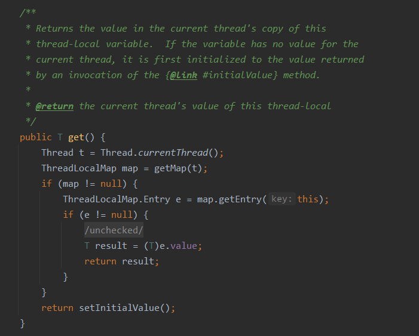
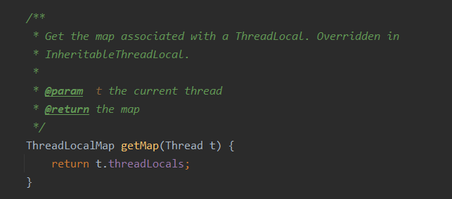
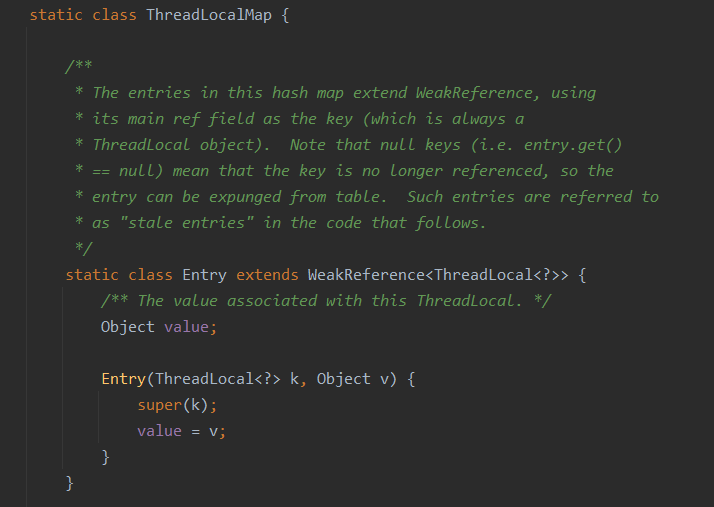
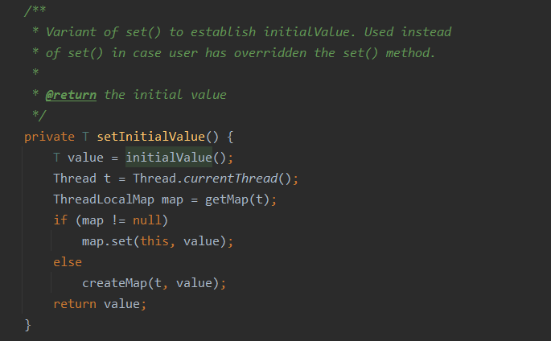
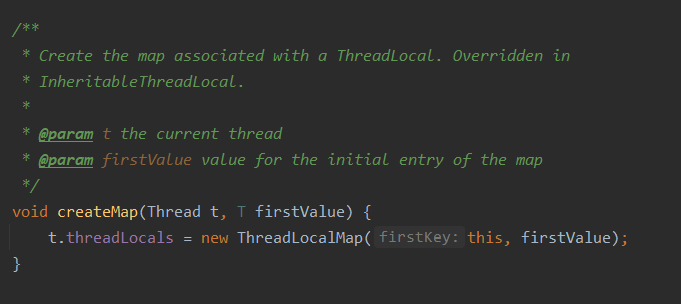
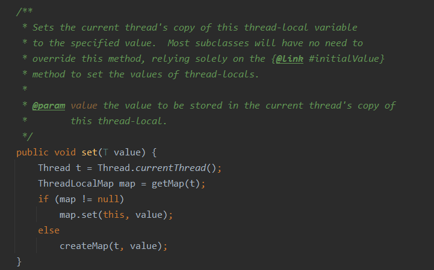
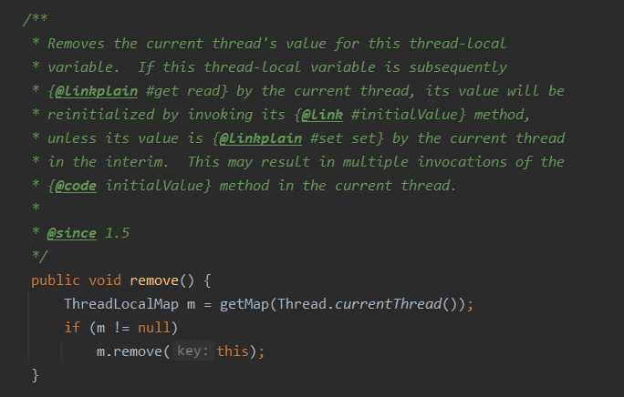

# ThreadLocal

# 1. 什么是ThreadLocal

结合我的总结可以这样理解：ThreadLocal提供了线程的局部变量，每个线程都可以通过`set()`和`get()`来对这个局部变量进行操作，但不会和其他线程的局部变量进行冲突，**实现了线程的数据隔离**～。

简要言之：往ThreadLocal中填充的变量属于**当前**线程，该变量对其他线程而言是隔离的。

# 2.ThreadLocal类解析

在上面谈到了对ThreadLocal的一些理解，那我们下面来看一下具体ThreadLocal是如何实现的。

先了解一下ThreadLocal类提供的几个方法：

```java
public T get() { }
public void set(T value) { }
public void remove() { }
protected T initialValue() { }
```

get()方法是用来获取ThreadLocal在当前线程中保存的变量副本，set()用来设置当前线程中变量的副本，remove()用来移除当前线程中变量的副本，initialValue()是一个protected方法，一般是用来在使用时进行重写的，它是一个延迟加载方法

## 2.1get 方法的实现



第一句是获取当前线程，然后通过当前线程获取`ThreadLocalMap`，然后通过这个 Map 获取 Entry 键值对，注意这里传入的参数是 this 而不是当前线程 t，如果获取成功则返回 value 否则通过调用 `setInitialValue` 方法返回 value 。

- 看一下 getMap 方法的实现



返回当前线程的 threadLocals 其类型为 ThreadLocalMap ，ThreadLocalMap 是 ThreadLocal 的内部类。

接着看一下 ThreadLocalMap 的实现



ThreadLocalMap 中的 Entry 继承了 ，这一点很重要。

- setInitialValue 方法



很容易理解：获取当前线程的 ThreadLocalMap，如果 map 不为空则将当天 ThreadLocal 作为键，value 作为值设置到 map 中，否则的话就调用 createMap 方法创建当前线程的 ThreadLocalMap 。

createMap 方法的实现：



## 2.1set、remove方法的实现





set 方法和 remove 方法的实现比较简单，这里不展开。

至此，已经明白 ThreadLocal 是如何为每个线程创建变量副本的了：首先每个 Thread 都有一个 ThreadLocal.ThreadLocalMap 类型的成员变量 ThreadLocals ，这个 threadLocals 就是用来存储实际的变量副本的，键值为当前 ThreadLocal 变量， value 为变量副本（即T类型的变量）。

初始时，在 Thread 里面， threadLocals 为空，当通过 ThreadLocal 变量调用 get() 方法或者 set() 方法，就会对 Thread 类中的 threadLocals 进行初始化，并且以当前 ThreadLocal 变量为键值，以 ThreadLocal 要保存的副本变量为 value，存到 threadLocals 。

然后在当前线程里面，如果要使用副本变量，就可以通过 get 方法在 threadLocals 里面查找。

# 3.ThreadLocal应用场景

最常见的ThreadLocal使用场景为 用来解决 数据库连接、Session管理等。

```java
private static final ThreadLocal threadSession = new ThreadLocal();
 
public static Session getSession() throws InfrastructureException {
    Session s = (Session) threadSession.get();
    try {
        if (s == null) {
            s = getSessionFactory().openSession();
            threadSession.set(s);
        }
    } catch (HibernateException ex) {
        throw new InfrastructureException(ex);
    }
    return s;
}
```

可以看到在getSession()方法中，首先判断当前线程中有没有放进去session，如果还没有，那么通过sessionFactory().openSession()来创建一个session，再将session set到线程中，实际是放到当前线程的ThreadLocalMap这个map中，这时，对于这个session的唯一引用就是当前线程中的那个ThreadLocalMap（下面会讲到），而threadSession作为这个值的key，要取得这个session可以通过threadSession.get()来得到，里面执行的操作实际是先取得当前线程中的ThreadLocalMap，然后将threadSession作为key将对应的值取出。这个session相当于线程的私有变量，而不是public的。
显然，其他线程中是取不到这个session的，他们也只能取到自己的ThreadLocalMap中的东西。要是session是多个线程共享使用的，那还不乱套了。
试想如果不用ThreadLocal怎么来实现呢？可能就要在action中创建session，然后把session一个个传到service和dao中，这可够麻烦的。或者可以自己定义一个静态的map，将当前thread作为key，创建的session作为值，put到map中，应该也行，这也是一般人的想法，但事实上，ThreadLocal的实现刚好相反，它是在每个线程中有一个map，而将ThreadLocal实例作为key，这样每个map中的项数很少，而且当线程销毁时相应的东西也一起销毁了，不知道除了这些还有什么其他的好处。

总之，ThreadLocal不是用来解决对象共享访问问题的，而主要是提供了保持对象的方法和避免参数传递的方便的对象访问方式。归纳了两点：
1。每个线程中都有一个自己的ThreadLocalMap类对象，可以将线程自己的对象保持到其中，各管各的，线程可以正确的访问到自己的对象。

当然如果要把本来线程共享的对象通过ThreadLocal.set()放到线程中也可以，可以实现避免参数传递的访问方式，但是要注意get()到的是那同一个共享对象，并发访问问题要靠其他手段来解决。但一般来说线程共享的对象通过设置为某类的静态变量就可以实现方便的访问了，似乎没必要放到线程中。

ThreadLocal的应用场合，我觉得最适合的是按线程多实例（每个线程对应一个实例）的对象的访问，并且这个对象很多地方都要用到。
