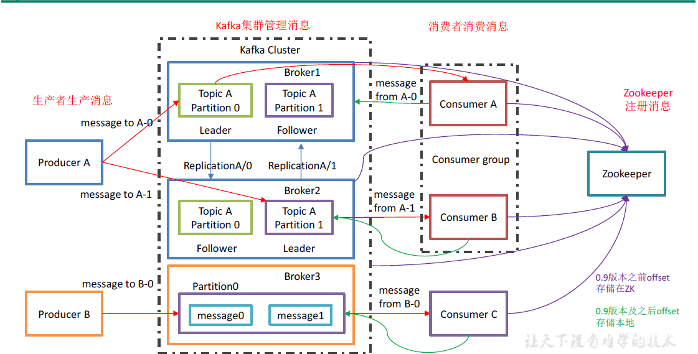

# kafka

# 1.基本介绍

Kafka 是一个分布式的基于发布/订阅模式的消息队列（Message Queue），主要应用于大数据实时处理领域。其基本架构如下：



1. Producer ：消息生产者，就是向kafka broker 发消息的客户端；
2. Consumer ：消息消费者，向kafka broker 取消息的客户端；
3. Consumer Group （CG）：消费者组，由多个consumer 组成。消费者组内每个消费者负责消费不同分区的数据，一个分区只能由一个组内消费者消费；消费者组之间互不影响。所有的消费者都属于某个消费者组，即消费者组是逻辑上的一个订阅者。
4. Broker ：一台kafka 服务器就是一个broker。一个集群由多个broker 组成。一个broker可以容纳多个topic。
5. Topic ：可以理解为一个队列，生产者和消费者面向的都是一个topic；
6. Partition：为了实现扩展性，一个非常大的topic 可以分布到多个broker（即服务器）上，一个topic 可以分为多个partition，每个partition 是一个有序的队列；
7. Replica：副本，为保证集群中的某个节点发生故障时，该节点上的partition 数据不丢失，且kafka 仍然能够继续工作，kafka 提供了副本机制，一个topic 的每个分区都有若干个副本，一个leader 和若干个follower。
8. leader：每个分区多个副本的“主”，生产者发送数据的对象，以及消费者消费数据的对象都是leader。
9. follower：每个分区多个副本中的“从”，实时从leader 中同步数据，保持和leader 数据的同步。leader 发生故障时，某个follower 会成为新的follower。

# 2.zookeeper集群搭建

kafka集群搭建依赖于zookeeper集群，所以需要先搭建zookeeper集群，首先需要安装java环境

`java -version`，查看java版本

```plain
[root@bigdata01 ~]# java -version
java version "1.8.0_221"
Java(TM) SE Runtime Environment (build 1.8.0_221-b11)
Java HotSpot(TM) 64-Bit Server VM (build 25.221-b11, mixed mode)
```

1. [下载](http://mirror.bit.edu.cn/apache/zookeeper/)zookeeper并上传到`/opt`目录下
2. 解压到`/usr/local`目录下

`tar -zxvf zookeeper-3.4.14.tar.gz -C /usr/local`

3. 在zookeeper解压目录下创建`zkData`目录，并创建myid文件

```bash
cd /usr/local/zookeeper-3.4.14/
mkdir zkData
cd zkData
touch myid
echo 1 > myid
```

4.修改zookeeper配置文件

将conf目录下的`zoo_sample.cfg`文件重命名为`zoo.cfg`，并修改或添加一下内容

```bash
dataDir=/usr/local/zookeeper-3.4.14/zkData
# 1、3、5即为myid文件中配置的数字
server.1=bigdata01:2888:3888
server.3=bigdata03:2888:3888
server.5=bigdata05:2888:3888
```

5. 将配置好的zookeeper分发至其他服务器，注意修改myid中的数字，需要与配置文件中的对应
6. zookeeper集群管理脚本

```shell
#!/bin/bash

case $1 in
"start"){
	for i in bigdata01 bigdata03 bigdata05
	do
		echo "********$i start********"
		ssh $i "/usr/local/zookeeper-3.4.14/bin/zkServer.sh start"
	done
};;

"stop"){
	for i in bigdata01 bigdata03 bigdata05
	do
		echo "********$i stop********"
		ssh $i "/usr/local/zookeeper-3.4.14/bin/zkServer.sh stop"
	done
};;
esac
```

# 3.kafka集群搭建

1. [下载](https://archive.apache.org/dist/kafka/2.3.0/kafka_2.12-2.3.0.tgz)并解压到`/usr/local`目录下
2. 修改`config/server.properties`配置文件

```shell
# 每个结点id不一样，数字
broker.id=0
# 数据文件的位置
log.dirs=/usr/local/kafka_2.12-2.3.0/data
# 配置zookeeper集群
zookeeper.connect=bigdata01:2181,bigdata02:2181,bigdata03:2181
```

3. 分发到其他服务器，注意修改配置文件中的`broker.id`
4. kafka集群管理脚本，注意先启动zookeeper集群

```shell
#!/bin/bash

case $1 in
"start"){
	for i in bigdata01 bigdata03 bigdata05
	do
		echo "********$i********"
		ssh $i "/usr/local/kafka_2.12-2.3.0/bin/kafka-server-start.sh -daemon /usr/local/kafka_2.12-2.3.0/config/server.properties"
	done
};;

"stop"){
	for i in bigdata01 bigdata03 bigdata05
	do
		echo "********$i********"
		ssh $i "/usr/local/kafka_2.12-2.3.0/bin/kafka-server-stop.sh /usr/local/kafka_2.12-2.3.0/config/server.properties"
	done
};;
esac
```

## 一、命令行基本使用

1. 创建topic，查看集群中的topic

```shell
# 创建topic
bin/kafka-topics.sh --zookeeper bigdata01:2181,bigdata03:2181,bigdata05:2181 --create --replication-factor 3 --partitions 2 --topic second
# --zookeeper: 连接的zookeeper集群
# --replication-factor 副本数，用于备份，不能大于集群中可用broker数
#--partitions 分区数，一般为了高效与消费者组中的消费者数一致

# 查看集群中的topic
bin/kafka-topics.sh --zookeeper bigdata01:2181 --list
```

2. 生成消息

```shell
[root@bigdata01 kafka_2.12-2.3.0]# bin/kafka-console-producer.sh --broker-list bigdata01:9092,bigdata03:9092,bigdata05:9092 --topic second
>hello
>
```

3. 消费者消费消息

```shell
[root@bigdata03 kafka_2.12-2.3.0]# bin/kafka-console-consumer.sh --bootstrap-server bigdata01:9092,bigdata03:9092,bigdata05:9092 --topic second
hello
```

## 二、使用java操作kafka

1. 项目依赖

```xml
<dependencies>
  <!-- https://mvnrepository.com/artifact/org.apache.kafka/kafka-clients -->
  <dependency>
    <groupId>org.apache.kafka</groupId>
    <artifactId>kafka-clients</artifactId>
    <version>2.3.0</version>
  </dependency>

</dependencies>
```

2. 生产者代码

```java
public static void main(String[] args) {
    Properties properties = new Properties();
    properties.put(ProducerConfig.BOOTSTRAP_SERVERS_CONFIG, "bigdata01:9092,bigdata03:9092,bigdata05:9092");
    properties.put("acks", "all");
    properties.put("retries", 3);
    properties.put("batch.size", 16384);
    properties.put("linger.ms", 1);
    properties.put("buffer.memory", 33554432);
    properties.put("key.serializer", "org.apache.kafka.common.serialization.StringSerializer");
    properties.put("value.serializer", "org.apache.kafka.common.serialization.StringSerializer");
    KafkaProducer<String, String> producer = new KafkaProducer<>(properties);
    for (int i = 0; i < 10; i++) {
        // 通过回调可以获取offset和分区等信息
        producer.send(new ProducerRecord<>("first", "hello**--**" + i), (recordMetadata, e) -> {
            if (e == null) {
                System.out.println(recordMetadata.partition() + "----------" + recordMetadata.offset());
            } else {
                e.printStackTrace();
            }
        });
    }
    producer.close();
}
```

3. 消费者代码

```java
public static void main(String[] args) {
    Properties properties = new Properties();
    properties.put(ConsumerConfig.BOOTSTRAP_SERVERS_CONFIG, "bigdata01:9092,bigdata03:9092,bigdata05:9092");
    properties.put(ConsumerConfig.KEY_DESERIALIZER_CLASS_CONFIG, "org.apache.kafka.common.serialization.StringDeserializer");
    properties.put(ConsumerConfig.VALUE_DESERIALIZER_CLASS_CONFIG, "org.apache.kafka.common.serialization.StringDeserializer");
    properties.put(ConsumerConfig.AUTO_COMMIT_INTERVAL_MS_CONFIG, 100);
    properties.put(ConsumerConfig.ENABLE_AUTO_COMMIT_CONFIG, true);
    properties.put(ConsumerConfig.GROUP_ID_CONFIG, "group1");
    KafkaConsumer<String, String> consumer = new KafkaConsumer<String, String>(properties);
    consumer.subscribe(Arrays.asList("first", "second"));
    while (true) {
        ConsumerRecords<String, String> records = consumer.poll(Duration.ofMillis(100));
        records.forEach(System.out::println);
    }
}
```

---

#
