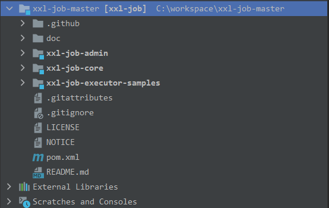
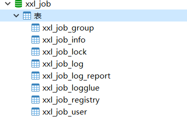
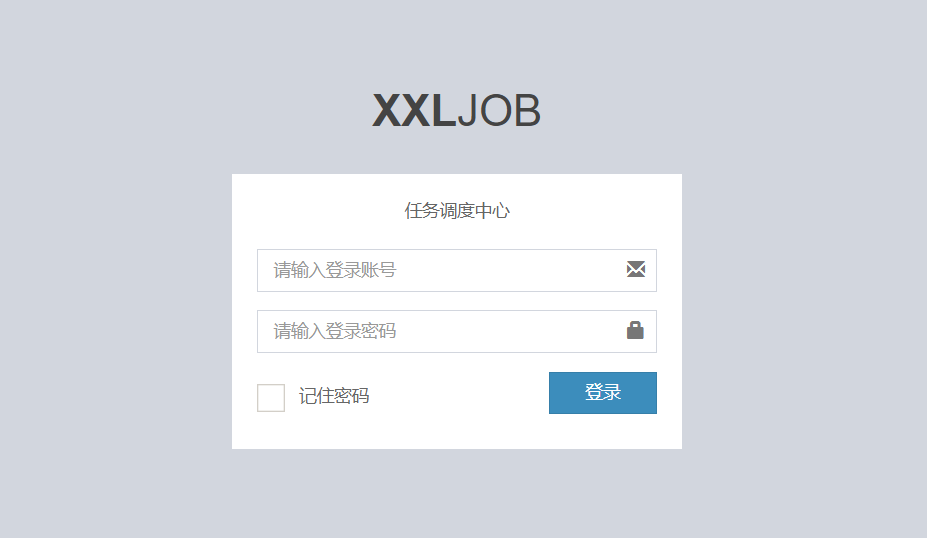
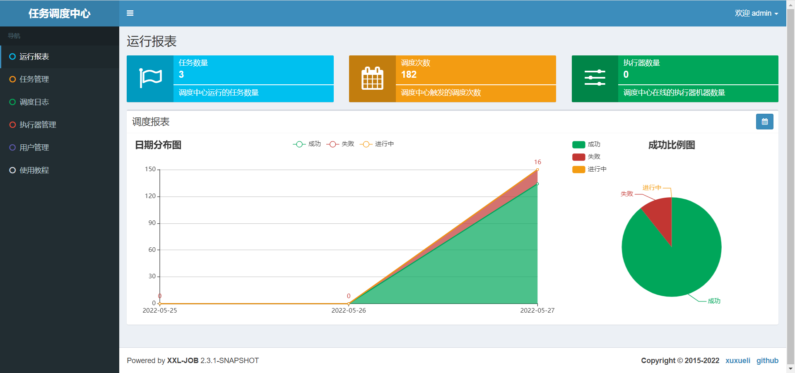
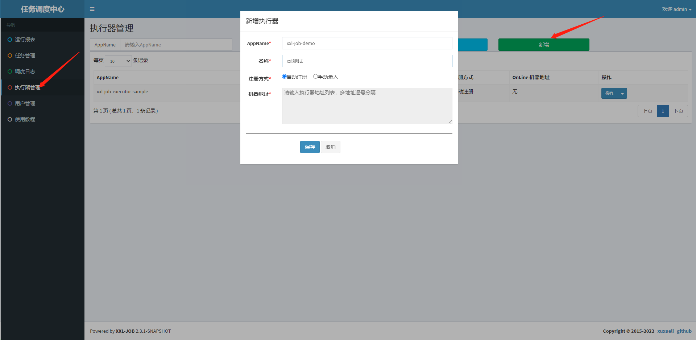
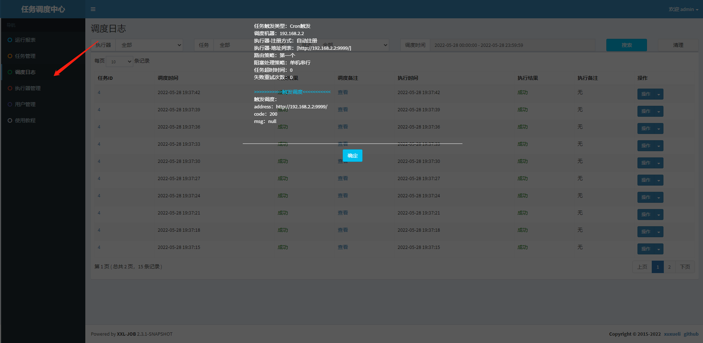
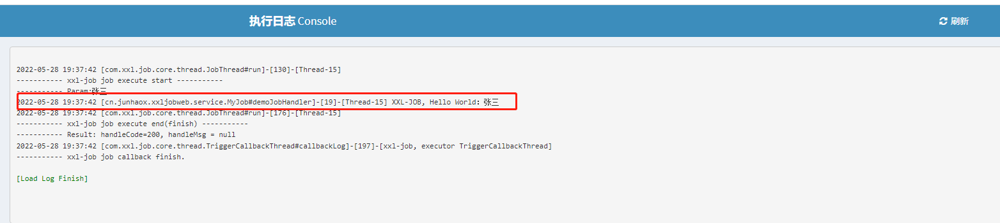

# xxl-job使用

# 1.管理页面配置

从 [GitHub ](https://github.com/xuxueli/xxl-job)上拉取最新代码，然后使用 idea 打开，代码结构如下



主要包含四个文件夹：

- doc：项目文档及 SQL 等
- xxl-job-admin：任务调度平台，提供可视化页面用来操作定时任务
- xxl-job-core：核心代码
- xxl-job-executor-samples：示例代码

xxl-job 的任务调度平台需要数据库，执行`doc/db/tables_xxl_job.sql`进行数据库初始化，初始化完成后如下：



然后修改 xxl-job-admin 的配置文件中的数据库配置：

```properties
### xxl-job, datasource
spring.datasource.url=jdbc:mysql://172.31.131.205:3306/xxl_job?useUnicode=true&characterEncoding=UTF-8&autoReconnect=true&serverTimezone=Asia/Shanghai&useSSL=false
spring.datasource.username=root
spring.datasource.password=123
spring.datasource.driver-class-name=com.mysql.cj.jdbc.Driver
```

同时修改日志配置中日志路径，以免没有权限创建日志文件或者找不到日志目录：

```xml
<property name="log.path" value="./applogs/xxl-job/xxl-job-admin.log"/>
```

xxl-job-admin 为 spring boot 项目，找到其启动类直接启动即可。启动完成后访问 `localhost:8080/xxl-job-admin/`，就可以看到登录页面了。默认密码为 `admin/123456`



看到如下页面表示登录成功：



# 2.开发定时任务

## 2.1项目创建及配置

首先创建 spring boot 项目，勾选 web 依赖即可，创建成功后手动添加 xxl-job 的依赖：

```xml
<dependency>
    <groupId>com.xuxueli</groupId>
    <artifactId>xxl-job-core</artifactId>
    <version>2.3.0</version>
</dependency>
```

然后在 resources 目录下添加 logback.xml 配置文件：

```xml
<?xml version="1.0" encoding="UTF-8"?>
<configuration debug="false" scan="true" scanPeriod="1 seconds">

    <contextName>logback</contextName>
    <property name="log.path" value="./applogs/xxl-job/xxl-job-executor-sample-springboot.log"/>

    <appender name="console" class="ch.qos.logback.core.ConsoleAppender">
        <encoder>
            <pattern>%d{HH:mm:ss.SSS} %contextName [%thread] %-5level %logger{36} - %msg%n</pattern>
        </encoder>
    </appender>

    <appender name="file" class="ch.qos.logback.core.rolling.RollingFileAppender">
        <file>${log.path}</file>
        <rollingPolicy class="ch.qos.logback.core.rolling.TimeBasedRollingPolicy">
            <fileNamePattern>${log.path}.%d{yyyy-MM-dd}.zip</fileNamePattern>
        </rollingPolicy>
        <encoder>
            <pattern>%date %level [%thread] %logger{36} [%file : %line] %msg%n
            </pattern>
        </encoder>
    </appender>

    <root level="info">
        <appender-ref ref="console"/>
        <appender-ref ref="file"/>
    </root>

</configuration>
```

修改 application.yaml 配置文件，添加如下配置：

```yaml
# 日志文件地址
logging:
  config: classpath:logback.xml
xxl:
  job:
    admin:
      # xxl-job 管理端的地址
      addresses: http://172.31.131.205:8089/xxl-job-admin
    # 与管理端交互的 token 两边都配置会进行校验
    accessToken:
    executor:
      # 执行器的名字，会在管理端试用到
      appname: xxl-job-demo
      # 执行器地址，如果没有配置就试用ip:port
      address:
      # 执行器IP
      ip:
      # 执行器端口
      port: 9998
      # 执行器执行定时任务日志地址，用来查看执行日志详情
      logpath: ./applogs/xxl-job/jobhandler
      # 执行器日志保存时间application.yam
      logretentiondays: 30
server:
  port: 8081
```

接下来根据配置提供一个配置类：

```java
@ConfigurationProperties(prefix = "xxl.job")
public class XxlJobProperties {
    private String accessToken;
    private Executor executor;
    private Admin admin;

    public String getAccessToken() {
        return accessToken;
    }

    public void setAccessToken(String accessToken) {
        this.accessToken = accessToken;
    }

    public Executor getExecutor() {
        return executor;
    }

    public void setExecutor(Executor executor) {
        this.executor = executor;
    }

    public Admin getAdmin() {
        return admin;
    }

    public void setAdmin(Admin admin) {
        this.admin = admin;
    }

    static class Executor {
        private String appname;
        private String address;
        private String ip;
        private Integer port;
        private String logpath;
        private Integer logretentiondays;

        public String getAppname() {
            return appname;
        }

        public void setAppname(String appname) {
            this.appname = appname;
        }

        public String getAddress() {
            return address;
        }

        public void setAddress(String address) {
            this.address = address;
        }

        public String getIp() {
            return ip;
        }

        public void setIp(String ip) {
            this.ip = ip;
        }

        public Integer getPort() {
            return port;
        }

        public void setPort(Integer port) {
            this.port = port;
        }

        public String getLogpath() {
            return logpath;
        }

        public void setLogpath(String logpath) {
            this.logpath = logpath;
        }

        public Integer getLogretentiondays() {
            return logretentiondays;
        }

        public void setLogretentiondays(Integer logretentiondays) {
            this.logretentiondays = logretentiondays;
        }
    }

    static class Admin {
        private String addresses;

        public String getAddresses() {
            return addresses;
        }

        public void setAddresses(String addresses) {
            this.addresses = addresses;
        }
    }

    private Logger logger = LoggerFactory.getLogger(XxlJobProperties.class);

    @Bean
    public XxlJobSpringExecutor xxlJobExecutor() {
        logger.info(">>>>>>>>>>> xxl-job config init.");
        XxlJobSpringExecutor xxlJobSpringExecutor = new XxlJobSpringExecutor();
        xxlJobSpringExecutor.setAdminAddresses(admin.getAddresses());
        xxlJobSpringExecutor.setAppname(executor.getAppname());
        xxlJobSpringExecutor.setAddress(executor.getAddress());
        xxlJobSpringExecutor.setIp(executor.getIp());
        xxlJobSpringExecutor.setPort(executor.getPort());
        xxlJobSpringExecutor.setAccessToken(accessToken);
        xxlJobSpringExecutor.setLogPath(executor.getLogpath());
        xxlJobSpringExecutor.setLogRetentionDays(executor.getLogretentiondays());
        return xxlJobSpringExecutor;
    }

}
```

由于使用的是`@ConfigurationProperties`注解来实现属性自动注入，如果需要导入该属性配置需要在配置类上添加`@EnableConfigurationProperties({XxlJobProperties.class})`注解，方可使用。

## 2.2开发定时任务

定时任务的开发主要有三种方式：

- BEAN 模式（基于类）：不依赖 spring 环境，每个任务对应一个 Java 类，容易造成类浪费
- BEAN 模式（基于方法）：依赖 spring 环境，每个任务对应一个方法，并且需要在方法上添加`@XxlJob`注解，同时将方法所在类添加到 spring 容器中
- CLUE模式（Java）：任务以源码的方式维护在调度中心，即在网页上编写定时任务代码，然后执行（使用较少）

这里主要介绍基于方法的 BEAN 模式。

1. 开发 JOB 方法：

```java
@Component
public class MyJob {
    @XxlJob("demoJobHandler")
    public ReturnT<String> demoJobHandler() throws Exception {
        String param = XxlJobHelper.getJobParam();
        XxlJobHelper.log("XXL-JOB, Hello World：{}",param);
        System.out.println("param = " + param);
        return ReturnT.SUCCESS;
    }
}
```

这里的 `@XxlJob`标注了该方法是一个任务，该注解还有 init 和 destroy 属性，分别用来配置初始化和销毁方法

通过`XxlJobHelper.getJobParam();`来获取定时任务参数，参数通过调度中心配置

通过`XxlJobHelper.log("XXL-JOB, Hello World：{}",param);`来打印日志，日志会记录在`xxl.job.executor.logpath`配置的路径下，在调度中心查看日志详情也是从该配置下的文件读取而来

任务默认返回“成功”，也可以通过`XxlJobHelper._handleFail_()\_handleSuccess_()`来指定任务成功或失败

2. 配置调度中心，新建定时任务

打开调度中心 ，找到执行器管理，点击新增：



其中 AppName 对应的值为配置文件中 `xxl.job.executor.appname`的配置，然后选择自动注册、保存

接下来点击任务管理，新增定时任务：


**执行器**选择我们刚刚新建的执行器，JobHandler 为定时任务方法上`@XxlJob`的属性值，调度类型及 cron 表达式自定义即可，也可以通过**任务参数**来给定时任务提供参数，点击保存。

在操作中选择启动即可启动该定时任务

在调度日志中可以查看任务备注及任务执行的日志：




